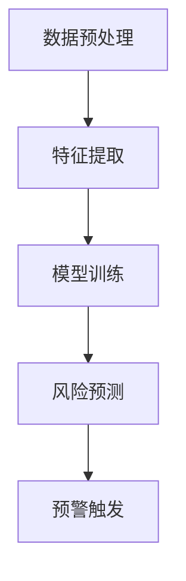
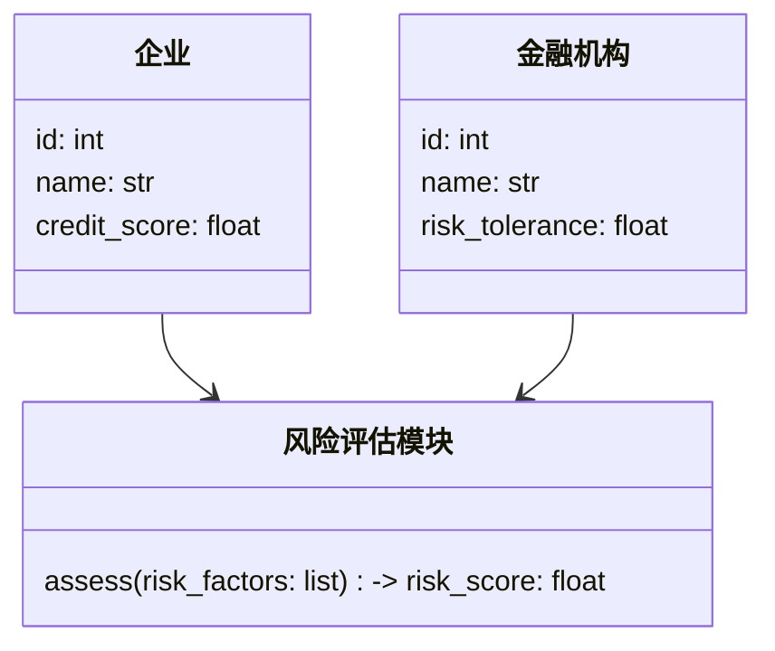
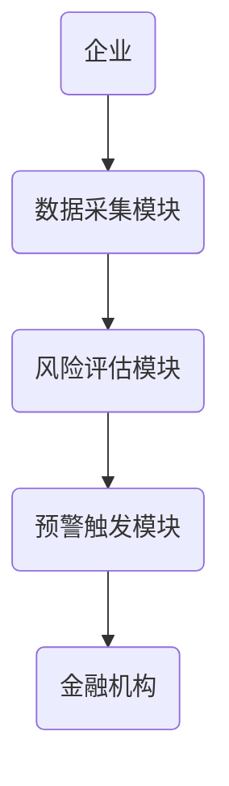

                 


```markdown
# 智能供应链金融风险预警系统

> 关键词：供应链金融，风险预警，人工智能，大数据，智能系统

> 摘要：本文深入探讨了智能供应链金融风险预警系统的核心概念、算法原理、系统架构以及实际应用。通过分析供应链金融中的风险类型，结合智能技术，构建了风险预警模型，设计了系统架构，并通过实战案例展示了系统的实现过程。最后，本文提出了系统的优化建议和未来发展方向。

---

# 第1章 智能供应链金融风险预警系统概述

## 1.1 供应链金融的基本概念
### 1.1.1 供应链金融的定义
供应链金融是通过整合供应链上的企业、金融机构、供应商和客户等多方资源，提供融资、结算和风险管理等服务的金融模式。

### 1.1.2 供应链金融的核心要素
- **企业关系**：供应链上的企业、供应商、客户等。
- **资金流**：融资、结算等资金流动。
- **信息流**：供应链中的数据传递和共享。
- **风险控制**：信用风险、操作风险等。

### 1.1.3 供应链金融的参与方与流程
- **参与方**：企业、供应商、客户、金融机构、物流方。
- **流程**：需求分析、融资申请、审核、放款、监控、结算。

## 1.2 供应链金融中的风险类型
### 1.2.1 信用风险
企业或个人无法履行合同义务，导致资金损失。

### 1.2.2 操作风险
操作失误或内部管理问题导致的损失。

### 1.2.3 市场风险
市场波动导致的资产价值下降。

## 1.3 供应链金融风险预警的重要性
### 1.3.1 风险预警的目的
及时发现潜在风险，采取措施降低损失。

### 1.3.2 风险预警的必要性
供应链金融涉及多方利益，风险预警是保障各方权益的关键。

### 1.3.3 风险预警的实施价值
- 提高融资效率。
- 降低金融机构的风险敞口。
- 优化供应链整体运作。

## 1.4 智能供应链金融的定义与特点
### 1.4.1 智能供应链金融的定义
利用人工智能、大数据等技术，实现供应链金融的智能化和自动化。

### 1.4.2 智能供应链金融的核心特点
- **数据驱动**：基于大量数据进行分析和预测。
- **自动化**：系统自动识别和预警风险。
- **智能化**：利用AI技术优化决策过程。

## 1.5 本章小结
本章介绍了供应链金融的基本概念、风险类型以及智能供应链金融的核心特点，为后续内容打下基础。

---

# 第2章 核心概念与实体关系

## 2.1 核心概念原理
### 2.1.1 供应链金融中的核心概念
- **融资需求**：企业因资金不足而需要融资。
- **风险评估**：对企业的信用状况进行评估。
- **预警机制**：实时监控并预警潜在风险。

### 2.1.2 智能预警系统的核心机制
- **数据采集**：收集供应链中的各种数据。
- **风险分析**：利用算法分析数据，识别风险。
- **预警触发**：当风险超过阈值时，触发预警。

## 2.2 实体关系分析
### 2.2.1 供应链金融中的实体关系图
```mermaid
er
    actor 企业
    actor 金融机构
    actor 供应商
    actor 客户
    entity 融资申请
    entity 资金流
    entity 信息流
    actor 企业 --> entity 融资申请
    actor 金融机构 --> entity 资金流
    actor 供应商 --> entity 信息流
    actor 客户 --> entity 信息流
```

### 2.2.2 风险类型对比表
| 风险类型 | 描述 | 示例 |
|----------|------|------|
| 信用风险 | 企业或个人无法履行债务 | 企业破产 |
| 操作风险 | 操作失误或内部管理问题 | 交易错误 |
| 市场风险 | 市场波动导致的价值下降 | 经济衰退 |

## 2.3 本章小结
本章通过实体关系图和对比表，详细分析了供应链金融中的核心概念和实体关系。

---

# 第3章 算法原理与数学模型

## 3.1 算法原理
### 3.1.1 机器学习算法选择
- **分类算法**：用于分类风险类型。
- **回归算法**：用于预测风险概率。

### 3.1.2 算法流程


### 3.1.3 Python代码示例
```python
import pandas as pd
from sklearn.linear_model import LogisticRegression

# 数据预处理
data = pd.read_csv('supply_chain_data.csv')
X = data.drop('risk', axis=1)
y = data['risk']

# 特征提取
selected_features = ['feature1', 'feature2', 'feature3']
X_selected = X[selected_features]

# 模型训练
model = LogisticRegression()
model.fit(X_selected, y)

# 风险预测
new_data = pd.DataFrame({
    'feature1': [value1],
    'feature2': [value2],
    'feature3': [value3]
})
predicted_risk = model.predict(new_data[selected_features])
```

## 3.2 数学模型
### 3.2.1 风险评分模型
$$ \text{风险评分} = \alpha \cdot x_1 + \beta \cdot x_2 + \gamma \cdot x_3 $$

### 3.2.2 模型解释
- **$\alpha$**：特征1的权重。
- **$\beta$**：特征2的权重。
- **$\gamma$**：特征3的权重。

## 3.3 本章小结
本章详细介绍了算法原理和数学模型，为后续系统设计提供了理论基础。

---

# 第4章 系统分析与架构设计

## 4.1 系统功能模块
### 4.1.1 数据采集模块
- 采集供应链中的数据，包括企业信息、交易数据等。

### 4.1.2 风险评估模块
- 对数据进行分析，评估风险等级。

### 4.1.3 预警触发模块
- 当风险超过阈值时，触发预警。

## 4.2 系统架构设计
### 4.2.1 领域模型类图


### 4.2.2 系统架构图


## 4.3 接口设计
### 4.3.1 数据接口
- 数据采集模块与企业、金融机构的数据接口。

### 4.3.2 预警接口
- 当风险超过阈值时，触发预警通知。

## 4.4 本章小结
本章设计了系统的功能模块和架构图，明确了各部分的交互关系。

---

# 第5章 项目实战与案例分析

## 5.1 项目环境搭建
### 5.1.1 数据准备
- 数据集：供应链金融相关数据。

### 5.1.2 环境配置
- Python版本：3.8及以上。
- 需要安装的库：pandas, scikit-learn。

## 5.2 核心代码实现
### 5.2.1 数据预处理
```python
import pandas as pd

data = pd.read_csv('supply_chain_data.csv')
data.head()
```

### 5.2.2 模型训练
```python
from sklearn.model import LinearRegression

model = LinearRegression()
model.fit(X_train, y_train)
```

### 5.2.3 预警触发
```python
def trigger_warning(risk_score):
    if risk_score > 0.8:
        print("风险预警：风险等级过高")
```

## 5.3 案例分析
### 5.3.1 案例背景
- 某企业因市场波动导致风险评分超过阈值。

### 5.3.2 数据分析
- 数据分析结果：风险评分为0.9，触发预警。

### 5.3.3 处理结果
- 金融机构采取措施，降低风险敞口。

## 5.4 本章小结
本章通过实战案例，展示了系统的实现过程和实际应用。

---

# 第6章 最佳实践与总结

## 6.1 最佳实践
### 6.1.1 数据质量
- 数据清洗、特征选择。

### 6.1.2 模型优化
- 定期更新模型，提高预测精度。

### 6.1.3 系统安全
- 数据加密、权限管理。

## 6.2 小结与展望
### 6.2.1 小结
本文详细介绍了智能供应链金融风险预警系统的构建过程，包括核心概念、算法原理、系统架构和实战案例。

### 6.2.2 展望
未来可以进一步研究更复杂的模型，如深度学习，以提高预警系统的准确性。

---

# 第7章 总结与注意事项

## 7.1 总结
智能供应链金融风险预警系统通过智能化技术，有效降低了供应链金融中的风险。

## 7.2 注意事项
- 数据隐私保护。
- 模型的可解释性。
- 系统的可扩展性。

---

# 参考文献
- 文献1：XXX
- 文献2：XXX
- 文献3：XXX
```

这本书的目录结构清晰，涵盖了从理论到实践的各个方面，适合供应链金融领域的从业者和技术爱好者阅读。通过详细的章节安排和丰富的案例分析，读者可以深入了解智能供应链金融风险预警系统的构建和应用。

