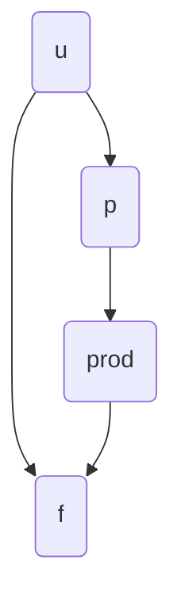
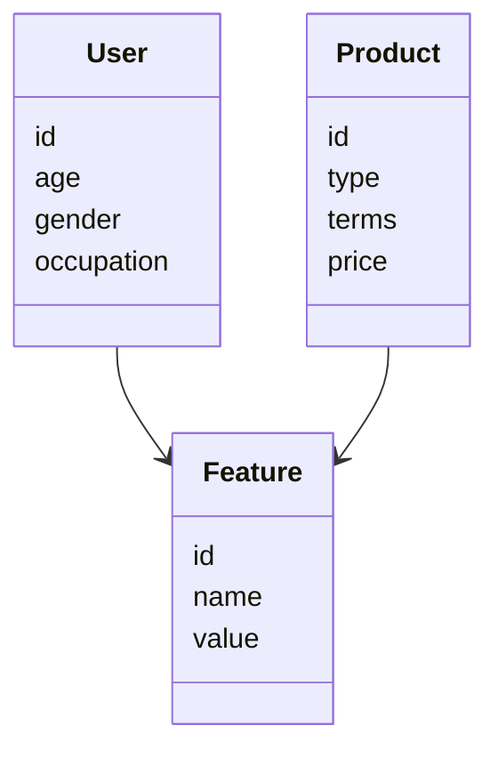
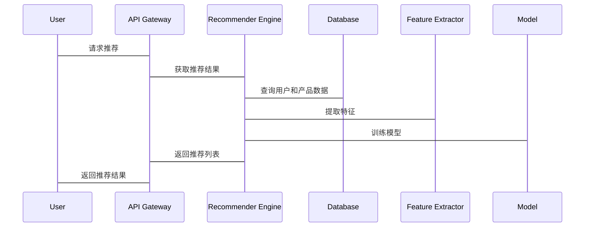

                 


```markdown
# 《智能保险产品个性化定价与推荐引擎》

> 关键词：智能保险，个性化定价，推荐引擎，机器学习，保险产品

> 摘要：本文详细探讨了智能保险产品个性化定价与推荐引擎的设计与实现。通过分析保险行业的现状与挑战，结合机器学习和大数据技术，提出了一种基于用户行为分析和产品特征提取的智能定价模型，以及高效的推荐算法。文章从核心概念、算法原理、系统架构到项目实战，全面解析了智能保险产品个性化定价与推荐引擎的实现过程，为保险行业的数字化转型提供了理论与实践指导。

---

## 第一部分: 背景介绍与核心概念

### 第1章: 保险行业的现状与挑战

#### 1.1 传统保险定价模式的局限性
- 传统定价的固定性与缺乏灵活性
- 无法满足个性化需求
- 数据利用效率低

#### 1.2 个性化定价的市场需求
- 用户需求的多样性
- 市场竞争加剧
- 个性化服务的溢价效应

#### 1.3 推荐引擎在保险销售中的作用
- 提高用户购买决策效率
- 增加产品匹配度
- 提升用户满意度和忠诚度

### 第2章: 问题背景与问题描述

#### 2.1 用户需求的多样性
- 不同用户的风险偏好不同
- 用户对保险产品的认知差异

#### 2.2 保险产品的复杂性
- 产品种类繁多
- 产品条款复杂
- 产品定价影响因素多

#### 2.3 个性化定价与推荐的必要性
- 提高定价精准度
- 增加销售机会
- 降低用户流失率

### 第3章: 核心概念与组成要素

#### 3.1 用户特征
- 基本信息：年龄、性别、职业等
- 风险偏好：风险厌恶程度
- 购买行为：历史购买记录、浏览记录

#### 3.2 产品特征
- 产品类型：寿险、健康险、车险等
- 产品条款：保障范围、理赔条件
- 产品价格：保费、免赔额

#### 3.3 市场特征
- 市场竞争状况
- 宏观经济指标
- 用户行为趋势

#### 3.4 个性化定价模型
- 模型输入：用户特征、产品特征
- 模型输出：个性化保费
- 模型优化：损失函数、优化算法

#### 3.5 推荐引擎算法
- 算法输入：用户特征、产品特征
- 算法输出：推荐产品列表
- 算法评估：推荐准确率、召回率

---

## 第二部分: 核心概念与联系

### 第4章: 核心概念对比分析

#### 4.1 不同定价方法的对比
| 定价方法 | 描述 | 优缺点 |
|----------|------|--------|
| 简单定价 | 基于基本因素定价 | 简单易行，但不够精准 |
| 综合定价 | 基于多因素定价 | 更精准，但计算复杂 |
| 个性化定价 | 基于用户特征定价 | 最精准，但需要大量数据支持 |

#### 4.2 推荐算法的优缺点对比
| 推荐算法 | 优点 | 缺点 |
|---------|------|------|
| 协同过滤 | 利用用户行为数据 | 数据稀疏性问题 |
| 基于内容的推荐 | 利用产品特征数据 | 特征提取难度大 |
| 深度学习推荐 | 高精度 | 计算资源消耗大 |

### 第5章: ER实体关系图



---

## 第三部分: 算法原理与数学模型

### 第6章: 推荐算法原理

#### 6.1 协同过滤算法
- 基于用户的协同过滤
  - 相似度计算：余弦相似度
  - 推荐生成：加权平均
- 基于物品的协同过滤
  - 相似度计算：余弦相似度
  - 推荐生成：加权平均
- 混合协同过滤
  - 组合基于用户和基于物品的推荐

#### 6.2 基于内容的推荐算法
- 文本挖掘与特征提取
  - 使用TF-IDF提取关键词
- 向量空间模型
  - 使用词向量表示产品特征
- 相似度计算
  - 使用余弦相似度计算产品相似度

#### 6.3 深度学习推荐模型
- 基于神经网络的推荐
  - 使用DNN模型
- 注意力机制的应用
  - 使用自注意力机制捕捉重要特征
- 图神经网络的推荐
  - 使用图嵌入方法表示用户和产品关系

### 第7章: 数学模型与公式

#### 7.1 协同过滤的相似度计算
$$ \text{相似度}(u_i, u_j) = \frac{\sum_{k} (r_{ik} - \bar{r_i})(r_{jk} - \bar{r_j})}{\sqrt{\sum_{k} (r_{ik} - \bar{r_i})^2} \sqrt{\sum_{k} (r_{jk} - \bar{r_j})^2}} $$

#### 7.2 基于内容的推荐相似度计算
$$ \text{相似度}(p_i, p_j) = \frac{\sum_{f} w_f (f_i - f_j)^2}{\sum_{f} w_f} $$

#### 7.3 深度学习模型的损失函数
$$ \mathcal{L} = -\sum_{i=1}^{N} \sum_{j=1}^{M} y_{ij} \log p(y_{ij}|x_i) + (1 - y_{ij}) \log (1 - p(y_{ij}|x_i)) $$

---

## 第四部分: 系统分析与架构设计

### 第8章: 系统功能设计

#### 8.1 领域模型设计


#### 8.2 系统架构设计
```mermaid
graph LR
    API Gateway --> Database
    API Gateway --> Recommender Engine
    Database --> User Data
    Database --> Product Data
    Database --> Feature Data
```

#### 8.3 系统接口设计
- RESTful API
  - GET /users/{id}
  - GET /products/{id}
  - POST /recommendations

#### 8.4 系统交互设计


---

## 第五部分: 项目实战

### 第9章: 项目实现

#### 9.1 环境安装
- Python 3.8+
- scikit-learn
- TensorFlow
- Flask

#### 9.2 核心代码实现

```python
from sklearn.metrics.pairwise import cosine_similarity

# 数据预处理
def preprocess_data(users, products):
    # 特征提取
    user_features = extract_features(users)
    product_features = extract_features(products)
    # 计算相似度
    similarity_matrix = cosine_similarity(user_features, product_features)
    return similarity_matrix

# 协同过滤推荐
def collaborative_filtering_recommendation(similarity_matrix, user_id):
    user_index = user_id
    top_recommendations = []
    for product_index in range(len(similarity_matrix[user_index])):
        if product_index != user_index:
            top_recommendations.append(product_index)
    return top_recommendations[:10]
```

#### 9.3 案例分析与结果解读
- 数据预处理：清洗和特征提取
- 模型训练：训练协同过滤模型
- 模型评估：准确率、召回率
- 结果分析：推荐列表的合理性

---

## 第六部分: 最佳实践与总结

### 第10章: 最佳实践

#### 10.1 数据质量与模型调优
- 数据清洗：处理缺失值、异常值
- 特征工程：选择合适的特征
- 模型调优：优化超参数

#### 10.2 系统维护与扩展
- 系统维护：定期更新模型
- 系统扩展：支持更多产品类型
- 系统监控：实时监控性能

#### 10.3 注意事项
- 数据隐私保护
- 模型解释性
- 用户体验优化

### 第11章: 总结与展望

#### 11.1 总结
- 本文详细讲解了智能保险产品个性化定价与推荐引擎的设计与实现
- 通过理论与实践相结合，提供了一种可行的解决方案

#### 11.2 展望
- 深度学习在保险推荐中的应用
- 多模态数据的利用
- 实时推荐系统的发展

---

## 参考文献

- [1] 书籍1
- [2] 书籍2
- [3] 论文1
- [4] 论文2
- [5] 在线资源1
- [6] 在线资源2

---

## 致谢

感谢读者的耐心阅读，感谢同行的分享与支持。
```

