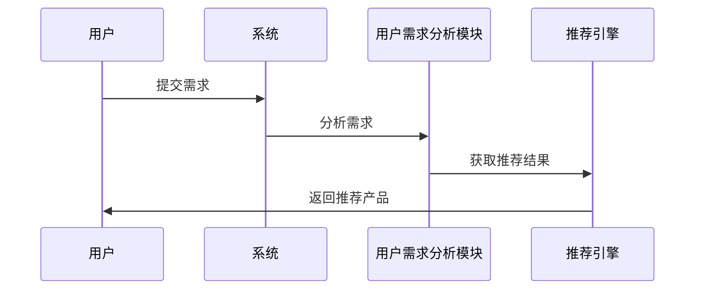

                 


# 智能保险产品个性化定制系统

## 关键词：智能保险，个性化定制，保险产品，推荐算法，系统架构

## 摘要：本文详细探讨了智能保险产品个性化定制系统的设计与实现，结合背景分析、核心概念、算法原理、系统架构和项目实战，为读者提供全面的技术解读。通过数据驱动的个性化推荐算法和动态调整机制，该系统能够根据用户需求定制最优保险方案，推动保险行业的数字化转型。

---

## 第一部分: 智能保险产品个性化定制系统概述

### 第1章: 智能保险产品个性化定制系统背景介绍

#### 1.1 问题背景
- **传统保险产品的局限性**：传统保险产品往往采用标准化设计，难以满足用户的个性化需求。
- **个性化需求的兴起**：随着消费者对个性化服务的需求增加，保险行业亟需提供定制化的产品。
- **智能技术在保险行业的应用潜力**：人工智能技术的快速发展为保险产品的个性化定制提供了技术支撑。

#### 1.2 问题描述
- **保险产品同质化严重**：市场上的保险产品种类有限，难以覆盖用户多样化的保障需求。
- **用户需求多样化与产品供给的矛盾**：用户的个性化需求难以通过传统产品实现。
- **保险行业数字化转型的必要性**：通过数字化手段实现保险产品的个性化定制，提升用户体验。

#### 1.3 问题解决
- **智能保险产品的定义**：利用人工智能技术，根据用户需求动态生成保险产品。
- **个性化定制的核心目标**：为用户提供量身定制的保险方案，满足个性化需求。
- **智能保险产品的实现路径**：通过数据采集、分析和推荐算法实现个性化定制。

#### 1.4 系统边界与外延
- **系统功能边界**：包括用户需求分析、产品推荐和动态调整模块。
- **系统与外部系统的交互**：与用户交互、第三方数据源接口等。
- **系统功能的扩展性**：支持更多保险产品的扩展和新功能的接入。

#### 1.5 核心要素组成
- **用户需求分析模块**：收集用户信息，分析需求。
- **保险产品推荐引擎**：基于用户需求推荐产品。
- **动态调整与优化模块**：实时优化推荐结果，提升用户体验。

---

## 第二部分: 核心概念与联系

### 第2章: 核心概念原理

#### 2.1 个性化定制的实现原理
- **数据驱动的个性化推荐**：利用用户数据进行分析和推荐。
- **保险产品特征提取**：提取产品的关键特征，如保费、保障范围等。
- **用户需求匹配算法**：通过算法匹配用户需求和产品特征。

#### 2.2 智能保险产品的核心要素
- **用户画像**：用户的基本信息、风险偏好等。
- **保险产品属性**：产品的保费、保障范围、理赔条件等。
- **个性化推荐算法**：协同过滤、基于内容的推荐等。

### 第3章: 核心概念属性对比

#### 3.1 概念属性对比表格
| 概念       | 数据驱动 | 算法支持 | 用户导向 |
|------------|----------|----------|----------|
| 个性化定制 | 是       | 是       | 是       |
| 智能保险产品 | 是       | 是       | 是       |

#### 3.2 ER实体关系图
```mermaid
erd
    系统
    用户
    保险产品
    推荐结果
    用户需求
    算法模块
    数据库
    界面
```

---

## 第三部分: 算法原理讲解

### 第4章: 推荐算法原理

#### 4.1 协同过滤算法
- **基于用户的协同过滤**：通过用户相似性推荐产品。
- **基于物品的协同过滤**：通过产品相似性推荐用户可能感兴趣的产品。
- **混合推荐模型**：结合用户和物品的特征，提升推荐准确性。

#### 4.2 基于内容的推荐
- **产品特征提取**：提取保险产品的特征，如保费、保障范围。
- **用户特征提取**：分析用户需求，提取关键词。
- **相似度计算**：基于特征向量计算相似度，推荐产品。

#### 4.3 算法实现
```python
def collaborative_filtering(user_id, user_similarity_matrix):
    # 找出与目标用户相似的用户
    similar_users = user_similarity_matrix[user_id]
    # 推荐目标用户未购买的产品
    recommendations = []
    for user in similar_users:
        for product in user.products:
            if product not in recommendations and product not in user_id.products:
                recommendations.append(product)
    return recommendations
```

#### 4.4 数学模型
- **协同过滤相似度计算**：
  $$ sim(u, v) = \frac{\sum_{i=1}^{n} (r_{ui} - \bar{r_u})(r_{vi} - \bar{r_v})}{\sqrt{\sum_{i=1}^{n} (r_{ui} - \bar{r_u})^2} \cdot \sqrt{\sum_{i=1}^{n} (r_{vi} - \bar{r_v})^2}}} $$

---

## 第四部分: 系统分析与架构设计

### 第5章: 系统分析

#### 5.1 问题场景介绍
- **保险公司利用系统进行产品定制**：保险公司通过系统分析用户需求，定制保险产品。
- **用户与系统交互**：用户输入需求，系统推荐保险产品。
- **动态调整优化模块**：根据用户反馈优化推荐结果。

#### 5.2 系统功能设计
- **用户需求分析模块**：收集用户信息，分析需求。
- **保险产品推荐引擎**：基于需求推荐产品。
- **动态调整与优化模块**：实时优化推荐结果。

#### 5.3 系统架构设计
- **微服务架构**：推荐引擎、用户模块、产品模块独立运行。
- **服务交互**：通过API接口进行数据交互。

#### 5.4 接口设计
- **REST API**：提供用户需求提交、产品推荐等接口。
- **交互流程图**：


---

## 第五部分: 项目实战

### 第6章: 环境安装与核心实现

#### 6.1 环境安装
- **Python 3.8+**
- **安装依赖**：`pip install numpy pandas scikit-learn`

#### 6.2 核心代码实现
- **数据预处理**：清洗和标准化用户数据。
- **推荐算法实现**：实现协同过滤和基于内容的推荐。
- **动态调整模块**：根据用户反馈优化推荐结果。

#### 6.3 代码解读
```python
import numpy as np
from sklearn.metrics.pairwise import cosine_similarity

class CollaborativeFiltering:
    def __init__(self):
        self.user_product_matrix = None
        self.product_features = None

    def fit(self, data):
        # 数据预处理
        self.user_product_matrix = data
        # 特征提取
        self.product_features = self.user_product_matrix.T

    def predict(self, user_id):
        # 计算相似度
        similarity = cosine_similarity(self.product_features)
        # 推荐产品
        recommendations = []
        for product in range(similarity.shape[0]):
            if product != user_id:
                recommendations.append((product, similarity[user_id, product]))
        return recommendations
```

#### 6.4 实际案例分析
- **案例背景**：用户A需要健康保险，系统推荐不同保费和保障范围的产品。
- **推荐结果**：根据用户需求和产品特征，推荐最优产品。

#### 6.5 项目小结
- **项目总结**：系统实现了个性化推荐，提升了用户体验。
- **关键点**：数据处理、算法实现和系统架构设计。

---

## 第六部分: 最佳实践

### 第7章: 最佳实践 tips

#### 7.1 小结
- **系统的核心价值**：通过个性化定制提升用户体验和保险公司效率。
- **关键成功因素**：数据质量、算法优化和系统架构设计。

#### 7.2 注意事项
- **数据隐私**：确保用户数据的安全性和隐私性。
- **模型泛化能力**：避免过拟合，确保模型的泛化能力。

#### 7.3 拓展阅读
- **推荐书籍**：《集体智慧编程》、《机器学习实战》。
- **推荐论文**：相关领域的最新研究成果。

---

## 第七部分: 附录

### 第8章: 术语表

- **用户画像**：基于用户数据构建的用户信息模型。
- **协同过滤**：基于用户相似性进行推荐的算法。
- **动态调整模块**：根据用户反馈优化推荐结果的模块。

### 第9章: 参考文献

- 书籍：《集体智慧编程》。
- 论文：相关领域的最新研究成果。

---

# 结语
智能保险产品个性化定制系统通过数据驱动和人工智能技术，为用户提供个性化的保险解决方案，推动保险行业的数字化转型。本文从背景分析到系统实现，为读者提供了全面的技术解读。

