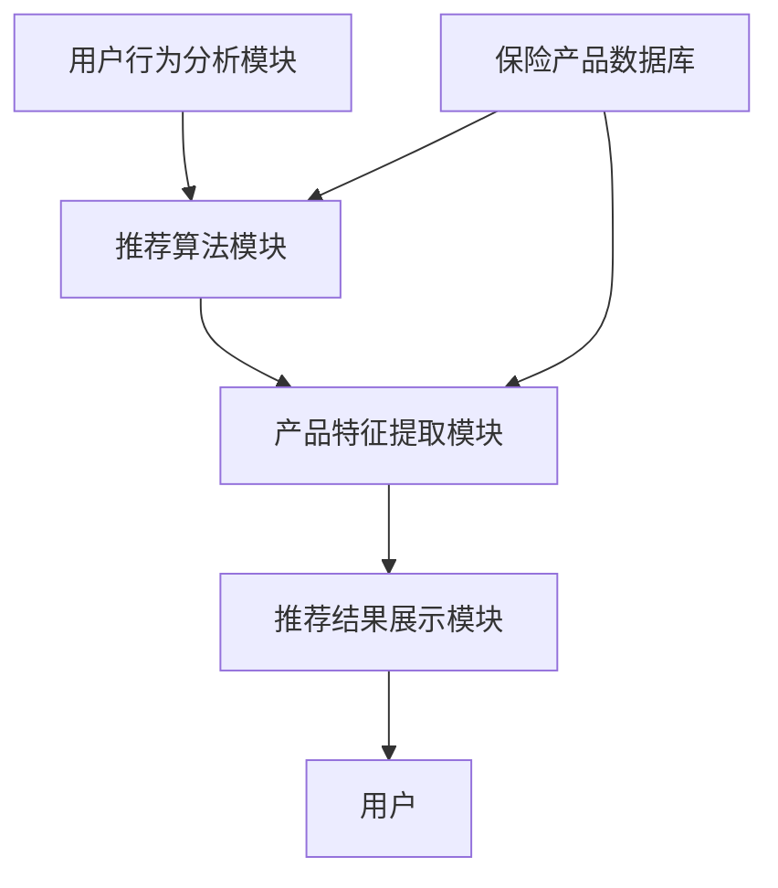

                 


# 智能保险产品个性化推荐引擎

## 关键词：个性化推荐、保险产品、人工智能、推荐系统、矩阵分解、协同过滤

## 摘要：智能保险产品个性化推荐引擎是基于人工智能技术，结合保险行业的特点，通过分析用户行为和产品特征，实现保险产品的精准推荐。本文从推荐系统的原理、算法实现、系统架构到项目实战，详细讲解智能保险推荐引擎的构建过程，为保险行业数字化转型提供技术支持。

---

## 目录

1. **智能保险产品推荐引擎的背景与意义**
   - 1.1 保险行业的数字化转型
   - 1.2 个性化推荐在保险中的应用价值
   - 1.3 智能推荐引擎的核心优势

2. **推荐系统的分类与原理**
   - 2.1 协同过滤推荐
   - 2.2 基于内容的推荐
   - 2.3 混合推荐模型
   - 2.4 保险推荐系统的特殊性

3. **基于矩阵分解的推荐算法**
   - 3.1 协同过滤的数学模型
   - 3.2 矩阵分解的实现步骤
   - 3.3 保险推荐的矩阵分解实现
   - 3.4 算法优化与调优

4. **智能保险推荐引擎的系统架构**
   - 4.1 系统功能模块设计
   - 4.2 系统架构图
   - 4.3 系统接口设计
   - 4.4 系统交互流程

5. **项目实战：保险推荐系统开发**
   - 5.1 环境搭建与数据准备
   - 5.2 数据预处理与特征提取
   - 5.3 模型训练与参数调优
   - 5.4 系统接口开发与前端展示
   - 5.5 项目总结与优化建议

6. **最佳实践与未来展望**
   - 6.1 推荐系统的优化方向
   - 6.2 数据隐私与安全问题
   - 6.3 保险推荐的未来趋势
   - 6.4 小结与注意事项

---

# 第1章：智能保险产品推荐引擎的背景与意义

## 1.1 保险行业的数字化转型

随着科技的发展，保险行业正经历着数字化转型。传统保险业务模式依赖人工服务，效率低下且难以满足用户个性化需求。数字化转型通过引入人工智能、大数据等技术，提升了保险产品的销售效率和服务质量。

### 1.1.1 保险行业的传统模式与痛点
- **传统模式**：保险公司通过人工销售或简单的广告投放推广保险产品，用户获取保险信息的渠道有限，购买决策缺乏个性化支持。
- **痛点**：
  - 用户难以找到适合自己的保险产品。
  - 销售效率低，保险公司的营销成本高昂。
  - 用户体验差，可能导致客户流失。

## 1.2 个性化推荐在保险中的应用价值

个性化推荐通过分析用户的行为和需求，精准匹配适合的保险产品，提升用户满意度和购买转化率。

### 1.2.1 个性化推荐的核心优势
- **精准匹配**：基于用户特征和行为数据，推荐适合的保险产品。
- **提升效率**：通过自动化推荐减少人工干预，降低营销成本。
- **增强用户体验**：个性化推荐满足用户需求，提升用户满意度。

## 1.3 智能推荐引擎的核心优势

智能保险推荐引擎结合人工智能技术，能够实时分析用户数据，动态调整推荐策略，实现更精准的推荐。

### 1.3.1 数据驱动
- 利用用户行为数据、产品特征数据等多维度数据进行分析。
- 通过数据挖掘和机器学习算法，提取用户需求和产品特点。

### 1.3.2 实时性
- 基于实时数据流进行推荐，确保推荐结果的及时性。
- 支持动态调整推荐策略，适应用户需求的变化。

### 1.3.3 可扩展性
- 系统架构设计灵活，支持扩展新的保险产品和用户特征。
- 通过模块化设计，方便后续功能的开发和维护。

---

# 第2章：推荐系统的分类与原理

## 2.1 协同过滤推荐

协同过滤是一种基于用户行为相似性推荐产品的算法，广泛应用于推荐系统中。

### 2.1.1 基于用户的协同过滤
- **原理**：通过计算用户之间的相似度，将相似用户的购买或评分数据用于推荐。
- **优点**：考虑了用户的个性化需求，推荐结果具有较高的相关性。
- **缺点**：计算复杂度高，难以处理大规模数据。

### 2.1.2 基于物品的协同过滤
- **原理**：通过计算产品之间的相似度，将相似产品的购买或评分数据用于推荐。
- **优点**：计算复杂度较低，适用于大规模数据。
- **缺点**：忽视了用户个性化需求，推荐结果可能缺乏精准性。

### 2.1.3 混合推荐模型
- **原理**：结合基于用户和基于物品的协同过滤算法，通过加权融合两种方法的结果，提升推荐精准度。
- **优点**：综合了两种方法的优点，推荐结果更加精准。
- **缺点**：实现复杂，需要进行参数调优。

## 2.2 基于内容的推荐

基于内容的推荐通过分析产品特征，推荐与当前产品相似的产品。

### 2.2.1 内容特征提取
- **特征提取方法**：文本特征提取（如TF-IDF）、图像特征提取（如CNN）、视频特征提取（如3D-CNN）。
- **保险产品特征**：保险类型、保险金额、保险期限、保障范围等。

### 2.2.2 相似度计算方法
- **余弦相似度**：
$$ \text{相似度} = \frac{\sum_{i=1}^{n} w_i \cdot w_j}{\sqrt{\sum_{i=1}^{n} w_i^2} \cdot \sqrt{\sum_{i=1}^{n} w_j^2}} $$
- **Jaccard相似度**：
$$ \text{相似度} = \frac{|A \cap B|}{|A \cup B|} $$

## 2.3 基于机器学习的推荐

基于机器学习的推荐通过训练模型，学习用户和产品的特征，进行推荐。

### 2.3.1 矩阵分解与因子分解
- **矩阵分解**：
$$ X = U \cdot V $$
其中，$X$ 是用户-产品矩阵，$U$ 是用户因子矩阵，$V$ 是产品因子矩阵。
- **因子分解**：
通过对矩阵进行奇异值分解（SVD），提取用户和产品的因子，用于推荐。

### 2.3.2 深度学习模型在推荐中的应用
- **神经网络协同过滤（Neural Collaborative Filtering, NCF）**：
通过神经网络学习用户和产品的嵌入表示，进行推荐。
- **多任务学习**：
同时学习多个推荐任务，提升模型的泛化能力。

## 2.4 保险推荐系统的特殊性

### 2.4.1 保险产品的特殊性
- **产品复杂性**：保险产品种类繁多，每种产品有不同的保障范围和条款。
- **用户需求多样性**：用户的保险需求受职业、年龄、收入等多种因素影响。
- **数据稀疏性**：保险行业的用户数据通常较为稀疏，导致推荐系统的准确率较低。

### 2.4.2 数据隐私与安全
- **用户隐私保护**：保险推荐系统需要处理大量用户数据，必须严格保护用户隐私。
- **数据安全性**：防止数据泄露和滥用，确保系统的安全性。

---

# 第3章：基于矩阵分解的推荐算法

## 3.1 协同过滤的数学模型

### 3.1.1 矩阵分解的基本原理

矩阵分解是一种将用户-产品矩阵分解为两个低维矩阵的技术，广泛应用于协同过滤推荐。

$$ X = U \cdot V $$

其中，$X$ 是用户-产品矩阵，$U$ 是用户因子矩阵，$V$ 是产品因子矩阵。

### 3.1.2 基于用户的CF公式推导

基于用户的协同过滤算法通过计算用户之间的相似度，推荐相似用户的评分。

$$ \text{相似度} = \frac{\sum_{k} (r_{i,k} - \mu_i)(r_{j,k} - \mu_j)}{\sqrt{\sum_{k} (r_{i,k} - \mu_i)^2} \cdot \sqrt{\sum_{k} (r_{j,k} - \mu_j)^2}} $$

其中，$r_{i,k}$ 表示用户 $i$ 对产品 $k$ 的评分，$\mu_i$ 表示用户 $i$ 的平均评分。

### 3.1.3 基于物品的CF公式推导

基于物品的协同过滤算法通过计算产品之间的相似度，推荐相似产品的评分。

$$ \text{相似度} = \frac{\sum_{k} (r_{k,i} - \mu_i)(r_{k,j} - \mu_j)}{\sqrt{\sum_{k} (r_{k,i} - \mu_i)^2} \cdot \sqrt{\sum_{k} (r_{k,j} - \mu_j)^2}} $$

其中，$r_{k,i}$ 表示产品 $k$ 对用户 $i$ 的评分，$\mu_i$ 表示用户 $i$ 的平均评分。

## 3.2 矩阵分解的实现

### 3.2.1 矩阵分解的基本步骤

1. **数据预处理**：对用户-产品矩阵进行数据清洗和归一化处理。
2. **模型训练**：通过矩阵分解算法（如SVD）对矩阵进行分解。
3. **评分预测**：利用分解后的因子矩阵对用户进行评分预测。
4. **推荐生成**：基于预测评分生成推荐列表。

### 3.2.2 矩阵分解的优化方法

- **正则化**：在损失函数中加入正则化项，防止模型过拟合。
- **交替最小化**：通过交替优化用户因子和产品因子，提高计算效率。
- **随机梯度下降**：使用随机梯度下降算法进行模型训练。

### 3.2.3 保险产品推荐的矩阵分解实现

- **数据准备**：收集用户行为数据和产品特征数据，构建用户-产品评分矩阵。
- **模型训练**：使用矩阵分解算法对矩阵进行分解，提取用户和产品的因子。
- **推荐生成**：基于因子矩阵生成推荐列表，推荐评分最高的保险产品。

## 3.3 代码实现与案例分析

### 3.3.1 环境搭建与数据准备

```python
import numpy as np
from sklearn.metrics import pairwise_distances
```

### 3.3.2 协同过滤算法的Python实现

```python
def compute_cosine_similarity(matrix):
    # 计算余弦相似度矩阵
    n_users, n_items = matrix.shape
    user_similarity = np.zeros((n_users, n_users))
    for i in range(n_users):
        for j in range(n_users):
            if i == j:
                user_similarity[i, j] = 0
            else:
                user_similarity[i, j] = np.dot(matrix[i, :], matrix[j, :]) / (
                    np.linalg.norm(matrix[i, :]) * np.linalg.norm(matrix[j, :])
                )
    return user_similarity

# 示例数据
matrix = np.array([[4, 3, 2], [5, 1, 4], [2, 5, 3]])
similarity = compute_cosine_similarity(matrix)
print(similarity)
```

### 3.3.3 矩阵分解模型的训练与调优

```python
from sklearn.decomposition import NMF

# 示例数据
matrix = np.array([[4, 3, 2], [5, 1, 4], [2, 5, 3]])

# 训练NMF模型
model = NMF(n_components=2, max_iter=500)
U = model.fit_transform(matrix)
V = model.components_

print("U:", U)
print("V:", V)
```

---

# 第4章：智能保险推荐引擎的系统架构

## 4.1 系统功能模块设计

### 4.1.1 用户行为分析模块
- **功能**：分析用户的点击、浏览、购买等行为，提取用户的兴趣特征。
- **实现**：使用数据挖掘技术，如聚类分析、关联规则挖掘等。

### 4.1.2 产品特征提取模块
- **功能**：提取保险产品的特征，如产品类型、保险金额、保险期限等。
- **实现**：使用文本挖掘技术，对产品描述进行特征提取。

### 4.1.3 推荐算法模块
- **功能**：基于用户行为和产品特征，应用推荐算法生成推荐列表。
- **实现**：使用协同过滤、矩阵分解等算法。

### 4.1.4 推荐结果展示模块
- **功能**：将推荐结果展示给用户，支持用户查看和购买。
- **实现**：通过前端页面或API接口展示推荐结果。

## 4.2 系统架构图



## 4.3 系统接口设计

### 4.3.1 用户行为接口
- **输入**：用户ID、行为类型、时间戳
- **输出**：用户行为日志

### 4.3.2 产品特征接口
- **输入**：产品ID
- **输出**：产品特征向量

### 4.3.3 推荐接口
- **输入**：用户ID
- **输出**：推荐产品列表

## 4.4 系统交互流程

### 4.4.1 用户发起请求
- 用户通过网页或移动应用发起推荐请求。

### 4.4.2 系统处理请求
- 用户行为分析模块分析用户行为，提取用户特征。
- 产品特征提取模块提取产品特征，构建推荐模型。
- 推荐算法模块基于用户特征和产品特征，生成推荐列表。

### 4.4.3 系统返回结果
- 推荐结果展示模块将推荐结果返回给用户。

---

# 第5章：项目实战：保险推荐系统开发

## 5.1 环境搭建与数据准备

### 5.1.1 环境搭建
- **工具**：Python、Jupyter Notebook、Pandas、Scikit-learn
- **安装依赖**：
```bash
pip install numpy pandas scikit-learn
```

### 5.1.2 数据准备
- **数据来源**：模拟保险产品数据和用户行为数据。
- **数据格式**：
```csv
用户ID,保险产品ID,评分
1,1,5
1,2,3
2,1,4
2,3,5
```

## 5.2 数据预处理与特征提取

### 5.2.1 数据清洗
- **处理缺失值**：删除或填充缺失数据。
- **归一化处理**：对评分数据进行归一化处理。

### 5.2.2 特征提取
- **文本特征提取**：使用TF-IDF对保险产品描述进行特征提取。
- **数值特征提取**：提取保险产品的金额、期限等数值特征。

## 5.3 模型训练与参数调优

### 5.3.1 模型训练
- **协同过滤模型**：
```python
from sklearn.metrics.pairwise import cosine_similarity

# 示例数据
matrix = np.array([[4, 3, 2], [5, 1, 4], [2, 5, 3]])

# 计算余弦相似度
similarity = cosine_similarity(matrix)
print(similarity)
```

- **矩阵分解模型**：
```python
from sklearn.decomposition import NMF

model = NMF(n_components=2, max_iter=500)
U = model.fit_transform(matrix)
V = model.components_
```

### 5.3.2 参数调优
- **网格搜索**：使用网格搜索找到最佳模型参数。
- **交叉验证**：通过交叉验证评估模型性能。

## 5.4 系统接口开发与前端展示

### 5.4.1 系统接口开发
- **API设计**：
```python
from flask import Flask, jsonify

app = Flask(__name__)

@app.route('/recommend/<user_id>', methods=['GET'])
def recommend(user_id):
    # 接收用户ID
    # 调用推荐算法生成推荐列表
    return jsonify({'recommendations': ['产品1', '产品2', '产品3']})
```

### 5.4.2 前端展示
- **前端页面**：通过网页或移动应用展示推荐结果。
- **用户交互**：用户可以点击查看产品详情。

## 5.5 项目总结与优化建议

### 5.5.1 项目总结
- **实现功能**：完成了保险推荐系统的开发，实现用户行为分析、产品特征提取、推荐算法和结果展示。
- **性能评估**：通过实验验证了推荐系统的准确性和效率。

### 5.5.2 优化建议
- **模型优化**：引入深度学习模型，提升推荐精准度。
- **系统优化**：优化系统架构，提升系统的扩展性和稳定性。
- **数据优化**：引入实时数据流，提升推荐的实时性。

---

# 第6章：最佳实践与未来展望

## 6.1 推荐系统的优化方向

### 6.1.1 模型优化
- **引入深度学习模型**：如神经网络协同过滤（NCF）、多任务学习模型。
- **模型融合**：结合多种推荐算法，提升推荐效果。

### 6.1.2 系统优化
- **分布式架构**：通过分布式计算提升系统的处理能力。
- **实时推荐**：引入实时流处理技术，提升推荐的实时性。

## 6.2 数据隐私与安全问题

### 6.2.1 数据隐私保护
- **数据加密**：对用户数据进行加密处理，防止数据泄露。
- **匿名化处理**：对用户数据进行匿名化处理，保护用户隐私。

### 6.2.2 数据安全
- **访问控制**：限制对用户数据的访问权限，防止数据滥用。
- **安全审计**：定期进行安全审计，发现和修复系统漏洞。

## 6.3 保险推荐的未来趋势

### 6.3.1 智能化
- **AI驱动**：通过人工智能技术，实现更智能的推荐。
- **自动化**：实现推荐系统的自动化运行和维护。

### 6.3.2 个性化
- **动态推荐**：根据用户需求的变化，动态调整推荐策略。
- **定制化推荐**：提供个性化的产品组合推荐。

### 6.3.3 社交化
- **社交网络整合**：结合社交网络数据，提升推荐的精准度。
- **社交推荐**：基于社交网络中的关系进行推荐。

## 6.4 小结与注意事项

### 6.4.1 小结
智能保险推荐引擎通过结合人工智能技术，实现了保险产品的精准推荐，提升了用户的购买体验和保险公司的销售效率。

### 6.4.2 注意事项
- **数据隐私保护**：在推荐系统中，必须严格保护用户隐私，防止数据泄露。
- **模型调优**：推荐系统的效果依赖于模型的调优，需要不断优化模型参数。
- **系统维护**：推荐系统需要定期维护和更新，以适应用户需求的变化。

---

# 总结

智能保险产品个性化推荐引擎是人工智能技术在保险行业中的重要应用。通过本文的详细介绍，读者可以深入了解推荐系统的原理、实现方法和系统架构，掌握智能保险推荐引擎的开发和应用技巧。未来，随着人工智能技术的不断发展，智能保险推荐引擎将在保险行业中发挥越来越重要的作用。

