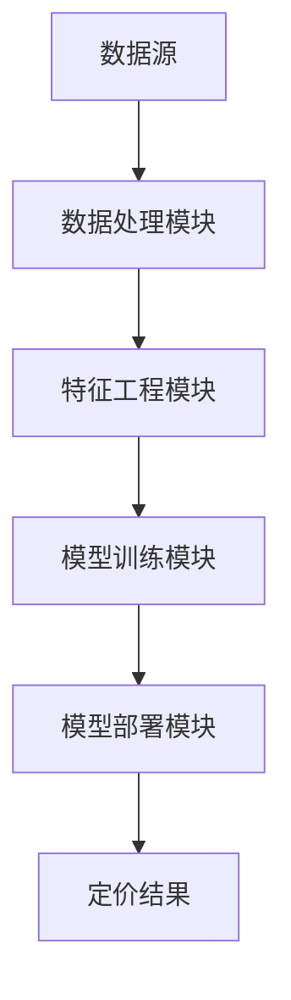

                 


# 智能保险产品定价模型

> 关键词：智能保险定价、机器学习、数据科学、风险管理、保险精算

> 摘要：智能保险产品定价模型是一种基于机器学习和数据分析的创新方法，用于更准确地评估风险并制定个性化保险产品价格。本文将详细探讨智能保险定价模型的背景、核心概念、算法原理、系统架构、项目实战及最佳实践，帮助读者深入了解如何利用人工智能技术优化保险定价流程。

---

# 第1章: 智能保险定价模型的背景与应用

## 1.1 保险定价的基本概念

保险定价是保险行业中一项核心任务，其目的是在合理评估风险的基础上，制定出既能覆盖赔付成本，又能保证公司利润的价格。传统保险定价主要依赖于历史数据和精算模型，通常基于客户的年龄、性别、职业、驾驶记录等因素进行评估。然而，随着数据科学和人工智能技术的快速发展，传统定价方法逐渐暴露出一些局限性，例如难以捕捉复杂的风险因素、客户体验不足以及定价不够精确等问题。

智能保险定价模型通过整合海量数据、运用先进的机器学习算法，能够更精准地评估客户风险，并实时调整定价策略，从而实现个性化和动态化定价。

## 1.2 智能保险定价模型的背景

### 1.2.1 数据科学与人工智能的发展

近年来，数据科学和人工智能技术取得了显著进展，特别是在数据分析、特征提取和模型训练方面。这些技术的发展为保险行业的数字化转型提供了强有力的支持。保险公司可以通过收集和分析客户的多维度数据（如行为数据、地理位置数据、健康数据等），构建更加精准的客户画像，并利用机器学习算法预测潜在风险。

### 1.2.2 保险行业的数字化转型

传统保险行业 heavily依赖经验丰富的精算师和繁琐的手工流程，这不仅效率低下，而且难以应对市场的快速变化。随着云计算、大数据和物联网技术的普及，保险公司开始利用数字化工具和平台，实现业务流程的自动化和智能化。智能保险定价模型正是这一转型的重要组成部分，它通过自动化数据处理和智能决策，显著提升了定价的效率和准确性。

### 1.2.3 智能定价模型在保险行业的应用前景

智能保险定价模型的应用前景广阔。它可以应用于寿险、财险、健康险等多个领域，帮助保险公司更精准地识别风险、优化产品设计、提升客户体验。此外，智能定价模型还可以通过实时数据分析，快速响应市场变化，制定灵活的定价策略，从而增强企业的竞争力。

## 1.3 智能保险定价模型的核心价值

### 1.3.1 提高定价准确性

智能保险定价模型能够整合多种数据源，利用复杂的算法对客户进行全方位评估，从而提高定价的准确性。与传统定价方法相比，智能定价模型能够捕捉更多影响风险的因素，从而更精准地预测赔付概率。

### 1.3.2 优化客户体验

通过个性化定价策略，保险公司可以为客户提供更具竞争力的价格，提升客户满意度和忠诚度。此外，智能定价模型还可以通过实时反馈机制，为客户提供透明的定价依据，增强客户信任。

### 1.3.3 降低运营成本

智能保险定价模型能够自动化处理大量数据，并快速生成定价结果，从而显著降低人工成本和时间成本。此外，通过实时监控和优化定价策略，保险公司可以减少资源浪费，进一步降低运营成本。

### 1.3.4 提升风险管理能力

智能保险定价模型能够帮助保险公司更准确地识别高风险客户，并制定相应的风险管理策略。通过实时数据分析和预测，保险公司可以提前采取措施，降低潜在风险。

## 1.4 本章小结

智能保险定价模型是保险行业数字化转型的重要成果，它通过整合数据科学和人工智能技术，显著提高了定价的准确性、优化了客户体验、降低了运营成本，并提升了风险管理能力。随着技术的不断发展，智能保险定价模型将在保险行业中发挥越来越重要的作用。

---

# 第2章: 智能保险定价模型的核心概念

## 2.1 数据驱动的保险定价

### 2.1.1 数据来源与类型

智能保险定价模型依赖于多源异构数据，主要数据来源包括：

1. **客户数据**：包括客户的基本信息（如年龄、性别、职业）、健康数据（如病史、体检报告）等。
2. **行为数据**：包括客户的驾驶行为、消费行为等。
3. **环境数据**：包括地理位置、天气状况等。
4. **历史数据**：包括历史赔付数据、历史投保记录等。

### 2.1.2 数据预处理与特征提取

在智能保险定价模型中，数据预处理是非常重要的一步。以下是常见的数据预处理步骤：

1. **数据清洗**：去除重复数据、缺失值和异常值。
2. **数据转换**：对数据进行标准化、归一化处理，以便模型能够更好地处理。
3. **特征提取**：从原始数据中提取有用的特征，例如将文本数据转化为数值型特征。

### 2.1.3 数据质量与清洗方法

数据质量是影响模型性能的重要因素。以下是几种常见的数据清洗方法：

1. **删除重复数据**：通过唯一标识符去除重复记录。
2. **处理缺失值**：使用均值、中位数或随机填充等方式处理缺失值。
3. **异常值处理**：通过箱线图或Z-score方法识别并处理异常值。

## 2.2 智能定价模型的构建过程

### 2.2.1 数据采集与特征工程

数据采集是智能定价模型的第一步，通常包括以下几个步骤：

1. **数据采集**：从各种数据源中获取数据。
2. **数据清洗**：对采集到的数据进行清洗和预处理。
3. **特征工程**：从数据中提取有用的特征，并进行特征组合和降维。

### 2.2.2 模型训练与优化

在模型训练阶段，通常需要进行以下步骤：

1. **选择算法**：根据数据类型和业务需求选择合适的算法。
2. **模型训练**：使用训练数据对模型进行训练。
3. **模型调优**：通过交叉验证和网格搜索等方法优化模型参数。

### 2.2.3 模型部署与监控

模型部署阶段包括以下几个步骤：

1. **模型部署**：将训练好的模型部署到生产环境中。
2. **实时监控**：监控模型的性能和预测结果，及时发现异常。
3. **模型更新**：根据监控结果，定期更新模型以保持其性能。

## 2.3 模型评估与验证

### 2.3.1 模型评估指标

以下是常用的模型评估指标：

1. **均方误差（MSE）**：衡量预测值与真实值之间的差距。
2. **平均绝对误差（MAE）**：衡量预测值与真实值之间的绝对差距。
3. **R平方值（R²）**：衡量模型对数据的拟合程度。

### 2.3.2 交叉验证与模型调优

交叉验证是一种常用的模型验证方法，通常包括以下步骤：

1. **划分数据集**：将数据集划分为训练集和验证集。
2. **模型训练**：在训练集上训练模型。
3. **模型验证**：在验证集上评估模型性能。
4. **参数调优**：通过网格搜索等方法优化模型参数。

### 2.3.3 模型的可解释性与透明度

模型的可解释性是智能定价模型的重要特征。以下是几种提高模型可解释性的方法：

1. **特征重要性分析**：通过特征重要性排序，了解各特征对模型的影响程度。
2. **模型解释方法**：使用SHAP值或LIME等解释方法，解释模型的预测结果。
3. **可视化工具**：通过可视化工具（如LIME或ELI5）展示模型的预测过程。

## 2.4 本章小结

智能保险定价模型的核心在于数据驱动的定价策略和模型的构建过程。通过数据预处理、特征工程、模型训练和优化，可以构建出一个高精度的智能定价模型。同时，模型的评估与验证也是确保模型性能的重要步骤。

---

# 第3章: 智能保险定价模型的算法原理

## 3.1 常见的定价算法与原理

### 3.1.1 线性回归模型

线性回归是一种简单而常用的回归算法，适用于线性关系的数据。其基本假设是因变量与自变量之间存在线性关系。以下是线性回归的数学公式：

$$ y = \beta_0 + \beta_1 x_1 + \beta_2 x_2 + ... + \beta_n x_n + \epsilon $$

其中，$\beta_0$是截距项，$\beta_1, \beta_2, ..., \beta_n$是回归系数，$\epsilon$是误差项。

### 3.1.2 决策树模型

决策树是一种基于树状结构的分类和回归算法。以下是决策树的构建流程：

1. **选择根节点**：选择信息增益最大的特征作为根节点。
2. **分裂子节点**：根据根节点的特征值，将数据集分裂成子节点。
3. **递归构建子树**：重复上述步骤，直到子节点无法再分裂。
4. **剪枝优化**：通过剪枝方法减少过拟合风险。

### 3.1.3 随机森林与梯度提升树

随机森林是一种基于决策树的集成算法，通过随机采样和特征采样提高模型的泛化能力。梯度提升树（如XGBoost、LightGBM）是一种基于树的优化算法，通过迭代优化模型，提升整体性能。

### 3.1.4 支持向量机（SVM）

支持向量机是一种监督学习算法，适用于分类和回归问题。以下是SVM的数学公式：

$$ y = \text{sign}(w \cdot x + b) $$

其中，$w$是权重向量，$x$是输入向量，$b$是偏置项。

### 3.1.5 神经网络

神经网络是一种模仿人脑结构和功能的深度学习算法，适用于复杂的非线性关系。以下是神经网络的基本结构：

1. **输入层**：接收输入数据。
2. **隐藏层**：通过激活函数进行非线性变换。
3. **输出层**：生成最终的预测结果。

---

## 3.2 算法选择与优化

### 3.2.1 算法选择的考虑因素

在选择定价算法时，需要考虑以下因素：

1. **数据类型**：数据是分类还是回归问题。
2. **数据规模**：数据量的大小。
3. **模型解释性**：是否需要解释模型的预测结果。
4. **计算资源**：算法的计算复杂度和资源需求。

### 3.2.2 算法优化方法

1. **参数调优**：通过网格搜索或随机搜索优化模型参数。
2. **正则化方法**：使用L1/L2正则化防止过拟合。
3. **交叉验证**：通过交叉验证评估模型性能。

---

## 3.3 算法实现与案例分析

### 3.3.1 线性回归的Python实现

以下是线性回归的Python代码示例：

```python
import numpy as np
from sklearn.linear_model import LinearRegression

# 生成数据
X = np.array([[1, 1], [2, 2], [3, 3]])
y = np.array([2.5, 3.5, 4.5])

# 训练模型
model = LinearRegression()
model.fit(X, y)

# 预测结果
print(model.predict([[4, 4]]))  # 输出：[[5.5]]
```

### 3.3.2 决策树的Python实现

以下是决策树的Python代码示例：

```python
from sklearn.tree import DecisionTreeRegressor
from sklearn.model_selection import train_test_split

# 生成数据
X = np.array([[1, 1], [2, 2], [3, 3]])
y = np.array([2.5, 3.5, 4.5])

# 划分训练集和测试集
X_train, X_test, y_train, y_test = train_test_split(X, y, test_size=0.33)

# 训练模型
model = DecisionTreeRegressor()
model.fit(X_train, y_train)

# 预测结果
print(model.predict(X_test))  # 输出：[[2.5], [3.5]]
```

---

## 3.4 本章小结

智能保险定价模型的算法选择和优化是构建高精度模型的关键。通过了解不同算法的原理和特点，可以更好地选择适合业务需求的算法，并通过参数调优和模型优化提高模型性能。

---

# 第4章: 智能保险定价系统的架构与实现

## 4.1 系统架构设计

### 4.1.1 系统功能设计

智能保险定价系统的主要功能包括：

1. **数据采集**：从多种数据源采集数据。
2. **数据处理**：对数据进行清洗、转换和特征工程。
3. **模型训练**：选择合适的算法，训练定价模型。
4. **模型部署**：将模型部署到生产环境，实时预测价格。

### 4.1.2 系统架构图

以下是智能保险定价系统的架构图：



---

## 4.2 系统实现细节

### 4.2.1 数据采集模块

数据采集模块负责从多种数据源（如数据库、API接口等）采集数据，并进行初步清洗和预处理。

### 4.2.2 特征工程模块

特征工程模块负责从原始数据中提取特征，并进行特征组合和降维处理。

### 4.2.3 模型训练模块

模型训练模块负责选择合适的算法，训练定价模型，并进行模型调优。

### 4.2.4 模型部署模块

模型部署模块负责将训练好的模型部署到生产环境，实时处理定价请求，并生成定价结果。

---

## 4.3 系统实现的代码示例

### 4.3.1 数据采集模块

以下是数据采集的Python代码示例：

```python
import pandas as pd
import requests

# 从API接口获取数据
url = "https://api.example.com/insurance_data"
data = requests.get(url).json()

# 将数据转换为DataFrame
df = pd.DataFrame(data)
```

### 4.3.2 特征工程模块

以下是特征工程的Python代码示例：

```python
from sklearn.preprocessing import StandardScaler

# 标准化处理
scaler = StandardScaler()
df_scaled = scaler.fit_transform(df)
```

### 4.3.3 模型训练模块

以下是模型训练的Python代码示例：

```python
from sklearn.ensemble import RandomForestRegressor

# 训练随机森林模型
model = RandomForestRegressor()
model.fit(X_train, y_train)
```

---

## 4.4 系统实现的注意事项

1. **数据隐私与安全**：确保数据的隐私和安全，遵守相关法律法规。
2. **模型的可解释性**：在实际应用中，需要解释模型的预测结果，以提高客户信任。
3. **模型的实时性**：确保模型能够实时处理定价请求，满足业务需求。

---

# 第5章: 智能保险定价模型的实战案例

## 5.1 案例背景介绍

假设我们是一家中小型保险公司，希望通过智能定价模型优化车险定价策略。以下是具体案例背景：

1. **数据来源**：包括历史赔付数据、客户驾驶行为数据、车辆信息等。
2. **业务目标**：提高定价准确性，降低赔付率，提升客户满意度。

---

## 5.2 数据准备与特征工程

### 5.2.1 数据预处理

1. **清洗数据**：去除重复数据、处理缺失值。
2. **特征提取**：提取有用的特征，例如驾驶行为评分、车辆使用年限等。

### 5.2.2 特征工程

1. **特征组合**：将多个特征组合成一个新的特征，例如“驾驶行为评分 × 车辆使用年限”。
2. **降维处理**：使用主成分分析（PCA）进行特征降维。

---

## 5.3 模型训练与优化

### 5.3.1 模型选择

根据业务需求和数据特点，选择合适的算法。例如，对于回归问题，可以选择随机森林或梯度提升树。

### 5.3.2 模型调优

通过网格搜索优化模型参数，例如调整随机森林的n_estimators和max_depth参数。

---

## 5.4 模型部署与监控

### 5.4.1 模型部署

将训练好的模型部署到生产环境，实时处理定价请求。

### 5.4.2 模型监控

通过日志记录和性能监控工具，实时监控模型的性能，并及时发现和解决问题。

---

## 5.5 案例分析与结果解读

通过实际案例分析，展示智能定价模型在车险定价中的应用效果。以下是具体步骤：

1. **模型训练**：在训练数据上训练随机森林模型。
2. **模型验证**：在验证数据上评估模型性能。
3. **模型部署**：将模型部署到生产环境，实时预测车险价格。

---

## 5.6 案例总结

通过本案例，我们可以看到智能定价模型在车险定价中的实际应用价值。通过数据驱动的定价策略，保险公司可以更精准地评估客户风险，制定个性化定价策略，从而提升整体竞争力。

---

# 第6章: 智能保险定价模型的最佳实践与未来展望

## 6.1 最佳实践

### 6.1.1 数据质量管理

数据质量是影响模型性能的重要因素。建议在数据采集和处理阶段，建立完善的数据质量管理机制，确保数据的准确性、完整性和一致性。

### 6.1.2 模型解释性

在实际应用中，模型的可解释性是非常重要的。建议使用SHAP值或LIME等解释方法，帮助业务人员理解模型的预测结果。

### 6.1.3 模型的实时性

为了满足业务需求，建议将模型部署到生产环境，并实时监控模型性能，及时进行模型更新和优化。

---

## 6.2 未来展望

随着人工智能和大数据技术的不断发展，智能保险定价模型将在保险行业中发挥越来越重要的作用。以下是未来的发展方向：

1. **深度学习的应用**：通过深度学习技术，进一步提高模型的预测精度。
2. **实时定价**：通过实时数据分析，实现动态定价。
3. **个性化定价**：基于客户的实时行为和环境数据，实现个性化定价。

---

# 第7章: 结语

智能保险定价模型是保险行业数字化转型的重要成果，它通过整合数据科学和人工智能技术，显著提高了定价的准确性、优化了客户体验、降低了运营成本，并提升了风险管理能力。随着技术的不断发展，智能定价模型将在保险行业中发挥越来越重要的作用。

---

# 参考文献

1. 刘军. (2018). 《机器学习实战》. 北京: 人民邮电出版社.
2. 周志华. (2016). 《机器学习》. 南京: 清华大学出版社.
3. Goodfellow, I., Bengio, Y., & Courville, A. (2016). Deep Learning. MIT Press.

---

# 附录

## 附录A: 常用机器学习算法总结表

| 算法名称       | 主要特点                     | 适用场景                     |
|----------------|------------------------------|------------------------------|
| 线性回归       | 简单、易于解释               | 线性关系数据                 |
| 决策树         | 易于解释、适合分类和回归     | 非线性关系数据               |
| 随机森林       | 抗过拟合、性能稳定           | 复杂数据                   |
| 梯度提升树     | 高精度、适合大规模数据       | 高维数据                   |
| 支持向量机（SVM）| 高精度、适合小规模数据       | 分类和回归问题               |
| 神经网络       | 高精度、适合复杂数据         | 非线性关系数据               |

## 附录B: 系统架构图

以下是智能保险定价系统的架构图：


---

通过以上内容，我们系统地介绍了智能保险产品定价模型的背景、核心概念、算法原理、系统架构、项目实战及最佳实践。希望本文能够为读者提供有价值的信息和启发，帮助他们在实际应用中更好地利用人工智能技术优化保险定价流程。

