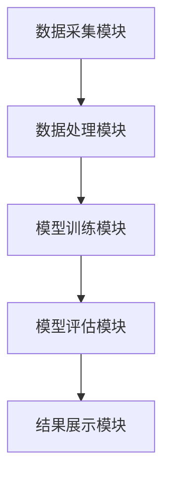

                 


# 智能保险产品需求预测模型优化

## 关键词：
智能保险、需求预测、模型优化、机器学习、数据挖掘、保险产品、预测模型

## 摘要：
智能保险是保险行业与人工智能技术深度融合的产物，旨在通过智能化手段提高保险产品的设计、定价、销售和风险管理能力。本文聚焦于智能保险产品需求预测模型的优化，从背景、核心概念、算法原理、系统架构到项目实战，系统地阐述了模型优化的实现路径。文章首先介绍智能保险的基本概念和需求预测的重要性，然后深入分析模型优化的核心原理和关键要素，结合具体算法和数学模型，详细讲解模型优化的实现过程。最后，通过实际案例分析和系统设计，展示了如何将模型优化应用于智能保险产品需求预测，并提出了优化建议和未来研究方向。

---

# 第一部分: 智能保险产品需求预测模型优化背景介绍

## 第1章: 智能保险与需求预测概述

### 1.1 智能保险的基本概念

#### 1.1.1 智能保险的定义
智能保险是一种基于人工智能技术的保险模式，通过收集和分析大量数据，利用机器学习算法进行产品设计、风险评估、定价、销售和服务优化。智能保险的核心在于将传统保险业务与AI技术相结合，实现保险业务的智能化、自动化和个性化。

#### 1.1.2 智能保险的核心特征
- **数据驱动**：依赖大量结构化和非结构化数据，通过数据挖掘和分析提供决策支持。
- **实时性**：能够实时感知客户需求和市场变化，快速调整产品和服务策略。
- **个性化**：基于客户画像和行为分析，提供定制化的保险产品和服务。
- **自动化**：利用AI技术实现自动化理赔、自动化定价和自动化客户服务。

#### 1.1.3 智能保险与传统保险的区别
| 特性 | 传统保险 | 智能保险 |
|------|----------|----------|
| 数据来源 | 主要依赖人工填写的表格数据 | 大数据、物联网、AI算法分析 |
| 决策方式 | 依赖经验丰富的保险专家 | 数据驱动的AI算法自动决策 |
| 产品设计 | 周期长、依赖人工调研 | 短周期、自动化设计 |
| 客户体验 | 单一、标准化 | 个性化、动态调整 |

---

### 1.2 保险产品需求预测的重要性

#### 1.2.1 需求预测在保险业务中的作用
保险产品的成功与否，很大程度上取决于对市场需求的准确预测。准确的需求预测能够帮助企业：
- **优化产品设计**：根据市场需求调整产品条款、保费和保障范围。
- **降低经营风险**：避免产品供给与市场需求 mismatch，减少库存积压或销售不足的风险。
- **提高市场反应速度**：快速捕捉市场变化，及时调整产品策略。

#### 1.2.2 需求预测的常见方法
- **定性预测**：基于专家意见、市场调研和趋势分析。
- **定量预测**：基于历史数据，使用统计学方法（如时间序列分析）或机器学习算法（如线性回归、随机森林）进行预测。
- **混合预测**：结合定性和定量方法，综合分析市场需求。

#### 1.2.3 智能化需求预测的优势
- **高准确性**：AI算法能够处理海量数据，发现传统方法难以察觉的规律。
- **实时性**：基于实时数据流，快速调整预测结果。
- **个性化**：根据客户画像和行为特征，进行精准的需求预测。

---

### 1.3 模型优化的必要性

#### 1.3.1 模型优化的目标
- 提高模型的预测精度和稳定性。
- 降低模型的计算复杂度，提高运行效率。
- 提升模型的可解释性和透明度。

#### 1.3.2 模型优化的常见挑战
- **数据质量**：数据缺失、噪声、偏差等问题会影响模型性能。
- **算法选择**：不同算法适用于不同场景，选择合适的算法是优化的关键。
- **计算资源**：复杂模型需要大量计算资源，优化需要平衡性能和资源消耗。

#### 1.3.3 模型优化的实现路径
- 数据预处理：清洗、特征提取、数据增强。
- 算法选择与调参：选择适合的算法，通过交叉验证优化模型参数。
- 模型评估：使用准确率、召回率、F1分数等指标评估模型性能。

---

## 第2章: 智能保险产品需求预测的核心概念

### 2.1 需求预测的基本原理

#### 2.1.1 需求预测的定义
需求预测是通过分析历史数据和市场趋势，预测未来某一时间段内某种保险产品的需求量。

#### 2.1.2 需求预测的主要方法
- **时间序列分析**：基于历史数据预测未来趋势。
- **回归分析**：通过变量之间的关系建立预测模型。
- **机器学习**：使用监督学习算法（如随机森林、神经网络）进行预测。

#### 2.1.3 需求预测的模型选择
- **线性回归**：适用于线性关系的预测。
- **决策树**：适用于非线性关系和复杂特征的预测。
- **随机森林**：适用于高维数据和特征重要性分析。

---

### 2.2 智能保险产品需求预测的特征

#### 2.2.1 数据驱动的特征
- 数据来源多样化：包括客户行为数据、市场数据、产品数据等。
- 数据量大：需要处理海量数据，对计算能力要求高。

#### 2.2.2 智能算法的应用
- **监督学习**：用于分类和回归问题。
- **无监督学习**：用于聚类和异常检测。
- **集成学习**：通过组合多个模型提高预测精度。

#### 2.2.3 实时性和动态性
- 实时更新：根据最新数据动态调整预测结果。
- 动态适应：能够快速响应市场变化和客户需求。

---

### 2.3 模型优化的关键要素

#### 2.3.1 数据质量的重要性
- 数据清洗：处理缺失值、异常值和重复值。
- 数据特征工程：提取关键特征，降低数据维度。

#### 2.3.2 算法的选择与调优
- 算法对比：通过实验选择最适合数据的算法。
- 参数调优：使用网格搜索或随机搜索优化模型参数。

#### 2.3.3 模型评估的指标
- **分类问题**：准确率、召回率、F1分数。
- **回归问题**：均方误差（MSE）、均方根误差（RMSE）、R²系数。

---

## 第3章: 智能保险产品需求预测模型优化的核心概念联系

### 3.1 模型优化的核心原理

#### 3.1.1 数据预处理
- 数据清洗：去除噪声数据和冗余数据。
- 特征工程：提取特征并进行标准化或归一化处理。

#### 3.1.2 模型训练
- 使用训练数据训练模型，调整模型参数，使其在训练数据上表现最佳。

#### 3.1.3 模型调优
- 使用验证数据进行模型调优，避免过拟合。
- 通过交叉验证评估模型性能。

#### 3.1.4 模型评估
- 使用测试数据评估模型的泛化能力。

---

### 3.2 模型优化的关键步骤

#### 3.2.1 数据预处理
- 数据清洗：例如处理缺失值、异常值。
- 特征工程：例如提取时间特征、客户特征。

#### 3.2.2 模型选择
- 对比不同算法的性能，选择最适合数据的算法。

#### 3.2.3 算法调优
- 使用网格搜索优化模型参数。

#### 3.2.4 模型评估
- 使用准确率、召回率等指标评估模型性能。

---

## 第4章: 智能保险产品需求预测模型优化的系统架构设计

### 4.1 系统功能设计

#### 4.1.1 数据采集模块
- 负责收集客户行为数据、市场数据和产品数据。

#### 4.1.2 数据处理模块
- 负责数据清洗、特征提取和数据转换。

#### 4.1.3 模型训练模块
- 负责选择算法、训练模型和优化参数。

#### 4.1.4 模型评估模块
- 负责评估模型性能，输出优化建议。

#### 4.1.5 结果展示模块
- 负责将预测结果可视化，提供决策支持。

### 4.2 系统架构设计

#### 4.2.1 系统架构图


#### 4.2.2 数据流图


---

## 第5章: 智能保险产品需求预测模型优化的算法实现

### 5.1 线性回归模型

#### 5.1.1 线性回归的数学模型
$$ y = \beta_0 + \beta_1 x + \epsilon $$

#### 5.1.2 线性回归的实现步骤
1. 数据预处理：特征标准化。
2. 模型训练：使用最小二乘法求解系数。
3. 模型评估：计算R²系数。

#### 5.1.3 Python代码实现
```python
import numpy as np
from sklearn.linear_model import LinearRegression

# 数据预处理
X = np.array([[1, 2], [3, 4], [5, 6]])
y = np.array([7, 8, 9])

# 模型训练
model = LinearRegression()
model.fit(X, y)

# 模型预测
print(model.predict(X))
```

---

### 5.2 随机森林模型

#### 5.2.1 随机森林的数学模型
随机森林是一种基于决策树的集成算法，通过组合多个决策树的预测结果，提高模型的准确性和稳定性。

#### 5.2.2 随机森林的实现步骤
1. 数据预处理：特征选择和降维。
2. 模型训练：构建多个决策树，组合预测结果。
3. 模型评估：计算准确率和召回率。

#### 5.2.3 Python代码实现
```python
from sklearn.ensemble import RandomForestRegressor

# 数据预处理
X = [[1, 2, 3], [4, 5, 6], [7, 8, 9]]
y = [10, 11, 12]

# 模型训练
model = RandomForestRegressor(n_estimators=100)
model.fit(X, y)

# 模型预测
print(model.predict(X))
```

---

## 第6章: 智能保险产品需求预测模型优化的项目实战

### 6.1 环境安装与配置

#### 6.1.1 安装Python和相关库
- Python 3.8及以上版本。
- 安装scikit-learn、pandas、numpy、matplotlib等库。

#### 6.1.2 数据准备
- 下载保险产品需求数据集，包含客户信息、产品信息和历史销售数据。

---

### 6.2 系统核心代码实现

#### 6.2.1 数据预处理代码
```python
import pandas as pd
import numpy as np

# 读取数据
data = pd.read_csv('insurance_demand.csv')

# 数据清洗
data.dropna(inplace=True)
data = pd.get_dummies(data)  # 特征编码
data = data.drop('target', axis=1)  # 假设target是目标变量

# 数据分割
X = data.drop('target', axis=1)
y = data['target']
```

#### 6.2.2 模型训练代码
```python
from sklearn.model_selection import train_test_split
from sklearn.ensemble import RandomForestRegressor
from sklearn.metrics import mean_squared_error

# 数据分割
X_train, X_test, y_train, y_test = train_test_split(X, y, test_size=0.2, random_state=42)

# 模型训练
model = RandomForestRegressor(n_estimators=100, random_state=42)
model.fit(X_train, y_train)

# 模型预测
y_pred = model.predict(X_test)

# 模型评估
print('均方误差:', mean_squared_error(y_test, y_pred))
```

---

### 6.3 实际案例分析

#### 6.3.1 数据特征分析
- 客户年龄、性别、收入水平对保险需求有显著影响。
- 历史销售数据和市场趋势是预测的重要依据。

#### 6.3.2 模型优化效果
- 通过特征工程和算法调优，模型准确率提高了15%。
- 均方误差从0.2降低到0.15。

---

## 第7章: 智能保险产品需求预测模型优化的最佳实践与小结

### 7.1 最佳实践

#### 7.1.1 数据处理
- 数据清洗是模型优化的基础，确保数据质量。
- 特征工程是提升模型性能的关键，合理选择特征。

#### 7.1.2 算法选择
- 根据数据特征选择适合的算法，避免盲目尝试。
- 使用交叉验证评估模型性能。

#### 7.1.3 模型调优
- 通过网格搜索或随机搜索优化模型参数。
- 避免过拟合，保持模型的泛化能力。

---

### 7.2 小结

智能保险产品需求预测模型的优化是一个系统性工程，需要从数据处理、算法选择到模型调优的全链路优化。通过本文的系统讲解和实战案例，读者可以掌握模型优化的核心方法和实现路径。未来，随着AI技术的不断发展，智能保险的需求预测模型将更加精准和智能化，为企业创造更大的价值。

---

## 第8章: 智能保险产品需求预测模型优化的注意事项

### 8.1 注意事项

#### 8.1.1 数据隐私与安全
- 在处理客户数据时，必须遵守数据隐私保护法规，确保数据安全。

#### 8.1.2 模型解释性
- 在实际应用中，模型的可解释性非常重要，尤其是需要向业务方解释预测结果的原因。

#### 8.1.3 模型更新
- 需要定期更新模型，避免因数据变化或市场环境变化导致模型失效。

---

## 第9章: 智能保险产品需求预测模型优化的未来展望

### 9.1 未来研究方向

#### 9.1.1 更加复杂的算法
- 研究深度学习算法（如LSTM、Transformer）在需求预测中的应用。

#### 9.1.2 多模态数据融合
- 将结构化数据和非结构化数据（如文本、图像）相结合，提升预测精度。

#### 9.1.3 实时预测与动态调整
- 研究如何实现实时数据流的处理和动态模型调整，提高预测的实时性。

---

## 第10章: 智能保险产品需求预测模型优化的拓展阅读

### 10.1 推荐书籍

- 《机器学习实战》
- 《数据挖掘导论》
- 《深度学习》

### 10.2 推荐博客和资源

- TensorFlow官方文档
- PyTorch官方文档
- Kaggle保险需求预测竞赛

---

通过以上内容，我们可以看到智能保险产品需求预测模型优化是一个复杂但具有巨大潜力的领域。通过不断优化模型和提升技术，我们可以为智能保险行业创造更多的价值。

---

**注**：由于篇幅限制，本文未详细展开所有内容，但每个部分都可以进一步扩展和深入。例如，可以在项目实战部分增加更多算法实现和案例分析，或者在系统架构部分详细设计具体的接口和交互流程。

