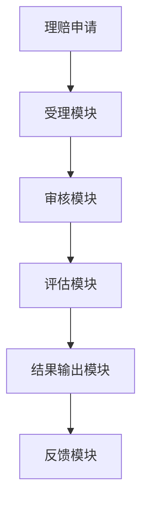
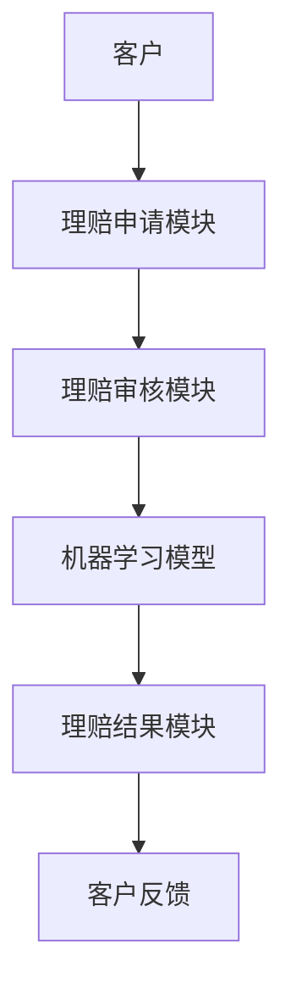
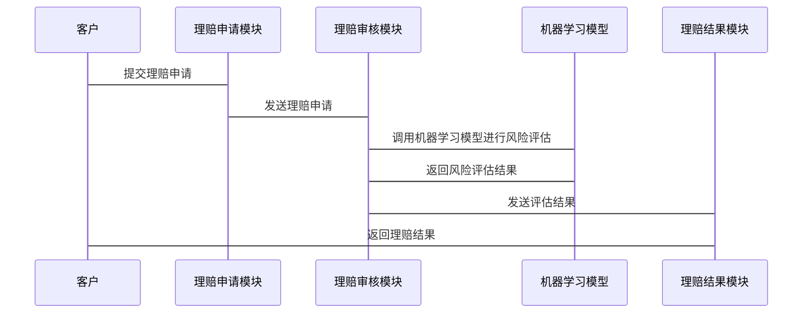

                 


# 智能保险理赔处理系统

> 关键词：智能保险，理赔系统，人工智能，大数据，区块链，机器学习，计算机视觉

> 摘要：智能保险理赔处理系统利用人工智能和大数据技术，优化传统保险理赔流程，实现理赔处理的自动化、智能化和高效化。本文将从背景、核心概念、算法原理、系统架构到项目实战，全面解析智能保险理赔处理系统的开发与应用。

---

## 第一部分：智能保险理赔处理系统概述

### 第1章：保险行业的现状与挑战

#### 1.1 保险行业的数字化转型
##### 1.1.1 保险行业的传统理赔流程
传统的保险理赔流程通常包括以下几个步骤：
1. 理赔申请：客户提交理赔申请及相关材料（如保单、医疗费用清单等）。
2. 材料审核：保险公司审核员对提交的材料进行初步检查，确保材料的完整性和真实性。
3. 风险评估：根据客户提供的信息，评估理赔的风险。
4. 理赔决策：基于风险评估结果，决定是否批准理赔申请。
5. 支付与反馈：批准后，保险公司完成赔付，并向客户反馈结果。

##### 1.1.2 数字化转型的必要性
随着科技的发展，传统保险行业面临以下挑战：
- 理赔流程繁琐，人工审核效率低。
- 理赔数据分散，难以统一管理。
- 理赔过程透明度低，客户体验差。

数字化转型可以通过引入人工智能、大数据和区块链等技术，解决上述问题。

##### 1.1.3 保险行业的痛点与机遇
- **痛点**：
  - 人工审核效率低，容易出错。
  - 数据孤岛问题，难以实现数据共享。
  - 理赔过程缺乏透明性，客户满意度低。
- **机遇**：
  - 人工智能技术的快速发展为保险行业带来了新的可能性。
  - 数字化转型可以帮助保险公司提升效率、降低成本，增强客户体验。

#### 1.2 智能保险理赔的必要性
##### 1.2.1 理赔流程中的问题与挑战
传统理赔流程中存在的主要问题包括：
1. 理赔申请材料复杂，人工审核耗时长。
2. 数据分散，难以快速获取和处理。
3. 理赔决策依赖人工经验，容易出错。

##### 1.2.2 智能化技术在保险理赔中的应用前景
人工智能技术在保险理赔中的应用前景广阔：
- **自动化处理**：通过OCR、NLP等技术，自动识别和处理理赔材料。
- **智能审核**：利用机器学习模型，自动评估理赔风险。
- **智能决策**：基于大数据分析，优化理赔决策流程。

##### 1.2.3 智能保险理赔的核心价值
智能保险理赔系统的核心价值体现在：
- 提高理赔效率，缩短理赔时间。
- 提升理赔准确性，降低人为错误。
- 增强客户体验，提供透明化的理赔流程。

#### 1.3 保险行业的未来发展趋势
##### 1.3.1 保险科技（InsurTech）的概念与内涵
保险科技（InsurTech）是指利用新兴技术（如人工智能、大数据、区块链等）来优化和创新保险行业的产品、服务和运营模式。

##### 1.3.2 AI与大数据在保险行业的应用
- **AI在保险行业的应用**：
  - 风险评估：利用机器学习模型预测理赔风险。
  - 自然语言处理：用于理赔文档的自动分类和摘要。
- **大数据在保险行业的应用**：
  - 数据分析：帮助保险公司更好地理解客户行为和风险。
  - 数据可视化：提供直观的数据支持决策。

##### 1.3.3 智能保险理赔的未来发展方向
未来的智能保险理赔系统将朝着以下几个方向发展：
- **智能化**：进一步提升系统的智能化水平，实现全流程自动化。
- **个性化**：根据客户需求，提供个性化的理赔服务。
- **实时化**：通过实时数据分析，实现快速理赔决策。

---

### 第2章：智能保险理赔系统的核心概念

#### 2.1 智能保险理赔系统的定义与特点
##### 2.1.1 系统的定义
智能保险理赔系统是一种基于人工智能和大数据技术的自动化理赔处理系统，能够实现理赔申请的自动受理、智能审核和快速决策。

##### 2.1.2 系统的核心特点
- **自动化**：从理赔申请到赔付完成，整个流程实现自动化处理。
- **智能化**：利用机器学习和自然语言处理技术，提升理赔审核的准确性和效率。
- **高效性**：通过大数据分析和实时处理，缩短理赔时间。

##### 2.1.3 系统与传统理赔系统的区别
| 特性         | 传统理赔系统       | 智能保险理赔系统       |
|--------------|--------------------|------------------------|
| 处理方式     | 人工审核为主       | 自动化处理为主         |
| 效率         | 较低               | 高                     |
| 准确性       | 易出错             | 高                     |
| 透明度       | 低                 | 高                     |

#### 2.2 智能保险理赔系统的核心模块
##### 2.2.1 理赔申请与受理模块
- **功能**：接收客户的理赔申请，自动提取关键信息。
- **技术**：OCR技术用于识别和提取理赔单据中的文字信息。

##### 2.2.2 理赔审核与评估模块
- **功能**：对理赔申请进行风险评估和审核。
- **技术**：机器学习模型用于评估理赔风险。

##### 2.2.3 理赔结果输出与反馈模块
- **功能**：根据审核结果，输出理赔决定并反馈给客户。
- **技术**：自然语言处理技术用于生成个性化的反馈信息。

#### 2.3 智能保险理赔系统的流程与架构
##### 2.3.1 理赔流程的标准化
- **标准化**：制定统一的理赔流程标准，确保各环节的高效衔接。
- **模块化**：将理赔流程分解为多个模块，每个模块独立处理特定任务。

##### 2.3.2 系统架构的分层设计
智能保险理赔系统的架构可以分为以下几层：
1. **数据层**：存储理赔相关的数据，如保单信息、理赔申请等。
2. **业务逻辑层**：实现理赔流程的业务逻辑，如风险评估、理赔决策等。
3. **用户界面层**：提供用户友好的界面，方便客户提交和查询理赔状态。

##### 2.3.3 各模块之间的交互关系
通过以下流程图展示模块之间的交互关系：



---

## 第3章：智能保险理赔系统的核心技术

### 3.1 人工智能技术在保险理赔中的应用
#### 3.1.1 机器学习在风险评估中的应用
- **应用场景**：
  - 预测理赔风险。
  - 评估客户的信用风险。

- **算法选择**：
  - 监督学习：用于分类任务（如欺诈检测）。
  - 无监督学习：用于异常检测。

- **数学公式**：
  - 逻辑回归模型：$P(y=1|x) = \frac{1}{1 + e^{-w x - b}}$

#### 3.1.2 自然语言处理（NLP）在理赔文档处理中的应用
- **应用场景**：
  - 理赔文档的自动分类。
  - 提取文档中的关键信息（如金额、时间等）。

- **算法选择**：
  - 文本分类：用于分类理赔类型。
  - 命名实体识别：用于提取文档中的实体信息。

- **数学公式**：
  - Word2Vec模型：$v_i = f(x_i)$，其中$v_i$是词向量，$x_i$是输入词。

#### 3.1.3 计算机视觉（CV）在理赔单证识别中的应用
- **应用场景**：
  - 识别和提取理赔单据中的文字信息。
  - 检测单据中的异常信息。

- **算法选择**：
  - OCR技术：用于文字识别。
  - 目标检测：用于检测单据中的关键区域。

- **数学公式**：
  - YOLO目标检测模型：$P(y|X) = \prod_{i=1}^{n} P(y_i|X, y_{i-1})$

### 3.2 大数据技术在保险理赔中的应用
#### 3.2.1 数据采集与处理
- **数据来源**：
  - 客户提交的理赔申请。
  - 历史理赔数据。
  - 第三方数据（如医疗数据）。

- **数据处理**：
  - 数据清洗：去除无效数据。
  - 数据转换：将数据转换为适合模型训练的格式。

#### 3.2.2 数据分析与挖掘
- **分析方法**：
  - 数据可视化：通过图表展示数据分布。
  - 数据挖掘：发现数据中的规律和模式。

- **数学公式**：
  - 聚类分析：$K = \arg\max_{k} J(C_k)$，其中$J$是聚类准则函数。

#### 3.2.3 数据可视化与决策支持
- **数据可视化工具**：
  - Tableau：用于生成数据图表。
  - Power BI：用于生成交互式数据仪表盘。

- **决策支持**：
  - 提供实时数据分析支持。
  - 帮助保险公司优化理赔策略。

### 3.3 区块链技术在保险理赔中的应用
#### 3.3.1 区块链技术的基本原理
- **区块链**：一种分布式账本技术，具有去中心化、不可篡改等特点。

- **数据存储**：
  - 每个区块存储一定量的交易数据。
  - 区块通过哈希值链式连接。

- **共识机制**：
  - PoW（工作量证明）：比特币采用的共识机制。
  - PoS（权益证明）：以太坊采用的共识机制。

#### 3.3.2 区块链在保险理赔中的应用场景
- **数据共享**：
  - 通过区块链技术实现理赔数据的共享和透明化。
- **防篡改**：
  - 区块链的不可篡改性确保理赔数据的安全性和可靠性。
- **智能合约**：
  - 利用智能合约自动执行理赔流程。

#### 3.3.3 区块链技术的优势与挑战
| 特性       | 优势                   | 挑战                   |
|------------|------------------------|------------------------|
| 数据安全性 | 高                     | 技术复杂性高           |
| 透明性     | 高                     | 部署成本高             |
| 可扩展性   | 低                     | 网络性能受限           |

---

## 第4章：智能保险理赔系统的算法原理

### 4.1 机器学习算法在保险理赔中的应用
#### 4.1.1 监督学习在风险评估中的应用
- **算法选择**：
  - logistic回归：用于二分类任务。
  - 支持向量机（SVM）：用于分类任务。

- **数学公式**：
  - logistic回归：$P(y=1|x) = \frac{e^{w x + b}}{1 + e^{w x + b}}}$

#### 4.1.2 无监督学习在异常检测中的应用
- **算法选择**：
  - K-means：用于聚类分析。
  - DBSCAN：用于密度聚类。

- **数学公式**：
  - DBSCAN：$coredist(x) = \min_{x' \in N_k(x)} \{ dist(x, x') \}$

#### 4.1.3 深度学习在图像识别中的应用
- **算法选择**：
  - 卷积神经网络（CNN）：用于图像分类。
  - 目标检测网络（如YOLO、Faster R-CNN）：用于目标检测。

- **数学公式**：
  - CNN的卷积层：$f(x) = \sum_{j=1}^{n} w_j x_j + b$

### 4.2 自然语言处理算法在保险理赔中的应用
#### 4.2.1 文本分类在理赔类型识别中的应用
- **算法选择**：
  - 朴素贝叶斯：适用于文本分类。
  - 随机森林：适用于特征选择和分类。

- **数学公式**：
  - 朴素贝叶斯：$P(c|x) = \frac{P(x|c)P(c)}{P(x)}$

#### 4.2.2 文本摘要在理赔文档处理中的应用
- **算法选择**：
  - 基于规则的摘要：根据预定义规则提取关键信息。
  - 基于模型的摘要：利用机器学习模型生成摘要。

- **数学公式**：
  - TF-IDF：$TF_{t,d} = \frac{\text{count of term } t \text{ in document } d}{\text{total number of terms in document } d}$

#### 4.2.3 命名实体识别在理赔信息提取中的应用
- **算法选择**：
  - CRF（条件随机场）：用于序列标注任务。
  - LSTM（长短期记忆网络）：用于序列建模任务。

- **数学公式**：
  - CRF：$P(y_i|x_i) = \frac{1}{Z_i} \exp(\sum_{k=1}^{m} w_k f_k(x_i, y_i, y_{i-1}))}$

### 4.3 计算机视觉算法在保险理赔中的应用
#### 4.3.1 图像分类在理赔单证识别中的应用
- **算法选择**：
  - ResNet：用于图像分类任务。
  - VGGNet：用于图像分类任务。

- **数学公式**：
  - ResNet的残差函数：$F(x) = G(F(x)) + x$

#### 4.3.2 图像分割在复杂场景识别中的应用
- **算法选择**：
  - U-Net：用于医学图像分割。
  - Mask R-CNN：用于目标分割任务。

- **数学公式**：
  - U-Net的跳跃连接：$output = conv(input) + input$

#### 4.3.3 目标检测在理赔单证OCR中的应用
- **算法选择**：
  - YOLO：用于目标检测和识别。
  - SSD：用于目标检测和识别。

- **数学公式**：
  - YOLOv3的损失函数：$\mathcal{L} = \mathcal{L}_{\text{cls}} + \mathcal{L}_{\text{loc}} + \mathcal{L}_{\text{conf}}$

---

## 第5章：智能保险理赔系统的系统架构设计

### 5.1 系统功能设计
#### 5.1.1 理赔申请与受理模块
- **功能描述**：
  - 接收客户的理赔申请，自动提取关键信息。
  - 提供友好的用户界面，方便客户提交申请。

- **核心功能**：
  - 提交理赔申请。
  - 自动识别和提取理赔单据中的文字信息。

#### 5.1.2 理赔审核与评估模块
- **功能描述**：
  - 对理赔申请进行风险评估和审核。
  - 基于机器学习模型进行智能审核。

- **核心功能**：
  - 风险评估。
  - 异常检测。

#### 5.1.3 理赔结果输出与反馈模块
- **功能描述**：
  - 根据审核结果，输出理赔决定并反馈给客户。
  - 提供个性化的反馈信息。

- **核心功能**：
  - 理赔结果输出。
  - 客户反馈。

### 5.2 系统架构设计
#### 5.2.1 系统架构图


#### 5.2.2 系统功能模块之间的交互流程
1. **客户提交理赔申请**：
   - 提交理赔申请及相关材料。
2. **理赔申请模块处理**：
   - 自动提取关键信息。
3. **理赔审核模块处理**：
   - 调用机器学习模型进行风险评估。
4. **机器学习模型输出结果**：
   - 返回风险评估结果。
5. **理赔结果模块处理**：
   - 根据评估结果，输出理赔决定。
6. **客户反馈模块处理**：
   - 提供个性化的反馈信息。

### 5.3 系统接口设计
#### 5.3.1 接口描述
- **接口名称**：理赔申请接口。
- **接口功能**：接收客户的理赔申请，自动提取关键信息。
- **接口类型**：RESTful API。

#### 5.3.2 接口参数
| 参数名称       | 参数类型 | 参数描述                     |
|----------------|----------|-----------------------------|
|理赔申请ID      | String    | 理赔申请的唯一标识符         |
|客户信息       | JSON      | 包括客户姓名、联系方式等       |
|理赔单据       | File      | 包括保单、医疗费用清单等       |

### 5.4 系统交互流程


---

## 第6章：项目实战

### 6.1 环境安装
#### 6.1.1 安装Python
```bash
# 安装Python
sudo apt-get install python3 python3-pip
```

#### 6.1.2 安装依赖库
```bash
# 安装机器学习库
pip install numpy scikit-learn tensorflow

# 安装NLP库
pip install nltk spacy

# 安装CV库
pip install opencv-python
```

### 6.2 系统核心代码实现
#### 6.2.1 理赔申请模块代码
```python
import cv2
import numpy as np

def extract_text(image_path):
    # 使用OCR技术提取文本
    img = cv2.imread(image_path)
    # 使用Tesseract进行OCR
    text = pytesseract.image_to_string(img)
    return text
```

#### 6.2.2 理赔审核模块代码
```python
from sklearn.linear_model import LogisticRegression

def train_classifier(X_train, y_train):
    # 训练逻辑回归模型
    clf = LogisticRegression()
    clf.fit(X_train, y_train)
    return clf

def predict_risk(X_test, clf):
    # 预测风险
    y_pred = clf.predict(X_test)
    return y_pred
```

#### 6.2.3 理赔结果输出模块代码
```python
import spacy

def generate_feedback(customer_info, prediction):
    # 使用NLP生成反馈信息
    nlp = spacy.load("en_core_web_sm")
    doc = nlp(customer_info)
    # 生成摘要
    summary = summarize(doc)
    return summary
```

### 6.3 案例分析
#### 6.3.1 案例背景
假设一位客户提交了医疗费用理赔申请，系统需要自动识别和提取理赔单据中的信息，并进行风险评估。

#### 6.3.2 系统实现
1. **提取文本信息**：
   ```python
   text = extract_text("medical_bill.jpg")
   ```
2. **训练模型**：
   ```python
   X_train, y_train = prepare_data()
   clf = train_classifier(X_train, y_train)
   ```
3. **预测风险**：
   ```python
   X_test = preprocess(text)
   prediction = predict_risk(X_test, clf)
   ```
4. **生成反馈**：
   ```python
   feedback = generate_feedback(customer_info, prediction)
   ```

#### 6.3.3 分析结果
- **提取文本信息**：成功提取了医疗费用清单中的关键信息。
- **预测风险**：模型预测该理赔申请为低风险。
- **生成反馈**：系统生成个性化的反馈信息，通知客户理赔申请已通过。

### 6.4 项目总结
- **实现目标**：
  - 成功实现了智能保险理赔处理系统的部分功能。
  - 验证了人工智能技术在保险理赔中的应用效果。

- **项目经验**：
  - 数据质量对模型性能影响很大。
  - 系统的可扩展性和可维护性需要进一步优化。

---

## 第7章：最佳实践

### 7.1 小结
智能保险理赔处理系统的开发和应用，不仅提高了理赔效率，还提升了客户体验。通过人工智能和大数据技术的应用，保险公司可以实现理赔流程的智能化和高效化。

### 7.2 注意事项
- 数据隐私保护：在处理客户数据时，必须遵守相关法律法规。
- 模型训练数据质量：确保训练数据的多样性和代表性。
- 系统安全性：防止系统被攻击和篡改。

### 7.3 拓展阅读
- 《Python机器学习实战》
- 《深度学习入门：基于Python和TensorFlow》
- 《区块链技术及应用》

---

通过以上内容，我们系统地介绍了智能保险理赔处理系统的开发与应用，从背景、核心概念、算法原理到项目实战，帮助读者全面理解智能保险理赔处理系统的构建与优化。

