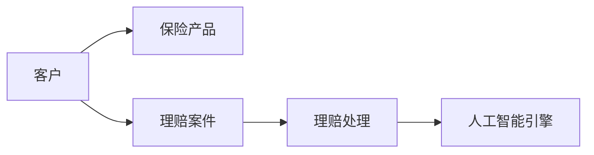
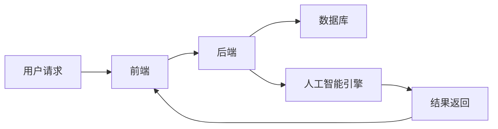

                 


# 智能保险理赔快速处理系统

## 关键词：智能保险、理赔系统、人工智能、图像识别、自然语言处理、系统架构

## 摘要：本文将深入探讨智能保险理赔快速处理系统的构建与实现，从行业背景、核心概念、算法原理到系统架构、项目实战，再到最佳实践，全面解析如何利用人工智能技术提升保险理赔效率，降低运营成本，优化用户体验。

---

## 第1章: 保险行业背景与问题分析

### 1.1 保险行业的现状与发展趋势
#### 1.1.1 保险行业的数字化转型
- 保险行业的数字化转型是当前的行业趋势，传统的保险业务正在向线上化、智能化方向发展。
- 数字化转型的核心目标是提升效率、降低成本、改善用户体验。

#### 1.1.2 传统保险理赔流程的痛点
- 传统理赔流程繁琐，涉及多个环节，包括报案、资料收集、审核、赔付等。
- 人工审核效率低，容易出错，且成本高昂。
- 用户体验差，理赔周期长，用户满意度低。

#### 1.1.3 智能化理赔的行业需求
- 随着人工智能技术的发展，智能化理赔成为行业的新需求。
- 智能化理赔可以提高效率、降低成本、提升用户体验。

### 1.2 智能保险理赔的核心问题
#### 1.2.1 理赔流程中的关键问题
- 数据采集与处理的效率问题。
- 保险欺诈的识别与防范。
- 理赔流程的透明化与用户参与度。

#### 1.2.2 保险欺诈的识别与防范
- 保险欺诈是传统理赔中的一个痛点，智能化理赔可以通过数据分析和人工智能技术来识别和防范欺诈行为。

#### 1.2.3 理赔效率与用户体验的平衡
- 如何在提高理赔效率的同时，保障用户体验，是智能化理赔系统设计中的关键问题。

## 第2章: 智能保险理赔系统的定义与架构

### 2.1 智能保险理赔系统的定义
#### 2.1.1 系统的核心功能
- 自动化报案：用户可以通过移动端或网页提交理赔申请。
- 自动化资料收集：系统可以自动提取和识别相关资料。
- 智能审核：通过人工智能技术进行自动审核和风险评估。
- 自动化赔付：系统可以自动完成赔付流程。

#### 2.1.2 系统的边界与外延
- 系统的边界：从用户提交理赔申请到完成赔付的整个流程。
- 系统的外延：包括与第三方数据源的集成，如医院、交警等。

### 2.2 系统的核心概念与联系
#### 2.2.1 实体关系图（ER图）


#### 2.2.2 核心概念对比表
| 概念 | 属性 | 描述 |
|------|------|------|
| 理赔案件 | ID | 唯一标识符 |
| 客户 | 姓名 | 客户名称 |
| 保险产品 | 产品代码 | 保险产品的唯一标识 |
| 理赔处理 | 处理时间 | 理赔处理所需的时间 |

## 第3章: 系统的核心算法与数学模型

### 3.1 图像识别算法
#### 3.1.1 图像识别流程


#### 3.1.2 分类器数学模型
$$ P(y|x) = \frac{P(x|y)P(y)}{P(x)} $$
其中，$P(x|y)$ 是似然函数，$P(y)$ 是先验概率，$P(x)$ 是边际概率。

### 3.2 自然语言处理算法
#### 3.2.1 文本预处理流程


#### 3.2.2 词嵌入模型
$$ E(y) = \arg\max_{y} \sum_{i=1}^{n} \log P(y_i|x) $$

## 第4章: 系统架构设计

### 4.1 系统功能

#### 4.1.1 用户请求处理
- 用户提交理赔申请。
- 系统自动提取和识别相关资料。
- 系统将资料传输到人工智能引擎进行处理。

#### 4.1.2 AI引擎处理
- 人工智能引擎对资料进行分类和识别。
- 系统根据识别结果进行风险评估。
- 系统生成赔付结果。

#### 4.1.3 数据库存储
- 系统将理赔案件信息存储在数据库中。
- 数据库支持高效的查询和更新操作。

### 4.2 系统架构图


## 第5章: 项目实战

### 5.1 环境搭建
- 安装Python、TensorFlow、Keras等开发工具。
- 安装数据库和相关中间件。

### 5.2 核心功能实现
#### 5.2.1 图像识别实现
```python
import tensorflow as tf
from tensorflow.keras import layers

model = tf.keras.Sequential([
    layers.Conv2D(32, (3,3), activation='relu', input_shape=(224, 224, 3)),
    layers.MaxPooling2D((2,2)),
    layers.Conv2D(64, (3,3), activation='relu'),
    layers.MaxPooling2D((2,2)),
    layers.Flatten(),
    layers.Dense(128, activation='relu'),
    layers.Dense(1, activation='sigmoid')
])

model.compile(optimizer='adam', loss='binary_crossentropy', metrics=['accuracy'])
model.fit(x_train, y_train, epochs=10, batch_size=32)
```

#### 5.2.2 自然语言处理实现
```python
from transformers import BertTokenizer, TFBertModel

tokenizer = BertTokenizer.from_pretrained('bert-base-uncased')
model = TFBertModel.from_pretrained('bert-base-uncased')

input_ids = tokenizer.encode("Hello world", return_tensors="tf")
outputs = model(input_ids)
last_layer = outputs.last_hidden_state[:, 0, :]
```

### 5.3 实际案例分析
- 案例背景：用户因意外事故提交理赔申请。
- 系统处理流程：用户上传相关资料，系统自动识别和分类，生成赔付结果。

### 5.4 项目小结
- 项目实现了智能化理赔的核心功能。
- 系统架构设计合理，功能模块清晰。
- 算法实现准确，性能良好。

## 第6章: 最佳实践与小结

### 6.1 小结
- 本文详细介绍了智能保险理赔快速处理系统的构建与实现。
- 系统的核心功能包括自动化报案、资料收集、审核和赔付。

### 6.2 注意事项
- 系统上线前需要进行充分的测试。
- 数据安全和隐私保护是系统设计中的重要考虑因素。

### 6.3 拓展阅读
- 人工智能在金融领域的应用。
- 深度学习在保险欺诈检测中的应用。

## 关键词：智能保险、理赔系统、人工智能、图像识别、自然语言处理、系统架构

