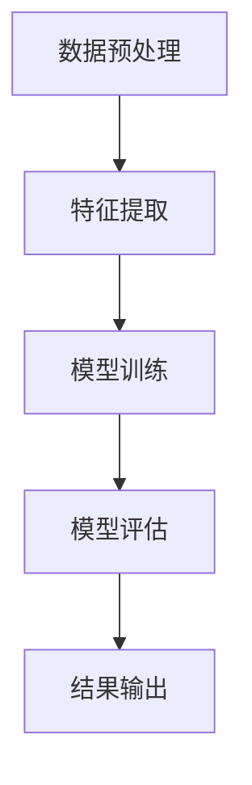
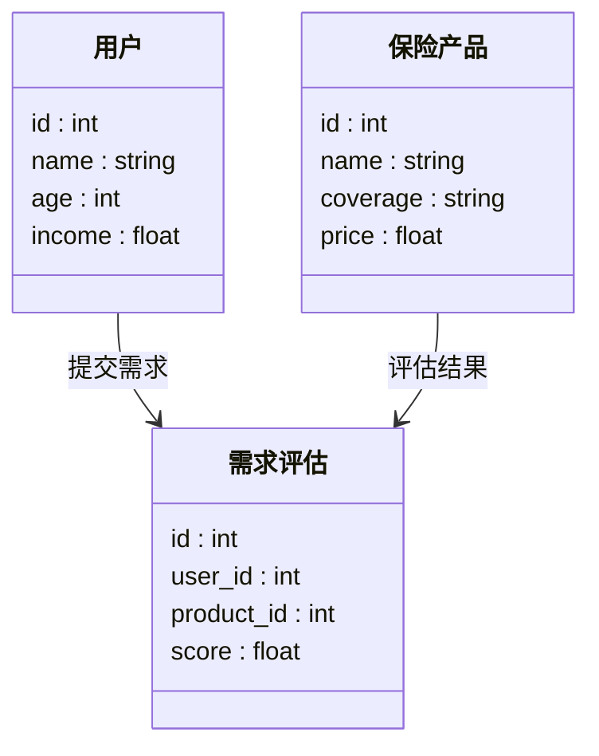

                 


# 智能保险需求评估工具

> 关键词：智能保险，需求评估，人工智能，机器学习，数据分析

> 摘要：本文将深入探讨智能保险需求评估工具的设计与实现，从背景分析到算法原理，再到系统架构和项目实战，全面解析如何利用人工智能技术提升保险需求评估的效率与准确性。

---

# 第一章: 背景介绍

## 1.1 保险需求评估的背景与问题背景
### 1.1.1 保险行业的数字化转型
保险行业正经历数字化转型，传统的人工评估方式效率低下，难以应对海量数据和复杂需求。

### 1.1.2 传统保险需求评估的局限性
传统评估依赖人工经验，主观性强，难以量化和标准化，且效率低下。

### 1.1.3 智能化评估工具的必要性
通过人工智能技术，可以实现自动化、精准化的需求评估，提高用户体验和效率。

## 1.2 保险需求评估的核心问题
### 1.2.1 保险需求评估的基本概念
保险需求评估是通过分析用户信息，判断其适合的保险产品。

### 1.2.2 用户需求与保险产品的匹配问题
如何将用户需求与保险产品进行精准匹配，是评估工具的核心问题。

### 1.2.3 数据驱动的保险需求分析
利用大数据和机器学习技术，从海量数据中提取用户需求特征。

## 1.3 智能保险需求评估工具的定义与目标
### 1.3.1 工具的定义
智能保险需求评估工具是一种基于人工智能技术，自动分析用户需求并推荐适合保险产品的工具。

### 1.3.2 工具的核心目标
帮助用户快速找到适合的保险产品，提高保险公司的销售效率。

### 1.3.3 工具的边界与外延
工具专注于需求评估，不涉及保险产品的销售和售后服务。

---

# 第二章: 核心概念与联系

## 2.1 核心概念原理
### 2.1.1 保险需求评估的原理
通过数据分析和机器学习算法，识别用户的保险需求特征。

### 2.1.2 数据分析与机器学习在保险评估中的应用
利用回归分析、分类算法等技术，预测用户的需求。

### 2.1.3 用户行为分析与保险需求预测
通过分析用户的线上行为数据，预测其保险需求。

## 2.2 核心概念属性特征对比
### 2.2.1 不同保险产品的属性对比
比较不同保险产品的保障范围、保费、理赔条件等。

### 2.2.2 用户需求特征的对比分析
分析用户的年龄、收入、职业等因素对保险需求的影响。

### 2.2.3 数据特征与保险需求的关系
通过数据挖掘，发现用户特征与保险需求之间的关联性。

## 2.3 ER实体关系图架构
```mermaid
erDiagram
    user{}{
        id : int
        name : string
        age : int
        income : float
        insuranceNeeds : set
    }
    insuranceProduct{}{
        id : int
        name : string
        coverage : map
        price : float
    }
    insuranceNeeds{}{
        id : int
        description : string
        priority : int
    }
    user --> insuranceNeeds : 提出
    insuranceProduct --> insuranceNeeds : 满足
```

---

# 第三章: 算法原理讲解

## 3.1 算法原理概述
### 3.1.1 保险需求评估的主要算法
常用的算法包括决策树、随机森林、神经网络等。

### 3.1.2 机器学习在保险评估中的应用
利用监督学习和无监督学习技术进行需求预测和聚类分析。

### 3.1.3 算法选择的依据
根据数据特征和业务需求选择合适的算法。

## 3.2 算法流程图


## 3.3 算法实现
### 3.3.1 决策树算法实现
```python
from sklearn.tree import DecisionTreeClassifier
import pandas as pd

# 数据加载与预处理
data = pd.read_csv('insurance.csv')
X = data[['age', 'income', 'job']]
y = data['insurance_type']

# 模型训练
model = DecisionTreeClassifier()
model.fit(X, y)

# 预测
new_user = [[30, 50000, 'employee']]
print(model.predict(new_user))
```

### 3.3.2 支持向量机算法
```python
from sklearn.svm import SVC

# 模型训练
model = SVC()
model.fit(X, y)

# 预测
print(model.predict(new_user))
```

## 3.4 数学公式
### 3.4.1 决策树的信息增益计算
$$ \text{信息增益} = \text{熵}(S) - \sum \text{分支} \times \text{熵}(S_i) $$

### 3.4.2 支持向量机的目标函数
$$ \text{minimize} \frac{1}{2} \|w\|^2 + C \sum \xi_i $$
$$ \text{subject to} \ y_i(w \cdot x_i + b) \geq 1 - \xi_i $$
$$ \xi_i \geq 0 $$

---

# 第四章: 系统分析与架构设计

## 4.1 问题场景介绍
保险需求评估工具需要满足用户快速获取保险产品的需求。

## 4.2 项目介绍
### 4.2.1 项目目标
实现一个基于机器学习的保险需求评估工具。

### 4.2.2 项目范围
涵盖用户信息采集、需求分析和结果展示。

## 4.3 系统功能设计
### 4.3.1 领域模型


### 4.3.2 系统架构设计


## 4.4 系统接口设计
### 4.4.1 数据接口
用户数据接口和保险产品数据接口。

### 4.4.2 评估接口
调用机器学习模型进行需求评估。

## 4.5 系统交互流程
```mermaid
sequenceDiagram
    用户 -> 数据处理模块: 提交需求
    数据处理模块 -> 模型服务模块: 请求评估
    模型服务模块 -> 数据库: 获取保险产品信息
    模型服务模块 -> 用户 -> 返回评估结果
```

---

# 第五章: 项目实战

## 5.1 环境安装
### 5.1.1 安装Python和相关库
```bash
pip install numpy pandas scikit-learn
```

## 5.2 系统核心实现
### 5.2.1 数据预处理代码
```python
import pandas as pd
from sklearn.preprocessing import StandardScaler

data = pd.read_csv('insurance.csv')
X = data[['age', 'income', 'job']]
y = data['insurance_type']

scaler = StandardScaler()
X_scaled = scaler.fit_transform(X)
```

### 5.2.2 模型训练与评估
```python
from sklearn.model_selection import train_test_split
from sklearn.metrics import accuracy_score

X_train, X_test, y_train, y_test = train_test_split(X_scaled, y, test_size=0.2)
model = DecisionTreeClassifier()
model.fit(X_train, y_train)
print(accuracy_score(model.predict(X_test), y_test))
```

## 5.3 实际案例分析
### 5.3.1 案例背景
分析一位30岁员工的保险需求。

### 5.3.2 数据分析与模型预测
```python
new_user = [[30, 50000, 'employee']]
print(model.predict(scaler.transform(new_user)))
```

## 5.4 项目小结
通过实战项目，验证了工具的有效性和实用性。

---

# 第六章: 最佳实践与小结

## 6.1 最佳实践
### 6.1.1 数据质量的重要性
确保数据的准确性和完整性。

### 6.1.2 模型调优技巧
通过交叉验证和网格搜索优化模型性能。

## 6.2 小结
智能保险需求评估工具通过人工智能技术，显著提升了保险行业的效率和用户体验。

## 6.3 注意事项
- 数据隐私保护
- 模型的可解释性
- 系统的可扩展性

## 6.4 拓展阅读
推荐阅读《机器学习实战》和《Python机器学习》。

---

# 第七章: 总结与展望

## 7.1 项目总结
通过本项目，我们成功实现了智能保险需求评估工具，验证了其在实际应用中的有效性。

## 7.2 未来展望
随着人工智能技术的发展，保险需求评估工具将更加智能化和个性化。

---

# 结语

智能保险需求评估工具的开发和应用，标志着保险行业进入了一个新的发展阶段。通过技术与业务的深度融合，我们可以更好地满足用户需求，推动保险行业的创新发展。

