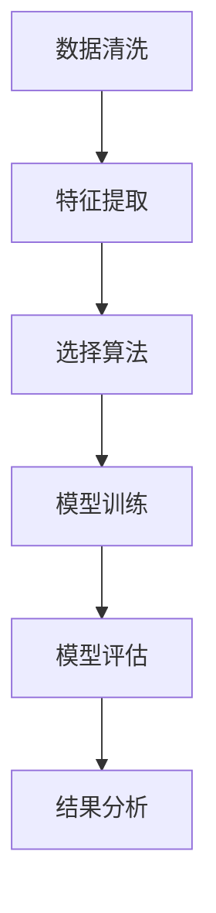
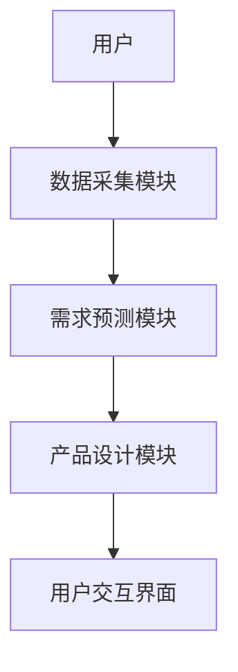
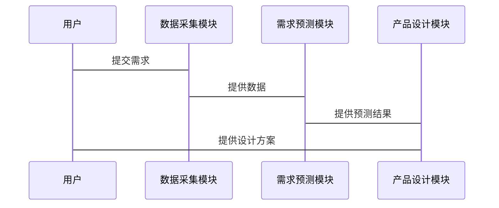

                 


# 《智能保险需求预测与产品设计系统》

> 关键词：智能保险，需求预测，产品设计，机器学习，人工智能

> 摘要：本文将探讨智能保险需求预测与产品设计系统的核心概念、算法原理、系统架构以及项目实战。通过详细分析，揭示如何利用人工智能技术提升保险行业的需求预测和产品设计效率，为保险行业提供创新的解决方案。

---

## 第1章: 智能保险需求预测与产品设计系统概述

### 1.1 问题背景
#### 1.1.1 保险行业数字化转型的现状
- 当前保险行业的数据化与智能化趋势
- 传统需求预测方法的局限性

#### 1.1.2 当前保险需求预测的痛点
- 数据分散、不完整
- 预测模型的准确性和实时性不足
- 缺乏个性化需求分析

#### 1.1.3 产品设计中的效率与精准性问题
- 产品设计周期长
- 个性化需求难以满足
- 产品与市场需求脱节

### 1.2 问题描述
#### 1.2.1 需求预测的复杂性
- 市场波动对需求的影响
- 用户行为的多样性
- 数据维度的多样性

#### 1.2.2 产品设计的多维度考量
- 用户需求分析
- 产品功能模块化设计
- 市场竞争分析

#### 1.2.3 当前技术手段的局限性
- 数据处理能力不足
- 预测模型的可解释性差
- 缺乏智能化辅助工具

### 1.3 问题解决
#### 1.3.1 智能化解决方案的提出
- 数据驱动的预测方法
- 人工智能技术的应用
- 智能化产品设计工具

#### 1.3.2 数据驱动的预测方法
- 数据采集与清洗
- 数据分析与建模
- 预测结果的应用

#### 1.3.3 人工智能在产品设计中的应用
- 机器学习算法的应用
- 自然语言处理技术
- 图像识别技术

### 1.4 系统的边界与外延
#### 1.4.1 系统的功能边界
- 数据采集与处理
- 需求预测与分析
- 产品设计与优化

#### 1.4.2 与现有保险系统的区别
- 智能化与自动化的区别
- 数据驱动与经验驱动的区别
- 用户交互方式的区别

#### 1.4.3 系统的扩展性与适应性
- 系统的可扩展性
- 系统的灵活性与适应性
- 系统的可维护性

### 1.5 核心概念结构与组成
#### 1.5.1 数据采集模块
- 数据来源
- 数据清洗与预处理
- 数据存储

#### 1.5.2 需求预测模型
- 算法选择
- 模型训练
- 模型评估

#### 1.5.3 产品设计模块
- 用户需求分析
- 产品功能设计
- 产品优化策略

#### 1.5.4 用户交互界面
- 用户界面设计
- 用户操作流程
- 用户反馈机制

## 第2章: 核心概念与系统架构

### 2.1 智能保险需求预测系统原理
#### 2.1.1 数据驱动的预测方法
- 数据特征提取
- 数据建模
- 预测结果分析

#### 2.1.2 机器学习模型的应用
- 监督学习
- 非监督学习
- 强化学习

#### 2.1.3 预测结果的解释性
- 可视化工具
- 解释性模型
- 预测结果的验证

### 2.2 产品设计系统的核心要素
#### 2.2.1 用户需求分析
- 用户画像
- 需求挖掘
- 需求排序

#### 2.2.2 产品功能模块设计
- 功能模块划分
- 模块之间的关系
- 模块设计的原则

#### 2.2.3 产品优化策略
- 持续优化
- 数据反馈机制
- 用户体验测试

### 2.3 系统核心概念对比表格
| 概念 | 特性1 | 特性2 | 特性3 |
|------|-------|-------|-------|
| 需求预测 | 数据驱动 | 模型复杂度 | 解释性 |
| 产品设计 | 用户导向 | 功能模块化 | 优化策略 |

### 2.4 系统ER实体关系图
```mermaid
er
  actor: 用户
  role: 保险顾问
  entity: 保险产品
  entity: 需求数据
  entity: 预测模型
  entity: 设计方案
  actor --> role: 提交需求
  role --> entity(需求数据): 收集数据
  entity(需求数据) --> entity(预测模型): 输入数据
  entity(预测模型) --> entity(需求预测结果): 输出预测
  entity(需求预测结果) --> entity(设计方案): 生成方案
  entity(设计方案) --> role: 提供设计
```

## 第3章: 算法原理与数学模型

### 3.1 需求预测算法原理
#### 3.1.1 线性回归模型
- 线性回归的基本原理
- 模型的假设
- 模型的优缺点

#### 3.1.2 随机森林算法
- 随机森林的基本原理
- 随机森林的优势
- 随机森林的参数调整

#### 3.1.3 LSTM序列模型
- LSTM的基本原理
- LSTM在时间序列预测中的应用
- LSTM的优缺点

### 3.2 预测模型的数学公式
#### 线性回归公式
$$ y = \beta_0 + \beta_1x + \epsilon $$

#### 随机森林算法
$$ \text{预测值} = \text{多数投票结果} $$

#### LSTM模型
$$ \text{输出} = \text{门控机制} \times \text{状态} $$

### 3.3 算法流程图


## 第4章: 系统分析与架构设计

### 4.1 系统功能设计
#### 4.1.1 领域模型
- 领域模型的概念
- 领域模型的构建方法
- 领域模型的应用

#### 4.1.2 功能模块划分
- 数据采集模块
- 需求预测模块
- 产品设计模块

### 4.2 系统架构设计
#### 4.2.1 系统架构图


#### 4.2.2 模块之间的关系
- 数据采集模块与需求预测模块的关系
- 需求预测模块与产品设计模块的关系
- 产品设计模块与用户交互界面的关系

### 4.3 系统接口设计
#### 4.3.1 接口定义
- API接口的设计
- 接口的调用方式
- 接口的返回格式

#### 4.3.2 接口实现
- 接口的实现方法
- 接口的测试方法
- 接口的维护方法

### 4.4 系统交互流程
#### 4.4.1 交互流程图


## 第5章: 项目实战

### 5.1 环境安装
#### 5.1.1 安装Python
- Python的安装方法
- 环境配置
- 包管理工具的使用

#### 5.1.2 安装相关库
- numpy、pandas、scikit-learn等库的安装
- 确保版本兼容性
- 安装其他必要的库

### 5.2 核心代码实现
#### 5.2.1 数据采集模块
```python
import pandas as pd
import numpy as np

# 数据采集函数
def collect_data():
    # 数据采集逻辑
    data = pd.DataFrame({
        '特征1': [1, 2, 3],
        '特征2': [4, 5, 6]
    })
    return data

# 调用数据采集函数
data = collect_data()
print(data)
```

#### 5.2.2 需求预测模块
```python
from sklearn.ensemble import RandomForestRegressor

# 数据预处理
data = collect_data()

# 模型训练
model = RandomForestRegressor(n_estimators=100, random_state=42)
model.fit(data[['特征1']], data['目标变量'])

# 预测结果
predicted = model.predict([[1, 2]])
print(predicted)
```

#### 5.2.3 产品设计模块
```python
# 产品设计模块
def design_product(predicted_data):
    # 设计逻辑
    product = {
        '功能1': True,
        '功能2': True
    }
    return product

# 调用产品设计模块
product = design_product(predicted)
print(product)
```

### 5.3 案例分析
#### 5.3.1 案例背景
- 案例的选择依据
- 案例的描述
- 案例的目标

#### 5.3.2 实际操作
- 数据的采集与处理
- 模型的训练与预测
- 产品的设计与优化

#### 5.3.3 结果分析
- 预测结果的解读
- 产品设计的优化
- 案例总结

### 5.4 项目小结
- 项目实施的关键点
- 项目中的问题与解决方案
- 项目的经验与教训

## 第6章: 最佳实践、小结、注意事项与拓展阅读

### 6.1 最佳实践
#### 6.1.1 数据处理
- 数据清洗的重要性
- 特征工程的技巧
- 数据存储的优化

#### 6.1.2 模型优化
- 超参数调优
- 模型评估指标的选择
- 模型的可解释性

#### 6.1.3 系统维护
- 系统的日常维护
- 系统的备份与恢复
- 系统的升级与优化

### 6.2 小结
- 本文的主要内容总结
- 智能保险需求预测与产品设计系统的核心优势
- 本文的创新点

### 6.3 注意事项
- 数据隐私与安全
- 模型的可解释性
- 系统的稳定性和可靠性

### 6.4 拓展阅读
- 人工智能在保险行业的其他应用
- 最新算法的研究进展
- 保险行业的未来发展趋势

---

通过以上章节的详细讲解和分析，本文为智能保险需求预测与产品设计系统提供了全面的技术博客内容，从基础概念到实际应用，帮助读者深入理解和掌握相关技术。

