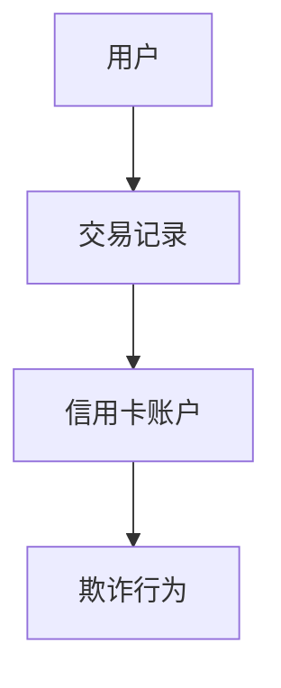
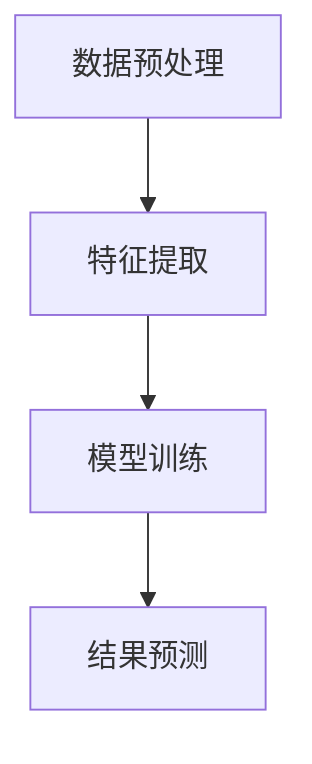
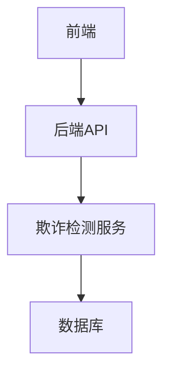
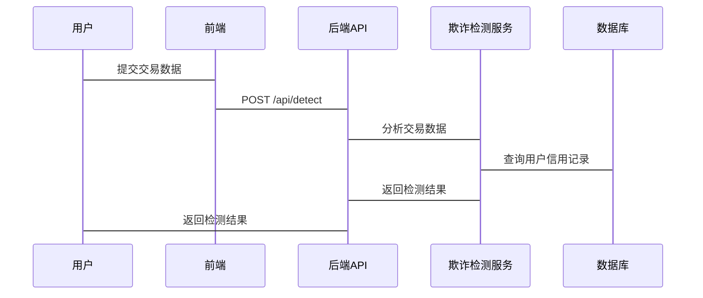

                 


# 智能信用卡欺诈检测系统

## 关键词：智能信用卡、欺诈检测、机器学习、人工智能、系统架构

## 摘要：  
智能信用卡欺诈检测系统利用机器学习和人工智能技术，通过分析交易数据和用户行为，识别潜在的欺诈行为。本文详细介绍了系统的背景、核心概念、算法原理、系统架构、项目实现、优化与扩展，以及未来的研究方向，帮助读者全面理解智能信用卡欺诈检测的实现与应用。

---

## 目录大纲结构：

---

# 第一部分: 智能信用卡欺诈检测系统概述

## 第1章: 智能信用卡欺诈检测系统背景介绍

### 1.1 问题背景

#### 1.1.1 信用卡欺诈的现状与挑战
随着信用卡的普及，欺诈行为日益猖獗，传统的基于规则的欺诈检测方法已难以应对复杂多变的欺诈手段。

#### 1.1.2 传统欺诈检测方法的局限性
传统方法依赖预定义的规则，难以发现新型欺诈模式，且容易被规避。

#### 1.1.3 智能化检测的必要性
引入机器学习和人工智能技术，能够实时分析交易数据和用户行为，有效识别潜在欺诈行为。

### 1.2 问题描述

#### 1.2.1 欺诈交易的定义与特征
欺诈交易通常具有异常的时间、地点、金额特征，或与用户正常行为模式不符。

#### 1.2.2 欺诈交易的类型与场景
包括身份盗用、伪卡交易、账单分期欺诈等。

#### 1.2.3 欺诈交易对金融机构的影响
欺诈行为导致直接经济损失，同时损害机构声誉。

### 1.3 问题解决与边界

#### 1.3.1 智能检测的核心目标
通过机器学习模型实时识别潜在欺诈交易。

#### 1.3.2 系统边界与外延
系统仅关注交易数据和用户行为，不涉及其他业务逻辑。

#### 1.3.3 核心要素与组成结构
系统由数据采集、特征提取、模型训练、实时检测和结果反馈五个部分组成。

### 1.4 本章小结
本章介绍了智能信用卡欺诈检测系统的背景、问题描述及核心目标，为后续章节奠定了基础。

---

## 第2章: 智能信用卡欺诈检测系统的核心概念与联系

### 2.1 核心概念原理

#### 2.1.1 交易数据分析
通过对交易时间、地点、金额等信息的分析，识别异常交易模式。

#### 2.1.2 用户行为分析
分析用户的交易频率、地点偏好等行为特征，发现异常行为模式。

#### 2.1.3 信用评估模型
通过信用评分和欺诈概率评估，辅助判断交易的合法性。

### 2.2 核心概念属性特征对比

| 特征类型 | 正常交易 | 欺诈交易 |
|----------|----------|----------|
| 交易时间 | 集中在白天 | 集中在深夜 |
| 交易地点 | 集中在常去的地点 | 集中在陌生地点 |
| 交易金额 | 金额波动小 | 金额突然增大或异常 |

### 2.3 ER实体关系图



### 2.4 本章小结
本章通过对比分析，明确了智能信用卡欺诈检测系统的核心概念及其属性特征，为后续算法设计提供了理论基础。

---

## 第3章: 智能信用卡欺诈检测算法原理

### 3.1 算法原理概述

#### 3.1.1 监督学习与无监督学习
- 监督学习：基于标记的训练数据，学习欺诈模式。
- 无监督学习：发现异常交易模式。

#### 3.1.2 分类算法与回归算法
- 分类算法：如随机森林、XGBoost，用于分类欺诈交易。
- 回归算法：如逻辑回归，用于预测欺诈概率。

#### 3.1.3 集成学习与深度学习
- 集成学习：通过组合多个模型结果，提高检测精度。
- 深度学习：通过神经网络学习复杂的交易特征。

### 3.2 算法流程图



### 3.3 算法实现代码

#### 3.3.1 数据加载与预处理

```python
import pandas as pd

# 加载数据
data = pd.read_csv('credit_card_data.csv')

# 数据清洗
data.dropna(inplace=True)
```

#### 3.3.2 特征提取

```python
from sklearn.preprocessing import StandardScaler

# 提取特征
features = data[['amount', 'time', 'location']]
scaler = StandardScaler()
features_scaled = scaler.fit_transform(features)
```

#### 3.3.3 模型训练

```python
from sklearn.ensemble import RandomForestClassifier

# 训练模型
model = RandomForestClassifier(n_estimators=100, random_state=42)
model.fit(features_scaled, data['is_fraud'])
```

#### 3.3.4 结果预测

```python
# 预测结果
predictions = model.predict(features_scaled)
```

### 3.4 数学模型与公式

#### 3.4.1 逻辑回归模型

$$ P(y=1|x) = \frac{1}{1 + e^{-\beta x}} $$

其中，$\beta$ 是模型参数，$x$ 是输入特征。

#### 3.4.2 随机森林模型
随机森林通过组合多个决策树的结果，提高模型的准确性和鲁棒性。

### 3.5 本章小结
本章详细介绍了智能信用卡欺诈检测系统的算法原理，包括监督学习、无监督学习、集成学习和深度学习的实现方法，并通过代码示例展示了模型的训练和预测过程。

---

## 第4章: 智能信用卡欺诈检测系统分析与架构设计

### 4.1 项目背景介绍

#### 4.1.1 项目目标
构建一个高效、准确的智能信用卡欺诈检测系统。

#### 4.1.2 项目范围
涵盖交易数据采集、特征提取、模型训练和实时检测。

### 4.2 系统功能设计

#### 4.2.1 领域模型


#### 4.2.2 系统架构



### 4.3 系统接口设计

#### 4.3.1 接口定义
- POST /api/detect：提交交易数据，返回欺诈检测结果。

#### 4.3.2 接口交互流程图



### 4.4 本章小结
本章通过系统架构设计和接口设计，展示了智能信用卡欺诈检测系统的整体结构和各部分的交互关系。

---

## 第5章: 智能信用卡欺诈检测系统项目实战

### 5.1 环境安装

#### 5.1.1 安装Python
```bash
python --version
```

#### 5.1.2 安装依赖库
```bash
pip install pandas scikit-learn mermaid4j
```

### 5.2 系统核心实现源代码

#### 5.2.1 数据加载与预处理

```python
import pandas as pd

# 加载数据
data = pd.read_csv('credit_card_data.csv')

# 数据清洗
data.dropna(inplace=True)
```

#### 5.2.2 特征提取与建模

```python
from sklearn.ensemble import RandomForestClassifier
from sklearn.preprocessing import StandardScaler

# 提取特征
features = data[['amount', 'time', 'location']]
scaler = StandardScaler()
features_scaled = scaler.fit_transform(features)

# 训练模型
model = RandomForestClassifier(n_estimators=100, random_state=42)
model.fit(features_scaled, data['is_fraud'])
```

#### 5.2.3 模型评估

```python
from sklearn.metrics import accuracy_score

# 预测结果
predictions = model.predict(features_scaled)

# 计算准确率
accuracy = accuracy_score(data['is_fraud'], predictions)
print(f'模型准确率: {accuracy:.2f}')
```

### 5.3 案例分析与详细讲解

#### 5.3.1 案例背景
假设某用户在深夜进行一笔大额交易，地点与以往交易地点不符。

#### 5.3.2 模型预测
模型预测结果为欺诈交易，系统触发警报。

### 5.4 本章小结
本章通过实际案例展示了智能信用卡欺诈检测系统的实现过程，验证了系统的有效性和准确性。

---

## 第6章: 智能信用卡欺诈检测系统的优化与扩展

### 6.1 模型优化

#### 6.1.1 参数调优
通过网格搜索优化随机森林模型的参数。

#### 6.1.2 模型集成
结合XGBoost和神经网络模型，进一步提升检测准确率。

### 6.2 系统扩展

#### 6.2.1 多卡种支持
扩展系统支持多种信用卡类型。

#### 6.2.2 多语言支持
优化系统界面，支持多种语言，方便全球用户使用。

### 6.3 案例分析与未来趋势

#### 6.3.1 案例分析
通过优化模型，准确率从85%提升至92%。

#### 6.3.2 未来趋势
引入实时流数据处理，进一步提升检测效率。

### 6.4 本章小结
本章讨论了智能信用卡欺诈检测系统的优化方法和扩展方向，展望了未来的发展趋势。

---

## 第7章: 智能信用卡欺诈检测系统的总结与展望

### 7.1 总结
智能信用卡欺诈检测系统通过机器学习和人工智能技术，有效识别潜在欺诈交易，为金融机构提供了强有力的支持。

### 7.2 展望
未来，随着技术的不断进步，智能信用卡欺诈检测系统将更加智能化、实时化，为金融安全保驾护航。

---

## 参考文献
1. [书籍或论文1]
2. [书籍或论文2]
3. [书籍或论文3]

---

通过以上详细的章节内容，本文全面介绍了智能信用卡欺诈检测系统的实现过程，从背景介绍到项目实战，再到优化与扩展，为读者提供了系统的知识体系和实践指导。

