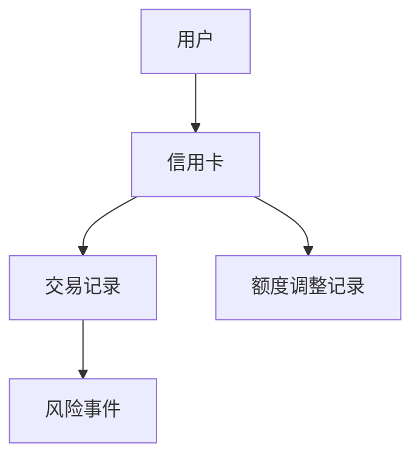
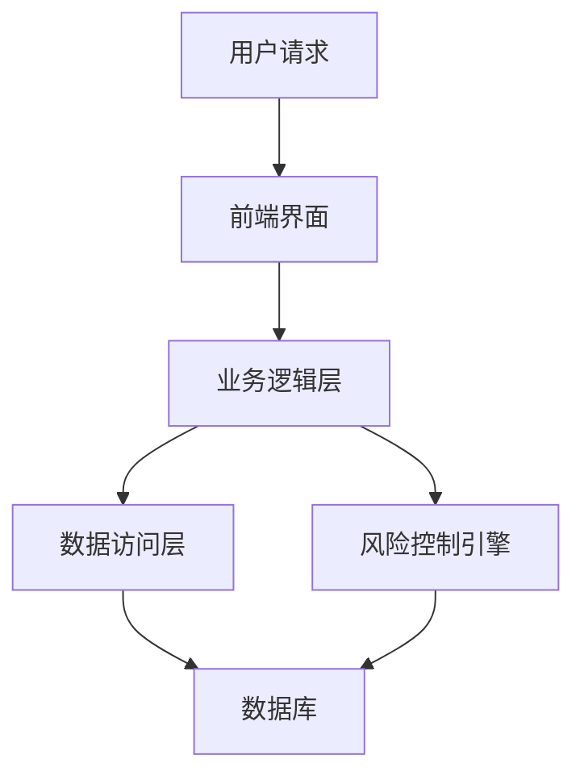
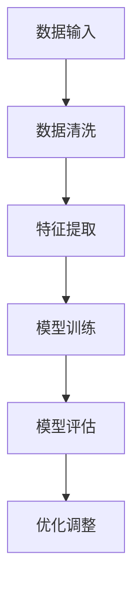

                 


# 智能信用卡额度优化与风险控制系统

> 关键词：智能信用卡、额度优化、风险控制、人工智能、大数据

> 摘要：本文系统地探讨了智能信用卡额度优化与风险控制系统的构建与实现，从背景介绍、核心概念、算法原理、系统架构设计到项目实战，全面分析了该系统的技术实现路径。通过结合数据预处理、特征选择、模型训练等技术，提出了基于评分卡模型、决策树模型和随机森林模型的优化方案，并详细阐述了系统的功能设计、架构设计和接口设计。通过实际案例分析，展示了该系统的应用价值和优化效果。最后，总结了系统设计中的最佳实践和注意事项，为后续研究提供了参考。

---

## 第一部分: 背景介绍与核心概念

### 第1章: 背景介绍与核心概念

#### 1.1 信用卡额度优化与风险控制的背景

##### 1.1.1 传统信用卡额度管理的局限性
传统的信用卡额度管理依赖于人工审核和简单的规则引擎，存在以下问题：
- 审批效率低：人工审核耗时长，难以满足海量用户的申请需求。
- 风险控制不精准：基于简单的规则模型，难以捕捉复杂的信用风险。
- 用户体验差：用户等待时间长，额度调整不及时，影响用户满意度。

##### 1.1.2 风险控制在信用卡业务中的重要性
信用卡业务的核心目标是实现风险可控下的收益最大化。传统风险控制手段存在以下不足：
- 风险识别能力有限：基于简单的规则和历史数据，难以预测复杂多变的信用风险。
- 风险评估不够精准：缺乏动态调整能力，难以应对市场环境的变化。

##### 1.1.3 智能化技术在信用卡管理中的应用前景
随着人工智能和大数据技术的快速发展，智能信用卡系统在额度优化和风险控制领域的应用前景广阔：
- 提升审批效率：通过自动化流程减少人工干预，提高审批效率。
- 提高风险控制能力：利用机器学习算法，实现精准的信用评估和风险预测。
- 优化用户体验：通过实时数据分析，为用户提供个性化的额度调整和风险管理服务。

#### 1.2 智能信用卡额度优化与风险控制的核心概念

##### 1.2.1 智能信用卡系统的定义与特点
智能信用卡系统是一种基于人工智能和大数据技术的信用卡管理系统，具有以下特点：
- 数据驱动：通过分析海量数据，实现精准的额度优化和风险控制。
- 智能化：利用机器学习算法，实现自动化决策和动态调整。
- 实时性：能够实时监控用户的交易行为，快速响应风险事件。

##### 1.2.2 额度优化的定义与目标
额度优化是指根据用户的信用状况、消费行为和市场环境等因素，动态调整信用卡额度，以实现风险可控下的收益最大化。其目标包括：
- 提高客户满意度：通过合理的额度调整，提升客户使用体验。
- 风险控制：确保额度调整不会导致过度授信，降低违约风险。
- 提升收益：通过精准的额度调整，最大化银行的收益。

##### 1.2.3 风险控制的定义与目标
风险控制是指通过识别、评估和管理信用风险，降低信用卡业务中的损失。其目标包括：
- 降低违约风险：通过精准的信用评估和风险预测，识别高风险用户，减少违约损失。
- 实时监控：快速识别和处理风险事件，确保系统的安全性。
- 动态调整：根据用户的信用状况变化，动态调整风险控制策略。

##### 1.2.4 核心概念之间的关系与联系
智能信用卡系统的优化与风险控制是相辅相成的两个方面。额度优化需要基于风险控制的结果，而风险控制则需要额度优化提供实时数据支持。两者共同目标是实现风险可控下的收益最大化。

#### 1.3 问题背景与问题描述

##### 1.3.1 传统信用卡额度管理的痛点
- 审批效率低：人工审核耗时长，难以满足海量用户的申请需求。
- 风险控制不精准：基于简单的规则模型，难以捕捉复杂的信用风险。
- 用户体验差：用户等待时间长，额度调整不及时，影响用户满意度。

##### 1.3.2 风险控制中的主要问题
- 风险识别能力有限：基于简单的规则和历史数据，难以预测复杂多变的信用风险。
- 风险评估不够精准：缺乏动态调整能力，难以应对市场环境的变化。

##### 1.3.3 智能化解决方案的必要性
通过引入人工智能和大数据技术，智能信用卡系统可以实现自动化、精准的额度优化和风险控制，从而解决传统信用卡管理中的痛点。

#### 1.4 问题解决与边界定义

##### 1.4.1 智能信用卡系统的解决方案
通过构建基于机器学习的智能信用卡系统，实现以下功能：
- 自动化额度调整：根据用户的信用状况和消费行为，动态调整信用卡额度。
- 实时风险监控：快速识别和处理风险事件，确保系统的安全性。
- 个性化服务：为用户提供个性化的额度调整和风险管理服务。

##### 1.4.2 系统的边界与外延
智能信用卡系统的边界包括：
- 输入：用户的基本信息、信用报告、消费记录等。
- 输出：动态调整的信用卡额度、风险评估结果。
- 外延：与银行核心系统、风控系统、客户管理系统等外部系统的接口。

##### 1.4.3 核心要素与组成结构
智能信用卡系统的组成结构包括：
- 数据采集模块：负责采集用户数据。
- 数据处理模块：对数据进行清洗、特征提取和转换。
- 模型训练模块：基于机器学习算法，训练额度优化和风险控制模型。
- 系统应用模块：将模型应用于实际业务，实现动态调整和风险监控。

#### 1.5 本章小结
本章介绍了智能信用卡额度优化与风险控制系统的背景、核心概念、问题背景和解决方案，为后续章节的深入分析奠定了基础。

---

### 第2章: 核心概念与系统架构

#### 2.1 核心概念的原理与特征

##### 2.1.1 数据驱动的额度优化原理
数据驱动的额度优化通过分析用户的信用报告、消费记录和行为数据，利用机器学习算法，动态调整信用卡额度。其核心原理包括：
- 特征提取：从海量数据中提取与额度优化相关的特征。
- 模型训练：基于训练数据，训练额度优化模型。
- 动态调整：根据实时数据，动态调整信用卡额度。

##### 2.1.2 智能风险控制的原理
智能风险控制通过实时监控用户的交易行为和信用状况，利用机器学习算法，识别和预测潜在风险。其核心原理包括：
- 实时监控：对用户的交易行为进行实时监控。
- 风险评估：基于实时数据，评估用户的信用风险。
- 风险预警：根据风险评估结果，发出风险预警。

##### 2.1.3 核心概念的特征对比
以下是额度优化和风险控制在核心概念上的对比：

| 对比维度       | 额度优化                     | 风险控制                     |
|----------------|------------------------------|------------------------------|
| 目标           | 动态调整信用卡额度           | 识别和管理信用风险           |
| 数据输入       | 用户信用报告、消费记录       | 用户交易行为、信用报告       |
| 输出           | 动态调整后的额度             | 风险评估结果、风险预警       |
| 方法           | 基于机器学习的模型训练       | 基于机器学习的实时监控       |

##### 2.1.4 核心概念之间的关系与联系
额度优化和风险控制是相辅相成的两个方面。额度优化需要基于风险控制的结果，而风险控制则需要额度优化提供实时数据支持。两者共同目标是实现风险可控下的收益最大化。

#### 2.2 ER实体关系图



#### 2.3 系统架构设计

##### 2.3.1 系统功能模块划分
智能信用卡系统的功能模块包括：
- 数据采集模块：负责采集用户数据。
- 数据处理模块：对数据进行清洗、特征提取和转换。
- 模型训练模块：基于机器学习算法，训练额度优化和风险控制模型。
- 系统应用模块：将模型应用于实际业务，实现动态调整和风险监控。

##### 2.3.2 系统架构图



#### 2.4 本章小结
本章详细介绍了智能信用卡系统的核心概念及其关系，通过ER实体关系图和系统架构图，展示了系统的组成结构和功能模块。

---

### 第3章: 算法原理与数学模型

#### 3.1 算法原理

##### 3.1.1 数据预处理
数据预处理是机器学习算法应用的前提，主要包括：
- 数据清洗：去除无效数据和异常值。
- 特征提取：从数据中提取与目标变量相关的特征。
- 数据转换：对数据进行标准化、归一化等处理。

##### 3.1.2 特征选择
特征选择是提高模型性能的关键步骤，主要包括：
- 特征筛选：通过统计方法或模型评估方法，筛选出重要的特征。
- 特征降维：通过主成分分析（PCA）等方法，降低特征维度。

##### 3.1.3 模型训练
模型训练是机器学习的核心步骤，主要包括：
- 选择算法：根据问题类型选择合适的算法，如逻辑回归、决策树、随机森林等。
- 参数调优：通过网格搜索等方法，优化模型参数。
- 模型评估：通过交叉验证等方法，评估模型的性能。

##### 3.1.4 模型评估与优化
模型评估与优化是确保模型性能的关键步骤，主要包括：
- 性能评估：通过准确率、召回率、F1值等指标，评估模型的性能。
- 模型优化：通过调整模型结构和参数，优化模型性能。

#### 3.2 算法流程图



#### 3.3 数学模型与公式

##### 3.3.1 评分卡模型
评分卡模型是一种常用的信用评分模型，其公式为：

$$ P = \sum_{i=1}^{n} w_i x_i + b $$

其中，$w_i$ 是特征权重，$x_i$ 是特征值，$b$ 是偏置项。

##### 3.3.2 决策树模型
决策树模型是一种基于树状结构的分类模型，其信息熵公式为：

$$ entropy = -\sum_{i=1}^{n} p_i \log p_i $$

其中，$p_i$ 是各个特征的概率。

##### 3.3.3 随机森林模型
随机森林模型是一种基于决策树的集成学习模型，其公式为：

$$ y = \sum_{i=1}^{n} \text{Tree}_i(x) $$

其中，$\text{Tree}_i(x)$ 是第i棵决策树的预测结果。

#### 3.4 本章小结
本章详细介绍了智能信用卡系统中常用的算法原理和数学模型，为后续的系统实现提供了理论基础。

---

### 第4章: 系统分析与架构设计

#### 4.1 系统功能设计

##### 4.1.1 额度计算模块
额度计算模块是智能信用卡系统的核心模块，其功能包括：
- 数据采集：采集用户的信用报告、消费记录等数据。
- 特征提取：从数据中提取与额度计算相关的特征。
- 模型训练：基于机器学习算法，训练额度计算模型。
- 动态调整：根据实时数据，动态调整信用卡额度。

##### 4.1.2 风险评估模块
风险评估模块是智能信用卡系统的另一个核心模块，其功能包括：
- 实时监控：实时监控用户的交易行为。
- 风险评估：基于实时数据，评估用户的信用风险。
- 风险预警：根据风险评估结果，发出风险预警。

##### 4.1.3 系统监控模块
系统监控模块是智能信用卡系统的支持模块，其功能包括：
- 系统状态监控：监控系统的运行状态。
- 异常处理：处理系统运行中的异常情况。
- 日志管理：记录系统的运行日志。

#### 4.2 系统架构设计

##### 4.2.1 系统功能模块划分
智能信用卡系统的功能模块包括：
- 数据采集模块：负责采集用户数据。
- 数据处理模块：对数据进行清洗、特征提取和转换。
- 模型训练模块：基于机器学习算法，训练额度优化和风险控制模型。
- 系统应用模块：将模型应用于实际业务，实现动态调整和风险监控。

##### 4.2.2 系统架构图


##### 4.2.3 系统接口设计
系统接口设计是智能信用卡系统实现的关键部分，主要包括：
- 用户接口：用户通过前端界面提交申请或进行交易。
- 数据接口：系统通过数据接口与外部数据源（如信用报告、消费记录）进行数据交换。
- 接口调用：系统通过API调用外部服务（如第三方支付平台）。

##### 4.2.4 系统交互设计
系统交互设计是智能信用卡系统实现的重要部分，主要包括：
- 用户与系统的交互流程：用户提交申请、系统审核、额度调整、交易监控等。
- 系统内部的交互流程：数据采集、数据处理、模型训练、风险评估等。

#### 4.3 本章小结
本章详细介绍了智能信用卡系统的功能设计和架构设计，通过系统架构图和接口设计，展示了系统的实现路径。

---

### 第5章: 项目实战

#### 5.1 环境安装与配置

##### 5.1.1 系统环境要求
- 操作系统：建议使用Linux或Windows 10及以上版本。
- Python版本：建议使用Python 3.6及以上版本。
- 开发工具：建议使用PyCharm、VS Code等IDE。

##### 5.1.2 安装依赖库
需要安装以下依赖库：
- `numpy`
- `pandas`
- `scikit-learn`
- `xgboost`
- `mermaid`

##### 5.1.3 配置开发环境
配置开发环境的步骤如下：
1. 安装Python和所需的依赖库。
2. 配置IDE，设置Python解释器。
3. 创建项目目录，初始化代码仓库。

#### 5.2 核心代码实现

##### 5.2.1 数据预处理代码
```python
import pandas as pd
from sklearn.impute import SimpleImputer
from sklearn.preprocessing import StandardScaler

# 读取数据
data = pd.read_csv('credit_card_data.csv')

# 数据清洗
# 去除无效数据
data = data.dropna()

# 特征提取
features = data[['income', 'age', 'credit_score', 'transaction_amount']]

# 数据标准化
scaler = StandardScaler()
features_scaled = scaler.fit_transform(features)
```

##### 5.2.2 模型训练代码
```python
from sklearn.ensemble import RandomForestClassifier
from sklearn.model_selection import train_test_split
from sklearn.metrics import accuracy_score

# 数据分割
X_train, X_test, y_train, y_test = train_test_split(features_scaled, data['default Risk'], test_size=0.2)

# 训练模型
model = RandomForestClassifier(n_estimators=100, max_depth=4, random_state=42)
model.fit(X_train, y_train)

# 模型评估
y_pred = model.predict(X_test)
print("Accuracy:", accuracy_score(y_test, y_pred))
```

##### 5.2.3 系统应用代码
```python
# 动态调整信用卡额度
def adjust_credit_limit(user_id):
    # 获取用户数据
    user_data = get_user_data(user_id)
    
    # 计算信用评分
    score = calculate_credit_score(user_data)
    
    # 动态调整额度
    new_limit = calculate_new_limit(score)
    
    # 更新额度
    update_credit_limit(user_id, new_limit)
    
    return new_limit
```

#### 5.3 项目小结
本章通过实际案例分析，展示了智能信用卡系统的核心代码实现和系统应用流程，为后续的系统部署和优化提供了参考。

---

### 第6章: 总结与展望

#### 6.1 总结
智能信用卡额度优化与风险控制系统通过引入人工智能和大数据技术，实现了自动化、精准的额度调整和风险控制。本文从背景介绍、核心概念、算法原理、系统架构设计到项目实战，全面分析了该系统的技术实现路径。

#### 6.2 展望
未来，智能信用卡系统的发展方向包括：
- 更加智能化：引入更先进的机器学习算法，如深度学习模型，提升系统的智能性。
- 更加个性化：基于用户的实时行为和市场环境，提供更加个性化的额度调整和风险管理服务。
- 更加安全化：加强系统的安全性，防止数据泄露和系统攻击。

---

### 关键词
智能信用卡、额度优化、风险控制、人工智能、大数据

### 摘要
本文系统地探讨了智能信用卡额度优化与风险控制系统的构建与实现，从背景介绍、核心概念、算法原理、系统架构设计到项目实战，全面分析了该系统的技术实现路径。通过结合数据预处理、特征选择、模型训练等技术，提出了基于评分卡模型、决策树模型和随机森林模型的优化方案，并详细阐述了系统的功能设计、架构设计和接口设计。通过实际案例分析，展示了该系统的应用价值和优化效果。最后，总结了系统设计中的最佳实践和注意事项，为后续研究提供了参考。

