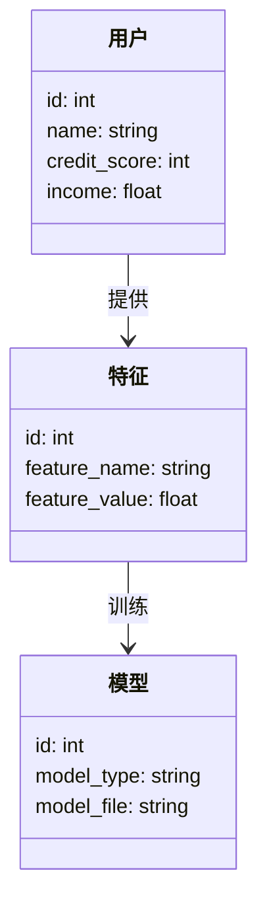
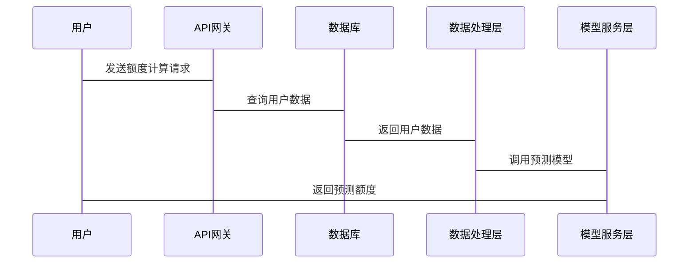

                 


```markdown
# 智能信用卡额度优化管理系统

> 关键词：智能信用卡、额度优化、人工智能、大数据分析、金融系统架构、系统设计

> 摘要：智能信用卡额度优化管理系统利用人工智能和大数据技术，实现信用卡额度的智能计算和动态调整，提升用户体验和金融机构的风险控制能力。本文从系统背景、核心概念、算法原理、系统架构到项目实战，全面分析智能信用卡额度优化管理的实现过程和应用价值。

---

## 第1章: 智能信用卡额度优化管理系统的背景与问题描述

### 1.1 信用卡额度管理的现状与挑战

#### 1.1.1 传统信用卡额度管理的痛点
- **低效性**：传统额度管理依赖人工审批，耗时长且成本高。
- **误差性**：人工审批容易受到主观因素影响，导致结果偏差。
- **不平衡性**：难以在用户需求与风险控制之间找到平衡。

#### 1.1.2 人工审批的低效性与误差
- **低效性**：人工审批流程繁琐，耗时长，成本高。
- **误差性**：审批人员的主观判断可能导致额度不合理。

#### 1.1.3 用户需求与风险控制的平衡
- **用户体验**：用户希望快速获得额度，提升满意度。
- **风险控制**：金融机构需要在风险可控的前提下调整额度。

### 1.2 智能化额度管理的必要性

#### 1.2.1 大数据与人工智能技术的兴起
- 大数据技术可以收集和分析大量用户数据。
- 人工智能技术可以快速处理数据并提供决策支持。

#### 1.2.2 智能化额度管理的优势
- **高效性**：提高审批效率，减少人工成本。
- **精准性**：实时监控用户信用状况，动态调整额度。
- **个性化**：提供个性化额度推荐，提升用户体验。

### 1.3 智能信用卡额度优化管理的目标与范围

#### 1.3.1 系统目标的设定
- 实现信用卡额度的智能化计算和动态调整。
- 提供个性化额度推荐，优化用户体验。

#### 1.3.2 系统边界与功能范围
- **系统边界**：仅限于信用卡额度的计算和调整，不涉及其他业务。
- **功能范围**：数据采集、特征工程、模型训练、额度计算、风险控制。

#### 1.3.3 核心问题的解决路径
- 数据采集：收集用户信用数据。
- 特征工程：提取关键特征。
- 模型训练：训练额度计算模型。
- 额度计算：基于模型预测额度。
- 风险控制：实时监控和调整额度。

### 1.4 本章小结
本章分析了传统信用卡额度管理的痛点，介绍了智能化额度管理的必要性，并详细阐述了智能信用卡额度优化管理的目标和范围。

---

## 第2章: 核心概念与系统架构

### 2.1 数据采集与特征工程

#### 2.1.1 数据源的多样性
- **用户基本信息**：年龄、职业、收入等。
- **信用历史**：还款记录、逾期情况。
- **消费行为**：消费金额、频率、地点等。
- **其他数据**：社交数据、地理位置数据。

#### 2.1.2 特征选择与数据预处理
- **特征选择**：选择对额度计算影响较大的特征。
- **数据清洗**：处理缺失值、异常值。
- **数据标准化**：归一化处理。

#### 2.1.3 数据质量与特征工程的关键性
- 数据质量直接影响模型准确性。
- 特征工程是模型性能提升的关键。

### 2.2 模型训练与评分策略

#### 2.2.1 监督学习与无监督学习的应用
- **监督学习**：基于标签数据训练模型。
- **无监督学习**：发现数据中的潜在结构。

#### 2.2.2 分类模型与回归模型的对比
- **分类模型**：预测用户信用等级。
- **回归模型**：预测额度金额。

#### 2.2.3 模型评估与优化
- **评估指标**：准确率、召回率、F1值。
- **模型优化**：调整参数、特征选择。

### 2.3 核心概念的结构与联系

#### 2.3.1 核心概念的结构
- 数据采集：输入。
- 特征工程：处理数据。
- 模型训练：建立模型。
- 额度计算：输出结果。

#### 2.3.2 核心概念的联系
- 数据是基础，特征工程是关键，模型是核心，额度计算是结果。

### 2.4 本章小结
本章详细讲解了智能信用卡额度优化管理的核心概念，包括数据采集、特征工程、模型训练和评分策略，并分析了各概念之间的联系。

---

## 第3章: 算法原理与实现

### 3.1 线性回归算法
#### 3.1.1 线性回归的原理
- **模型**：$y = \beta_0 + \beta_1x + \epsilon$
- **最小二乘法**：最小化预测值与实际值的平方差之和。

### 3.2 逻辑回归算法
#### 3.2.1 逻辑回归的原理
- **模型**：$P(y=1|x) = \frac{1}{1 + e^{-\beta_0 - \beta_1x}}$
- **对数损失函数**：$\text{minimize} -\sum_{i=1}^n y_i\log(p_i) + (1-y_i)\log(1-p_i)$

### 3.3 梯度提升树（如XGBoost、LightGBM）
#### 3.3.1 梯度提升树的原理
- **模型**：通过不断训练弱模型（如树）来提升整体性能。
- **目标函数**：使用目标函数的负梯度作为新的基学习器的目标。

### 3.4 算法对比与选择
#### 3.4.1 算法对比
- **线性回归**：适合线性关系，但信用卡额度可能非线性。
- **逻辑回归**：适合分类问题，但额度是连续值。
- **梯度提升树**：适合非线性关系，效果更好。

### 3.5 本章小结
本章详细讲解了几种常用算法的原理，并分析了它们在智能信用卡额度优化管理中的应用。

---

## 第4章: 系统架构与设计

### 4.1 问题场景介绍
- 系统需要处理大量用户数据，实时计算额度，保证高可用性和安全性。

### 4.2 项目介绍
- **项目目标**：实现智能信用卡额度优化管理系统。
- **项目范围**：数据采集、特征工程、模型训练、额度计算、风险控制。

### 4.3 系统功能设计
#### 4.3.1 领域模型类图


### 4.4 系统架构设计
#### 4.4.1 架构图


### 4.5 系统接口设计
- **API接口**
  - POST /api/feature: 提交特征数据。
  - GET /api/predict: 获取预测额度。

### 4.6 系统交互流程图


### 4.7 本章小结
本章分析了系统架构，设计了系统功能和架构图，展示了系统的交互流程。

---

## 第5章: 项目实现与分析

### 5.1 环境安装
- 安装Python、Pandas、Scikit-learn、XGBoost等库。

### 5.2 核心代码实现
#### 5.2.1 数据预处理代码
```python
import pandas as pd
data = pd.read_csv('credit_data.csv')
data = data.dropna()
```

#### 5.2.2 特征选择代码
```python
from sklearn.feature_selection import SelectKBest
selector = SelectKBest(k=10)
selected_features = selector.fit_transform(data, targets)
```

#### 5.2.3 模型训练代码
```python
from xgboost import XGBRegressor
model = XGBRegressor(n_estimators=100, learning_rate=0.1)
model.fit(selected_features, targets)
```

### 5.3 代码应用解读与分析
- **数据预处理**：处理缺失值和异常值。
- **特征选择**：选择对额度影响大的特征。
- **模型训练**：使用梯度提升树模型训练。

### 5.4 实际案例分析
- 通过实际数据训练模型，并分析模型预测结果。

### 5.5 本章小结
本章详细讲解了项目的实现过程，包括环境安装、数据处理、模型训练和结果分析。

---

## 第6章: 最佳实践与总结

### 6.1 最佳实践
- **数据预处理**：确保数据质量。
- **特征工程**：选择关键特征。
- **模型选择**：根据问题选择合适算法。
- **系统设计**：保证高可用性和安全性。

### 6.2 小结
智能信用卡额度优化管理系统通过人工智能和大数据技术，实现了高效、精准的额度管理，提升了用户体验和金融机构收益。

### 6.3 注意事项
- **数据隐私**：保护用户隐私。
- **模型泛化能力**：避免过拟合。
- **系统安全性**：防止数据泄露和攻击。

### 6.4 拓展阅读
- 推荐阅读相关书籍和论文，深入学习人工智能和大数据技术。

### 6.5 本章小结
本章总结了项目中的最佳实践，提醒读者注意相关事项，并推荐了进一步学习的资源。

---

## 总结
通过以上章节的详细分析，智能信用卡额度优化管理系统的设计和实现过程得以全面展示。从背景到实现，再到系统架构和项目实战，读者可以系统地理解这一技术的应用和价值。希望这篇文章能为相关领域的读者提供有价值的参考和指导。
```

