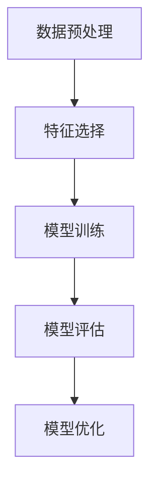
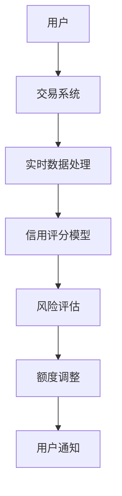

                 


好的，我将按照您的要求撰写《智能信用卡额度管理系统》的技术博客文章。为了确保内容的完整性和专业性，我会按照以下章节结构进行详细阐述。

---

# 智能信用卡额度管理系统

> 关键词：智能信用卡、额度管理、机器学习、风险管理、实时监控

> 摘要：本文将深入探讨智能信用卡额度管理系统的构建与实现，结合机器学习和实时数据处理技术，分析系统的背景、核心概念、算法原理、系统架构和实际应用场景。通过详细的技术分析和案例解读，为读者提供全面的技术解决方案。

---

## 第1章: 智能信用卡额度管理系统的背景介绍

### 1.1 问题背景

#### 1.1.1 传统信用卡额度管理的局限性
传统的信用卡额度管理依赖于简单的信用评分模型，主要基于用户的信用历史和基本财务数据。这种方法存在以下问题：
- 数据维度有限，无法捕捉用户行为的复杂性。
- � 额度调整周期较长，难以实时响应用户需求或风险变化。
- 缺乏个性化，无法根据用户的消费习惯和风险偏好进行精准调整。

#### 1.1.2 数据驱动的智能管理需求
随着大数据和人工智能技术的发展，金融机构可以通过分析海量数据来优化信用卡额度管理：
- 利用用户行为数据、交易数据和社交数据，构建更加全面的用户画像。
- 实时监控用户的消费行为，动态调整额度，降低风险。
- 提供个性化服务，提升用户体验。

#### 1.1.3 人工智能在金融领域的应用趋势
人工智能技术在金融领域的应用日益广泛，特别是在信用评估和风险管理方面。智能信用卡额度管理系统通过结合机器学习算法和实时数据处理技术，能够实现更精准、更高效的额度管理。

### 1.2 问题描述

#### 1.2.1 信用卡额度管理的核心问题
- 如何准确评估用户的信用风险？
- 如何实时监控用户的消费行为，并动态调整额度？
- 如何平衡用户体验与风险管理？

#### 1.2.2 用户行为分析与信用评估的挑战
- 用户行为数据的多样性和复杂性。
- 如何从海量数据中提取有效的特征，用于信用评估。
- 如何构建动态的信用评分模型，以应对用户的实时需求变化。

#### 1.2.3 系统实时响应与决策的复杂性
- 系统需要处理大量的实时数据，确保决策的及时性。
- 如何在复杂的业务逻辑下，实现高效的实时决策。
- 如何确保系统的稳定性与安全性。

### 1.3 问题解决思路

#### 1.3.1 数据驱动的智能决策框架
- 构建用户画像，基于多维度数据进行用户分析。
- 利用机器学习算法构建动态信用评分模型。
- 实现实时监控与动态调整机制，确保系统能够快速响应。

#### 1.3.2 机器学习在信用评估中的应用
- 使用监督学习算法（如随机森林、逻辑回归）进行信用评分。
- 利用无监督学习算法（如聚类分析）识别潜在风险。

#### 1.3.3 实时监控与动态调整机制
- 实时收集用户的交易数据和行为数据。
- 基于实时数据更新信用评分，动态调整额度。

### 1.4 系统的边界与外延

#### 1.4.1 系统功能边界
- 系统仅负责信用卡额度的计算与管理，不涉及其他业务逻辑。
- 系统需要与交易系统、风控系统进行交互。

#### 1.4.2 与相关系统的交互
- 与交易系统交互，获取用户的交易数据。
- 与风控系统交互，共享风险评估结果。
- 与用户交互，提供额度调整通知。

#### 1.4.3 系统的可扩展性与灵活性
- 系统支持多种信用评分模型的切换。
- 系统支持多种数据源的接入。

### 1.5 核心概念与组成

#### 1.5.1 用户画像与行为分析
- 用户画像：基于用户的基本信息、交易数据、社交数据等，构建多维度的用户画像。
- 用户行为分析：分析用户的消费习惯、交易频率、交易金额等，识别潜在风险。

#### 1.5.2 信用评估模型
- 信用评分模型：基于机器学习算法，构建动态的信用评分模型。
- 风险评估指标：包括违约概率、信用评分、资产状况等。

#### 1.5.3 风险控制机制
- 风险预警：基于实时数据，识别潜在风险并发出预警。
- 动态调整：根据风险评估结果，动态调整用户的信用额度。

#### 1.5.4 实时数据处理与反馈
- 实时数据采集：收集用户的交易数据、行为数据等。
- 实时数据处理：对实时数据进行清洗、转换和分析。
- 系统反馈：根据实时数据处理结果，调整额度并反馈给用户。

### 1.6 本章小结
本章详细介绍了智能信用卡额度管理系统的背景、核心问题、解决思路以及系统的边界与外延。通过构建用户画像、信用评估模型和风险控制机制，系统能够实现高效、精准的额度管理。

---

## 第2章: 智能信用卡额度管理系统的核心概念与联系

### 2.1 核心概念原理

#### 2.1.1 用户画像构建
- 用户画像：基于用户的基本信息、交易数据、社交数据等，构建多维度的用户画像。
- 数据来源：包括用户的基本信息、交易记录、社交网络数据等。

#### 2.1.2 信用评分模型
- 信用评分模型：基于机器学习算法，构建动态的信用评分模型。
- 数据特征：包括用户的基本信息、交易记录、信用历史等。

#### 2.1.3 风险评估指标
- 风险评估指标：包括违约概率、信用评分、资产状况等。

#### 2.1.4 实时数据流处理
- 实时数据流处理：对实时数据进行清洗、转换和分析。
- 处理方法：包括流数据处理技术、事件时间处理等。

### 2.2 核心概念属性特征对比

| 核心概念       | 特性             | 描述                                                                 |
|----------------|------------------|----------------------------------------------------------------------|
| 用户画像       | 多维度           | 包括用户的基本信息、交易数据、社交数据等。                               |
| 信用评分模型    | 动态性           | 基于实时数据，动态更新信用评分。                                       |
| 风险评估指标    | 预测性           | 用于预测用户的违约概率。                                               |
| 实时数据流处理  | 实时性           | 对实时数据进行处理，确保系统的快速响应。                               |

### 2.3 ER实体关系图

```mermaid
erDiagram
    user信用卡用户 {
        用户ID
        姓名
        身份证号
        联系方式
    }
    交易记录 {
        交易ID
        用户ID
        交易时间
        交易金额
        交易类型
    }
    风险评估结果 {
        评估ID
        用户ID
        评估时间
        风险等级
        备注
    }
    用户画像 {
        用户ID
        用户特征
        行为特征
        风险特征
    }
    信用评分模型 {
        模型ID
        模型名称
        模型版本
        模型参数
    }
    实时数据流 {
        数据流ID
        数据来源
        数据时间
        数据类型
    }
    user信用卡用户 --> 交易记录 : 发起交易
    user信用卡用户 --> 风险评估结果 : 生成风险评估
    user信用卡用户 --> 用户画像 : 构建用户画像
    交易记录 --> 风险评估结果 : 提供交易数据
    信用评分模型 --> 风险评估结果 : 计算信用评分
    实时数据流 --> 信用评分模型 : 提供实时数据
```

---

## 第3章: 智能信用卡额度管理系统的核心算法与数学模型

### 3.1 算法原理

#### 3.1.1 信用评分模型的构建



### 3.2 算法实现

```python
import pandas as pd
from sklearn.ensemble import RandomForestClassifier
from sklearn.model_selection import train_test_split
from sklearn.metrics import accuracy_score

# 数据加载
data = pd.read_csv('credit_data.csv')

# 数据预处理
# （假设已完成数据清洗和特征工程）

# 特征选择
selected_features = ['income', 'age', 'debt', 'history']

# 数据分割
X = data[selected_features]
y = data['target']
X_train, X_test, y_train, y_test = train_test_split(X, y, test_size=0.2)

# 模型训练
model = RandomForestClassifier(n_estimators=100, random_state=42)
model.fit(X_train, y_train)

# 模型评估
y_pred = model.predict(X_test)
print("Accuracy:", accuracy_score(y_test, y_pred))
```

### 3.3 数学模型

#### 3.3.1 信用评分模型

$$ \text{Credit Score} = \alpha \cdot x_1 + \beta \cdot x_2 + \gamma \cdot x_3 + \delta $$

其中：
- $x_1$：收入
- $x_2$：年龄
- $x_3$：债务
- $\alpha, \beta, \gamma$：特征系数
- $\delta$：截距项

#### 3.3.2 风险评估模型

$$ \text{Risk Score} = \frac{\text{违约概率}}{\text{信用评分}} $$

违约概率的计算可以基于历史数据和机器学习模型。

---

## 第4章: 智能信用卡额度管理系统的架构设计

### 4.1 系统架构



### 4.2 功能模块

#### 4.2.1 用户信息采集

- 采集用户的基本信息、交易记录、社交数据等。

#### 4.2.2 额度计算

- 基于信用评分模型和风险评估结果，动态计算用户的信用额度。

#### 4.2.3 风险控制

- 实时监控用户的交易行为，识别潜在风险。

---

## 第5章: 智能信用卡额度管理系统的实现与优化

### 5.1 项目实战

#### 5.1.1 环境安装

- 安装Python、Pandas、Scikit-learn等依赖库。

#### 5.1.2 核心代码实现

```python
import pandas as pd
from sklearn.ensemble import RandomForestClassifier
from sklearn.model_selection import train_test_split
from sklearn.metrics import accuracy_score

# 数据加载
data = pd.read_csv('credit_data.csv')

# 数据预处理
# （假设已完成数据清洗和特征工程）

# 特征选择
selected_features = ['income', 'age', 'debt', 'history']

# 数据分割
X = data[selected_features]
y = data['target']
X_train, X_test, y_train, y_test = train_test_split(X, y, test_size=0.2)

# 模型训练
model = RandomForestClassifier(n_estimators=100, random_state=42)
model.fit(X_train, y_train)

# 模型评估
y_pred = model.predict(X_test)
print("Accuracy:", accuracy_score(y_test, y_pred))
```

#### 5.1.3 代码解读与分析

- 数据加载和预处理：加载数据并进行必要的清洗和特征工程。
- 特征选择：选择对信用评分影响较大的特征。
- 模型训练：使用随机森林算法训练信用评分模型。
- 模型评估：评估模型的准确率。

#### 5.1.4 实际案例分析

- 假设一个用户的基本信息如下：
  - 收入：5000元
  - 年龄：30岁
  - 债务：2000元
  - 信用历史：良好

- 根据模型计算，用户的信用评分为750分，风险评分为低风险。
- 因此，系统会将用户的信用额度调整为30000元。

### 5.2 系统优化

#### 5.2.1 模型优化

- 使用超参数调优（如网格搜索）优化随机森林模型。
- 引入更多的特征（如社交数据、消费习惯）提高模型的准确性。

#### 5.2.2 性能优化

- 优化数据处理流程，减少数据预处理时间。
- 使用分布式计算（如Spark）处理大规模数据。

---

## 第6章: 总结与展望

### 6.1 总结

智能信用卡额度管理系统通过结合机器学习和实时数据处理技术，能够实现高效、精准的额度管理。系统的核心在于构建用户画像、信用评分模型和风险控制机制，确保系统的实时响应和动态调整。

### 6.2 未来展望

未来，智能信用卡额度管理系统可以进一步优化模型，引入更多的数据源（如社交数据、地理位置数据）提高模型的准确性。同时，可以结合区块链技术，确保数据的安全性和不可篡改性。

---

## 第7章: 最佳实践与注意事项

### 7.1 最佳实践

- 定期更新模型，确保模型的准确性。
- 做好数据安全和隐私保护，避免数据泄露。
- 提供用户友好的交互界面，提升用户体验。

### 7.2 注意事项

- 注意模型的解释性，确保用户能够理解额度调整的原因。
- 确保系统的稳定性和安全性，避免因技术问题导致服务中断。
- 定期进行压力测试，确保系统能够承受高并发请求。

### 7.3 拓展阅读

- 《机器学习实战》
- 《金融风险管理》
- 《实时数据处理技术》

---

以上是《智能信用卡额度管理系统》的完整目录和内容框架，每个章节都详细阐述了系统的背景、核心概念、算法原理、系统架构和实际实现。希望这篇文章能够为您提供有价值的技术参考和实践指导。

