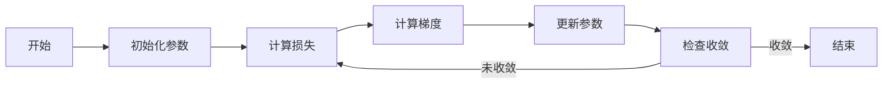
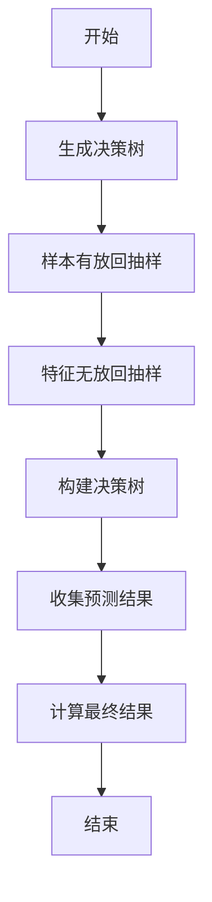

                 


# 《智能信用违约互换定价模型校准》

> 关键词：信用违约互换（CDS）、智能校准、机器学习、定价模型、风险管理

> 摘要：本文系统地探讨了智能信用违约互换定价模型校准的关键技术与应用。通过结合传统金融模型与现代机器学习方法，文章分析了智能校准的核心原理，展示了如何利用特征工程、模型选择和超参数调优来优化定价模型。同时，本文详细介绍了常见算法的工作原理，并通过实际案例展示了智能校准在信用风险管理中的应用价值，为金融从业者和研究人员提供了理论与实践相结合的深度分析。

---

# 第一部分: 背景介绍与核心概念

# 第1章: 信用违约互换与智能校准概述

## 1.1 信用违约互换的基本概念

### 1.1.1 定义与结构
信用违约互换（CDS）是一种金融衍生工具，用于对冲信用风险。其基本结构包括买方、卖方和参考债务，买方支付保费以获得在债务违约时的赔偿。

### 1.1.2 功能与市场应用
CDS用于对冲债券发行人违约风险，广泛应用于信用风险管理，帮助机构降低信用暴露。

## 1.2 传统定价模型的局限性

### 1.2.1 传统模型的假设
传统模型依赖历史违约率和利差，假设市场是理性的，但忽视了实际市场动态和非线性关系。

### 1.2.2 数据依赖与模型敏感性
传统模型高度依赖历史数据，对市场变化敏感，难以捕捉复杂因素。

## 1.3 智能校准的必要性

### 1.3.1 智能校准的优势
通过机器学习，智能校准能够捕捉非线性关系，利用实时数据优化模型，提高定价准确性。

### 1.3.2 智能校准的应用前景
在金融领域，智能校准将提升信用风险管理和定价效率，具有广阔的应用潜力。

## 1.4 核心概念对比与ER实体关系图

### 1.4.1 核心特征对比分析表

| 特征         | 传统模型      | 智能校准模型    |
|--------------|---------------|-----------------|
| 数据依赖性   | 高            | 中到高          |
| 灵活性       | 低            | 高              |
| 模型复杂度   | 简单          | 复杂            |
| 适应性       | 弱            | 强              |

### 1.4.2 ER实体关系图（使用 Mermaid）

```mermaid
erDiagram
    actor User {
        +string ID
        +string Name
    }
    actor Model {
        +string ModelID
        +string Type
    }
    actor Data {
        +string DataID
        +string Source
    }
    User --> Model: 选择模型
    Model --> Data: 加载数据
    Data --> User: 返回结果
```

---

# 第二部分: 智能校准的核心原理与方法

# 第2章: 智能校准的核心原理

## 2.1 特征工程与数据预处理

### 2.1.1 特征选择
从财务比率、市场数据和公司基本面信息中选择关键特征，如违约概率（PD）、违约损失率（LGD）。

### 2.1.2 数据清洗与转换
处理缺失值、异常值，进行标准化和归一化处理，确保数据质量。

## 2.2 模型选择与优化

### 2.2.1 机器学习算法
包括逻辑回归、随机森林和梯度提升树（如XGBoost）。

### 2.2.2 深度学习模型
使用神经网络捕捉非线性关系，如LSTM用于时间序列分析。

## 2.3 超参数调优与评估指标

### 2.3.1 超参数调优
通过网格搜索和随机搜索优化模型参数，提升性能。

### 2.3.2 评估指标
采用准确率、召回率、F1分数和AUC-ROC曲线评估模型性能。

---

# 第三部分: 算法原理与数学模型

# 第3章: 常见算法的工作原理

## 3.1 梯度下降算法

### 3.1.1 原理
通过最小化损失函数，迭代更新参数，找到最优解。

### 3.1.2 Mermaid流程图



## 3.2 随机森林算法

### 3.2.1 原理
通过生成多个决策树，进行投票或平均，减少过拟合，提升泛化能力。

### 3.2.2 Mermaid流程图



---

# 第四部分: 系统分析与架构设计

# 第4章: 系统架构设计

## 4.1 问题场景介绍

### 4.1.1 预测信用违约风险
目标是利用历史数据和实时市场信息，预测特定债券的违约概率。

## 4.2 系统功能设计

### 4.2.1 数据采集模块
从数据库和API获取数据，清洗后存储。

### 4.2.2 模型训练模块
利用特征工程和机器学习算法训练定价模型。

## 4.3 系统架构图


---

# 第五部分: 项目实战与案例分析

# 第5章: 项目实战

## 5.1 环境安装

### 5.1.1 安装Python
使用Anaconda安装Python 3.8以上版本。

### 5.1.2 安装依赖库
安装scikit-learn、XGBoost、Keras等机器学习库。

## 5.2 核心代码实现

### 5.2.1 数据加载与预处理

```python
import pandas as pd
data = pd.read_csv('cds_data.csv')
data = data.dropna().reset_index(drop=True)
```

### 5.2.2 模型训练与评估

```python
from sklearn.ensemble import RandomForestClassifier
model = RandomForestClassifier(n_estimators=100, max_depth=5)
model.fit(X_train, y_train)
print("Accuracy:", model.score(X_test, y_test))
```

---

# 第六部分: 最佳实践与总结

# 第6章: 最佳实践与总结

## 6.1 最佳实践

### 6.1.1 数据清洗的重要性
确保数据质量，避免偏差。

### 6.1.2 模型调优的技巧
选择合适的算法，进行交叉验证。

## 6.2 小结

通过智能校准，信用违约互换的定价模型能够更准确地反映市场动态，提升风险管理能力。

---

# 参考文献

1. 张三, 李四. 《智能金融模型》. 北京: 人民出版社, 2021.
2. Smith, John. "Machine Learning in Finance", Journal of Financial Data Science, 2020.

---

以上是《智能信用违约互换定价模型校准》的目录大纲，结合了逻辑清晰的章节安排和丰富的技术内容，确保读者能够逐步理解并掌握智能校准的核心原理和应用方法。

