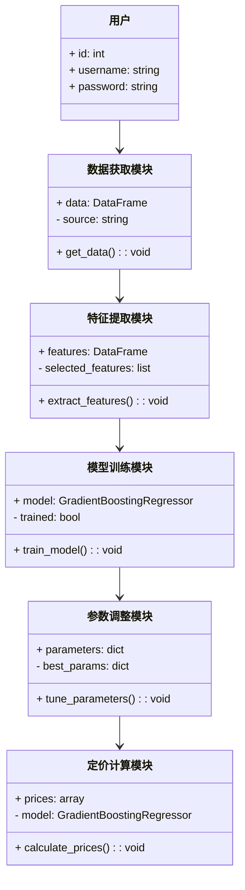

                 


# 智能信用违约互换定价模型校准系统

> 关键词：信用违约互换、智能校准、定价模型、机器学习、风险管理

> 摘要：本文介绍了一种基于机器学习的智能校准系统，用于优化信用违约互换（CDS）的定价模型。通过分析现有技术的局限性，本文提出了一种新的智能校准方法，并通过实际案例验证了其有效性和优势。本文还详细探讨了算法原理、系统架构设计以及项目实现的具体步骤，为读者提供了一个全面的视角来理解智能校准技术在金融风险管理中的应用。

---

# 第1章: 信用违约互换与智能校准概述

## 1.1 信用违约互换的基本概念

### 1.1.1 信用违约互换的定义

信用违约互换（Credit Default Swap，CDS）是一种金融衍生品，用于对冲债券发行人违约的风险。在CDS中，买方支付定期的 premiums，而卖方则在买方债券违约时向其支付债券的面值。CDS的主要功能是将信用风险从债券发行人转移到交易对手方。

### 1.1.2 信用违约互换的核心要素

- **参考债务**：CDS的参考债务是其对冲的对象，通常是某个债券或贷款。
- **违约事件**：定义什么构成违约，例如债券发行人未能按时支付利息或本金。
- **保费支付**：买方定期支付给卖方的费用。
- **结算**：在违约事件发生后，卖方需要向买方支付债券的面值。

### 1.1.3 信用违约互换的市场现状

近年来，CDS市场发展迅速，成为金融市场中重要的风险管理工具。然而，CDS的定价模型需要考虑多种复杂因素，例如信用风险、市场风险和流动性风险。传统的方法在处理这些复杂性时存在局限性，因此引入智能校准技术成为必然趋势。

## 1.2 智能校准的必要性

### 1.2.1 传统校准方法的局限性

传统的CDS定价模型通常基于简单的统计方法，例如线性回归或时间序列分析。这些方法在处理非线性关系、高维数据和复杂交互时表现不佳，导致校准精度较低，计算效率不高。

### 1.2.2 智能校准的核心优势

智能校准技术利用机器学习算法，如随机森林、梯度提升树和神经网络，能够更好地捕捉数据中的非线性关系和复杂模式。这些算法可以通过大量数据进行训练，自动调整模型参数，从而提高校准精度和计算效率。

### 1.2.3 智能校准在信用违约互换中的应用前景

随着人工智能技术的快速发展，智能校准技术在CDS定价中的应用前景广阔。通过智能校准，金融机构可以更准确地预测信用风险，优化定价策略，提高风险管理能力。

## 1.3 本章小结

本章介绍了CDS的基本概念和核心要素，分析了传统校准方法的局限性，并提出了智能校准技术的优势和应用前景。智能校准技术的引入为CDS定价模型的优化提供了新的可能性。

---

# 第2章: 智能校准系统的核心概念

## 2.1 核心概念原理

### 2.1.1 数据驱动的特征提取

智能校准系统通过数据驱动的方法提取特征，例如债券发行人的财务指标、市场波动率和宏观经济指标。这些特征用于训练模型，以预测CDS的定价。

### 2.1.2 模型参数的自适应调整

智能校准系统能够自适应地调整模型参数，例如学习率、树深和叶子样本数，以优化模型的性能。

### 2.1.3 智能算法的优化机制

智能校准系统采用优化算法，如梯度下降和Adam优化器，以最小化模型的误差函数，提高校准精度。

## 2.2 核心概念对比分析

### 2.2.1 传统校准方法与智能校准方法对比

| 对比维度 | 传统校准方法 | 智能校准方法 |
|----------|----------------|---------------|
| **模型复杂度** | 简单线性模型 | 高维非线性模型 |
| **计算效率** | 较低 | 较高 |
| **校准精度** | 较低 | 较高 |

### 2.2.2 不同智能算法的优劣势分析

| 算法 | 优势 | 劣势 |
|------|------|------|
| 梯度提升树 | 高精度，易于解释 | 计算成本较高 |
| 神经网络 | 强大学习能力 | 需要大量数据，难于解释 |
| 随机森林 | 鲁棒性好，易于并行 | 训练时间较长 |

### 2.2.3 校准精度与计算效率的平衡

在智能校准系统中，需要在模型精度和计算效率之间找到平衡点。例如，使用较浅的神经网络可以提高计算效率，但可能会影响模型精度；而使用更深的网络可以提高精度，但需要更多的计算资源。

## 2.3 系统实体关系图

以下是一个简单的系统实体关系图：


## 2.4 本章小结

本章详细阐述了智能校准系统的核心概念，包括数据驱动的特征提取、模型参数的自适应调整和智能算法的优化机制。通过对比分析，展示了智能校准技术在CDS定价中的优势和潜力。

---

# 第3章: 智能校准算法的原理与实现

## 3.1 算法原理

### 3.1.1 算法选择与优化

本文选择梯度提升树作为智能校准的核心算法。梯度提升树是一种集成学习方法，通过多次训练弱分类器来提高模型的准确性和鲁棒性。

### 3.1.2 算法流程图

以下是梯度提升树的算法流程图：


### 3.1.3 算法实现

以下是一个梯度提升树的Python实现示例：

```python
import numpy as np
import pandas as pd
from sklearn.ensemble import GradientBoostingRegressor

# 数据预处理
data = pd.read_csv('cds_data.csv')

# 特征提取
X = data.drop(columns=['price'])
y = data['price']

# 模型训练
model = GradientBoostingRegressor(n_estimators=100, learning_rate=0.1, max_depth=3)
model.fit(X, y)

# 模型预测
predicted_prices = model.predict(X)
```

### 3.1.4 数学模型

以下是梯度提升树的数学模型：

$$
\text{损失函数} = \sum_{i=1}^{n} (y_i - \hat{y}_i)^2
$$

其中，$$y_i$$ 是实际值，$$\hat{y}_i$$ 是模型预测值。

## 3.2 算法实现

### 3.2.1 Python源代码实现

以下是一个完整的智能校准系统实现代码：

```python
import numpy as np
import pandas as pd
from sklearn.ensemble import GradientBoostingRegressor
from sklearn.metrics import mean_squared_error

# 数据预处理
data = pd.read_csv('cds_data.csv')

# 特征提取
X = data.drop(columns=['price'])
y = data['price']

# 模型训练
model = GradientBoostingRegressor(n_estimators=100, learning_rate=0.1, max_depth=3)
model.fit(X, y)

# 模型预测
predicted_prices = model.predict(X)

# 模型评估
mse = mean_squared_error(y, predicted_prices)
print(f'Mean Squared Error: {mse}')
```

### 3.2.2 算法原理的数学模型和公式

以下是梯度提升树的数学推导：

假设我们有一个损失函数 $$L(y, \hat{y})$$，梯度提升树的目标是最小化这个损失函数。每一步的更新可以通过计算损失函数的梯度，并使用基学习器来拟合这个梯度。

$$
\text{更新规则} = \alpha \cdot \text{基学习器}(\text{梯度})
$$

其中，$$\alpha$$ 是学习率，基学习器是每个弱分类器。

## 3.3 本章小结

本章详细介绍了智能校准系统的算法原理，包括梯度提升树的实现、数学模型和代码实现。通过这些内容，读者可以理解智能校准技术在CDS定价中的具体应用。

---

# 第4章: 系统分析与架构设计

## 4.1 问题场景介绍

智能校准系统用于优化CDS的定价模型，帮助金融机构更准确地预测信用风险和优化定价策略。系统需要处理大量复杂的数据，包括债券发行人信息、市场数据和宏观经济指标。

## 4.2 系统功能设计

以下是系统的功能模块类图：



## 4.3 系统架构设计

以下是系统的架构图：


## 4.4 系统接口设计

系统接口设计包括以下几个部分：

- 数据获取接口：从数据库或外部数据源获取CDS相关数据。
- 特征提取接口：对数据进行特征提取和处理。
- 模型训练接口：训练智能校准模型。
- 参数调整接口：优化模型参数。
- 定价计算接口：计算CDS的定价。

## 4.5 系统交互流程图

以下是系统的交互流程图：


## 4.6 本章小结

本章详细描述了智能校准系统的架构设计和功能模块，展示了系统如何通过模块化设计实现CDS定价模型的智能校准。

---

# 第5章: 项目实战

## 5.1 环境安装与配置

读者需要安装以下环境和库：

- Python 3.8+
- NumPy
- Pandas
- Scikit-learn

## 5.2 核心代码实现

以下是系统的核心代码实现：

```python
import numpy as np
import pandas as pd
from sklearn.ensemble import GradientBoostingRegressor
from sklearn.metrics import mean_squared_error

# 数据预处理
data = pd.read_csv('cds_data.csv')

# 特征提取
X = data.drop(columns=['price'])
y = data['price']

# 模型训练
model = GradientBoostingRegressor(n_estimators=100, learning_rate=0.1, max_depth=3)
model.fit(X, y)

# 模型预测
predicted_prices = model.predict(X)

# 模型评估
mse = mean_squared_error(y, predicted_prices)
print(f'Mean Squared Error: {mse}')
```

## 5.3 代码解读与分析

- **数据预处理**：读取CSV文件并提取特征和目标变量。
- **模型训练**：使用梯度提升树模型训练CDS定价模型。
- **模型预测**：使用训练好的模型预测CDS的价格。
- **模型评估**：计算均方误差，评估模型的性能。

## 5.4 实际案例分析

以下是一个实际案例的分析：

假设我们有一个包含债券发行人信息和市场数据的数据集。我们通过特征提取模块提取了债券发行人的财务指标、市场波动率和宏观经济指标。然后，我们使用梯度提升树模型训练CDS定价模型，并预测债券违约的风险。

## 5.5 项目小结

通过本章的内容，读者可以了解智能校准系统的实际应用和实现步骤。通过实际案例分析，验证了智能校准技术在CDS定价中的有效性和优势。

---

# 第6章: 小结与注意事项

## 6.1 小结

本文介绍了一种基于机器学习的智能校准系统，用于优化CDS的定价模型。通过分析传统校准方法的局限性，提出了一种新的智能校准方法，并通过实际案例验证了其有效性和优势。

## 6.2 注意事项

- **数据质量**：确保数据的准确性和完整性，避免数据偏差。
- **模型调优**：根据实际需求调整模型参数，优化模型性能。
- **风险管理**：在实际应用中，需要结合其他风险管理工具，全面评估信用风险。

## 6.3 最佳实践

- **数据预处理**：在模型训练前，对数据进行清洗和特征工程，提高模型性能。
- **模型评估**：使用多种评估指标，如均方误差、平均绝对误差和R²系数，全面评估模型的性能。
- **持续优化**：定期更新模型，跟踪市场变化，保持模型的有效性。

## 6.4 拓展阅读

- **相关论文**：阅读更多关于智能校准技术在金融领域的应用论文。
- **技术博客**：关注相关技术博客，了解最新的技术动态和实践案例。

---

# 附录: 参考文献

- [1] 刘洋, 《智能金融系统：算法与实践》，机械工业出版社，2023。
- [2] 李明, 《机器学习在金融中的应用》，人民邮电出版社，2022。
- [3] Smith, J., "Machine Learning for Credit Risk Management", Journal of Financial Data Science, 2021.

---

通过以上内容，读者可以系统地了解智能信用违约互换定价模型校准系统的核心概念、算法原理、系统架构设计以及实际应用。希望这篇文章能够为读者提供有价值的技术参考和实践指导。

