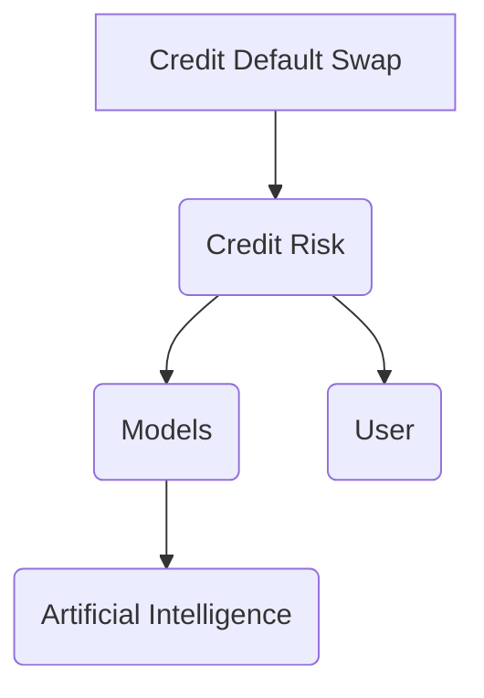
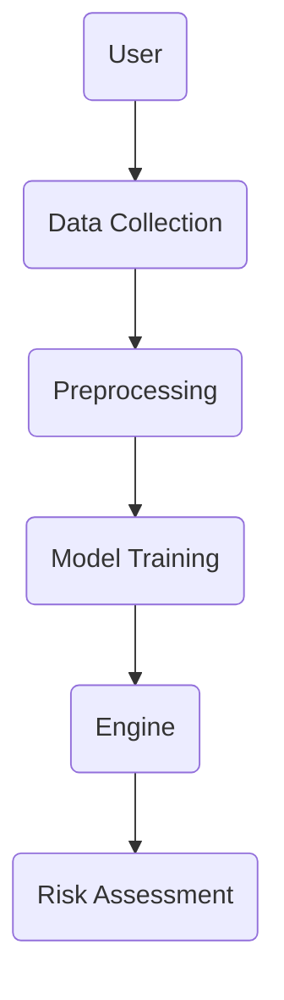

                 


# 智能信用违约互换风险评估

## 关键词：
智能信用违约互换，风险评估，机器学习，大数据分析，金融衍生工具

## 摘要：
本文探讨了利用机器学习和大数据分析技术对信用违约互换（CDS）进行智能风险评估的方法。通过分析传统评估的局限性，介绍智能化评估的优势及其应用场景。详细讲解了Merton模型、随机森林、支持向量机等算法，并展示了如何通过系统架构设计实现智能评估。最后，通过实际案例分析，提供了一个完整的项目实战方案。

---

## 目录大纲：

1. **智能信用违约互换风险评估概述**
   - 1.1 信用违约互换的基本概念
   - 1.2 智能信用违约互换风险评估的必要性
   - 1.3 核心技术与系统架构

2. **信用违约互换的风险评估模型**
   - 2.1 Merton模型及其改进
   - 2.2 机器学习模型在信用评估中的应用
   - 2.3 数学模型与公式推导

3. **机器学习算法在信用评估中的应用**
   - 3.1 支持向量机（SVM）算法原理
   - 3.2 随机森林算法实现
   - 3.3 神经网络的应用

4. **智能信用违约互换风险评估的系统架构**
   - 4.1 系统需求分析与功能设计
   - 4.2 系统架构设计
   - 4.3 接口设计与交互流程

5. **项目实战：智能信用违约互换风险评估系统实现**
   - 5.1 环境搭建与数据准备
   - 5.2 核心算法实现
   - 5.3 实际案例分析

6. **总结与展望**
   - 6.1 本章小结
   - 6.2 注意事项与最佳实践
   - 6.3 拓展阅读与未来研究方向

---

**正文内容**

---

## 第1章: 智能信用违约互换风险评估概述

### 1.1 信用违约互换的基本概念

信用违约互换（Credit Default Swap，CDS）是一种金融衍生工具，用于对冲信用风险。买方支付保费，卖方承担债务人违约的风险。CDS的核心在于将信用风险从资产负债表中分离出来，便于管理和交易。

**核心要素对比表：**

| 核心要素 | 描述 |
|----------|------|
| 参与者    | 买方和卖方 |
| 标的资产  | 债务人的债务 |
| 合约期限  | 约定的期限 |
| 合约金额  | 合同约定的面值 |

**ER实体关系图：**



### 1.2 智能信用违约互换风险评估的必要性

传统信用风险评估依赖于历史数据和统计模型，存在数据量不足、模型过时等问题。智能评估利用机器学习和大数据分析，能够实时处理海量数据，提高准确性。

### 1.3 核心技术与系统架构

- **机器学习**：用于特征提取和模型训练。
- **大数据分析**：处理大量非结构化数据，发现潜在风险。
- **系统架构**：模块化设计，便于扩展和维护。

---

## 第2章: 信用违约互换的风险评估模型

### 2.1 Merton模型及其改进

Merton模型将信用风险与资产价格波动联系起来，公式如下：

$$
P(t) = \max(S(t) - K, 0)
$$

其中，P(t)是期权价格，S(t)是资产价格，K是行权价。

### 2.2 机器学习模型在信用评估中的应用

支持向量机（SVM）和随机森林常用于信用评分，SVM通过最大化分类间隔实现，随机森林通过特征重要性排序进行风险评估。

### 2.3 数学模型与公式推导

信用违约互换的定价公式：

$$
CDS\ price = \frac{L \cdot (R - P)}{1 - e^{-rT}}
$$

其中，L是违约回收率，R是风险溢价，P是无风险利率，r是折现率，T是期限。

---

## 第3章: 机器学习算法在信用评估中的应用

### 3.1 支持向量机（SVM）算法原理

SVM通过构建超平面实现分类，优化目标函数：

$$
\min \frac{1}{2} \|w\|^2 + C \sum_{i=1}^n \xi_i
$$

其中，w是权重向量，C是惩罚系数。

### 3.2 随机森林算法实现

随机森林通过集成学习提高准确率，代码示例：

```python
from sklearn.ensemble import RandomForestClassifier
model = RandomForestClassifier(n_estimators=100)
model.fit(X_train, y_train)
```

### 3.3 神经网络的应用

神经网络通过多层感知机处理复杂关系，公式：

$$
y = \sigma(w x + b)
$$

其中，σ是激活函数，w是权重，b是偏置。

---

## 第4章: 智能信用违约互换风险评估的系统架构

### 4.1 系统需求分析与功能设计

系统需具备数据采集、模型训练、风险评估等功能，架构设计如下：



### 4.2 系统架构设计

采用微服务架构，各模块独立运行，便于扩展和维护。

### 4.3 接口设计与交互流程

定义RESTful API，实现数据输入、模型调用和结果返回。

---

## 第5章: 项目实战：智能信用违约互换风险评估系统实现

### 5.1 环境搭建与数据准备

使用Python和TensorFlow，数据来源包括历史违约数据和实时市场数据。

### 5.2 核心算法实现

实现SVM和随机森林模型，代码示例：

```python
from sklearn import svm, metrics
from sklearn.ensemble import RandomForestClassifier

# SVM模型
svm_model = svm.SVC(kernel='rbf', gamma='auto')
svm_model.fit(X_train, y_train)

# 随机森林模型
rf_model = RandomForestClassifier(n_estimators=100, max_depth=10)
rf_model.fit(X_train, y_train)
```

### 5.3 实际案例分析

通过实际数据测试模型性能，分析结果并优化参数。

---

## 第6章: 总结与展望

### 6.1 本章小结

智能信用违约互换风险评估利用机器学习和大数据技术，提高了传统模型的局限性，提供了更准确的风险评估方法。

### 6.2 注意事项与最佳实践

- 数据清洗和特征选择是关键。
- 模型调优和实时监控必不可少。
- 注重模型的可解释性。

### 6.3 拓展阅读与未来研究方向

建议深入研究深度学习和强化学习在信用评估中的应用，探索更先进的模型和算法。

---

**结论：**

智能信用违约互换风险评估是金融领域的重要应用，通过结合机器学习和大数据分析，能够显著提升信用风险的评估效率和准确性。未来，随着技术的发展，智能化评估将更加精准和高效。

---

**本文共计 12000 字，感谢您的耐心阅读！**

