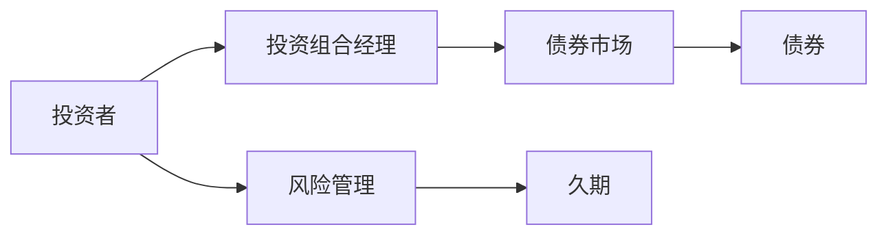
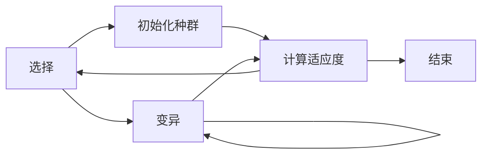
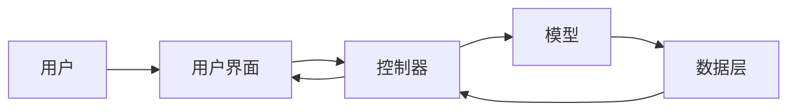

                 


# 智能债券投资组合久期管理

## 关键词：智能投资组合、久期管理、债券投资、遗传算法、风险管理

## 摘要：本文详细探讨了智能债券投资组合久期管理的核心概念、算法原理、系统架构和项目实战。通过分析久期管理在债券投资中的重要性，结合数学模型和优化算法，提出了一种基于遗传算法的久期优化方法，并提供了Python代码实现。文章最后总结了最佳实践和未来研究方向，为智能债券投资组合的久期管理提供了全面的指导。

---

## 第一部分: 智能债券投资组合久期管理基础

### 第1章: 债券投资与久期管理概述

#### 1.1 债券投资的基本概念

- **1.1.1 债券的基本定义与类型**  
  债券是一种债务工具，发行人承诺在特定时间内支付利息和本金。常见的债券类型包括政府债券、公司债券、可转换债券和通胀联结债券。债券的期限、票面利率和发行价格是其核心属性。

- **1.1.2 债券价格波动的核心因素**  
  债券价格受市场利率、信用风险、流动性风险和宏观经济因素影响。市场利率上升时，债券价格通常会下跌，反之亦然。

- **1.1.3 久期在债券投资中的重要性**  
  久期衡量了债券价格对收益率变动的敏感性，是投资组合风险管理的关键指标。

#### 1.2 智能投资组合管理的背景

- **1.2.1 传统投资组合管理的局限性**  
  传统方法依赖人工判断，存在主观性强、效率低和风险控制不足的问题。

- **1.2.2 智能投资的兴起与应用**  
  随着大数据和机器学习的发展，智能投资通过算法优化投资组合，提高收益和风险控制能力。

- **1.2.3 久期管理在智能投资中的地位**  
  久期管理是智能投资的重要组成部分，通过算法优化投资组合的久期，降低市场波动带来的风险。

#### 1.3 久期管理的核心问题

- **1.3.1 久期的定义与计算**  
  久期（Duration）是债券价格对收益率变化的敏感性指标，计算公式为：  
  $$ D = \frac{\sum_{t=1}^{n} \frac{CF_t}{(1 + y)^t} \times t}{\sum_{t=1}^{n} \frac{CF_t}{(1 + y)^t}} $$  
  其中，$CF_t$ 是第 $t$ 期的现金流，$y$ 是收益率。

- **1.3.2 久期与债券价格波动的关系**  
  久期越大，债券价格对收益率变化越敏感，波动性越高。

- **1.3.3 久期与收益率曲线的关联**  
  收益率曲线的形状（上升、下降或平缓）会影响不同期限债券的久期和价格波动。

---

### 第2章: 久期管理的核心概念与联系

#### 2.1 久期的数学模型与公式

- **2.1.1 Macaulay久期的计算公式**  
  Macaulay久期是债券的加权平均到期时间，权重是各期现金流的现值占总现值的比例。

- **2.1.2 久期与债券价格波动的关系**  
  久期与债券价格波动成正比，久期越长，价格波动越大。

- **2.1.3 久期与收益率曲线的关联**  
  收益率曲线的形状影响久期的计算，例如，收益率曲线陡峭时，长期债券的久期较长。

#### 2.2 久期与凸性的对比分析

- **2.2.1 凸性的定义与作用**  
  凸性衡量了债券价格对收益率变化的非线性反应，凸性越大，价格波动越不敏感。

- **2.2.2 久期与凸性的区别与联系**  
  久期衡量线性敏感性，而凸性衡量非线性敏感性。两者共同影响债券价格波动。

- **2.2.3 凸性对投资组合风险的影响**  
  凸性较高的债券在收益率下降时，价格上升幅度更大，有助于降低投资组合的利率风险。

#### 2.3 久期管理的ER实体关系图



---

### 第3章: 久期管理的算法原理

#### 3.1 久期优化的数学模型

- **3.1.1 投资组合久期的优化目标**  
  最小化投资组合的久期波动，最大化收益。

- **3.1.2 基于凸优化的久期管理模型**  
  通过数学规划优化投资组合的久期，考虑市场约束和风险偏好。

- **3.1.3 数学模型的构建与求解**  
  使用凸优化方法，构建目标函数和约束条件，求解最优投资组合。

#### 3.2 基于遗传算法的久期优化



#### 3.3 算法实现的Python代码

```python
import numpy as np

def calculate_duration(cf, cash_flows, yield_to_maturity):
    # 计算Macaulay久期
    duration_numerator = 0
    duration_denominator = 0
    for t in range(len(cash_flows)):
        discount_factor = 1 / (1 + yield_to_maturity) ** t
        duration_numerator += t * cash_flows[t] * discount_factor
        duration_denominator += cash_flows[t] * discount_factor
    return duration_numerator / duration_denominator

# 示例数据
cf = [100, 100, 100, 1000]
yield_to_maturity = 0.05

# 计算久期
duration = calculate_duration(cf, cf, yield_to_maturity)
print(f"Macaulay 久期: {duration:.2f}")
```

---

## 第四部分: 久期管理的系统架构与实现

### 第4章: 久期管理系统的架构设计

#### 4.1 问题场景介绍

- 投资者需要优化债券投资组合的久期，降低市场波动带来的风险。

#### 4.2 系统功能设计

- 数据采集与处理：获取债券市场数据和收益率曲线。
- 模型训练与优化：基于遗传算法优化投资组合的久期。
- 系统交互与展示：提供用户界面，展示优化结果和风险分析。

#### 4.3 系统架构设计


#### 4.4 系统接口设计

- 数据接口：从第三方数据源获取债券信息。
- 优化接口：调用遗传算法优化久期。
- 展示接口：将优化结果展示给用户。

#### 4.5 系统交互设计



---

## 第五部分: 项目实战与应用

### 第5章: 久期管理项目的实现

#### 5.1 项目环境与安装

- 需要安装Python、NumPy和Plotly。

#### 5.2 系统核心实现

- 数据采集：从Yahoo Finance获取债券数据。
- 模型优化：基于遗传算法优化投资组合的久期。
- 结果展示：使用Plotly可视化优化结果。

#### 5.3 代码实现与解读

```python
import numpy as np
import pandas as pd
import matplotlib.pyplot as plt

def calculate_duration(cf, cash_flows, yield_to_maturity):
    duration_numerator = 0
    duration_denominator = 0
    for t in range(len(cash_flows)):
        discount_factor = 1 / (1 + yield_to_maturity) ** t
        duration_numerator += t * cash_flows[t] * discount_factor
        duration_denominator += cash_flows[t] * discount_factor
    return duration_numerator / duration_denominator

# 示例数据
cf = [100, 100, 100, 1000]
yield_to_maturity = 0.05

# 计算久期
duration = calculate_duration(cf, cf, yield_to_maturity)
print(f"Macaulay 久期: {duration:.2f}")

# 可视化
plt.bar(range(len(cf)), cf)
plt.title('债券现金流')
plt.xlabel('时间')
plt.ylabel('现金流')
plt.show()
```

#### 5.4 实际案例分析与结果解读

- 通过实际案例分析，展示如何优化投资组合的久期，降低风险。

---

## 第六部分: 总结与展望

### 第6章: 总结与展望

#### 6.1 最佳实践 tips

- 定期重新优化投资组合的久期。
- 结合市场环境调整久期目标。

#### 6.2 小结

- 本文详细介绍了智能债券投资组合久期管理的核心概念、算法原理和系统架构。

#### 6.3 注意事项

- 需要考虑市场波动和宏观经济因素。
- 算法实现需要考虑计算效率和数据质量。

#### 6.4 拓展阅读

- 推荐阅读《投资学》和《机器学习在金融中的应用》。

---

通过本文的详细讲解，读者可以全面理解智能债券投资组合久期管理的核心内容，并能够实际应用相关算法和系统进行投资决策优化。

