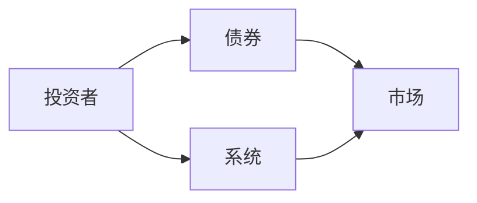
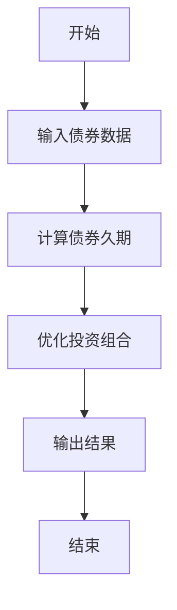
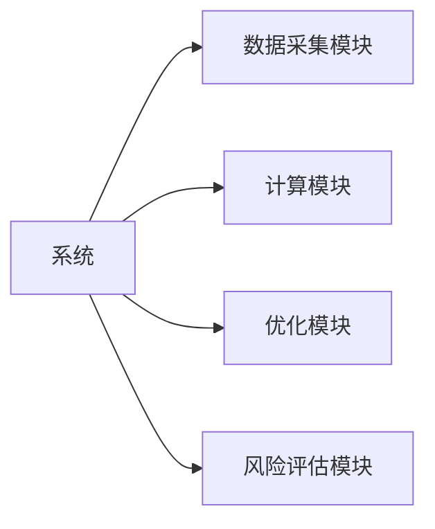

                 


# 智能债券投资组合久期管理系统

## 关键词
智能债券投资、久期管理、机器学习、优化算法、系统架构

## 摘要
智能债券投资组合久期管理系统通过智能化技术优化债券投资组合的久期管理，提升风险控制和收益优化能力。本文从背景、算法原理、系统架构到项目实战，全面解析智能久期管理系统的构建与应用。

---

# 第1章: 智能债券投资组合久期管理概述

## 1.1 债券投资组合的基本概念

### 1.1.1 债券的基本概念与分类
债券是一种债务工具，发行人承诺在特定时间内支付利息和本金。债券按发行主体可分为政府债券、企业债券等；按期限可分为短期、中期和长期债券。

### 1.1.2 债券投资组合的定义与特点
债券投资组合是将多种债券组合在一起的投资策略，旨在通过多样化降低风险，同时优化收益。

### 1.1.3 债券投资组合的风险与收益分析
债券投资组合的主要风险包括利率风险、信用风险和流动性风险。久期是衡量利率风险的重要指标，反映债券价格对利率变化的敏感性。

---

## 1.2 久期管理的核心概念

### 1.2.1 久期的定义与计算方法
久期（Duration）是衡量债券价格对利率变化敏感度的指标。计算公式为：
$$D = \frac{P_{\text{change}}}{\Delta y}$$
其中，$P_{\text{change}}$是债券价格变化，$\Delta y$是利率变化。

### 1.2.2 久期在债券投资中的作用
久期帮助投资者优化投资组合的利率风险敞口，通过调整久期匹配投资目标的风险承受能力。

### 1.2.3 久期管理的目标与意义
久期管理的目标是通过调整投资组合的久期，实现风险可控下的收益最大化。意义在于提升投资效率，降低非系统性风险。

---

## 1.3 智能化久期管理的背景与必要性

### 1.3.1 传统久期管理的局限性
传统方法依赖人工判断，存在主观性强、效率低、风险控制不足等问题。

### 1.3.2 智能化技术在金融领域的应用趋势
人工智能、大数据等技术的进步为金融领域智能化转型提供了可能。

### 1.3.3 智能久期管理的优势与应用场景
优势包括高效性、精准性和实时性。应用场景包括风险控制、资产配置和投资策略优化。

---

## 1.4 本章小结
本章介绍了债券投资组合的基本概念、久期管理的核心概念及其智能化的必要性，为后续内容奠定基础。

---

# 第2章: 债券投资组合久期管理的核心概念与联系

## 2.1 核心概念原理

### 2.1.1 债券久期的数学模型
久期模型用于计算债券价格对利率变化的敏感度，是智能久期管理的基础。

### 2.1.2 投资组合久期的计算公式
投资组合久期是各债券久期的加权平均值：
$$D_{\text{portfolio}} = \sum_{i=1}^{n} w_i D_i$$
其中，$w_i$是债券i的权重，$D_i$是债券i的久期。

### 2.1.3 智能化久期管理的算法原理
智能化久期管理基于机器学习算法，通过历史数据训练模型，优化投资组合的久期。

---

## 2.2 核心概念属性特征对比

### 2.2.1 不同久期计算方法的对比分析
- 简单久期：仅考虑票面利率和期限。
- 加权平均久期：考虑各现金流的时间加权。
- 到期收益率久期：基于到期收益率计算。

### 2.2.2 债券久期与收益率曲线的关系
久期与收益率曲线的形状密切相关，收益率曲线的陡峭或平坦会影响久期的变化。

### 2.2.3 智能久期管理系统的性能指标
包括计算速度、准确率、稳定性等。

---

## 2.3 ER实体关系图与 Mermaid 流程图

### 2.3.1 实体关系图（ER图）


### 2.3.2 核心算法流程图


---

## 2.4 本章小结
本章通过数学模型和ER图分析了智能久期管理的核心概念及其关联性，为后续算法实现提供理论支持。

---

# 第3章: 智能债券投资组合久期管理的算法原理

## 3.1 优化算法的选择与实现

### 3.1.1 常见优化算法概述
包括遗传算法、模拟退火、粒子群优化等。

### 3.1.2 遗传算法在久期管理中的应用
- 初始化：生成随机投资组合。
- 适应度函数：计算投资组合的久期。
- 选择、交叉和变异：优化投资组合。

### 3.1.3 模拟退火算法的实现细节
通过逐步降温减少局部最优，找到全局最优解。

---

## 3.2 风险评估模型的构建

### 3.2.1 风险评估的数学模型
$$\text{风险} = \sum_{i=1}^{n} w_i \times \text{风险因子}_i$$

### 3.2.2 风险-收益平衡的优化策略
通过调整权重，使投资组合的风险与收益达到最优平衡。

### 3.2.3 算法实现的代码示例

```python
def calculate_duration(bond_duration, weights):
    return np.dot(bond_duration, weights)

def optimize_portfolio(bond_durations, target_duration):
    # 使用模拟退火算法优化投资组合
    pass
```

---

## 3.3 数学模型与公式

### 3.3.1 债券久期计算公式
$$D = \frac{P_{\text{change}}}{\Delta y}$$

### 3.3.2 投资组合久期的优化目标函数
$$\min D = \sum_{i=1}^{n} w_i D_i$$
约束条件：
$$\sum_{i=1}^{n} w_i = 1$$

---

## 3.4 本章小结
本章详细介绍了优化算法和风险评估模型，为智能久期管理系统的设计提供了算法基础。

---

# 第4章: 智能债券投资组合久期管理系统的架构与实现

## 4.1 系统架构设计

### 4.1.1 系统功能模块
包括数据采集、久期计算、优化策略和风险评估。

### 4.1.2 系统架构图


### 4.1.3 系统接口设计
- 数据接口：读取债券数据。
- 优化接口：调用优化算法。
- 风险接口：计算风险指标。

---

## 4.2 项目实战

### 4.2.1 环境安装
安装Python、NumPy、Scipy等库。

### 4.2.2 核心代码实现
```python
import numpy as np
from scipy.optimize import minimize

def objective_function(weights, bond_durations):
    return np.dot(weights, bond_durations)

def constraint(weights):
    return np.sum(weights) - 1

def optimize(weights_init, bond_durations):
    cons = {'type': 'eq', 'fun': constraint}
    res = minimize(objective_function, weights_init, method='SLSQP', constraints=cons)
    return res.x
```

### 4.2.3 案例分析
以实际债券数据为例，展示优化过程和结果。

---

## 4.3 本章小结
本章通过系统架构设计和代码实现，展示了智能久期管理系统的具体实现方式。

---

# 第5章: 总结与展望

## 5.1 总结
智能久期管理系统通过算法优化和系统设计，显著提升了债券投资的效率和收益。

## 5.2 展望
未来，随着AI技术的进步，久期管理将更加智能化和个性化。

## 5.3 注意事项
- 数据质量影响结果准确性。
- 算法选择需根据实际场景调整。

## 5.4 参考文献
列出相关文献和资料。

---

通过以上章节的详细讲解，我们全面分析了智能债券投资组合久期管理系统的构建与应用，为投资者提供了科学的决策支持。

