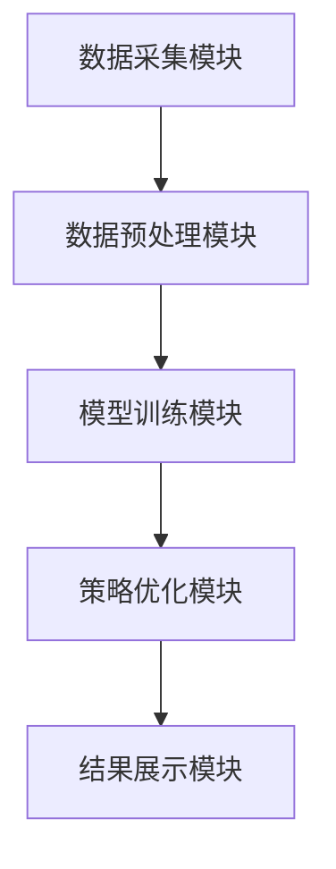
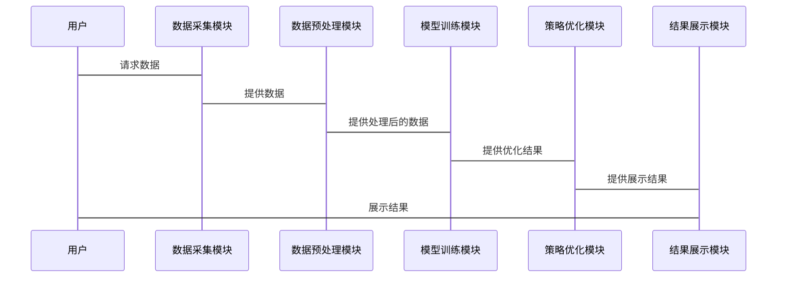

                 


# 智能债券投资组合免疫策略优化

> 关键词：智能债券投资，免疫策略，优化算法，风险控制，投资组合管理

> 摘要：本文详细探讨了智能债券投资组合免疫策略的优化方法，从传统免疫策略的局限性出发，结合人工智能技术，提出了一种基于遗传算法的优化方案。通过构建数学模型、设计系统架构并实现算法，本文为投资者提供了一种高效的风险控制和收益最大化的方法。

---

## 第1章 债券投资组合免疫策略概述

### 1.1 债券投资的基本概念

#### 1.1.1 债券的定义与分类

债券是一种债务工具，发行人向投资者借款，并承诺在特定时间内支付利息和本金。债券按发行人分类，可以分为政府债券、企业债券和金融债券；按期限分类，可以分为短期债券、中期债券和长期债券。

#### 1.1.2 债券投资的目标与风险

债券投资的主要目标是在控制风险的前提下实现收益最大化。债券投资的风险主要包括利率风险、信用风险和流动性风险。

#### 1.1.3 投资组合免疫策略的基本原理

投资组合免疫策略是一种通过优化债券组合来实现收益最大化和风险最小化的策略。其核心思想是通过调整债券的种类、期限和比例，使投资组合的收益和风险达到最优状态。

### 1.2 智能投资组合免疫策略的必要性

#### 1.2.1 传统免疫策略的局限性

传统免疫策略在实际应用中存在以下问题：

- 优化过程复杂，需要大量手动调整。
- 无法实时适应市场变化。
- 对于复杂的市场环境，传统策略难以有效应对。

#### 1.2.2 智能免疫策略的优势

智能免疫策略通过引入人工智能技术，可以实现以下目标：

- 自动化优化，减少人工干预。
- 实时适应市场变化，提高策略的灵活性。
- 提高优化效率，降低投资成本。

#### 1.2.3 人工智能在债券投资中的应用前景

人工智能技术在债券投资中的应用前景广阔，尤其是在以下几个方面：

- 风险预测与管理。
- 债券评级与筛选。
- 投资组合优化与调整。

### 1.3 智能债券投资组合免疫策略的核心要素

#### 1.3.1 优化目标

智能债券投资组合免疫策略的优化目标主要包括以下两个方面：

1. **收益最大化**：在风险可控的前提下，实现投资组合的最大化收益。
2. **风险最小化**：通过优化组合，降低投资组合的整体风险。

#### 1.3.2 约束条件

在优化过程中，需要考虑以下约束条件：

1. **资金约束**：投资组合的总规模不能超过可用资金。
2. **风险约束**：投资组合的风险不能超过设定的阈值。
3. **流动性约束**：投资组合中债券的流动性必须满足一定的要求。

#### 1.3.3 优化算法的选择

在选择优化算法时，需要考虑以下几个因素：

1. **算法的效率**：算法需要能够快速收敛到最优解。
2. **算法的复杂度**：算法的计算复杂度不能过高，否则会影响优化效率。
3. **算法的适用性**：算法需要能够适应债券投资的具体场景。

---

## 第2章 智能免疫策略的数学模型构建

### 2.1 优化目标的数学表达

#### 2.1.1 投资组合收益最大化

投资组合的收益可以表示为以下公式：

$$
\text{收益} = \sum_{i=1}^{n} w_i \times r_i
$$

其中，$w_i$ 是第 $i$ 种债券的投资比例，$r_i$ 是第 $i$ 种债券的预期收益率。

#### 2.1.2 风险最小化

投资组合的风险可以用方差来衡量，公式如下：

$$
\text{风险} = \sum_{i=1}^{n} \sum_{j=1}^{n} w_i w_j \sigma_{ij}
$$

其中，$\sigma_{ij}$ 是第 $i$ 种债券和第 $j$ 种债券之间的协方差。

#### 2.1.3 组合免疫的数学模型

综合考虑收益和风险，可以建立如下的优化模型：

$$
\max \sum_{i=1}^{n} w_i r_i
$$

$$
\text{subject to} \quad \sum_{i=1}^{n} w_i = 1
$$

### 2.2 约束条件的数学表达

#### 2.2.1 资金约束

投资组合的总规模不能超过可用资金，可以表示为：

$$
\sum_{i=1}^{n} w_i \leq 1
$$

#### 2.2.2 风险约束

投资组合的风险不能超过设定的阈值，可以表示为：

$$
\sum_{i=1}^{n} \sum_{j=1}^{n} w_i w_j \sigma_{ij} \leq \text{风险阈值}
$$

#### 2.2.3 流动性约束

投资组合中债券的流动性必须满足一定的要求，可以表示为：

$$
\sum_{i=1}^{n} w_i \times l_i \geq \text{流动性要求}
$$

其中，$l_i$ 是第 $i$ 种债券的流动性指标。

### 2.3 智能免疫策略的数学模型对比

#### 2.3.1 传统免疫模型与智能免疫模型的对比

传统免疫模型通常采用确定性方法，而智能免疫模型则采用概率优化方法，具有更高的灵活性和适应性。

#### 2.3.2 不同约束条件下的模型选择

在实际应用中，需要根据具体的投资目标和市场环境选择合适的优化模型。

---

## 第3章 智能免疫策略的算法原理

### 3.1 常见优化算法概述

#### 3.1.1 遗传算法

遗传算法是一种基于生物进化原理的优化算法，主要包括选择、交叉和变异三个步骤。

#### 3.1.2 梯度下降法

梯度下降法是一种基于梯度优化的算法，适用于连续优化问题。

#### 3.1.3 强化学习算法

强化学习算法是一种基于奖励机制的优化算法，适用于复杂的动态环境。

### 3.2 算法选择与优化

#### 3.2.1 算法选择的依据

选择算法时需要考虑优化目标、约束条件和计算资源等因素。

#### 3.2.2 算法优化的步骤

优化步骤包括算法参数调整、计算效率优化和结果验证。

#### 3.2.3 算法实现的注意事项

实现算法时需要注意计算精度、收敛速度和稳定性等问题。

### 3.3 算法实现的数学模型

#### 3.3.1 遗传算法的数学模型

遗传算法的核心思想是通过迭代优化来寻找最优解，其数学模型如下：

$$
\text{目标函数} = \sum_{i=1}^{n} w_i r_i
$$

约束条件：

$$
\sum_{i=1}^{n} w_i = 1
$$

#### 3.3.2 强化学习算法的数学模型

强化学习算法通过与环境的交互来优化策略，其数学模型如下：

$$
Q(s, a) = r + \gamma \max_a Q(s', a)
$$

其中，$s$ 是当前状态，$a$ 是动作，$r$ 是奖励，$\gamma$ 是折扣因子，$s'$ 是下一个状态。

#### 3.3.3 算法模型的对比分析

不同算法在优化效率、计算复杂度和适应性方面存在差异，需要根据具体场景选择合适的算法。

### 3.4 本章小结

---

## 第4章 系统架构设计

### 4.1 系统功能模块划分

#### 4.1.1 数据采集模块

数据采集模块负责收集市场数据，包括债券价格、收益率等。

#### 4.1.2 数据预处理模块

数据预处理模块负责清洗和转换数据，确保数据的准确性和一致性。

#### 4.1.3 模型训练模块

模型训练模块负责训练优化模型，包括算法选择和参数调整。

#### 4.1.4 策略优化模块

策略优化模块负责根据优化结果生成最优的投资组合。

#### 4.1.5 结果展示模块

结果展示模块负责将优化结果以可视化的方式呈现给用户。

### 4.2 系统架构的mermaid图



### 4.3 系统接口设计

#### 4.3.1 数据接口

数据接口负责与外部数据源的交互，包括数据获取和数据更新。

#### 4.3.2 模型接口

模型接口负责与优化算法的交互，包括模型训练和参数调整。

#### 4.3.3 用户接口

用户接口负责与用户的交互，包括输入参数和展示结果。

### 4.4 系统交互的mermaid图



### 4.5 本章小结

---

## 第5章 系统实现与优化

### 5.1 环境搭建

系统实现需要以下环境：

- **编程语言**：Python
- **框架**：TensorFlow、PyTorch
- **工具库**：Pandas、NumPy、Matplotlib

### 5.2 核心实现代码

#### 5.2.1 数据预处理代码

```python
import pandas as pd
import numpy as np

# 读取数据
data = pd.read_csv('bond_data.csv')

# 数据清洗
data.dropna(inplace=True)

# 数据转换
data['收益率'] = data['收益率'].astype(float)
```

#### 5.2.2 优化算法实现代码

```python
def genetic_algorithm(目标函数, 约束条件, 迭代次数):
    for i in range(迭代次数):
        # 选择
        适应度 = 计算适应度(目标函数)
        选择个体 = 选择高适应度的个体
        
        # 交叉
        子代 = 进行交叉操作(选择个体)
        
        # 变异
        变异后的个体 = 进行变异操作(子代)
        
        # 更新
        当前种群 = 变异后的个体
    return 最优解
```

### 5.3 代码应用解读与分析

通过上述代码，可以实现智能免疫策略的优化过程。数据预处理代码用于清洗和转换数据，优化算法实现代码用于生成最优的投资组合。

### 5.4 实际案例分析

#### 5.4.1 案例背景

假设我们有以下几种债券：

| 债券名称 | 期限 | 收益率 | 评级 |
|----------|------|--------|------|
| 债券A    | 1年  | 5%     | AA   |
| 债券B    | 2年  | 6%     | A    |
| 债券C    | 3年  | 7%     | BBB  |

#### 5.4.2 优化过程

1. 数据预处理：清洗和转换数据，确保数据的准确性和一致性。
2. 模型训练：选择合适的优化算法，训练模型。
3. 策略优化：根据优化结果生成最优的投资组合。
4. 结果展示：将优化结果以可视化的方式呈现给用户。

### 5.5 项目小结

---

## 第6章 最佳实践与注意事项

### 6.1 最佳实践 tips

- 在实际应用中，需要根据具体的投资目标和市场环境选择合适的优化算法。
- 数据预处理是优化过程中的关键步骤，需要仔细清洗和转换数据。
- 优化结果需要定期更新，以适应市场的变化。

### 6.2 注意事项

- 投资组合优化需要考虑多种风险因素，如信用风险和流动性风险。
- 优化过程中需要合理设置约束条件，避免过度优化。
- 算法实现需要考虑计算效率和稳定性，避免出现计算错误。

### 6.3 未来研究方向

- 研究更加高效的优化算法，如深度学习算法。
- 探索多目标优化方法，实现收益与风险的双重优化。
- 研究智能免疫策略在不同市场环境下的适应性。

### 6.4 本章小结

---

## 结语

智能债券投资组合免疫策略优化是一种结合人工智能技术的投资策略，具有广阔的应用前景。通过构建数学模型、设计系统架构并实现算法，可以有效提高投资组合的收益和风险控制能力。未来，随着人工智能技术的不断发展，智能免疫策略将在债券投资中发挥更加重要的作用。

--- 

希望这篇文章能为您提供有价值的见解和启发！

