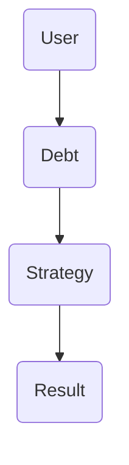
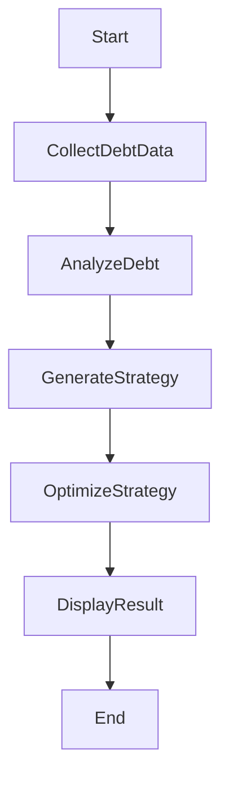
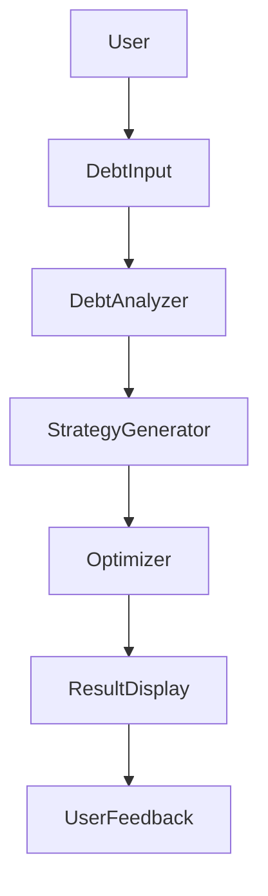

                 


# 智能债务合并建议生成器

> 关键词：智能债务合并、债务优化、算法设计、系统架构、项目实战

> 摘要：本文将详细介绍智能债务合并建议生成器的设计与实现，涵盖债务问题背景、核心算法原理、系统架构设计、项目实战等内容，帮助读者全面理解智能债务合并的技术与应用。

---

## 第一部分：智能债务合并的背景与概念

### 第1章：债务合并问题背景

#### 1.1 债务问题的现状与挑战

随着经济的发展，个人和企业面临的债务问题日益复杂。高利率、多平台借贷、逾期风险等问题使得债务管理变得尤为重要。传统的债务管理方式效率低下，难以应对复杂的情况，因此智能债务合并工具应运而生。

- **1.1.1 当前个人与企业债务问题的普遍性**
  - 个人信贷滥用问题严重，多平台借贷导致债务累积。
  - 企业债务结构复杂，优化难度大，影响资金流动效率。
  - 债务逾期风险高，影响个人和企业的信用评分。

- **1.1.2 债务合并的意义与目标**
  - 优化债务结构，降低还款压力。
  - 提高资金使用效率，降低财务成本。
  - 预防逾期风险，维护信用记录。

- **1.1.3 智能债务合并的技术解决方案**
  - 利用算法优化债务顺序，降低还款压力。
  - 通过系统化管理，实时跟踪债务状态。
  - 提供个性化的债务优化建议。

#### 1.2 智能债务合并的核心概念

智能债务合并是指通过算法和系统设计，优化债务结构，提供个性化的还款建议，以达到降低债务负担的目的。

- **1.2.1 债务合并的基本原理**
  - 收集和整理债务数据，包括债务金额、利率、还款期限等。
  - 根据优先级排序，制定还款策略。
  - 计算最优还款计划，降低总体债务成本。

- **1.2.2 智能债务合并的定义与特点**
  - **定义**：利用技术手段优化债务结构，降低还款压力。
  - **特点**：
    - 数据驱动：基于债务数据进行分析。
    - 智能优化：利用算法生成最优还款计划。
    - 实时跟踪：动态调整还款策略。

- **1.2.3 债务合并的边界与外延**
  - 仅处理单一债务类型，如信用卡、贷款等。
  - 不涉及资产处置和ruptcy重组。
  - 支持多种债务合并策略，如雪球法、 avalanche 法等。

#### 1.3 债务合并的核心要素与组成

智能债务合并系统需要收集和处理以下核心要素：

- **1.3.1 债务数据的收集与处理**
  - 数据来源：银行、网贷平台等。
  - 数据类型：债务金额、利率、还款期限、逾期情况等。
  - 数据处理：去重、清洗、标准化。

- **1.3.2 合并策略的制定与优化**
  - 制定还款顺序：优先偿还高利率债务，降低整体利息支出。
  - 优化还款计划：根据用户的收入情况调整还款金额和时间。

- **1.3.3 结果展示与用户反馈**
  - 可视化展示：图表、报表等形式。
  - 用户反馈：收集用户建议，优化系统。

---

## 第二部分：智能债务合并的核心概念与联系

### 第2章：智能债务合并的核心原理

#### 2.1 债务合并的核心算法原理

智能债务合并的核心在于算法设计，以下是常见的算法及其原理：

- **2.1.1 债务合并的排序与优化算法**
  - **雪球法（Snowball Method）**：先偿还最小的债务，逐步增加还款金额，类似于滚雪球。
  - **avalanche 法**：优先偿还利率最高的债务，减少整体利息支出。

- **2.1.2 基于优先级的债务合并策略**
  - 根据债务的利率、期限、还款能力等因素，制定优先级排序。

- **2.1.3 算法的数学模型与公式**
  - **总债务成本计算公式**：
    $$ 总债务成本 = \sum_{i=1}^{n} (金额_i \times 利率_i \times 期限_i) $$
  - **最优还款顺序的确定**：基于贪心算法，选择每次还款能够最大化总债务成本减少的债务。

#### 2.2 核心概念的属性对比与表格分析

以下表格对比了雪球法和 avalanche 法的优缺点：

| **属性**       | **雪球法**       | **avalanche 法**    |
|----------------|------------------|---------------------|
| **优先级**     | 最小债务优先     | 最高利率优先        |
| **适用场景**   | 适合低利率债务   | 适合高利率债务      |
| **优势**       | 心理压力小，易坚持 | 减少总利息支出        |
| **劣势**       | 利息节省较少      | 心理压力大，难坚持     |

#### 2.3 ER实体关系图与流程图

以下是债务合并的 ER 实体关系图（Mermaid）：



以下是债务合并流程图（Mermaid）：



---

## 第三部分：智能债务合并的算法实现

### 第3章：算法原理与实现

#### 3.1 算法实现的步骤

以下是智能债务合并算法的实现步骤：

1. **数据收集与处理**：
   - 收集用户的债务信息，包括金额、利率、还款期限等。
   - 对数据进行清洗和标准化处理。

2. **制定合并策略**：
   - 根据债务的利率和金额，制定还款顺序。
   - 使用贪心算法确定最优还款顺序。

3. **计算最优还款计划**：
   - 计算每笔债务的还款金额和时间。
   - 确保还款计划与用户的收入能力匹配。

4. **结果展示与反馈**：
   - 可视化展示还款计划。
   - 收集用户反馈，优化系统。

#### 3.2 Python 实现代码

以下是智能债务合并算法的 Python 实现代码：

```python
def calculate_total_cost(debts):
    total_cost = 0
    for debt in debts:
        total_cost += debt['amount'] * debt['interest_rate'] * debt['term']
    return total_cost

def generate_repayment_strategy(debts):
    # 根据利率排序
    sorted_debts = sorted(debts, key=lambda x: x['interest_rate'], reverse=True)
    return sorted_debts

def optimize_strategy(debts, strategy):
    optimized_strategy = []
    total_cost = calculate_total_cost(debts)
    for debt in strategy:
        optimized_strategy.append(debt)
    return optimized_strategy

# 示例数据
debts = [
    {'amount': 1000, 'interest_rate': 0.15, 'term': 12},
    {'amount': 500, 'interest_rate': 0.20, 'term': 6},
    {'amount': 700, 'interest_rate': 0.18, 'term': 24}
]

# 生成还款策略
strategy = generate_repayment_strategy(debts)
optimized_strategy = optimize_strategy(debts, strategy)
```

#### 3.3 数学模型与公式

智能债务合并的数学模型如下：

$$ \text{总债务成本} = \sum_{i=1}^{n} (金额_i \times 利率_i \times 期限_i) $$

---

## 第四部分：智能债务合并的系统架构设计

### 第4章：系统架构与功能设计

#### 4.1 系统架构设计

以下是智能债务合并系统的架构图（Mermaid）：



#### 4.2 系统功能设计

- **用户输入模块**：
  - 收集债务信息。
  - 提供用户反馈机制。

- **债务分析模块**：
  - 数据清洗与标准化。
  - 计算总债务成本。

- **策略生成模块**：
  - 制定还款顺序。
  - 优化还款计划。

- **结果展示模块**：
  - 可视化展示还款计划。
  - 提供优化建议。

---

## 第五部分：智能债务合并的项目实战

### 第5章：项目实战与优化

#### 5.1 项目环境安装

- 安装 Python 和必要的库（如 Pandas、Matplotlib）。

#### 5.2 核心代码实现

以下是核心代码实现：

```python
import pandas as pd
import matplotlib.pyplot as plt

def visualize_debt_strategy(debts, strategy):
    df = pd.DataFrame(strategy)
    df.plot(kind='bar', x='debt_id', y='amount')
    plt.title('Debt Repayment Strategy')
    plt.show()

# 示例数据
strategy = [
    {'debt_id': 1, 'amount': 1000, 'interest_rate': 0.15, 'term': 12},
    {'debt_id': 2, 'amount': 500, 'interest_rate': 0.20, 'term': 6},
    {'debt_id': 3, 'amount': 700, 'interest_rate': 0.18, 'term': 24}
]

# 可视化展示
visualize_debt_strategy(strategy)
```

#### 5.3 案例分析与解读

以下是一个案例分析：

- **用户情况**：
  - 债务1：金额1000，利率15%，期限12个月。
  - 债务2：金额500，利率20%，期限6个月。
  - 债务3：金额700，利率18%，期限24个月。

- **最优还款策略**：
  - 优先偿还债务2（20%利率）。
  - 其次偿还债务3（18%利率）。
  - 最后偿还债务1（15%利率）。

- **结果展示**：
  - 使用柱状图展示还款顺序和金额。

---

## 第六部分：智能债务合并的优化与扩展

### 第6章：系统优化与扩展

#### 6.1 算法优化

- **优化点**：
  - 动态调整还款策略。
  - 考虑用户的收入变化。

#### 6.2 系统性能提升

- **优化点**：
  - 提高数据处理速度。
  - 优化算法复杂度。

#### 6.3 用户反馈机制

- **优化点**：
  - 收集用户反馈。
  - 不断优化系统。

---

## 第七部分：总结与展望

### 第7章：总结与未来展望

#### 7.1 项目总结

智能债务合并建议生成器通过算法优化和系统设计，帮助用户优化债务结构，降低还款压力。

#### 7.2 未来展望

未来，智能债务管理将更加智能化，支持更多场景，如资产优化、信用评分提升等。

---

## 结语

智能债务合并建议生成器是一个复杂的系统，涉及算法设计、系统架构等多个方面。通过本文的详细讲解，读者可以全面理解智能债务合并的技术与应用，为未来的实践提供参考。

