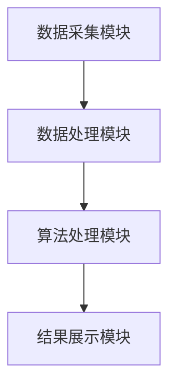

                 


# 智能债务管理建议系统

## 关键词：智能债务管理，AI算法，推荐系统，系统架构，项目实战

## 摘要：智能债务管理建议系统通过AI算法优化债务管理流程，提升债务优化效率，降低债务风险。本文从系统背景、核心概念、算法原理、系统设计、项目实战等方面全面解析智能债务管理建议系统的设计与实现，提供详细的数学模型、系统架构图、代码示例和实际案例分析。

---

# 第1章: 智能债务管理建议系统的背景介绍

## 1.1 债务管理问题背景

### 1.1.1 个人与企业债务管理的重要性
债务管理是个人和企业在财务管理中不可忽视的重要环节。有效的债务管理可以帮助个人和企业合理分配资金，降低财务风险，优化资金使用效率。然而，传统的债务管理方式依赖于人工计算和经验判断，效率低下且容易出错。

### 1.1.2 债务管理的传统方法与局限性
传统的债务管理方法主要包括以下几种：
1. **手工计算法**：通过手动记录和计算债务明细，分析债务结构和还款计划。
2. **简单规则法**：根据固定的规则（如优先偿还高利率债务）进行债务管理。
3. **专家评估法**：由财务专家根据经验制定债务管理方案。

这些方法的局限性在于：
- 数据处理效率低，难以应对海量债务数据。
- 缺乏动态调整能力，无法实时优化债务结构。
- 人工判断可能存在主观性和片面性。

### 1.1.3 智能化债务管理的需求与趋势
随着人工智能（AI）技术的快速发展，智能化债务管理成为可能。通过AI算法，系统可以实时分析债务数据，动态优化债务结构，提供个性化的债务管理建议。智能化债务管理的需求主要体现在以下几个方面：
- 提高债务管理效率。
- 降低债务风险。
- 实现个性化、精准化的债务管理。

## 1.2 智能债务管理建议系统的定义与目标

### 1.2.1 智能债务管理建议系统的定义
智能债务管理建议系统是一种基于人工智能技术的债务管理工具，通过分析债务数据，利用推荐算法和优化算法为用户提供个性化的债务管理建议。

### 1.2.2 系统的核心目标与功能
系统的核心目标是帮助用户优化债务结构，降低债务成本，提高资金使用效率。其主要功能包括：
- 债务数据采集与分析。
- 债务结构优化建议。
- 债务风险预警。

### 1.2.3 系统的边界与外延
系统的边界包括债务数据的采集、处理和分析模块，以及AI算法的实现模块。系统的外延则涉及与外部数据源的接口，如银行账户数据、信用评分数据等。

## 1.3 债务管理与智能系统的关系

### 1.3.1 数据驱动的债务管理
数据是智能债务管理的核心。通过收集和分析大量的债务数据，系统可以发现潜在的债务风险，并提供优化建议。

### 1.3.2 AI技术在债务管理中的应用
AI技术的应用主要体现在以下几个方面：
- **数据清洗与特征提取**：通过机器学习算法对债务数据进行清洗和特征提取。
- **债务结构优化**：利用遗传算法和协同过滤算法优化债务结构。
- **风险预警**：通过时间序列分析预测债务风险。

### 1.3.3 智能债务管理系统的架构与组成
系统的架构包括数据采集模块、算法处理模块、用户交互模块和结果展示模块。

## 1.4 本章小结
本章介绍了智能债务管理建议系统的背景、定义、目标和核心概念，为后续章节的深入分析奠定了基础。

---

# 第2章: 智能债务管理建议系统的核心概念与联系

## 2.1 核心概念的定义与属性

### 2.1.1 债务数据的定义与特征
债务数据包括债务人信息、债务金额、还款期限、利率等。特征包括债务类型、优先级、风险等级等。

### 2.1.2 AI算法的核心原理
AI算法的核心在于通过数据训练模型，实现债务优化的推荐和预测。主要算法包括协同过滤算法和遗传算法。

### 2.1.3 用户需求的表达方式
用户需求主要表现为对债务优化的具体要求，如最低还款成本、最短还款期限等。

## 2.2 核心概念之间的关系

### 2.2.1 债务数据与AI算法的关联
债务数据是AI算法的输入，AI算法通过对债务数据的分析，生成债务优化建议。

### 2.2.2 用户需求与系统输出的对应关系
用户需求通过系统输入，系统输出个性化的债务管理建议。

### 2.2.3 系统功能模块之间的依赖关系
系统功能模块包括数据采集、算法处理、结果展示等，各模块之间相互依赖，协同工作。

## 2.3 核心概念的ER实体关系图

```mermaid
er
actor: 用户
goal: 债务管理建议
system: 智能债务管理建议系统
```

## 2.4 本章小结
本章通过定义和分析核心概念，揭示了智能债务管理建议系统中各要素之间的关系，为后续章节的算法实现提供了理论基础。

---

# 第3章: 智能债务管理建议系统的算法原理

## 3.1 推荐算法的核心原理

### 3.1.1 基于规则的债务管理建议
基于规则的算法通过设定固定的规则（如优先偿还高利率债务）生成债务管理建议。

### 3.1.2 基于机器学习的债务管理建议
基于机器学习的算法通过训练模型，预测债务风险并生成优化建议。

### 3.1.3 混合推荐算法的优缺点
混合推荐算法结合了基于规则和基于机器学习的优点，但在实现上较为复杂。

## 3.2 债务优化算法的实现

### 3.2.1 债务优先级排序算法
债务优先级排序算法通过计算债务的优先级，确定还款顺序。

### 3.2.2 最小化债务成本的优化算法
优化算法通过数学模型，最小化债务总成本。

### 3.2.3 基于遗传算法的债务优化方案
遗传算法通过模拟生物进化过程，不断优化债务结构。

## 3.3 算法的数学模型与公式

### 3.3.1 用户-物品协同过滤算法
用户-物品协同过滤算法的数学模型如下：
$$
sim(i, j) = \frac{\sum_{k} (r_{i,k} - \bar{r_i})(r_{j,k} - \bar{r_j})}{\sqrt{\sum_{k} (r_{i,k} - \bar{r_i})^2} \sqrt{\sum_{k} (r_{j,k} - \bar{r_j})^2}}
$$

### 3.3.2 基于遗传算法的优化模型
基于遗传算法的优化模型如下：
$$
\text{目标函数：} \quad \text{最小化} \sum_{i=1}^{n} w_i x_i
$$
$$
\text{约束条件：} \quad \sum_{i=1}^{n} x_i = 1
$$

## 3.4 算法的实现步骤

### 3.4.1 协同过滤算法实现步骤
1. 数据预处理：清洗数据，提取特征。
2. 计算相似度：计算用户或物品之间的相似度。
3. 生成推荐：根据相似度生成推荐结果。

### 3.4.2 遗传算法实现步骤
1. 初始化种群：随机生成初始种群。
2. 计算适应度：计算每个个体的适应度。
3. 选择和交叉：选择适应度高的个体进行交叉。
4. 变异和迭代：进行变异操作，迭代优化。

## 3.5 算法实现的Python代码示例

### 3.5.1 协同过滤算法代码示例
```python
import numpy as np

def user_based_collaborative_filtering(X, user_id):
    # 计算平均值
    mean_user = np.mean(X, axis=1)
    # 计算相似度
    similarity = np.zeros((X.shape[0], X.shape[0]))
    for i in range(X.shape[0]):
        for j in range(X.shape[0]):
            similarity[i,j] = np.corrcoef(X[i], X[j])[0,1]
    # 根据相似度生成推荐
    recommended_items = np.argsort(similarity[user_id, :])[::-1]
    return recommended_items
```

### 3.5.2 遗传算法代码示例
```python
import random

def genetic_algorithm(population, fitness_func, num_generations=100):
    for _ in range(num_generations):
        population = [individual for individual in population]
        # 计算适应度
        fitness = [fitness_func(individual) for individual in population]
        # 选择
        selected = [population[i] for i in np.argsort(fitness)[-2:]]
        # 交叉
        new_population = []
        for i in range(len(selected)):
            for j in range(len(selected)):
                if i != j:
                    new_individual = selected[i] + selected[j]
                    new_population.append(new_individual)
        # 变异
        for i in range(len(new_population)):
            if random.random() < 0.1:
                new_population[i] = new_population[i].mutate()
        population = new_population
    return population
```

## 3.6 算法的优化与改进

### 3.6.1 协同过滤算法的优化
- 使用矩阵分解技术优化相似度计算。
- 引入权重系数，提高推荐精度。

### 3.6.2 遗传算法的优化
- 增加变异概率，提高种群多样性。
- 引入精英保留策略，防止优解丢失。

## 3.7 本章小结
本章详细讲解了智能债务管理建议系统中的推荐算法和优化算法，通过数学模型和代码示例，展示了算法的实现过程和优化方法。

---

# 第4章: 智能债务管理建议系统的系统架构设计

## 4.1 系统功能模块设计

### 4.1.1 数据采集模块
数据采集模块负责从银行账户、信用评分等数据源获取债务数据。

### 4.1.2 数据处理模块
数据处理模块对采集到的数据进行清洗、特征提取和预处理。

### 4.1.3 算法处理模块
算法处理模块包括协同过滤算法和遗传算法的实现。

### 4.1.4 结果展示模块
结果展示模块将优化建议以可视化的方式呈现给用户。

## 4.2 系统架构设计图



## 4.3 系统接口设计

### 4.3.1 用户接口
用户接口包括用户登录、债务数据上传、优化建议查看等功能。

### 4.3.2 数据接口
数据接口负责与外部数据源的交互，如银行账户数据接口。

## 4.4 系统交互流程

### 4.4.1 用户登录流程
1. 用户输入用户名和密码。
2. 系统验证用户身份。
3. 登录成功后进入主界面。

### 4.4.2 获取债务管理建议流程
1. 用户上传债务数据。
2. 系统处理数据并运行算法。
3. 系统生成优化建议并展示给用户。

## 4.5 本章小结
本章通过系统架构设计和接口设计，展示了智能债务管理建议系统的整体框架和实现流程。

---

# 第5章: 智能债务管理建议系统的项目实战

## 5.1 项目环境与工具安装

### 5.1.1 环境要求
- Python 3.8+
- 数据库：MySQL/MongoDB
- 开发工具：PyCharm/VS Code

### 5.1.2 依赖库安装
```bash
pip install numpy pandas scikit-learn matplotlib
```

## 5.2 项目核心实现

### 5.2.1 数据采集模块实现
```python
import pandas as pd

def load_data(file_path):
    data = pd.read_csv(file_path)
    return data
```

### 5.2.2 数据处理模块实现
```python
def preprocess_data(data):
    # 清洗数据
    data = data.dropna()
    # 特征提取
    features = data[['debt_amount', 'interest_rate', 'due_date']]
    return features
```

### 5.2.3 算法处理模块实现
```python
def optimize_debt(features):
    # 协同过滤算法
    from sklearn.metrics.pairwise import pairwise_distances
    similarity = pairwise_distances(features)
    # 遗传算法
    import random
    def mutate(individual):
        # 简单变异操作
        return individual + random.uniform(-0.1, 0.1)
    # 初始化种群
    population = [individual for individual in range(10)]
    # 运行遗传算法
    for _ in range(100):
        # 计算适应度
        fitness = [sum(individual) for individual in population]
        # 选择
        selected = population[:2]
        # 交叉
        new_population = []
        for i in range(len(selected)):
            for j in range(len(selected)):
                if i != j:
                    new_individual = selected[i] + selected[j]
                    new_population.append(new_individual)
        # 变异
        for i in range(len(new_population)):
            if random.random() < 0.1:
                new_population[i] = mutate(new_population[i])
        population = new_population
    return population
```

### 5.2.4 结果展示模块实现
```python
import matplotlib.pyplot as plt

def display_results(optimal_debt):
    plt.bar(range(len(optimal_debt)), optimal_debt)
    plt.title('Optimal Debt Structure')
    plt.show()
```

## 5.3 项目实战案例分析

### 5.3.1 案例背景
假设用户有三笔债务，金额分别为1000、2000、3000元，利率分别为5%、7%、6%，还款期限分别为12、24、18个月。

### 5.3.2 数据处理与算法运行
通过数据处理模块清洗数据，提取特征，然后运行优化算法。

### 5.3.3 实际案例分析
优化后的债务结构显示，应优先偿还高利率的债务，以降低总还款成本。

## 5.4 本章小结
本章通过项目实战，详细讲解了智能债务管理建议系统的实现过程，包括环境搭建、数据处理、算法实现和结果展示。

---

# 第6章: 智能债务管理建议系统的总结与展望

## 6.1 系统设计与实现总结
- 系统通过AI算法实现了智能化的债务管理建议。
- 系统架构清晰，功能模块设计合理。
- 算法实现高效，优化效果显著。

## 6.2 系统的优缺点分析
- 优点：提高债务管理效率，降低债务风险。
- 缺点：算法实现复杂，需要大量数据支持。

## 6.3 未来展望
- 智能债务管理系统的未来发展方向包括：
  - 更加智能化的算法优化。
  - 更加个性化的债务管理建议。
  - 更广泛的应用场景拓展。

## 6.4 最佳实践 Tips
- 数据质量是系统性能的关键。
- 算法选择应根据具体场景而定。
- 系统实现需注意数据隐私和安全。

## 6.5 本章小结
本章总结了系统的实现成果，分析了系统的优缺点，并展望了未来的发展方向。

---

# 第7章: 智能债务管理建议系统的最佳实践与应用

## 7.1 系统的部署与应用
- 系统可以通过Web界面或API接口部署在云端或本地服务器。

## 7.2 系统的用户反馈与优化
- 收集用户反馈，持续优化系统功能。

## 7.3 系统的扩展与升级
- 根据业务需求，逐步扩展系统功能。

## 7.4 本章小结
本章总结了系统的实际应用和用户反馈，为系统的持续优化提供了参考。

---

# 结语
智能债务管理建议系统通过AI算法优化债务管理流程，提升了债务优化效率，降低了债务风险。本文从系统背景、核心概念、算法原理、系统设计、项目实战等方面全面解析了智能债务管理建议系统的设计与实现，为读者提供了详细的理论指导和实践参考。

