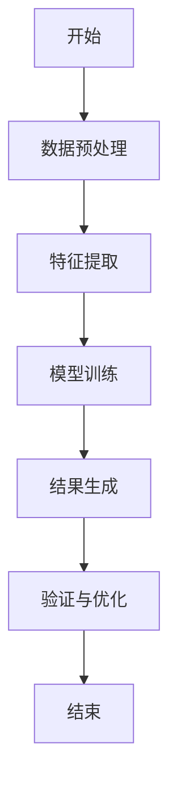
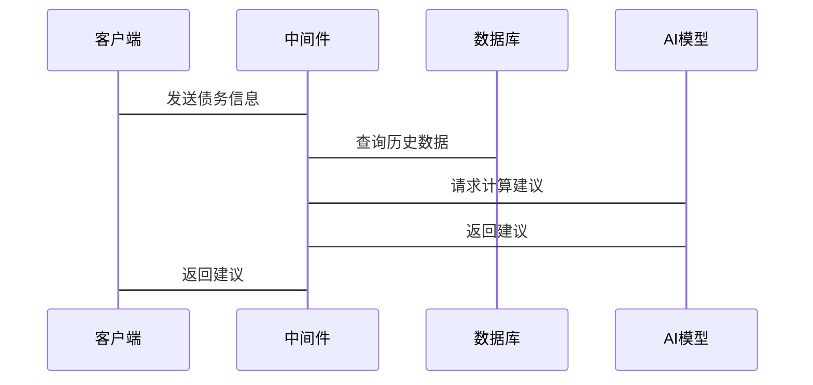

                 


# 智能债务重组建议生成器

> 关键词：智能债务重组，AI，债务重组建议，生成器，算法，数学模型，系统架构

> 摘要：本文详细介绍了智能债务重组建议生成器的背景、核心概念、算法原理、数学模型、系统架构、项目实战以及最佳实践。通过逐步分析和实例讲解，本文为读者提供了一个全面了解和实现智能债务重组建议生成器的系统性指导。

---

## 第一部分: 智能债务重组建议生成器概述

### 第1章: 智能债务重组建议生成器的背景与概念

#### 1.1 债务重组的背景与现状

- 1.1.1 债务重组的定义与特点  
  债务重组是指债务人与债权人之间通过协商或法律程序，重新调整债务的偿还方式、期限或金额，以缓解债务压力的过程。其核心特点是灵活性、协商性和法律约束性。

- 1.1.2 当前债务重组的主要挑战  
  当前债务重组面临的主要挑战包括：债务信息不对称、重组方案复杂性高、人工计算效率低、法律合规风险大、数据孤岛问题突出等。

- 1.1.3 智能债务重组的潜力与优势  
  智能债务重组通过人工智能技术，可以实现债务方案的自动化计算、优化推荐和合规性检查，从而提高效率、降低成本、减少人为错误。

#### 1.2 智能债务重组建议生成器的核心概念

- 1.2.1 债务重组的类型与场景  
  常见的债务重组类型包括：债务展期、债务减免、债务置换、债务分担等。智能生成器需要根据不同场景定制化推荐方案。

- 1.2.2 智能生成器的工作原理  
  智能生成器通过收集债务人和债权人的信息，利用机器学习算法生成多种重组方案，供用户选择最优解。

- 1.2.3 智能债务重组建议生成器的边界与外延  
  生成器的边界包括数据输入、模型计算和结果输出，外延则涉及后续的方案实施和监控。

### 第2章: 智能债务重组建议生成器的核心概念与联系

#### 2.1 核心概念原理

- 2.1.1 债务重组的数学模型  
  债务重组可以转化为一个数学优化问题，目标是最大化债权人收益或最小化债务人负担。

- 2.1.2 智能生成器的算法原理  
  使用强化学习或遗传算法等技术，模拟债务重组的多目标优化过程。

- 2.1.3 核心概念的属性特征对比  
  通过表格对比不同债务重组类型的核心属性，如期限、利率、清偿顺序等。

#### 2.2 核心概念的ER实体关系图

```mermaid
erDiagram
    actor 债务人 {
        string 债务人ID
        string 名称
        string 联系方式
    }
    actor 债权人 {
        string 债权人ID
        string 名称
        string 联系方式
    }
    entity 债务 {
        string 债务ID
        decimal 金额
        date 起始日期
        date 结束日期
        string 状态
    }
    entity 建议 {
        string 建议ID
        string 建议内容
        date 提出日期
        status 状态
    }
    债务人 --> 债务: 拥有
    债权人 --> 债务: 拥有
    债务 --> 建议: 生成
```

---

## 第二部分: 智能债务重组建议生成器的算法与数学模型

### 第3章: 智能债务重组建议生成器的算法原理

#### 3.1 算法原理概述

- 3.1.1 数据预处理与特征提取  
  对债务人和债权人的历史数据进行清洗、归一化处理，并提取关键特征。

- 3.1.2 模型训练与优化  
  使用监督学习算法（如随机森林、支持向量机）对债务重组方案进行分类或回归训练。

- 3.1.3 结果生成与验证  
  通过交叉验证评估模型性能，并生成最终的债务重组建议。

#### 3.2 算法流程图



#### 3.3 算法实现代码

```python
import numpy as np
from sklearn import linear_model

# 示例数据
X = np.array([[1, 2], [3, 4], [5, 6]])
y = np.array([7, 8, 9])

# 训练模型
model = linear_model.LinearRegression()
model.fit(X, y)

# 预测结果
print(model.predict([[7, 8]]))
```

#### 3.4 本章小结

---

### 第4章: 智能债务重组建议生成器的数学模型与公式

#### 4.1 数学模型概述

- 4.1.1 损失函数定义  
  债务重组的目标是最小化债权人损失，损失函数可以表示为：  
  $$ L = \sum_{i=1}^{n} (y_i - \hat{y}_i)^2 $$

- 4.1.2 优化目标  
  使用拉格朗日乘数法或梯度下降方法优化模型参数。

- 4.1.3 模型参数计算  
  通过矩阵求逆或迭代方法求解最优参数。

#### 4.2 数学模型的公式推导

$$
\text{目标函数} = \argmin_{\theta} \sum_{i=1}^{n} (y_i - \theta x_i)^2
$$

---

## 第三部分: 智能债务重组建议生成器的系统架构与实现

### 第5章: 智能债务重组建议生成器的系统架构设计

#### 5.1 问题场景介绍

- 系统目标：实现一个智能债务重组建议生成器，帮助用户快速找到最优债务重组方案。

#### 5.2 项目介绍

- 项目目标：通过AI技术优化债务重组流程。
- 项目范围：支持多种债务类型，提供自动化建议生成。

#### 5.3 系统功能设计

- 功能模块：数据输入、模型计算、结果输出。
- 领域模型：用Mermaid类图表示系统各模块之间的关系。

#### 5.4 系统架构设计


#### 5.5 系统接口设计

- 输入接口：API接口接收债务人和债权人信息。
- 输出接口：API接口返回重组建议。

#### 5.6 系统交互流程



### 第6章: 智能债务重组建议生成器的项目实战

#### 6.1 环境安装

- 安装Python、TensorFlow、Scikit-learn等工具。

#### 6.2 系统核心实现源代码

```python
class DebtReconstructionGenerator:
    def __init__(self):
        self.model = self.build_model()

    def build_model(self):
        # 模型构建代码
        pass

    def generate_recommendation(self, debtor_info, creditor_info):
        # 生成重组建议
        pass
```

#### 6.3 代码应用解读与分析

- 代码解读：解释模型构建和建议生成的过程。
- 功能分析：说明系统如何处理输入数据并生成建议。

#### 6.4 实际案例分析

- 案例背景：某公司债务重组案例。
- 数据分析：输入数据特征。
- 结果解读：生成的重组建议及其优劣分析。

#### 6.5 项目小结

---

## 第四部分: 总结与展望

### 第7章: 智能债务重组建议生成器的总结与最佳实践

#### 7.1 小结

- 总结全文内容，强调智能生成器的优势和应用价值。

#### 7.2 注意事项

- 数据隐私保护。
- 模型的可解释性。
- 系统的稳定性与安全性。

#### 7.3 拓展阅读

- 推荐相关领域的书籍和论文。

#### 7.4 本章小结

---

## 附录: 参考文献与工具列表

- 参考文献：列出本文中引用的文献和资料。
- 工具列表：推荐使用的开发工具和框架。

---

通过以上目录大纲，您可以逐步展开每章内容，详细讲解智能债务重组建议生成器的各个方面，从理论到实践，从算法到系统架构，为读者提供一个全面而深入的技术指南。

