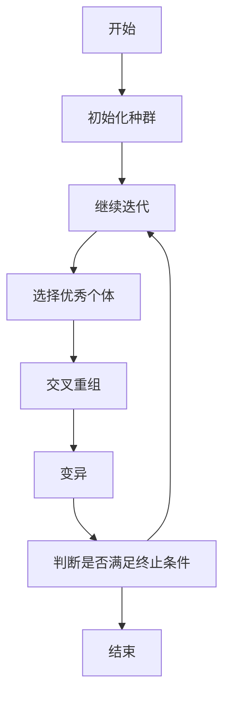
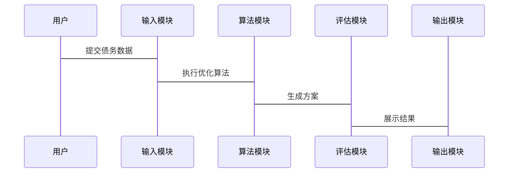

                 


# 智能债务重组方案效果模拟器

## 关键词：智能债务重组、模拟器、算法、债务优化、风险管理

## 摘要：本文详细介绍了智能债务重组方案效果模拟器的设计与实现，从背景、核心概念、算法原理到系统架构、项目实战，全面剖析了该模拟器的技术细节和实际应用价值。

---

# 第1章 智能债务重组方案效果模拟器背景介绍

## 1.1 背景介绍

### 1.1.1 企业债务重组的背景
企业在经营过程中，由于资金链断裂、市场波动或管理问题，常常面临债务重组的需求。传统的债务重组方式通常依赖人工计算和经验判断，效率低且结果可能存在偏差。

### 1.1.2 债务重组的核心问题与挑战
- **债务重组的复杂性**：涉及多方面的利益平衡，包括债权人、债务人和相关利益方。
- **传统方法的局限性**：依赖人工计算，耗时且容易出错。
- **优化目标的多样性**：需要在偿债期限、成本、风险等多个目标之间找到平衡点。

### 1.1.3 智能债务重组模拟器的必要性
智能债务重组模拟器通过自动化计算和优化算法，能够快速、准确地生成多种债务重组方案，帮助决策者优化债务结构，降低风险。

---

## 1.2 智能债务重组模拟器的定义与特点

### 1.2.1 模拟器的定义
智能债务重组模拟器是一种基于人工智能和优化算法的工具，能够根据输入的债务数据，生成多种债务重组方案，并评估每种方案的效果。

### 1.2.2 模拟器的核心特点
- **智能化**：利用机器学习和优化算法，自动计算最优解。
- **高效性**：快速生成和评估多个方案，节省时间和成本。
- **灵活性**：支持多种债务结构和优化目标。

---

## 1.3 模拟器的应用场景与边界

### 1.3.1 应用场景
- **企业债务危机处理**：帮助企业快速找到最优的债务重组方案。
- **债务优化**：在正常情况下优化债务结构，降低财务风险。
- **风险管理**：通过模拟不同情景，评估债务重组的潜在风险。

### 1.3.2 模拟器的边界与外延
- **边界**：仅处理债务重组问题，不涉及企业其他财务决策。
- **外延**：可以与其他财务工具结合使用，如现金流预测、信用评估等。

### 1.3.3 模拟器的核心要素与组成
- **输入数据**：债务相关信息，包括债务金额、期限、利率等。
- **优化目标**：如最小化偿债成本、最大化资产保留率等。
- **输出结果**：多个优化方案及其效果评估。

---

# 第2章 智能债务重组方案效果模拟器的核心概念与联系

## 2.1 核心概念

### 2.1.1 债务重组的核心要素
- **债务金额**：需要重组的债务总额。
- **债权人信息**：债权人数量、债权金额、债权期限等。
- **债务人信息**：债务人资产、现金流、信用评级等。

### 2.1.2 模拟器的算法原理
- **输入数据处理**：解析输入的债务数据。
- **优化算法应用**：使用遗传算法、模拟退火等方法生成最优方案。
- **方案评估**：根据预设目标评估每个方案的可行性。

### 2.1.3 模拟器的输入与输出
- **输入**：债务数据、优化目标。
- **输出**：多个优化方案及其效果评估。

---

## 2.2 核心概念的属性对比

### 2.2.1 模拟器与传统债务重组的对比
| 属性 | 传统方法 | 智能模拟器 |
|------|----------|------------|
| 效率 | 低       | 高         |
| 准确性 | 一般     | 高         |
| 可扩展性 | 低       | 高         |

---

## 2.3 智能债务重组模拟器的ER实体关系图

```mermaid
erDiagram
    actor 债务人 {
        key string 债务人ID
        string 公司名称
        string 法人代表
    }
    actor 债权人 {
        key string 债权人ID
        string 债权人名称
        decimal 债权金额
        date 债权到期日
    }
    entity 债务重组方案 {
        key integer 方案ID
        string 优化目标
        decimal 重组成本
        date 实施时间
    }
    debt_restructuring_simulator 和债务人通过 提交方案 关联
    debt_restructuring_simulator 和债权人通过 获取债权信息 关联
    debt_restructuring_simulator 和债务重组方案通过 生成方案 关联
```

---

# 第3章 智能债务重组方案效果模拟器的算法原理

## 3.1 算法概述

### 3.1.1 算法的核心思想
智能债务重组模拟器通常采用**遗传算法（GA）**或**模拟退火算法（SA）**，通过迭代优化找到最优解。

---

## 3.2 算法的数学模型与公式

### 3.2.1 债务重组的数学模型
假设我们有 $n$ 个债权人，每个债权人有债权金额 $A_i$ 和期限 $T_i$。我们的目标是最小化总偿债成本，同时满足所有债权人的偿债要求。

目标函数：
$$
\min \sum_{i=1}^{n} C_i
$$

约束条件：
$$
\sum_{i=1}^{n} A_i \leq 总资产
$$
$$
T_i \leq 最大期限
$$

### 3.2.2 算法的流程



---

## 3.3 算法的实现与优化

### 3.3.1 算法的实现步骤
1. 初始化种群：生成随机的债务重组方案。
2. 计算适应度：评估每个方案的优劣。
3. 选择优秀个体：保留适应度高的方案。
4. 交叉重组：生成新的方案。
5. 变异：随机调整部分方案参数。
6. 迭代优化：重复上述步骤直到满足终止条件。

### 3.3.2 优化策略
- **局部搜索优化**：在遗传算法中加入局部搜索步骤，进一步优化解。
- **动态适应度计算**：根据实时市场数据动态调整适应度函数。

---

# 第4章 智能债务重组方案效果模拟器的系统分析与架构设计

## 4.1 项目背景与目标

### 4.1.1 项目背景
企业债务重组是一个复杂的系统性问题，需要结合多方面的信息进行决策。

### 4.1.2 项目目标
- 提供高效的债务重组方案生成工具。
- 支持多种优化目标和约束条件。

---

## 4.2 系统功能设计

### 4.2.1 功能模块划分
- **输入模块**：接收债务数据和优化目标。
- **算法模块**：执行优化算法生成方案。
- **评估模块**：评估方案的可行性和效果。
- **输出模块**：展示优化方案和结果。

### 4.2.2 系统架构设计


---

## 4.3 接口与交互设计

### 4.3.1 接口设计
- **输入接口**：提供债务数据和优化目标的输入方式。
- **输出接口**：展示优化方案和评估结果。

### 4.3.2 交互设计



---

# 第5章 项目实战

## 5.1 环境安装

### 5.1.1 安装Python
安装Python 3.8及以上版本。

### 5.1.2 安装依赖
安装numpy、pandas、scipy等库：
```bash
pip install numpy pandas scipy
```

---

## 5.2 核心代码实现

### 5.2.1 算法实现
以下是一个简单的遗传算法实现：

```python
import numpy as np

def fitness(solution):
    # 计算适应度，这里简化为总成本
    return sum(solution['cost'])

def mutate(solution, mutation_rate=0.1):
    # 突变操作
    for i in range(len(solution['variables'])):
        if np.random.random() < mutation_rate:
            solution['variables'][i] *= np.random.uniform(0.9, 1.1)
    return solution

def crossover(solution1, solution2):
    # 交叉操作
    new_solution = {'variables': []}
    for var1, var2 in zip(solution1['variables'], solution2['variables']):
        if np.random.random() < 0.5:
            new_solution['variables'].append(var1)
        else:
            new_solution['variables'].append(var2)
    return new_solution

# 初始化种群
population = [{'variables': np.random.rand(3), 'cost': fitness({'variables': np.random.rand(3)})} for _ in range(10)]

# 迭代优化
for _ in range(100):
    # 计算适应度
    for sol in population:
        sol['cost'] = fitness(sol)
    
    # 选择
    population.sort(key=lambda x: x['cost'])
    selected = population[:5]
    
    # 交叉和突变
    new_population = []
    for _ in range(5):
        sol1 = selected[np.random.randint(5)]
        sol2 = selected[np.random.randint(5)]
        new_sol = crossover(sol1, sol2)
        new_sol = mutate(new_sol)
        new_population.append(new_sol)
    population = new_population + selected
```

---

## 5.3 案例分析

### 5.3.1 案例背景
假设某企业有3个债权人，债权金额分别为100万、200万和150万，期限分别为2年、3年和2年。

### 5.3.2 方案生成与评估
运行上述代码，生成多个方案，评估哪个方案的总成本最低。

---

## 5.4 项目总结

### 5.4.1 实践收获
通过实战，我们掌握了智能债务重组模拟器的核心算法和实现方法。

### 5.4.2 经验总结
- 算法的选择和参数设置对结果影响较大。
- 系统设计需要考虑数据输入和输出的兼容性。

---

# 第6章 最佳实践、小结与注意事项

## 6.1 最佳实践 tips

### 6.1.1 算法优化建议
- 根据具体问题调整算法参数。
- 结合实际情况选择合适的优化算法。

### 6.1.2 系统设计建议
- 确保系统可扩展性。
- 优化数据处理效率。

---

## 6.2 小结

智能债务重组模拟器通过自动化算法，能够高效、准确地生成优化方案，帮助企业降低债务风险，提升财务健康度。

---

## 6.3 注意事项

### 6.3.1 数据输入的准确性
确保输入数据的准确性和完整性。

### 6.3.2 算法的适用性
根据具体问题选择合适的算法和模型。

### 6.3.3 结果的可解释性
确保优化方案的透明性和可解释性。

---

## 6.4 拓展阅读

### 6.4.1 推荐书籍
- 《算法导论》
- 《机器学习实战》

### 6.4.2 推荐工具
- Python的scipy.optimize模块
- 基于机器学习的债务重组工具

---

通过本文的详细讲解，我们全面了解了智能债务重组方案效果模拟器的设计与实现，希望对读者在实际应用中有一定的启发和帮助。

