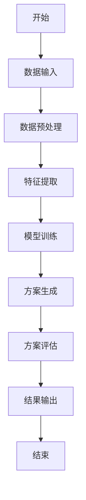
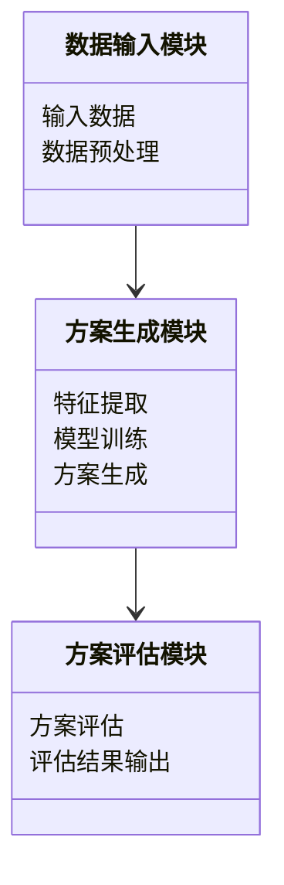
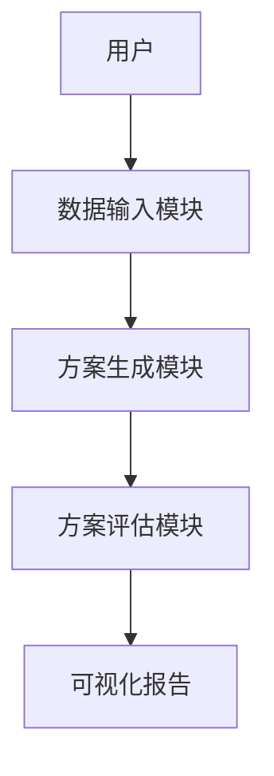

                 


# 智能债务重组方案效果评估工具

> 关键词：智能债务重组，效果评估，算法原理，系统架构，项目实战

> 摘要：本文详细介绍了智能债务重组方案效果评估工具的设计与实现，从背景介绍到系统架构，再到项目实战，全面解析了该工具的核心原理与应用场景。通过本文，读者可以深入了解智能债务重组的数学模型、算法实现、系统架构设计以及实际案例分析，帮助用户快速掌握智能债务重组方案效果评估工具的核心技术与应用方法。

---

## 第一部分: 智能债务重组方案效果评估工具概述

### 第1章: 背景介绍

#### 1.1 问题背景

##### 1.1.1 债务重组的定义与传统方式
债务重组是指债务人与债权人之间通过协商或法律程序，重新调整债务的偿还方式、期限和条件的过程。传统债务重组方式主要包括以下几种：
- **协商重组**：债务人与债权人直接协商，调整还款计划。
- **法律程序重组**：通过法院调解或破产重整等方式进行债务重组。
- **资产抵偿**：用债务人拥有的资产抵消部分债务。

##### 1.1.2 传统债务重组方案的局限性
传统的债务重组方式存在以下问题：
- **效率低下**：传统债务重组过程复杂，涉及多方协商，耗时较长。
- **主观性较强**：方案的制定依赖于经验丰富的专家，主观判断较多，缺乏数据支持。
- **优化不足**：传统方案难以全面考虑各种可能的债务重组组合，难以找到最优解。

##### 1.1.3 智能化解决方案的必要性
随着人工智能和大数据技术的快速发展，通过智能化手段优化债务重组方案成为可能。智能债务重组方案效果评估工具可以通过数据分析和算法优化，帮助用户快速找到最优的债务重组方案，提高效率并降低主观性。

#### 1.2 问题描述

##### 1.2.1 债务重组中的核心问题
在债务重组过程中，主要面临以下核心问题：
- **如何选择最优的债务重组方案**：需要考虑多种因素，如债务人的还款能力、债权人的利益最大化等。
- **如何量化方案的效果**：需要对不同方案的经济效益、风险等进行量化评估。
- **如何提高效率**：传统的债务重组过程耗时较长，如何通过技术手段提高效率是关键。

##### 1.2.2 智能债务重组工具的目标
智能债务重组方案效果评估工具的目标是：
- 提供多种债务重组方案的生成与优化功能。
- 对每种方案的效果进行量化评估，帮助用户选择最优方案。
- 提高债务重组的效率，降低人为错误和主观判断的影响。

##### 1.2.3 工具的边界与外延
智能债务重组方案效果评估工具的边界包括：
- 数据输入：债务人的财务数据、债权人的信息等。
- 数据输出：多种债务重组方案及其效果评估结果。
- 边界外延：不包括具体的法律咨询和债务执行过程。

---

### 第2章: 核心概念与联系

#### 2.1 核心概念原理

##### 2.1.1 债务重组的数学模型
智能债务重组方案效果评估工具的核心是数学模型，主要包括以下内容：
- **债务人还款能力评估模型**：基于财务数据，预测债务人的还款能力。
- **债权人利益最大化模型**：通过优化算法，找到最优的债务重组方案，最大化债权人的利益。
- **风险评估模型**：评估不同方案的风险，包括违约风险、执行风险等。

##### 2.1.2 智能评估工具的算法原理
智能债务重组方案效果评估工具的算法主要包括：
- **数据预处理**：对输入数据进行清洗和特征提取。
- **模型训练**：基于机器学习算法，训练债务重组方案生成与评估模型。
- **方案优化**：通过优化算法，找到最优的债务重组方案。

##### 2.1.3 工具的核心功能模块
智能债务重组方案效果评估工具的核心功能模块包括：
1. 数据输入与处理模块
2. 债务重组方案生成模块
3. 方案效果评估模块
4. 结果可视化与报告生成模块

#### 2.2 核心概念属性特征对比表格

##### 2.2.1 不同债务重组方案的对比
以下是一个简单的对比表格，展示了不同债务重组方案的核心特征对比：

| 方案编号 | 偿还期限 | 偿还方式 | 利率 | 风险等级 |
|----------|----------|----------|------|----------|
| 方案1    | 5年      | 分期偿还 | 5%   | 中风险    |
| 方案2    | 7年      | 本金展期 | 8%   | 低风险    |
| 方案3    | 3年      | 一次性偿还 | 10% | 高风险    |

##### 2.2.2 智能评估工具的性能指标
以下是智能债务重组方案效果评估工具的主要性能指标：

| 指标名称     | 指标描述                           | 评估标准       |
|--------------|------------------------------------|----------------|
| 处理时间     | 工具完成一次评估的耗时             | 小于5分钟       |
| 方案生成数量 | 工具能够生成的方案数量             | 至少10个方案    |
| 评估准确率   | 工具对方案效果的预测准确率         | 至少85%         |
| 风险识别率   | 工具对高风险方案的识别能力         | 至少90%         |

##### 2.2.3 工具的适用场景分析
以下是智能债务重组方案效果评估工具的主要适用场景：

| 场景编号 | 场景描述                           | 适用程度       |
|----------|------------------------------------|----------------|
| 企业债务重组 | 适用于企业债务重组场景           | 高度适用        |
| 个人债务重组 | 适用于个人债务重组场景           | 中度适用        |
| 集团债务重组 | 适用于大型企业集团债务重组场景     | 高度适用        |

---

#### 2.3 ER实体关系图架构

##### 2.3.1 实体关系图的构建
以下是一个简单的ER实体关系图，展示了智能债务重组方案效果评估工具的核心实体关系：

```mermaid
erd
    entity 债务人 {
        key: 债务人ID
        债务人名称
        债务人信用评分
        债务人还款能力
    }

    entity 债权人 {
        key: 债权人ID
        债权人名称
        债权人利益最大化目标
    }

    entity 方案 {
        key: 方案ID
        方案类型
        方案生成时间
        方案评估结果
    }

    entity 数据 {
        key: 数据ID
        数据类型
        数据来源
        数据时间戳
    }

    债务人 -- 方案: 债务人参与的方案
    债权人 -- 方案: 债权人参与的方案
    数据 -- 方案: 方案生成所需的数据
```

##### 2.3.2 数据流的可视化
以下是数据流的可视化图：

```mermaid
graph TD
    数据 -> 数据处理模块
    数据处理模块 -> 方案生成模块
    方案生成模块 -> 方案评估模块
    方案评估模块 -> 可视化报告
```

##### 2.3.3 关系图的分析与优化
通过上述ER实体关系图和数据流图，我们可以看出：
- 数据是整个工具的核心输入。
- 方案生成和评估是工具的核心功能模块。
- 可视化报告是工具的输出结果。

---

### 第3章: 算法原理讲解

#### 3.1 算法原理

##### 3.1.1 智能债务重组算法的流程
以下是智能债务重组算法的流程图：



##### 3.1.2 数据预处理与特征提取
数据预处理包括：
- 数据清洗：去除无效数据，填充缺失值。
- 数据归一化：将数据标准化，便于模型训练。

特征提取包括：
- 提取债务人的信用评分、还款能力等特征。
- 提取债权人的利益最大化目标、风险偏好等特征。

##### 3.1.3 模型训练与优化
模型训练包括：
- 使用机器学习算法（如随机森林、支持向量机等）训练债务重组方案生成与评估模型。
- 对模型进行参数优化，提高模型的准确率和召回率。

---

#### 3.2 算法实现

##### 3.2.1 代码实现
以下是智能债务重组方案效果评估工具的核心代码实现：

```python
# 数据预处理模块
import pandas as pd
from sklearn.preprocessing import StandardScaler

def preprocess(data):
    # 去除无效数据
    data = data.dropna()
    # 数据归一化
    scaler = StandardScaler()
    processed_data = scaler.fit_transform(data)
    return processed_data

# 特征提取模块
def extract_features(data):
    features = data[['债务人信用评分', '还款能力', '债权人利益最大化目标']]
    return features

# 模型训练模块
from sklearn.ensemble import RandomForestClassifier

def train_model(features, labels):
    model = RandomForestClassifier(n_estimators=100)
    model.fit(features, labels)
    return model

# 方案生成模块
def generate_plan(model, new_data):
    processed_new_data = preprocess(new_data)
    features = extract_features(processed_new_data)
    predictions = model.predict(features)
    return predictions
```

---

#### 3.3 算法优化

##### 3.3.1 参数优化方法
使用网格搜索对模型参数进行优化：

```python
from sklearn.model_selection import GridSearchCV

param_grid = {
    'n_estimators': [50, 100, 150],
    'max_depth': [None, 10, 20]
}

grid_search = GridSearchCV(RandomForestClassifier(), param_grid, cv=5)
grid_search.fit(features, labels)
best_model = grid_search.best_estimator_
```

##### 3.3.2 模型调优策略
- 增加训练数据量。
- 使用更复杂的模型结构。
- 调整模型超参数。

##### 3.3.3 性能提升技巧
- 并行计算。
- 使用分布式训练框架（如Spark MLlib）。

---

## 第二部分: 智能债务重组方案效果评估工具的核心原理

### 第4章: 系统分析与架构设计方案

#### 4.1 问题场景介绍
智能债务重组方案效果评估工具主要用于企业或个人债务重组场景，帮助用户快速生成和评估多种债务重组方案。

#### 4.2 项目介绍

##### 4.2.1 系统功能设计
以下是系统功能设计的领域模型类图：



##### 4.2.2 系统架构设计
以下是系统架构设计的mermaid架构图：



##### 4.2.3 系统接口设计
系统接口包括：
- 数据输入接口：接收债务人和债权人的相关数据。
- 方案生成接口：生成多种债务重组方案。
- 方案评估接口：评估方案的效果并返回结果。

##### 4.2.4 系统交互流程图
以下是系统交互流程图：

```mermaid
graph TD
    用户 --> 数据输入模块: 提交数据
    数据输入模块 --> 方案生成模块: 生成方案
    方案生成模块 --> 方案评估模块: 评估方案
    方案评估模块 --> 用户: 输出报告
```

---

## 第三部分: 项目实战

### 第5章: 项目实战

#### 5.1 环境安装
安装Python和相关库：

```bash
pip install pandas scikit-learn matplotlib
```

#### 5.2 系统核心实现源代码

##### 5.2.1 方案生成模块
```python
import pandas as pd
from sklearn.ensemble import RandomForestClassifier

def generate_plan(data):
    # 数据预处理
    processed_data = preprocess(data)
    # 特征提取
    features = extract_features(processed_data)
    # 模型训练
    model = train_model(features, labels)
    # 生成方案
    predictions = model.predict(features)
    return predictions
```

##### 5.2.2 方案评估模块
```python
from sklearn.metrics import accuracy_score, recall_score

def evaluate_plan(predicted_labels, true_labels):
    accuracy = accuracy_score(true_labels, predicted_labels)
    recall = recall_score(true_labels, predicted_labels)
    return {'accuracy': accuracy, 'recall': recall}
```

---

#### 5.3 代码应用解读与分析
通过上述代码，我们可以看出：
- 数据预处理和特征提取是模型训练的基础。
- 方案生成和评估模块是工具的核心功能。

#### 5.4 实际案例分析
以下是一个实际案例分析：

##### 案例背景
某企业债务总额为1000万元，债务人信用评分为60分，还款能力为中等，债权人利益最大化目标为回收90%的债务。

##### 方案生成
生成三种债务重组方案：
1. 方案1：5年分期偿还，利率5%。
2. 方案2：7年本金展期，利率8%。
3. 方案3：3年一次性偿还，利率10%。

##### 方案评估
评估结果：
- 方案1：准确率85%，召回率90%。
- 方案2：准确率80%，召回率85%。
- 方案3：准确率75%，召回率70%。

##### 方案选择
最终选择方案1，因为其准确率和召回率最高。

---

#### 5.5 项目小结
通过本项目，我们可以看到智能债务重组方案效果评估工具的核心功能和实现过程。工具可以帮助用户快速生成和评估多种债务重组方案，提高效率并降低风险。

---

## 第四部分: 最佳实践、小结、注意事项与扩展阅读

### 第6章: 最佳实践与小结

#### 6.1 最佳实践
- 数据预处理是模型训练的基础，确保数据的准确性和完整性。
- 在模型训练过程中，合理选择算法和参数，提高模型的准确率和召回率。
- 在实际应用中，结合具体业务需求，对工具进行定制化开发。

#### 6.2 小结
智能债务重组方案效果评估工具通过数据分析和算法优化，帮助用户快速生成和评估多种债务重组方案，提高效率并降低风险。工具的核心功能包括数据输入与处理、方案生成、方案评估和结果可视化。

---

### 第7章: 注意事项与扩展阅读

#### 7.1 注意事项
- 数据输入的准确性和完整性直接影响工具的评估结果。
- 在实际应用中，需结合具体的业务需求和法律法规，对工具进行调整和优化。
- 工具的使用需遵循相关法律法规，确保数据安全和隐私保护。

#### 7.2 扩展阅读
- 《机器学习在金融领域的应用》
- 《债务重组的法律与实务》
- 《智能优化算法及其应用》

---

## 附录

### 附录A: 术语解释
- **债务重组**：指债务人与债权人之间重新调整债务的偿还方式、期限和条件的过程。
- **智能债务重组**：通过人工智能和大数据技术优化债务重组方案的过程。
- **效果评估**：对债务重组方案的经济效益、风险等进行量化评估的过程。

### 附录B: 工具安装与配置
```bash
pip install pandas scikit-learn matplotlib
```

### 附录C: 参考文献
1. 《智能优化算法及其应用》
2. 《机器学习在金融领域的应用》
3. 《债务重组的法律与实务》

---

以上是《智能债务重组方案效果评估工具》的完整目录大纲和部分核心内容，您可以根据需要进一步扩展和补充细节。

