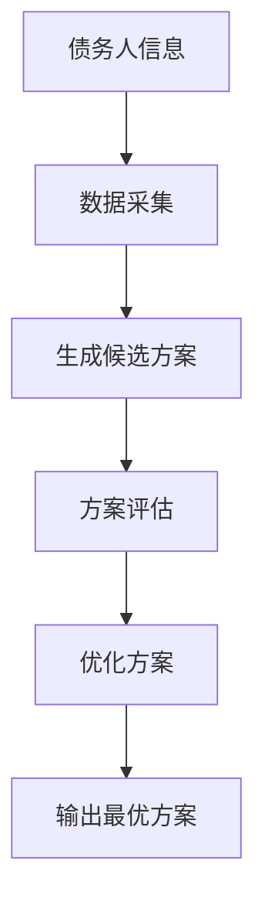
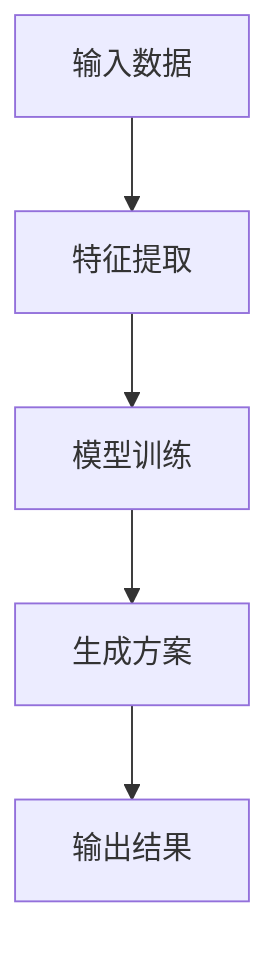
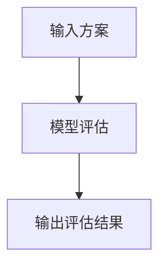
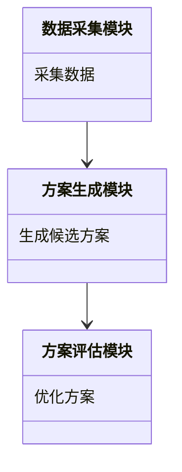
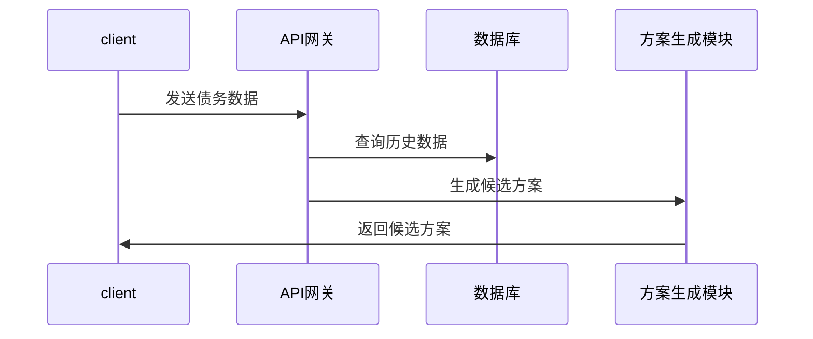

                 


# 智能债务重组方案生成与评估

> 关键词：智能债务重组，方案生成，评估系统，机器学习，数据分析

> 摘要：智能债务重组方案生成与评估系统通过整合机器学习和大数据分析技术，实现债务重组方案的智能化生成与优化。本文将详细探讨智能债务重组的核心概念、算法原理、系统设计及实际应用案例，为读者提供全面的技术解读。

---

## 第一部分: 智能债务重组方案生成与评估基础

### 第1章: 债务重组概述

#### 1.1 债务重组的基本概念

##### 1.1.1 债务重组的定义
债务重组是指通过调整债务条件、期限或金额等方式，解决债务人无法按时偿还债务的问题。传统债务重组依赖人工分析，效率低且主观性强。

##### 1.1.2 债务重组的常见场景
- 企业因经营不善或资金链断裂导致无法偿还债务。
- 债权人希望降低损失，寻找最优债务回收方案。
- 法律框架下的债务调整，如企业破产重整。

##### 1.1.3 债务重组的法律框架
不同国家和地区对债务重组有不同法律规定，通常涉及破产法、公司法等。

#### 1.2 智能债务重组的定义与优势

##### 1.2.1 智能债务重组的定义
智能债务重组是利用人工智能、大数据分析等技术，自动生成和优化债务重组方案的过程。

##### 1.2.2 智能债务重组的核心优势
- **高效性**：自动化处理大量数据，缩短债务重组周期。
- **准确性**：基于数据驱动的分析，提高方案的科学性。
- **个性化**：根据不同债务人的特点，生成定制化方案。

#### 1.3 智能债务重组的技术基础

##### 1.3.1 人工智能在债务重组中的应用
- 使用机器学习模型预测债务风险和重组效果。
- 自然语言处理技术分析财务报告和法律文件。

##### 1.3.2 大数据分析在债务重组中的作用
- 通过数据分析识别债务人财务状况中的关键问题。
- 基于历史数据优化重组方案。

##### 1.3.3 自然语言处理在债务重组中的应用
- 分析债务人提供的文本数据，提取关键信息。
- 自动生成债务重组建议书。

---

## 第2章: 智能债务重组的核心概念与联系

### 2.1 债务重组的核心要素

#### 2.1.1 债务人
- **定义**：需要进行债务重组的企业或个人。
- **属性**：财务状况、信用记录、经营能力等。

#### 2.1.2 债权人
- **定义**：持有债务的债权人，如银行、投资机构等。
- **属性**：债权金额、还款期限、债权类型等。

#### 2.1.3 债务重组方案
- **定义**：为解决债务问题而制定的具体计划。
- **属性**：还款金额、期限、利率调整等。

### 2.2 智能债务重组的核心概念

#### 2.2.1 数据驱动的债务重组
- **定义**：基于大量数据进行分析和预测。
- **优势**：提高方案的科学性和可操作性。

#### 2.2.2 智能算法在债务重组中的应用
- **生成式模型**：用于自动生成重组方案。
- **评估算法**：用于优化和评估方案的可行性。

#### 2.2.3 债务重组方案的生成与评估
- **生成**：基于输入数据，算法生成多个候选方案。
- **评估**：对每个方案进行分析，选择最优解。

### 2.3 智能债务重组的核心概念联系

#### 2.3.1 债务重组的流程图


#### 2.3.2 债务重组的核心概念属性对比表格

| 概念 | 属性         |
|------|--------------|
| 债务人 | 财务状况、信用记录 |
| 债权人 | 债权金额、还款期限 |
| 方案  | 还款金额、期限、利率 |

#### 2.3.3 债务重组的ER实体关系图
```mermaid
erd
    entity 债务人 {
        债务人ID
        公司名称
        财务状况
    }
    entity 债权人 {
        债权人ID
        债权金额
        还款期限
    }
    entity 债务重组方案 {
        方案ID
        债务人ID
        债权人ID
        还款金额
    }
    debt_mapping(债务人, 债权人, 债务重组方案)
```

---

## 第3章: 智能债务重组的算法原理

### 3.1 债务重组方案生成的算法原理

#### 3.1.1 生成式模型在债务重组中的应用
- 使用生成对抗网络（GAN）或变体模型生成多种重组方案。

#### 3.1.2 基于机器学习的债务重组方案生成
- **输入数据**：债务人和债权人的财务数据。
- **输出结果**：多个重组方案，包括还款金额、期限等。

#### 3.1.3 债务重组方案生成的数学模型
- 示例：线性回归模型预测最优还款金额。
$$ y = \beta_0 + \beta_1 x_1 + \beta_2 x_2 + \epsilon $$
其中，\( y \) 是预测的还款金额，\( x_1 \) 和 \( x_2 \) 是债务人和债权人的特征变量。

### 3.2 债务重组方案评估的算法原理

#### 3.2.1 基于规则的债务重组方案评估
- 使用预定义的规则对方案进行评估，如还款金额是否低于债务人可承受范围。

#### 3.2.2 基于机器学习的债务重组方案评估
- 使用分类模型对方案进行分类，如评估方案是否可行。

#### 3.2.3 债务重组方案评估的数学模型
- 示例：逻辑回归模型评估方案可行性。
$$ P(y=1|x) = \frac{e^{\beta_0 + \beta_1 x}}{1 + e^{\beta_0 + \beta_1 x}} $$

### 3.3 算法原理的Mermaid流程图

#### 3.3.1 债务重组方案生成的流程图


#### 3.3.2 债务重组方案评估的流程图


---

## 第4章: 智能债务重组的系统分析与架构设计方案

### 4.1 项目介绍

#### 4.1.1 项目背景
智能债务重组系统旨在解决传统债务重组效率低、人工成本高等问题。

#### 4.1.2 项目目标
- 自动生成债务重组方案。
- 优化方案以提高债务回收率。

### 4.2 系统功能设计

#### 4.2.1 系统功能模块
- 数据采集模块：收集债务人和债权人的数据。
- 方案生成模块：基于算法生成候选方案。
- 方案评估模块：对方案进行优化和评估。

#### 4.2.2 系统功能模块的Mermaid类图


### 4.3 系统架构设计

#### 4.3.1 系统架构的Mermaid架构图
```mermaid
container 客户端 {
    浏览器
}
container 服务端 {
    数据库
    API网关
}
client --> API网关
API网关 --> 数据库
```

### 4.4 系统接口设计

#### 4.4.1 接口定义
- 数据接口：提供债务人和债权人数据的输入接口。
- 方案接口：生成和评估方案的API接口。

### 4.5 系统交互的Mermaid序列图

#### 4.5.1 方案生成交互流程


---

## 第5章: 智能债务重组的项目实战

### 5.1 环境安装

#### 5.1.1 安装Python
- 使用Anaconda安装Python 3.8以上版本。

#### 5.1.2 安装必要的库
- 使用pip安装numpy、pandas、scikit-learn等库。

### 5.2 系统核心实现

#### 5.2.1 数据预处理代码
```python
import pandas as pd

# 读取数据
data = pd.read_csv('debt_data.csv')

# 数据清洗
data.dropna(inplace=True)
data['label'] = data['label'].astype(int)
```

#### 5.2.2 方案生成代码
```python
from sklearn.linear_model import LinearRegression

# 训练模型
model = LinearRegression()
model.fit(X_train, y_train)

# 预测方案
y_pred = model.predict(X_test)
```

#### 5.2.3 方案评估代码
```python
from sklearn.metrics import accuracy_score

# 评估方案
y_pred = model.predict(X_test)
accuracy = accuracy_score(y_test, y_pred)
print(f'Accuracy: {accuracy}')
```

### 5.3 代码应用解读与分析

#### 5.3.1 数据预处理
- 使用pandas进行数据清洗，确保数据质量。

#### 5.3.2 方案生成
- 使用线性回归模型生成候选方案。

#### 5.3.3 方案评估
- 使用准确率评估模型性能，优化方案。

### 5.4 实际案例分析

#### 5.4.1 案例背景
- 假设债务人A欠债权人B 100万元，还款能力有限。

#### 5.4.2 方案生成
- 系统生成多个方案，如延期一年、分期还款等。

#### 5.4.3 方案评估
- 系统评估各方案的可行性，选择最优方案。

### 5.5 项目小结

---

## 第6章: 总结与展望

### 6.1 最佳实践

#### 6.1.1 数据质量的重要性
- 确保输入数据的准确性和完整性。

#### 6.1.2 模型可解释性的优化
- 提升模型的透明度，便于用户理解和调整。

### 6.2 小结

### 6.3 注意事项

#### 6.3.1 数据隐私保护
- 注意保护债务人和债权人的隐私数据。

#### 6.3.2 模型的局限性
- 机器学习模型依赖数据质量，可能存在偏差。

### 6.4 拓展阅读

#### 6.4.1 推荐书籍
- 《机器学习实战》
- 《数据挖掘导论》

#### 6.4.2 推荐博客
- AI in Finance blog
- Data Science for Business blog

---

## 附录

### 附录A: 算法原理的详细推导

### 附录B: 系统架构设计的详细说明

### 附录C: 项目实战的代码仓库链接

---

通过以上详细的内容，您可以构建一个完整且有深度的智能债务重组方案生成与评估的技术博客文章。希望这篇博客能够为读者提供有价值的技术见解和实践指导。

