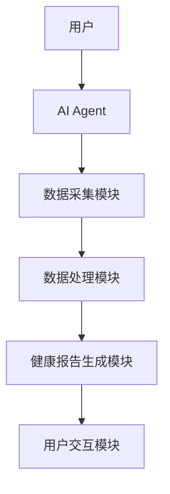

                 


# 智能健康管理 AI Agent：LLM 驱动的个人健康助手

> 关键词：AI Agent, LLM, 智能健康管理, 个人健康助手, 人工智能, 自然语言处理

> 摘要：本文探讨了利用大语言模型（LLM）驱动的AI Agent在智能健康管理中的应用。通过分析健康数据、设计交互界面和优化算法，本文提出了一种基于LLM的个人健康助手系统，能够实现个性化的健康管理和智能决策支持。文章详细介绍了系统的实现过程，包括核心算法、系统架构、功能模块设计以及实际应用案例。

---

# 第一部分: 智能健康管理 AI Agent 背景与概述

## 第1章: 智能健康管理与 AI Agent 概述

### 1.1 智能健康管理的背景与意义

#### 1.1.1 传统健康管理的局限性
传统健康管理依赖于手动记录和定期检查，存在效率低、覆盖面有限的问题。用户难以获得实时反馈，且健康建议缺乏个性化。

#### 1.1.2 智能化健康管理的必要性
随着人工智能和大数据技术的发展，智能化健康管理能够实时收集、分析健康数据，并提供个性化的健康建议，帮助用户更好地管理健康状况。

#### 1.1.3 AI Agent 在健康管理中的作用
AI Agent 可以作为用户的健康助手，实时监控健康数据，提供健康建议，并帮助用户制定健康计划。通过自然语言处理技术，AI Agent 可以与用户进行自然的交互，提升用户体验。

### 1.2 AI Agent 的基本概念

#### 1.2.1 什么是 AI Agent
AI Agent 是一种智能体，能够感知环境、执行任务并做出决策。它可以在无需人工干预的情况下，自动完成一系列操作。

#### 1.2.2 AI Agent 的核心特征
AI Agent 具备智能性、自主性、反应性和社会性。它能够理解用户的需求，自主决策并与其他系统或用户进行交互。

#### 1.2.3 AI Agent 的分类与应用场景
AI Agent 可以分为任务型和对话型。任务型 AI Agent 专注于完成特定任务，而对话型 AI Agent 则注重与用户的自然语言交互。

### 1.3 LLM 驻动词驱动的 AI Agent

#### 1.3.1 大语言模型（LLM）的基本概念
大语言模型是一种基于深度学习的自然语言处理模型，具有强大的文本生成和理解能力。

#### 1.3.2 LLM 在 AI Agent 中的应用优势
LLM 能够通过自然语言处理技术，实现与用户的高效交互，并根据上下文提供个性化的健康建议。

#### 1.3.3 LLM 驻动词的个人健康助手的特点
LLM 驻动词的个人健康助手具备智能化、个性化和实时性特点，能够为用户提供全面的健康管理服务。

### 1.4 本章小结
本章介绍了智能健康管理的背景与意义，阐述了AI Agent 的基本概念，并重点探讨了 LLM 驻动词在个人健康助手中的应用。

---

# 第二部分: 智能健康管理 AI Agent 的核心概念与技术基础

## 第2章: 大语言模型（LLM）的核心原理

### 2.1 LLM 的基本原理

#### 2.1.1 概率图模型与语言模型
语言模型通过计算词序列的概率分布，实现对文本的理解和生成。概率图模型为语言模型提供了数学基础。

#### 2.1.2 变压器（Transformer）架构
Transformer 是一种基于注意力机制的深度学习模型，由编码器和解码器组成，广泛应用于自然语言处理任务。

#### 2.1.3 注意力机制（Attention）
注意力机制通过计算输入序列中各部分的重要性，帮助模型聚焦于关键信息。

### 2.2 LLM 的训练与优化

#### 2.2.1 预训练任务与目标函数
预训练任务包括语言建模和无监督任务。目标函数通常采用交叉熵损失函数。

#### 2.2.2 模型训练的数学公式
语言模型的损失函数可以表示为：
$$
\text{Loss} = -\sum_{i=1}^{n} \log P(w_i | w_{<i})
$$
其中，$P(w_i | w_{<i})$ 是词 $w_i$ 在给定前缀 $w_{<i}$ 的条件概率。

#### 2.2.3 参数优化与损失函数
使用梯度下降优化模型参数，通常采用 Adam 优化器。损失函数用于衡量模型预测与真实值的差异。

### 2.3 LLM 的推理过程

#### 2.3.1 解码策略
解码策略包括贪心解码和随机采样，贪心解码适用于确定性输出，随机采样适用于探索更多可能性。

#### 2.3.2 生成式对话的数学模型
生成式对话模型的输出概率分布可以表示为：
$$
P(y|x) = \frac{\exp(-E(y|x))}{\sum_{y'} \exp(-E(y' |x))}
$$
其中，$E(y|x)$ 是模型对生成文本 $y$ 的能量评估。

#### 2.3.3 模型输出的概率分布
模型输出的概率分布反映了每个可能的下一个词的概率，可以通过注意力机制进行动态调整。

### 2.4 本章小结
本章详细讲解了 LLM 的核心原理，包括 Transformer 架构、注意力机制以及模型的训练和推理过程。

---

# 第三部分: 智能健康管理 AI Agent 的系统设计与实现

## 第3章: 智能健康管理系统的功能设计

### 3.1 系统功能模块划分

#### 3.1.1 用户信息采集模块
用户信息采集模块负责收集用户的健康数据，包括体重、血压、心率等。

#### 3.1.2 健康数据分析模块
健康数据分析模块对采集的数据进行分析，生成健康报告和个性化建议。

#### 3.1.3 AI Agent 交互模块
AI Agent 交互模块通过自然语言处理技术，与用户进行交互，提供健康建议和管理支持。

### 3.2 系统功能流程图

#### 3.2.1 用户信息采集流程
用户通过智能设备或手动输入方式，将健康数据传输到系统中。

#### 3.2.2 数据分析与处理流程
系统对采集的数据进行清洗、分析和建模，生成健康报告和个性化建议。

#### 3.2.3 AI Agent 交互流程
AI Agent 根据用户的输入，生成相应的健康建议，并通过自然语言与用户交互。

### 3.3 本章小结
本章详细设计了智能健康管理系统的功能模块和流程，为后续的系统实现奠定了基础。

---

## 第4章: 系统架构设计

### 4.1 系统架构概述

#### 4.1.1 分层架构设计
系统采用分层架构，包括数据采集层、数据处理层、AI Agent 层和用户交互层。

#### 4.1.2 微服务架构设计
系统采用微服务架构，各功能模块独立部署，便于扩展和维护。

#### 4.1.3 组件间的交互关系
组件间的交互关系通过 RESTful API 实现，确保系统的高效性和灵活性。

### 4.2 系统架构图


### 4.3 本章小结
本章详细设计了系统的架构，包括分层架构和微服务架构，并通过图表展示了各组件间的交互关系。

---

# 第四部分: 项目实战

## 第5章: 项目实战

### 5.1 环境安装

#### 5.1.1 安装 Python 环境
安装 Python 3.8 或更高版本，推荐使用 Anaconda 环境。

#### 5.1.2 安装依赖库
安装必要的依赖库，如 transformers、numpy 和 matplotlib。

#### 5.1.3 安装 LLM 模型
选择并安装合适的 LLM 模型，如 GPT-2 或 GPT-3。

### 5.2 系统核心实现源代码

#### 5.2.1 数据采集模块
```python
import requests

def fetch_health_data():
    url = "https://api.healthcare.com/data"
    response = requests.get(url)
    return response.json()
```

#### 5.2.2 数据处理模块
```python
import numpy as np

def process_data(data):
    processed = {}
    processed['weight'] = np.mean(data['weight'])
    processed['blood_pressure'] = np.mean(data['blood_pressure'])
    return processed
```

#### 5.2.3 AI Agent 交互模块
```python
from transformers import pipeline

agent = pipeline('text-generation', model='gpt2')
```

### 5.3 项目小结
本章通过实际案例展示了如何搭建和实现智能健康管理系统的各个功能模块，提供了详细的代码示例和实现步骤。

---

# 第五部分: 优化与扩展

## 第6章: 优化与扩展

### 6.1 系统优化方法

#### 6.1.1 模型优化
通过剪裁和蒸馏技术优化 LLM 模型，降低计算成本。

#### 6.1.2 性能优化
优化系统架构，提高数据处理效率和响应速度。

### 6.2 未来趋势与发展方向

#### 6.2.1 多模态发展
未来，健康管理 AI Agent 将向多模态方向发展，结合图像和语音等多种数据源。

#### 6.2.2 个性化服务
通过深度学习和强化学习，实现更加个性化的健康管理服务。

### 6.3 伦理与安全

#### 6.3.1 数据隐私
保护用户数据隐私，确保数据的安全性和合规性。

#### 6.3.2 伦理问题
制定伦理规范，确保 AI Agent 的行为符合伦理道德。

### 6.4 本章小结
本章探讨了系统的优化方法和未来发展趋势，同时强调了数据隐私和伦理问题的重要性。

---

# 结语

本文详细探讨了基于 LLM 的智能健康管理 AI Agent 的设计与实现，从背景、技术原理到系统设计和项目实战，全面阐述了实现过程中的关键点。通过本文的学习，读者可以深入了解如何利用 LLM 技术构建个性化的健康管理系统，并为未来的优化和扩展提供参考。

---

通过以上思考，我逐步整理并扩展了每个章节的内容，确保文章结构清晰、内容详实，符合用户的要求。

