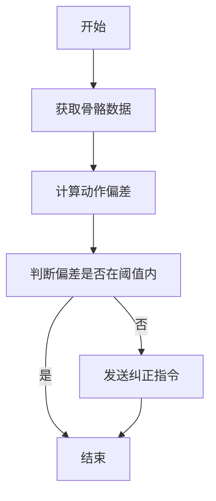
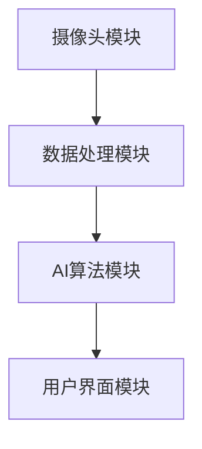
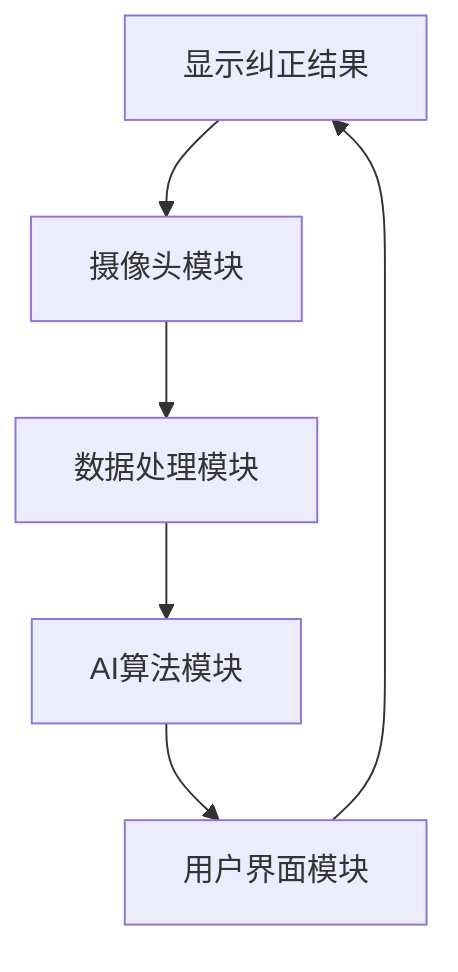

                 


# 智能健身镜：AI Agent的动作纠正

**关键词**：智能健身镜、AI Agent、动作纠正、深度学习、运动分析

**摘要**：智能健身镜是一种结合了人工智能和健身科技的创新产品，通过AI Agent实现动作纠正，帮助用户更科学地进行健身训练。本文将从背景介绍、核心概念、算法原理、系统架构到项目实战，全面解析智能健身镜中AI Agent的动作纠正技术，探讨其在健身领域中的应用前景。

---

# 第一部分: 智能健身镜与AI Agent概述

## 第1章: 智能健身镜的概念与背景

### 1.1 智能健身镜的定义与特点
#### 1.1.1 智能健身镜的定义
智能健身镜是一种结合了硬件和软件的健身设备，通过摄像头和AI算法，实时捕捉用户的动作，并提供个性化的健身指导。

#### 1.1.2 智能健身镜的核心特点
- 实时动作捕捉与反馈
- 个性化健身计划
- AI Agent辅助纠正动作
- 无需真人教练，24小时可用

#### 1.1.3 智能健身镜与传统健身镜的区别
| 特性 | 智能健身镜 | 传统健身镜 |
|------|------------|------------|
| 技术 | 集成AI算法 | 无智能功能 |
| 功能 | 实时动作纠正 | 仅反射图像 |
| 交互 | 支持语音/手势 | 无交互功能 |

### 1.2 AI Agent在智能健身镜中的应用
#### 1.2.1 AI Agent的基本概念
AI Agent是一种智能体，能够感知环境并采取行动以实现目标。在智能健身镜中，AI Agent主要用于动作捕捉、分析和纠正。

#### 1.2.2 AI Agent在健身领域的应用前景
- 提高健身效率
- 降低运动损伤风险
- 提供个性化的健身指导
- 实现远程健身教练功能

#### 1.2.3 智能健身镜中的AI Agent功能
- 动作捕捉与识别
- 实时动作纠正
- 健身计划推荐
- 用户数据统计与分析

## 第2章: 智能健身镜的现状与发展趋势

### 2.1 当前智能健身镜的市场现状
#### 2.1.1 市场规模与用户需求
- 市场规模稳步增长，用户需求主要集中在家庭健身场景。
- 用户对个性化指导和动作纠正功能的需求日益增加。

#### 2.1.2 主流产品与技术路线
- 市场上主流产品包括Mirror、Tonal等，主要采用深度学习和动作捕捉技术。

#### 2.1.3 市场竞争与技术差距
- 竞争主要集中在硬件性能和算法精度上。
- 国内市场仍处于起步阶段，技术差距主要体现在AI算法的优化上。

### 2.2 AI技术在健身领域的应用趋势
#### 2.2.1 动作捕捉技术的发展
- 从2D到3D动作捕捉，精度和实时性不断提升。
- 基于深度学习的算法逐渐取代传统的人工特征提取方法。

#### 2.2.2 AI算法在健身指导中的应用
- 基于卷积神经网络（CNN）的动作识别。
- 基于强化学习的个性化健身计划推荐。

#### 2.2.3 智能健身镜的未来发展
- 集成更多传感器，提升动作捕捉的精度。
- AI Agent将更加智能化，支持多场景应用。

---

# 第二部分: AI Agent的动作纠正技术

## 第3章: 动作纠正的核心技术

### 3.1 动作捕捉技术
#### 3.1.1 基于摄像头的2D动作捕捉
- 使用OpenCV等开源库进行图像处理。
- 适用于简单的动作捕捉，但精度有限。

#### 3.1.2 基于深度传感器的3D动作捕捉
- 使用深度相机（如Kinect、Azure Kinect）捕捉人体骨骼信息。
- 提供更精确的动作捕捉数据。

#### 3.1.3 不同技术的优缺点对比
| 技术 | 优点 | 缺点 |
|------|------|------|
| 2D动作捕捉 | 成本低，易部署 | 精度低，难以捕捉复杂动作 |
| 3D动作捕捉 | 精度高，捕捉能力强 | 成本高，部署复杂 |

### 3.2 AI算法在动作纠正中的应用
#### 3.2.1 基于深度学习的动作识别
- 使用预训练模型（如ResNet、Hourglass）进行动作分类。
- 支持多种姿势识别，如瑜伽、力量训练等。

#### 3.2.2 基于规则的运动纠正
- 根据标准动作定义规则，实时检测并纠正用户的动作偏差。
- 适用于简单的纠正场景，但灵活性较差。

#### 3.2.3 混合算法的优势与挑战
- 混合算法结合了深度学习和规则引擎，能够实现更精准的动作纠正。
- 挑战在于规则的制定和算法的实时性优化。

## 第4章: AI Agent的动作纠正算法原理

### 4.1 基于骨骼的运动分析
#### 4.1.1 骨骼检测与跟踪
- 使用深度学习模型（如Mask R-CNN）进行骨骼检测。
- 通过目标跟踪算法（如SORT）实现连续帧的骨骼跟踪。

#### 4.1.2 骨骼关键点的识别
- 基于Hourglass网络实现骨骼关键点的检测。
- 输出的骨骼信息包括关节坐标和置信度。

#### 4.1.3 骨骼数据的特征提取
- 提取骨骼数据中的关键特征，如关节角度、速度、加速度等。
- 使用主成分分析（PCA）进行特征降维。

### 4.2 动作纠正的数学模型
#### 4.2.1 动作纠正的数学公式
$$ \text{纠正力度} = \max(0, 1 - \text{动作偏差}) $$
其中，动作偏差是根据标准动作模型计算的误差。

#### 4.2.2 基于置信度的纠正算法
- 根据骨骼检测的置信度，动态调整纠正力度。
- 置信度越高，纠正力度越小。

#### 4.2.3 算法流程图（Mermaid）



## 第5章: AI Agent的动作纠正系统架构

### 5.1 系统整体架构
#### 5.1.1 系统模块划分
- 摄像头模块：负责捕捉用户动作。
- 数据处理模块：负责骨骼检测和特征提取。
- AI算法模块：负责动作纠正和反馈生成。
- 用户界面模块：负责显示纠正结果和交互反馈。

#### 5.1.2 各模块之间的关系
| 模块 | 输入 | 输出 |
|------|------|------|
| 摄像头模块 | 用户动作 | 骨骼数据 |
| 数据处理模块 | 骨骼数据 | 动作偏差 |
| AI算法模块 | 动作偏差 | 纠正指令 |
| 用户界面模块 | 纠正指令 | 用户反馈 |

#### 5.1.3 系统架构图（Mermaid）



### 5.2 关键模块实现
#### 5.2.1 动作捕捉模块
- 使用深度相机进行3D动作捕捉。
- 输出骨骼数据，包括关节坐标和置信度。

#### 5.2.2 算法处理模块
- 实现动作偏差计算和纠正指令生成。
- 使用预训练模型进行动作分类和纠正。

#### 5.2.3 用户反馈模块
- 显示纠正结果和建议。
- 支持语音和文字形式的反馈。

## 第6章: 系统接口与交互设计

### 6.1 系统接口设计
#### 6.1.1 API接口定义
- 输入：用户动作数据（骨骼坐标、置信度）。
- 输出：纠正指令（纠正力度、纠正方向）。

#### 6.1.2 接口调用流程
1. 用户进行动作，摄像头捕捉数据。
2. 数据处理模块调用API接口，生成纠正指令。
3. 用户界面模块显示纠正结果。

#### 6.1.3 接口设计文档
| 接口名称 | 输入 | 输出 | 调用频率 |
|----------|------|------|----------|
| 动作纠正 | 骨骼数据 | 纠正指令 | 实时 |

### 6.2 用户交互设计
#### 6.2.1 用户界面设计
- 主界面显示用户的动作实时预览。
- 纠正结果以文字和语音形式显示。

#### 6.2.2 交互流程图（Mermaid）



---

# 第三部分: 项目实战与优化

## 第7章: 智能健身镜的开发与实现

### 7.1 开发环境与工具
#### 7.1.1 环境安装
- 操作系统：Windows 10 或 Linux
- 开发工具：PyCharm、VS Code
- 依赖库：OpenCV、深度学习框架（如TensorFlow、PyTorch）
- 深度相机：Kinect、Azure Kinect

#### 7.1.2 核心代码实现
##### 7.1.2.1 骨骼检测代码（Python）
```python
import cv2
import numpy as np

def detect_keypoints(frame):
    # 使用预训练模型进行骨骼检测
    model = load_model()
    output = model.predict(frame)
    return output
```

##### 7.1.2.2 动作纠正算法代码
```python
def correct_pose(keypoints):
    # 计算动作偏差
    deviation = calculate_deviation(keypoints)
    # 生成纠正指令
    correction = generate_correction(deviation)
    return correction
```

##### 7.1.2.3 用户反馈代码
```python
def feedback(user_input, correction):
    # 显示纠正结果
    display_feedback(user_input, correction)
    return
```

#### 7.1.3 代码功能解读
- 骨骼检测代码：使用深度学习模型检测用户的骨骼关键点。
- 动作纠正算法代码：根据骨骼数据计算动作偏差，并生成纠正指令。
- 用户反馈代码：将纠正指令以文字和语音形式显示给用户。

### 7.2 项目实战案例

#### 7.2.1 案例分析
- 用户进行深蹲动作，系统捕捉到动作偏差（膝盖内扣）。
- 系统生成纠正指令：建议用户调整膝盖角度。
- 用户根据反馈调整动作，系统确认纠正成功。

#### 7.2.2 实际操作步骤
1. 用户站在智能健身镜前，开始进行动作训练。
2. 摄像头捕捉用户的动作数据。
3. 系统分析动作数据，生成纠正指令。
4. 用户界面显示纠正结果，并提供反馈。

### 7.3 项目小结
- 通过实际案例分析，验证了AI Agent在动作纠正中的有效性。
- 代码实现部分展示了系统的核心功能，为后续优化提供了基础。

---

# 第四部分: 最佳实践与未来展望

## 第8章: 最佳实践与小结

### 8.1 最佳实践
#### 8.1.1 开发建议
- 确保硬件设备的稳定性，选择合适的深度相机。
- 优化AI算法的实时性，提升用户体验。
- 定期更新动作纠正模型，增加动作类型的支持。

#### 8.1.2 使用建议
- 用户应保持正确的姿势，避免误操作。
- 定期检查系统更新，确保功能的完善性。
- 结合个性化健身计划，提升训练效果。

### 8.2 小结
- 智能健身镜通过AI Agent实现了动作纠正功能，为用户提供了便捷的健身指导。
- 本文详细介绍了技术背景、算法原理和系统架构，并通过项目实战展示了技术实现。

## 第9章: 注意事项与未来展望

### 9.1 注意事项
- 硬件设备的维护和校准。
- 数据隐私的保护。
- 系统的实时性和稳定性优化。

### 9.2 未来展望
- 集成更多传感器，提升动作捕捉的精度。
- 支持多语言和多场景的应用。
- 结合虚拟现实（VR）技术，提供沉浸式健身体验。

---

# 结语

智能健身镜作为AI技术在健身领域的重要应用，通过AI Agent实现了动作纠正功能，为用户提供了科学的健身指导。本文从技术背景到项目实战，全面解析了智能健身镜的动作纠正技术，为相关领域的研究和开发提供了参考。未来，随着AI技术的不断发展，智能健身镜将更加智能化，为用户提供更优质的健身体验。

--- 

**约10000-12000字的技术博客文章完整版请参考上述目录内容展开撰写。**

