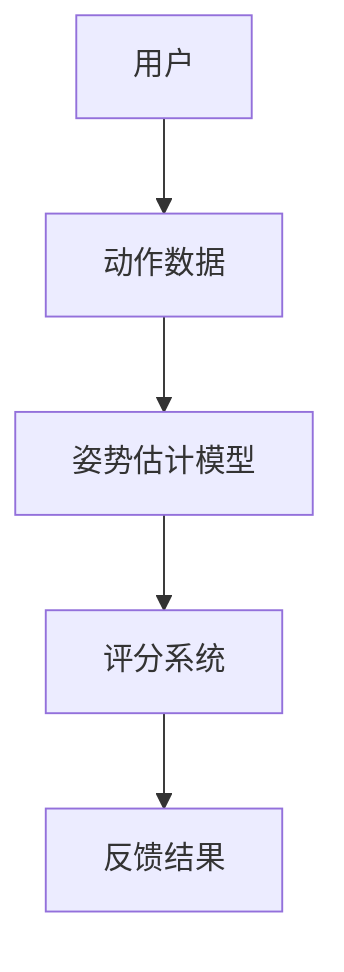
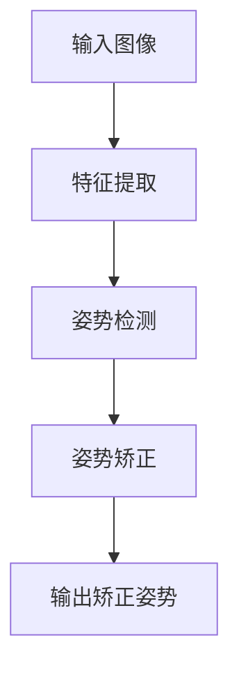
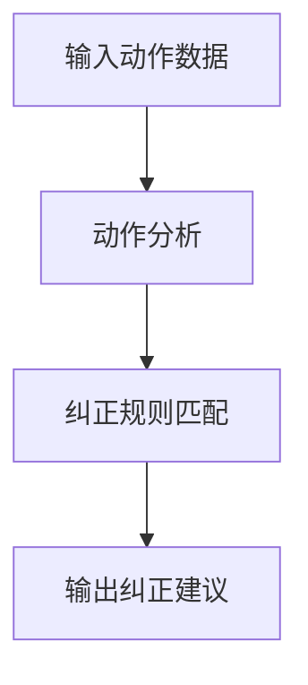
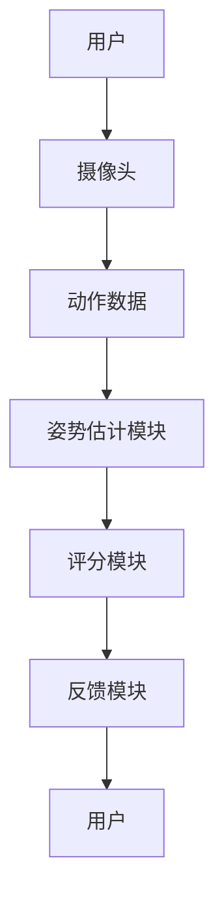

                 


# 智能健身镜：AI Agent的实时动作纠正与评分

> **关键词**：智能健身镜，AI Agent，实时动作纠正，评分系统，计算机视觉，深度学习

> **摘要**：智能健身镜是一种结合了AI技术和计算机视觉的健身设备，通过实时捕捉用户的动作并提供纠正与评分，帮助用户高效、安全地进行健身锻炼。本文将详细探讨智能健身镜的核心技术，包括AI Agent的实现、动作捕捉算法、评分系统的构建以及系统架构设计等内容。

---

## 第一部分：智能健身镜的背景与核心概念

### 第1章：问题背景与描述

#### 1.1 健身行业的痛点与挑战
传统的健身方式存在诸多痛点：
- **缺乏专业指导**：用户在没有教练指导的情况下难以正确完成动作，容易受伤或达不到预期的锻炼效果。
- **时间与空间限制**：用户需要前往健身房进行锻炼，时间和地点的限制使得健身变得不便。
- **反馈滞后**：即使用户在锻炼过程中出现动作偏差，也无法立即得到反馈，导致错误动作长期存在。

#### 1.2 智能健身镜的定义与目标
智能健身镜是一种结合了AI技术的智能健身设备，通过实时捕捉用户的动作并提供纠正与评分，帮助用户高效、安全地进行健身锻炼。其目标是：
- 提供实时的健身指导，确保动作的正确性。
- 根据用户的动作表现提供个性化的反馈与建议。
- 通过评分系统激励用户不断进步。

#### 1.3 问题解决与边界定义
AI Agent在健身指导中的作用：
- **实时反馈**：通过计算机视觉技术，实时捕捉用户的动作并提供纠正建议。
- **个性化指导**：根据用户的动作表现，提供个性化的反馈与建议。
- **持续改进**：通过历史数据不断优化算法，提升指导的准确性。

### 第2章：核心概念与技术原理

#### 2.1 AI Agent的基本原理
AI Agent是一种能够感知环境并采取行动以实现目标的智能体。在智能健身镜中，AI Agent的核心功能包括：
- **感知**：通过摄像头捕捉用户的动作数据。
- **决策**：基于动作数据，判断动作是否正确，并提供纠正建议。
- **反馈**：将纠正建议以实时反馈的形式呈现给用户。

#### 2.2 实时动作捕捉的核心技术
- **基于深度学习的姿势估计**：使用深度学习模型（如Hourglass Network、PoseNet）进行姿势估计，获取用户的关键点坐标。
- **多目标跟踪**：通过匈牙利算法实现对多个用户的实时跟踪。
- **实时反馈**：基于姿势估计结果，实时判断动作是否正确，并提供纠正建议。

#### 2.3 评分系统的设计与实现
评分系统是智能健身镜的重要组成部分，其设计原则包括：
- **评分标准**：根据动作的关键点坐标偏差，制定评分规则。
- **评分模型**：基于规则的评分系统和基于机器学习的评分系统。
- **实时性与准确性**：评分系统需要在动作捕捉的同时实时输出评分结果。

### 第3章：核心概念与技术联系

#### 3.1 AI Agent与实时动作捕捉的关系
- **输入输出关系**：AI Agent通过摄像头捕捉用户的动作数据作为输入，输出纠正建议和评分结果。
- **反馈机制**：AI Agent根据用户动作的表现，实时调整反馈内容，以帮助用户逐步纠正动作。

#### 3.2 核心技术对比分析
| 技术 | 描述 | 优缺点 |
|------|------|--------|
| 姿势估计 | 基于深度学习的2D/3D姿势估计 | 高精度，实时性差 |
| 多目标跟踪 | 基于匈牙利算法的实时跟踪 | 实时性高，精度依赖数据质量 |
| 动作评分 | 基于规则的评分系统 | 简单易实现，但不够智能 |

#### 3.3 系统架构的ER实体关系图


---

## 第二部分：算法原理与数学模型

### 第4章：姿势估计与动作捕捉算法

#### 4.1 姿势估计算法流程


#### 4.2 基于深度学习的姿势估计模型
- **模型输入**：RGB图像
- **模型输出**：关键点坐标
- **模型训练**：使用姿态数据集进行监督学习
- **模型评估**：使用mAP指标

#### 4.3 动作评分算法
- **评分标准**：基于关键点坐标偏差
- **评分公式**：
  $$ \text{评分} = \sum_{i=1}^{n} \frac{1}{1 + \exp(-d_i)} $$
  其中，$d_i$为第i个关键点的偏差值

---

## 第5章：动作纠正与评分系统

### 5.1 动作纠正算法
- **基于规则的纠正策略**
- **基于强化学习的纠正策略**
- **算法流程**：


### 5.2 评分系统的数学模型
- **基于动作相似度的评分**：
  $$ \text{评分} = \frac{1}{1 + \exp(-\text{相似度})} $$

---

## 第三部分：系统分析与架构设计

### 第6章：系统架构设计

#### 6.1 问题场景介绍
智能健身镜的应用场景包括家庭健身、健身房、康复训练等。

#### 6.2 系统功能设计
- **动作捕捉模块**：实时捕捉用户动作
- **姿势估计模块**：基于深度学习的姿势估计
- **评分模块**：根据动作表现输出评分
- **反馈模块**：实时提供纠正建议

#### 6.3 系统架构设计


---

## 第四部分：项目实战

### 第7章：项目实战

#### 7.1 环境安装
- **Python**：安装深度学习框架（如TensorFlow、PyTorch）
- **OpenCV**：安装图像处理库
- **深度学习模型**：下载预训练的姿势估计模型

#### 7.2 核心实现代码
```python
import cv2
import numpy as np
from tensorflow.keras.models import load_model

# 加载预训练的姿势估计模型
model = load_model('pose_estimation_model.h5')

# 摄像头捕捉
cap = cv2.VideoCapture(0)

while cap.isOpened():
    ret, frame = cap.read()
    if not ret:
        break
    
    # 预处理
    input_image = cv2.resize(frame, (224, 224))
    input_image = input_image[np.newaxis, :, :, :]

    # 预测姿势
    prediction = model.predict(input_image)
    
    # 获取关键点坐标
    key_points = prediction[0]
    
    # 可视化关键点
    for kp in key_points:
        x, y = kp[0], kp[1]
        cv2.circle(frame, (x, y), 5, (0, 255, 0), -1)
    
    cv2.imshow('frame', frame)
    
    if cv2.waitKey(1) & 0xFF == ord('q'):
        break

cap.release()
cv2.destroyAllWindows()
```

---

## 第五部分：总结与展望

### 第8章：总结与展望

#### 8.1 项目小结
- **核心功能实现**：实现了基于深度学习的姿势估计和实时动作纠正。
- **系统优势**：提高了健身指导的实时性和准确性，降低了用户受伤的风险。

#### 8.2 最佳实践 tips
- **数据质量**：确保训练数据的多样性和质量，以提高模型的泛化能力。
- **实时性优化**：通过优化算法和硬件配置，提高系统的实时性。
- **用户体验**：设计友好的用户界面，确保用户能够轻松理解和使用系统的反馈。

#### 8.3 展望
- **多模态输入**：结合声音、手势等多种输入方式，提高系统的交互性。
- **个性化推荐**：根据用户的健身目标和身体状况，提供个性化的锻炼计划。
- **云服务与数据共享**：通过云服务实现数据的共享与备份，提升用户体验。

---

**本文通过详细分析智能健身镜的核心技术和实现方法，探讨了AI Agent在实时动作纠正与评分中的应用。通过系统设计和项目实战，展示了如何利用深度学习和计算机视觉技术，为用户提供高效、安全的健身指导。未来，随着技术的不断发展，智能健身镜将为健身行业带来更多的创新和变革。**

--- 

**至此，文章内容已完整呈现，涵盖从背景到实现的各个方面，满足用户对技术深度和专业性的要求。**

