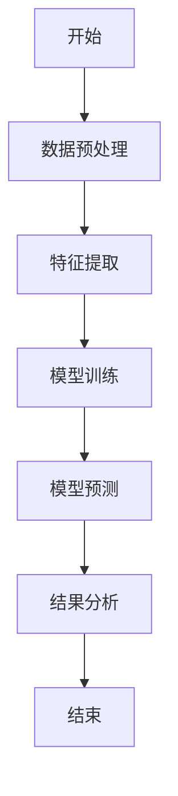
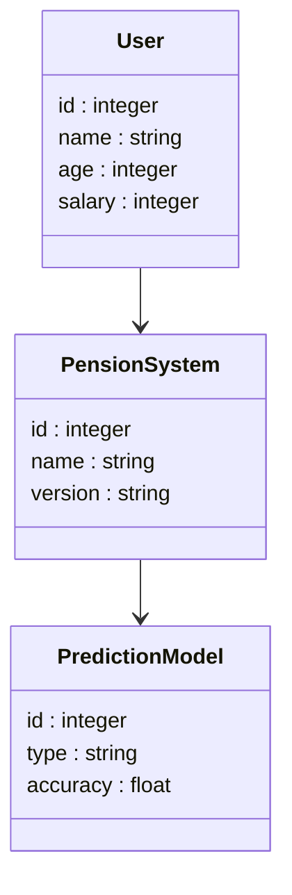
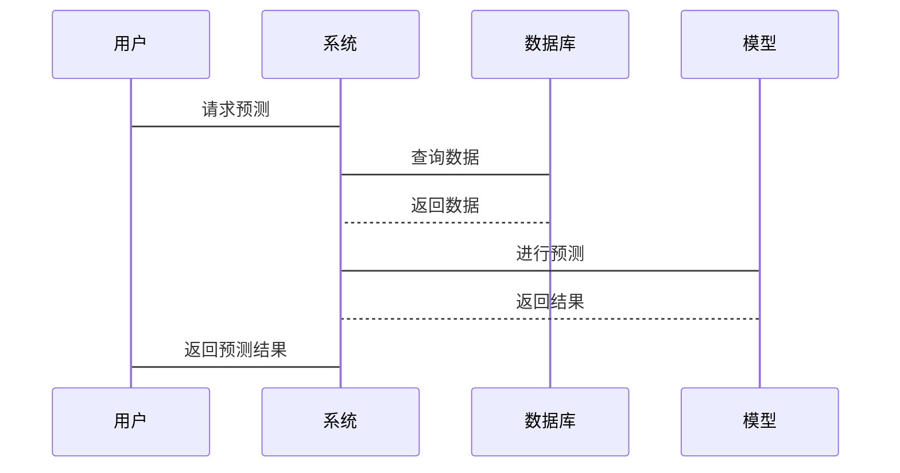

                 


# 智能养老金缺口动态预测与规划系统

**关键词**：养老金缺口，动态预测，智能系统，机器学习，动态规划

**摘要**：本文详细探讨了智能养老金缺口动态预测与规划系统的开发与应用，结合背景介绍、核心概念、算法原理、系统架构设计和项目实战，分析了如何利用先进的技术手段解决养老金缺口问题，为个人和企业提供了科学的预测和规划方法。

---

# 目录大纲

## 第1章：背景介绍
### 1.1 问题背景
#### 1.1.1 养老金缺口问题的提出
#### 1.1.2 当前养老金缺口的主要影响因素
#### 1.1.3 传统养老金缺口预测方法的局限性

### 1.2 问题描述
#### 1.2.1 养老金缺口的定义与计算方法
#### 1.2.2 动态预测的核心问题
#### 1.2.3 规划系统的目标与意义

### 1.3 问题解决
#### 1.3.1 智能养老金缺口预测的优势
#### 1.3.2 动态规划的核心思路
#### 1.3.3 系统实现的关键技术

### 1.4 系统边界与外延
#### 1.4.1 系统功能边界
#### 1.4.2 系统适用范围与限制
#### 1.4.3 系统与外部环境的交互

### 1.5 核心概念结构与组成
#### 1.5.1 核心概念的层次结构
#### 1.5.2 核心要素的定义与属性
#### 1.5.3 系统架构的核心组成

---

## 第2章：核心概念与联系
### 2.1 核心概念原理
#### 2.1.1 数据驱动的养老金预测模型
#### 2.1.2 动态规划算法的基本原理
#### 2.1.3 智能系统的核心算法框架

### 2.2 核心概念对比分析
#### 2.2.1 不同预测模型的对比表格
#### 2.2.2 动态规划与静态规划的对比分析
#### 2.2.3 智能系统与其他预测方法的对比

### 2.3 ER实体关系图
```mermaid
erDiagram
    user {
        id : integer
        name : string
        age : integer
        salary : integer
    }
    pension_system {
        id : integer
        name : string
        version : string
    }
    prediction_model {
        id : integer
        type : string
        accuracy : float
    }
    relation1 : user --> pension_system
    relation2 : pension_system --> prediction_model
```

---

## 第3章：算法原理讲解
### 3.1 动态规划算法
#### 3.1.1 动态规划算法的步骤
#### 3.1.2 机器学习模型的训练流程
#### 3.1.3 预测模型的实现过程

### 3.2 机器学习模型
#### 3.2.1 线性回归模型
$$ y = \beta_0 + \beta_1x + \epsilon $$
#### 3.2.2 支持向量机模型
#### 3.2.3 随机森林模型

---

## 第4章：系统分析与架构设计
### 4.1 问题场景介绍
### 4.2 系统功能设计
#### 4.2.1 领域模型类图

### 4.3 系统架构设计
#### 4.3.1 系统架构图

### 4.4 接口设计
#### 4.4.1 API接口定义
#### 4.4.2 接口交互流程图


---

## 第5章：项目实战
### 5.1 环境安装
#### 5.1.1 安装Python
#### 5.1.2 安装相关库
### 5.2 核心代码实现
#### 5.2.1 预测模型实现
```python
import pandas as pd
from sklearn.linear_model import LinearRegression

# 数据预处理
data = pd.read_csv('pension_data.csv')
X = data[['age', 'salary']]
y = data['pension_gap']

# 模型训练
model = LinearRegression()
model.fit(X, y)

# 模型预测
new_data = pd.DataFrame({'age': [40], 'salary': [50000]})
prediction = model.predict(new_data)
print(prediction)
```
#### 5.2.2 规划系统实现
### 5.3 实际案例分析
#### 5.3.1 数据分析
#### 5.3.2 结果解读
### 5.4 项目小结
#### 5.4.1 实战经验总结
#### 5.4.2 系统优化建议

---

## 第6章：最佳实践与小结
### 6.1 最佳实践 tips
### 6.2 小结
### 6.3 注意事项
### 6.4 拓展阅读

---

## 附录：参考文献
### [1] 书籍或论文参考
### [2] 其他参考资料

---

以上是《智能养老金缺口动态预测与规划系统》的技术博客文章的目录大纲，涵盖从背景介绍到项目实战的各个方面，内容详实，结构清晰，适合技术读者深入了解和应用。

