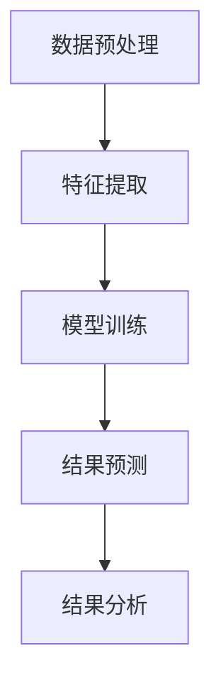
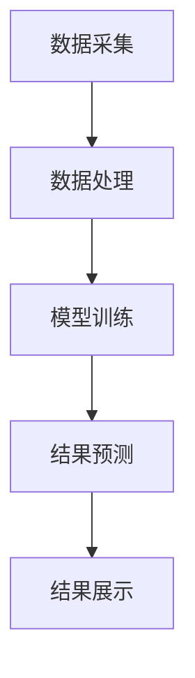

                 


# 智能养老金缺口预测与规划系统

## 关键词
智能养老金缺口预测，人工智能，机器学习，系统架构设计，数据可视化

## 摘要
随着人口老龄化加剧，养老金缺口问题日益严重。本文提出一种基于人工智能的智能养老金缺口预测与规划系统，利用机器学习算法和大数据分析技术，帮助个人和企业准确预测养老金缺口并制定合理的规划策略。文章详细介绍了系统的背景、核心算法、架构设计、项目实战及最佳实践，为解决养老金缺口问题提供了新的思路和方法。

---

# 目录大纲

## 第1章: 智能养老金缺口预测与规划系统背景介绍

### 1.1 问题背景
#### 1.1.1 养老金缺口问题的提出
- 人口老龄化带来的养老金压力
- 养老金缺口的具体表现
- 养老金缺口预测的必要性

#### 1.1.2 当前养老金规划的主要挑战
- 数据分散与不完整性
- 传统方法的局限性
- 精准预测的需求

#### 1.1.3 智能化技术在养老金规划中的应用前景
- 人工智能的优势
- 大数据技术的应用
- 智能化系统的未来发展

### 1.2 问题描述
#### 1.2.1 养老金缺口预测的核心问题
- 数据特征分析
- 预测模型的选择
- 结果的可解释性

#### 1.2.2 养老金规划的主要目标
- 精准预测缺口
- 制定个性化规划方案
- 提供风险预警

#### 1.2.3 智能养老金缺口预测与规划系统的边界与外延
- 系统的功能边界
- 外部接口的定义
- 系统的适用范围

### 1.3 核心概念与联系
#### 1.3.1 核心概念原理
- 数据采集与处理
- 特征工程
- 模型训练与优化

#### 1.3.2 核心概念属性特征对比表格
| 特征 | 描述 | 示例 |
|------|------|------|
| 年龄 | 用户当前年龄 | 45岁 |
| 收入 | 年收入 | 100,000元 |
| 缴费基数 | 社会保险缴费基数 | 月均收入的一定比例 |
| 预计退休年龄 | 用户计划退休年龄 | 60岁 |

#### 1.3.3 ER实体关系图架构
```mermaid
erDiagram
    user(User) {
        id : integer
        name : string
        age : integer
        income : float
    }
    pension_gap(PensionGap) {
        id : integer
        user_id : integer
        predicted_gap : float
        planning_recommendation : string
    }
    rules(Rules) {
        id : integer
        rule_name : string
        rule_description : string
    }
    User --|> PensionGap : 预测养老金缺口
    PensionGap --|> Rules : 应用规则
```

### 1.4 本章小结
总结本章内容，明确智能养老金缺口预测与规划系统的核心目标和实现路径。

---

## 第2章: 智能养老金缺口预测与规划系统的核心算法

### 2.1 算法原理概述
#### 2.1.1 数据预处理
- 数据清洗
- 缺失值处理
- 标准化与归一化

#### 2.1.2 特征提取
- 重要特征的选择
- 特征工程的优化

#### 2.1.3 模型训练
- 训练集、验证集、测试集的划分

### 2.2 基于机器学习的养老金缺口预测算法
#### 2.2.1 线性回归模型
- 线性回归的原理
- 模型的优缺点
- 应用场景

#### 2.2.2 支持向量回归模型
- SVR算法的基本原理
- 核函数的选择
- 模型的适用性

#### 2.2.3 随机森林回归模型
- 随机森林的优势
- 参数调优
- 模型的稳定性

### 2.3 算法流程图


### 2.4 数学模型与公式
#### 2.4.1 线性回归模型
$$y = \beta_0 + \beta_1x + \epsilon$$
其中：
- $y$ 是预测的养老金缺口
- $x$ 是输入特征
- $\beta_0$ 是截距
- $\beta_1$ 是回归系数
- $\epsilon$ 是误差项

#### 2.4.2 支持向量回归模型
$$\text{min} \frac{1}{2}||w||^2 + C \sum_{i=1}^{n} \xi_i$$
其中：
- $w$ 是模型的权重向量
- $C$ 是惩罚系数
- $\xi_i$ 是松弛变量

#### 2.4.3 随机森林回归模型
随机森林通过集成多个决策树模型，提高预测的准确性和稳定性。

### 2.5 代码实现
```python
import pandas as pd
from sklearn.model_selection import train_test_split
from sklearn.ensemble import RandomForestRegressor

# 数据加载
data = pd.read_csv('pension_data.csv')

# 特征与目标分离
X = data.drop(columns=['pension_gap'])
y = data['pension_gap']

# 划分训练集与测试集
X_train, X_test, y_train, y_test = train_test_split(X, y, test_size=0.2, random_state=42)

# 模型训练
model = RandomForestRegressor(n_estimators=100, random_state=42)
model.fit(X_train, y_train)

# 预测与评估
y_pred = model.predict(X_test)
print('预测结果:', y_pred)
print('真实结果:', y_test.values)
```

### 2.6 本章小结
总结本章所介绍的算法原理及其实现方式，为后续系统设计奠定基础。

---

## 第3章: 智能养老金缺口预测与规划系统的系统架构设计

### 3.1 系统功能设计
#### 3.1.1 功能模块划分
- 数据采集与处理模块
- 模型训练与预测模块
- 结果展示与规划模块

#### 3.1.2 功能模块流程图


### 3.2 系统架构设计
#### 3.2.1 分层架构设计
- 数据层：数据存储与管理
- 业务逻辑层：核心功能实现
- 表现层：用户交互界面

#### 3.2.2 系统架构图


### 3.3 接口设计与交互流程
#### 3.3.1 接口设计
- 数据接口：数据输入与输出
- 模型接口：算法调用接口

#### 3.3.2 交互流程
- 用户输入数据
- 系统调用模型进行预测
- 展示预测结果和规划建议

### 3.4 本章小结
总结系统的架构设计，强调模块化和分层设计的重要性。

---

## 第4章: 智能养老金缺口预测与规划系统的项目实战

### 4.1 环境安装与配置
#### 4.1.1 开发环境搭建
- Python版本要求
- 必需库的安装（如pandas、scikit-learn）

#### 4.1.2 数据准备
- 数据集的获取与预处理
- 数据清洗与特征工程

### 4.2 系统核心实现
#### 4.2.1 数据处理代码
```python
import pandas as pd

# 数据加载
data = pd.read_csv('pension_data.csv')

# 数据清洗
data.dropna(inplace=True)

# 特征工程
data['age_category'] = pd.qcut(data['age'], 3, labels=['年轻', '中年', '老年'])
```

#### 4.2.2 模型训练代码
```python
from sklearn.ensemble import RandomForestRegressor

# 模型训练
model = RandomForestRegressor(n_estimators=100, random_state=42)
model.fit(X_train, y_train)
```

#### 4.2.3 结果展示
```python
import matplotlib.pyplot as plt

plt.scatter(y_test, y_pred)
plt.xlabel('真实值')
plt.ylabel('预测值')
plt.show()
```

### 4.3 案例分析
#### 4.3.1 案例背景
- 用户的基本信息
- 数据处理过程
- 模型预测结果

#### 4.3.2 规划建议
- 缺口分析
- 资金规划建议
- 风险提示

### 4.4 本章小结
总结项目实战的过程，强调理论与实践的结合。

---

## 第5章: 智能养老金缺口预测与规划系统的最佳实践

### 5.1 优化建议
#### 5.1.1 数据优化
- 数据来源的多样性
- 数据质量的保证

#### 5.1.2 模型优化
- 超参数调优
- 模型融合

### 5.2 部署与维护
#### 5.2.1 系统部署
- 本地部署
- 云端部署

#### 5.2.2 系统维护
- 数据更新
- 模型迭代

### 5.3 注意事项
#### 5.3.1 数据隐私保护
- 用户信息的保密性
- 数据使用的合法性

#### 5.3.2 系统稳定性
- 系统的容错能力
- 系统的可扩展性

### 5.4 拓展阅读
- 机器学习在金融领域的应用
- 大数据分析技术的最新发展

### 5.5 本章小结
总结系统的最佳实践，为读者提供实用的建议和未来的发展方向。

---

## 第6章: 总结与展望

### 6.1 全文总结
- 文章的主要内容
- 关键技术的总结
- 实际应用的价值

### 6.2 未来展望
- 技术的进一步发展
- 应用领域的拓展
- 系统功能的优化

### 6.3 致谢
感谢参与项目开发的团队成员和提供数据支持的机构。

---

## 参考文献

（此处列出参考文献的具体内容）

---

## 附录

### 附录A: 代码汇总
- 数据处理代码
- 模型训练代码
- 结果展示代码

### 附录B: 图表汇总
- ER图
- 系统架构图
- 算法流程图

### 附录C: 特征分析表
- 各特征的描述与分析

---

通过以上目录大纲，文章将从背景介绍、算法原理、系统架构、项目实战等多个角度，全面、系统地介绍智能养老金缺口预测与规划系统的实现过程与实际应用，为读者提供深入的技术指导和实践参考。

