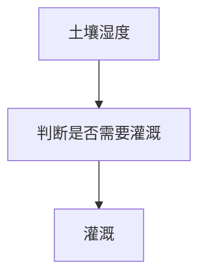
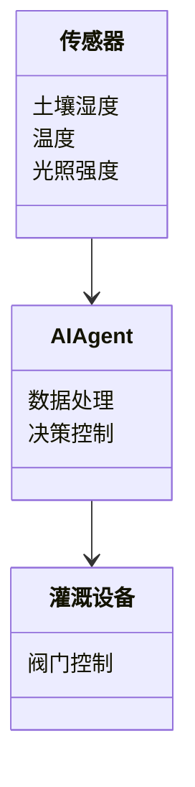
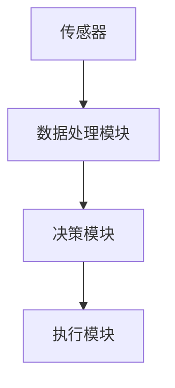
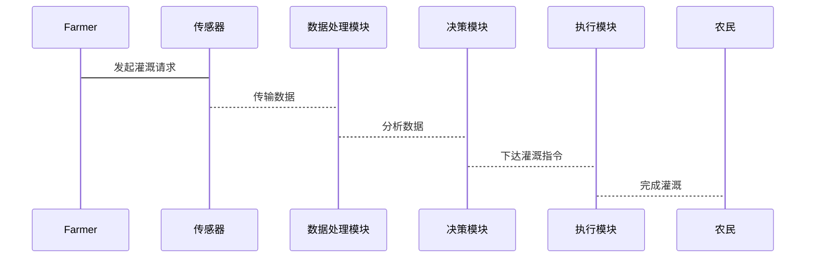

                 


# 智能农业：AI Agent控制的精准灌溉系统

> 关键词：智能农业，AI Agent，精准灌溉，算法原理，系统架构

> 摘要：随着农业智能化的快速发展，AI Agent在精准灌溉系统中的应用越来越广泛。本文详细探讨了AI Agent如何通过智能决策算法实现精准灌溉，分析了系统的架构设计，并通过实际案例展示了AI Agent在农业中的潜力与优势。文章从背景、原理、实现到应用，全面解析了AI Agent控制的精准灌溉系统。

---

## 第一部分: 智能农业的背景与发展

### 第1章: 智能农业的背景与发展

#### 1.1 精准农业的概念与特点

##### 1.1.1 精准农业的定义
精准农业（Precision Agriculture）是一种利用现代信息技术、传感器和数据分析来优化农业生产的过程。它通过实时监测和精确控制，实现资源的高效利用和作物的最佳生长条件。

##### 1.1.2 精准农业的核心特点
- **数据驱动**：依赖传感器和物联网设备收集实时数据。
- **精准控制**：根据数据进行精确的决策和操作。
- **可持续性**：减少资源浪费，降低环境影响。

##### 1.1.3 精准农业与传统农业的区别
| 特性 | 精准农业 | 传统农业 |
|------|----------|----------|
| 数据使用 | 高度依赖数据 | 依赖经验 |
| 资源利用 | 高效 | 可能浪费 |
| 决策方式 | 数据驱动 | 经验驱动 |

#### 1.2 AI Agent的基本概念

##### 1.2.1 AI Agent的定义
AI Agent（人工智能代理）是一种能够感知环境、自主决策并执行任务的智能实体。它能够根据输入的信息做出决策，并通过执行动作与环境互动。

##### 1.2.2 AI Agent的核心属性
- **感知能力**：通过传感器或其他输入源获取信息。
- **决策能力**：基于获取的信息做出决策。
- **执行能力**：通过执行动作影响环境。

##### 1.2.3 AI Agent在农业中的应用潜力
AI Agent可以用于农业中的多种场景，包括作物监测、病虫害预测、资源优化分配等。在灌溉系统中，AI Agent可以通过实时监测土壤湿度、天气条件等信息，智能调整灌溉策略。

#### 1.3 AI Agent与精准灌溉的结合

##### 1.3.1 灌溉系统的基本原理
灌溉系统通过将水输送到作物根部区域，提供作物生长所需的水分。传统灌溉系统通常采用固定时间表或简单的传感器控制，而精准灌溉系统则通过AI Agent进行智能决策。

##### 1.3.2 AI Agent在灌溉控制中的作用
AI Agent可以实时分析土壤湿度、气象数据、作物生长阶段等信息，计算出最优的灌溉时间和水量，从而实现精准灌溉。

##### 1.3.3 精准灌溉系统的优势
- **节水**：通过精确控制灌溉量，减少水资源浪费。
- **增产**：优化灌溉策略，提高作物产量和质量。
- **节省时间**：自动化决策减少人工干预。

---

## 第二部分: AI Agent控制的精准灌溉系统核心概念

### 第2章: AI Agent在灌溉系统中的角色

#### 2.1 AI Agent的功能模块

##### 2.1.1 数据采集模块
AI Agent通过传感器采集土壤湿度、温度、光照强度等数据。

##### 2.1.2 数据分析模块
对采集的数据进行分析，判断是否需要灌溉。

##### 2.1.3 决策模块
根据分析结果，制定灌溉计划。

##### 2.1.4 执行模块
通过控制阀门或其他执行机构，执行灌溉操作。

#### 2.2 精准灌溉系统的结构与功能

##### 2.2.1 系统的基本组成
- **传感器**：土壤湿度传感器、气象传感器等。
- **数据传输模块**：将传感器数据传输到AI Agent。
- **AI Agent**：处理数据并做出决策。
- **执行机构**：如电动阀门。

##### 2.2.2 系统的功能模块
- **数据采集**：实时采集环境数据。
- **数据处理**：对数据进行预处理和分析。
- **决策控制**：根据数据做出灌溉决策。
- **执行控制**：控制灌溉设备执行决策。

#### 2.3 AI Agent与灌溉系统的实体关系

##### 2.3.1 实体关系图（ER图）
```mermaid
erDiagram
    actor Farmer {
        <属性> 土壤湿度
        <属性> 温度
        <属性> 光照强度
    }
    entity 灌溉系统 {
        <外键> 农民ID
        <外键> 设备ID
    }
    entity 传感器 {
        <外键> 农民ID
        <外键> 设备ID
    }
    entity AI Agent {
        <外键> 农民ID
        <外键> 设备ID
    }
```

---

## 第三部分: AI Agent控制的精准灌溉系统算法原理

### 第3章: AI Agent控制的精准灌溉系统算法原理

#### 3.1 模糊逻辑控制算法

##### 3.1.1 模糊逻辑的基本原理
模糊逻辑是一种处理不精确信息的数学方法，适合用于处理复杂的、非线性的系统控制问题。

##### 3.1.2 模糊推理规则
例如，当土壤湿度低于某一阈值时，AI Agent会触发灌溉操作。

##### 3.1.3 模糊控制算法的实现


#### 3.2 基于机器学习的灌溉决策算法

##### 3.2.1 数据采集与预处理
采集土壤湿度、温度、光照等数据，并进行标准化处理。

##### 3.2.2 算法模型的训练
使用机器学习模型（如随机森林、支持向量机）进行训练，预测是否需要灌溉。

##### 3.2.3 模型的部署与应用
将训练好的模型部署到AI Agent中，实时进行灌溉决策。

#### 3.3 基于优化算法的灌溉调度

##### 3.3.1 灌溉调度的优化目标
最小化水资源消耗，最大化作物产量。

##### 3.3.2 约束条件
- 每个作物阶段的需水量不同。
- 灌溉时间不能冲突。

##### 3.3.3 优化算法的实现
使用遗传算法、模拟退火等优化算法，找到最优的灌溉调度方案。

---

## 第四部分: AI Agent控制的精准灌溉系统分析与架构设计

### 第4章: AI Agent控制的精准灌溉系统分析与架构设计

#### 4.1 问题场景介绍

##### 4.1.1 灌溉系统的需求
- 实时监测土壤湿度。
- 根据需求自动启动灌溉。

#### 4.2 项目介绍

##### 4.2.1 项目目标
实现基于AI Agent的精准灌溉系统。

#### 4.3 系统功能设计

##### 4.3.1 领域模型


#### 4.4 系统架构设计

##### 4.4.1 系统架构图


#### 4.5 系统接口设计

##### 4.5.1 系统接口
- 传感器接口：接收传感器数据。
- 执行机构接口：控制灌溉设备。

#### 4.6 系统交互流程

##### 4.6.1 系统交互图


---

## 第五部分: AI Agent控制的精准灌溉系统项目实战

### 第5章: AI Agent控制的精准灌溉系统项目实战

#### 5.1 环境配置

##### 5.1.1 系统需求
- Python 3.6+
- 传感器套件
- 物联网平台

#### 5.2 系统核心实现

##### 5.2.1 数据采集与处理
```python
import pandas as pd
import numpy as np

# 采集数据
data = pd.DataFrame({
    '土壤湿度': [70, 65, 80, 75],
    '温度': [25, 28, 23, 26],
    '光照强度': [1200, 1100, 1300, 1250]
})

# 数据预处理
data['是否需要灌溉'] = data['土壤湿度'].apply(lambda x: '是' if x < 60 else '否')
```

##### 5.2.2 算法实现
```python
from sklearn.ensemble import RandomForestClassifier

# 训练模型
model = RandomForestClassifier()
model.fit(X_train, y_train)

# 预测
y_pred = model.predict(X_test)
```

##### 5.2.3 系统集成与测试
集成传感器、AI Agent和执行机构，进行系统测试，确保各模块协同工作。

---

## 第六部分: AI Agent控制的精准灌溉系统最佳实践与总结

### 第6章: 最佳实践与总结

#### 6.1 小结
本文详细介绍了AI Agent在精准灌溉系统中的应用，从背景到实现，全面分析了系统的各个方面。

#### 6.2 注意事项
- 确保传感器数据的准确性。
- 定期更新AI模型，以适应环境变化。

#### 6.3 拓展阅读
推荐阅读关于机器学习在农业中的应用、物联网技术等领域的书籍和论文。

---

通过以上步骤，我们详细解析了AI Agent控制的精准灌溉系统的各个方面，从理论到实践，帮助读者全面理解其工作原理和实现方法。

