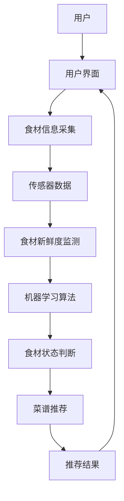

                 


# 智能冰箱：AI Agent的食材新鲜度监测与菜谱推荐

## 关键词：智能冰箱、AI Agent、食材新鲜度监测、菜谱推荐、机器学习

## 摘要：本文探讨了智能冰箱中AI Agent在食材新鲜度监测与菜谱推荐中的应用。通过分析食材新鲜度监测的核心算法和菜谱推荐的实现原理，本文详细阐述了AI Agent如何通过传感器数据、机器学习算法和用户偏好分析，实现智能冰箱的智能化功能。文章从背景介绍、核心概念、算法原理、系统架构、项目实战到总结，全面解析了智能冰箱AI Agent的技术实现与应用场景。

---

## 第一部分: 背景介绍

### 第1章: 智能冰箱与AI Agent概述

#### 1.1 智能冰箱的背景与发展

随着智能家居的普及，智能冰箱作为家庭中的重要设备，逐渐成为人们生活中不可或缺的一部分。智能冰箱不仅能够存储食材，还能够通过AI技术实现食材管理、健康饮食推荐等功能，极大地提升了用户的使用体验。

#### 1.2 AI Agent在智能冰箱中的作用

AI Agent（人工智能代理）是一种能够感知环境、执行任务并优化决策的智能实体。在智能冰箱中，AI Agent主要用于食材新鲜度监测、菜谱推荐、用户行为分析等功能，帮助用户更好地管理食材、规划饮食。

#### 1.3 食材新鲜度监测的重要性

食材的新鲜度直接影响用户的健康和饮食体验。通过AI Agent实时监测食材的状态，用户可以及时了解食材的保存情况，避免浪费，同时确保饮食的安全和健康。

#### 1.4 菜谱推荐的用户需求

现代用户对个性化饮食需求日益增长，AI Agent可以通过分析用户的饮食习惯、偏好以及食材库存情况，推荐适合的菜谱，提升用户的烹饪体验和生活质量。

---

## 第二部分: 核心概念与联系

### 第2章: AI Agent与食材新鲜度监测

#### 2.1 AI Agent的基本原理

AI Agent通过感知环境、接收输入数据、分析处理数据、做出决策并执行操作，实现智能化功能。在智能冰箱中，AI Agent主要通过传感器获取食材信息，利用机器学习算法进行分析，为用户提供实时的食材状态反馈。

#### 2.2 食材新鲜度监测的原理

食材新鲜度监测主要通过传感器采集温度、湿度、气体浓度等数据，结合机器学习算法对数据进行分析，判断食材的新鲜程度。通过长期的数据积累，AI Agent可以不断优化监测模型，提高监测的准确性。

#### 2.3 AI Agent与食材新鲜度监测的结合

AI Agent通过实时接收传感器数据，利用预训练的模型快速判断食材的新鲜度，并通过用户界面提供反馈。同时，AI Agent还可以根据食材的保存时间、保质期等因素，提醒用户及时使用或丢弃食材，避免浪费。

---

## 第三部分: 算法原理讲解

### 第3章: 食材新鲜度监测算法

#### 3.1 时间序列分析算法

时间序列分析是一种基于历史数据预测未来趋势的算法。在食材新鲜度监测中，AI Agent可以利用时间序列分析算法预测食材的保存期限，帮助用户合理安排食材使用。

**代码示例：**

```python
import pandas as pd
from statsmodels.tsa.arima_model import ARIMA

# 假设df为食材新鲜度数据，'freshness'为新鲜度指标
model = ARIMA(df['freshness'], order=(1, 1, 1))
model_fit = model.fit()

# 预测未来一天的新鲜度
forecast = model_fit.forecast(steps=1)
print(forecast)
```

#### 3.2 数据特征提取与分类

通过传感器数据提取食材的新鲜度特征，利用机器学习算法对食材进行分类。例如，通过支持向量机（SVM）对食材的新鲜度进行分类，帮助用户快速了解食材的状态。

**代码示例：**

```python
from sklearn.svm import SVC
from sklearn.preprocessing import StandardScaler
from sklearn.pipeline import Pipeline

# 假设X为食材特征，y为新鲜度标签
pipeline = Pipeline([
    ('scaler', StandardScaler()),
    ('svm', SVC())
])

pipeline.fit(X, y)
预测结果 = pipeline.predict(X_test)
```

---

## 第四部分: 系统分析与架构设计

### 第4章: 系统架构设计

#### 4.1 系统功能设计

智能冰箱AI Agent系统主要功能包括：

1. **食材信息采集**：通过传感器采集食材的温度、湿度、气体浓度等信息。
2. **食材新鲜度监测**：利用机器学习算法判断食材的新鲜度。
3. **菜谱推荐**：基于用户的饮食偏好和食材库存，推荐适合的菜谱。
4. **用户交互**：通过用户界面显示食材状态和推荐菜谱。

#### 4.2 系统架构图

以下是智能冰箱AI Agent系统的架构图：



#### 4.3 系统接口设计

智能冰箱AI Agent系统主要接口包括：

1. **传感器接口**：用于采集食材的环境数据。
2. **用户交互接口**：用于展示食材状态和推荐菜谱。
3. **算法接口**：用于调用机器学习算法进行数据分析。

---

## 第五部分: 项目实战

### 第5章: 项目实现

#### 5.1 环境安装

为了实现智能冰箱AI Agent系统，需要安装以下环境和工具：

- **Python**：编程语言
- **TensorFlow** 或 **Scikit-learn**：机器学习库
- **Mermaid**：用于绘制系统架构图
- **Jupyter Notebook**：用于算法实现和测试

#### 5.2 核心代码实现

以下是食材新鲜度监测和菜谱推荐的核心代码示例：

```python
# 食材新鲜度监测代码
import numpy as np
from sklearn.model_selection import train_test_split
from sklearn.ensemble import RandomForestClassifier

# 假设data为传感器数据，labels为食材新鲜度标签
X_train, X_test, y_train, y_test = train_test_split(data, labels, test_size=0.2)

model = RandomForestClassifier()
model.fit(X_train, y_train)
score = model.score(X_test, y_test)
print(f'模型准确率：{score}')

# 菜谱推荐代码
from surprise import SVD
from surprise.dataset import Dataset
from surprise import Reader

# 假设data是用户饮食数据
reader = Reader(rating_scale=(1, 5))
data = Dataset.load_from_file('user_ratings.csv', reader=reader)

model = SVD()
model.fit(data)
预测结果 = model.predict(user_id, item_id)
print(f'推荐结果：{预测结果}')
```

#### 5.3 案例分析

通过实际案例分析，展示AI Agent在食材新鲜度监测和菜谱推荐中的具体应用。例如，通过传感器数据和机器学习算法，AI Agent可以准确判断食材的新鲜度，并推荐适合用户口味的菜谱，提升用户的使用体验。

---

## 第六部分: 总结与展望

### 第6章: 总结

本文详细探讨了智能冰箱中AI Agent在食材新鲜度监测与菜谱推荐中的应用。通过分析核心算法和系统架构，展示了AI Agent如何通过传感器数据和机器学习技术，实现智能化的食材管理与菜谱推荐。

### 6.1 未来展望

随着人工智能和物联网技术的不断发展，智能冰箱AI Agent的应用将更加广泛。未来，AI Agent可以通过与智能家居系统的联动，实现更智能的食材管理和更个性化的饮食推荐，进一步提升用户的使用体验和生活质量。

---

通过本文的详细讲解，读者可以全面了解智能冰箱AI Agent的技术实现与应用场景，为未来的智能家居发展提供重要的参考和借鉴。

