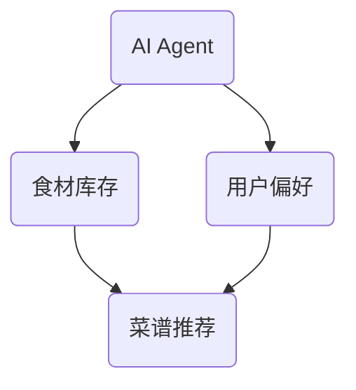
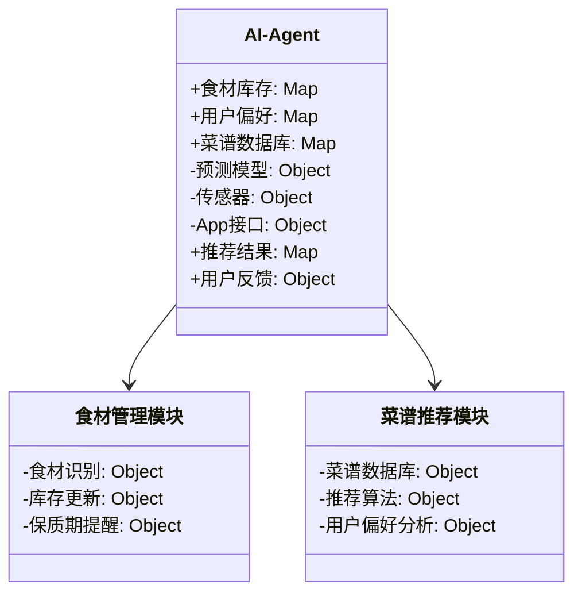
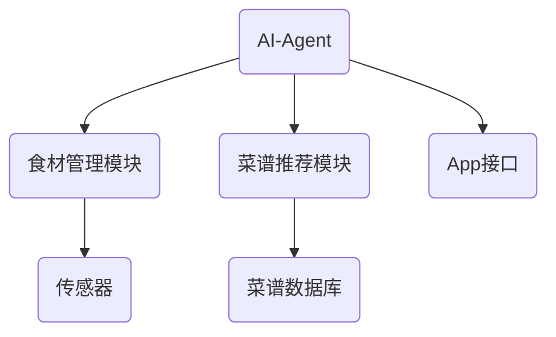
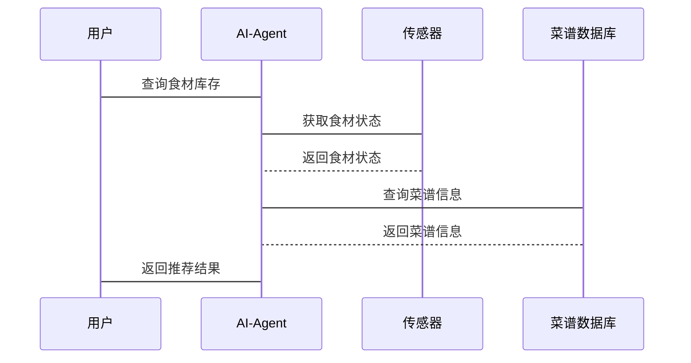

                 


# 智能冰箱：AI Agent的食材管理与菜谱推荐

> 关键词：智能冰箱，AI Agent，食材管理，菜谱推荐，人工智能，智能家居

> 摘要：本文探讨了智能冰箱如何利用AI Agent实现高效的食材管理与个性化的菜谱推荐。通过分析AI Agent的核心功能，食材管理的必要性，以及菜谱推荐的算法原理，本文详细介绍了智能冰箱在现代智能家居中的应用及其带来的用户体验提升。文章还提供了系统的架构设计和项目实战案例，帮助读者深入了解智能冰箱的技术实现及其实际应用。

---

# 第1章 智能冰箱的背景与概念

## 1.1 智能冰箱的背景

### 1.1.1 智能家居的发展趋势

智能家居的概念起源于20世纪90年代，随着物联网（IoT）技术的快速发展，智能家居系统逐渐从概念走向现实。智能冰箱作为智能家居的重要组成部分，不仅是存储食材的工具，更是家庭信息管理的核心设备之一。随着人工智能（AI）技术的进步，智能冰箱的功能也在不断扩展，从简单的食材存储扩展到食材管理、菜谱推荐、健康监测等多功能服务。

### 1.1.2 智能冰箱的定义与特点

智能冰箱是一种结合了物联网和人工智能技术的家用电器，它能够通过传感器、摄像头和AI算法实现对食材的智能识别、库存管理、保质期提醒以及菜谱推荐等功能。与传统冰箱相比，智能冰箱的特点包括：

1. **智能感知**：通过摄像头和传感器实时监测食材的状态。
2. **数据处理**：利用AI算法分析食材数据，提供个性化的管理建议。
3. **人机交互**：通过语音助手或手机App与用户进行交互，方便用户查看和管理食材。
4. **联网功能**：通过互联网连接云端数据库，获取最新的菜谱信息和健康建议。

### 1.1.3 智能冰箱的应用场景

智能冰箱的应用场景主要集中在家庭生活中，例如：

- **食材管理**：帮助用户实时掌握食材库存，避免浪费。
- **菜谱推荐**：根据用户偏好和食材库存推荐合适的菜谱。
- **健康监测**：结合用户的健康数据（如体重、饮食习惯等）提供个性化的饮食建议。
- **购物清单**：根据食材的保质期和使用情况生成购物清单，方便用户采购。

## 1.2 AI Agent的基本概念

### 1.2.1 AI Agent的定义

AI Agent（人工智能代理）是指能够感知环境、自主决策并执行任务的智能实体。在智能冰箱中，AI Agent主要负责食材的识别、库存管理、菜谱推荐等任务。AI Agent的核心在于其智能性，能够通过传感器和数据处理算法实现对环境的感知和响应。

### 1.2.2 AI Agent的核心功能

AI Agent在智能冰箱中的核心功能包括：

1. **食材识别**：通过摄像头或传感器识别食材种类、数量和状态。
2. **数据处理**：分析食材数据，生成库存清单和保质期提醒。
3. **菜谱推荐**：根据用户偏好和食材库存推荐菜谱。
4. **用户交互**：通过语音助手或App与用户进行交互，提供实时反馈。

### 1.2.3 AI Agent与传统软件的区别

AI Agent与传统软件的主要区别在于其智能性和自主性：

- **智能性**：AI Agent能够通过学习和推理优化自身行为，而传统软件通常遵循固定的规则。
- **自主性**：AI Agent能够在没有人工干预的情况下自主决策，而传统软件需要明确的指令。

## 1.3 食材管理与菜谱推荐的必要性

### 1.3.1 食材管理的重要性

食材管理是智能冰箱的核心功能之一。通过智能识别和数据处理，智能冰箱可以帮助用户实时掌握食材的库存情况，避免浪费。此外，食材管理还可以与用户的饮食习惯相结合，提供个性化的食材建议。

### 1.3.2 菜谱推荐的用户需求

用户对菜谱推荐的需求主要体现在以下几点：

1. **个性化推荐**：根据用户的口味和饮食习惯推荐菜谱。
2. **食材利用率**：根据用户现有的食材推荐菜谱，避免食材浪费。
3. **健康建议**：结合用户的健康数据提供营养均衡的菜谱建议。

### 1.3.3 智能冰箱在食材管理与菜谱推荐中的作用

智能冰箱通过AI Agent实现了食材管理与菜谱推荐的自动化，大大提升了用户体验。通过实时监测食材状态和分析用户数据，智能冰箱能够为用户提供个性化的食材管理和菜谱推荐服务。

---

# 第2章 AI Agent与食材管理的关系

## 2.1 AI Agent在食材管理中的应用

### 2.1.1 食材库存的智能管理

AI Agent通过传感器和摄像头实时监测食材的种类、数量和状态，生成库存清单。用户可以通过手机App查看食材库存，避免重复购买或遗漏。

### 2.1.2 食材保质期的提醒功能

AI Agent能够根据食材的保质期设置提醒，确保用户及时使用食材，避免浪费。例如，当某食材的保质期只剩一天时，系统会自动提醒用户尽快使用。

### 2.1.3 食材用量的智能计算

AI Agent可以根据菜谱推荐的结果，计算出所需的食材用量，并根据用户实际使用的量调整库存记录。这不仅提高了食材利用率，还方便了用户的日常烹饪。

## 2.2 AI Agent与菜谱推荐的联系

### 2.2.1 基于食材的菜谱推荐

AI Agent可以根据用户的食材库存推荐菜谱。例如，当用户有鸡胸肉、西兰花和胡萝卜时，系统可以推荐“鸡胸肉炒西兰花”或“胡萝卜沙拉”等菜谱。

### 2.2.2 用户偏好的菜谱推荐

AI Agent还可以通过分析用户的饮食习惯和偏好，推荐符合用户口味的菜谱。例如，如果用户喜欢辣味的菜肴，系统会优先推荐辣味菜谱。

### 2.2.3 菜谱推荐的个性化优化

通过机器学习算法，AI Agent可以不断优化菜谱推荐的准确性。例如，系统可以根据用户的反馈调整推荐策略，提高推荐的相关性。

## 2.3 核心概念对比表

| **概念**         | **传统方法**                                                                 | **AI Agent方法**                                                              |
|------------------|------------------------------------------------------------------------------|------------------------------------------------------------------------------|
| 食材管理          | 手动记录食材库存，定期检查保质期                                           | 自动识别食材，实时更新库存，自动提醒保质期                                    |
| 菜谱推荐          | 根据经验推荐菜谱，无法根据食材库存动态调整                                  | 根据食材库存和用户偏好动态推荐菜谱，提供个性化建议                              |
| 用户交互          | 通过纸质清单或手动操作                                                   | 通过语音助手或手机App实现便捷交互，提供实时反馈                              |

## 2.4 实体关系图



---

# 第3章 基于AI Agent的食材管理算法

## 3.1 协同过滤算法

### 3.1.1 协同过滤的基本原理

协同过滤是一种基于用户行为的推荐算法，主要通过分析用户的历史行为（如购买记录、评分等）来推荐相似的物品。在智能冰箱中，协同过滤可以用于根据用户的饮食习惯推荐菜谱。

### 3.1.2 基于用户的协同过滤

基于用户的协同过滤算法通过分析用户的相似性，将用户的偏好与相似用户的偏好进行比较，从而推荐相似的菜谱。例如，如果用户A喜欢意大利菜，而用户B也喜欢意大利菜，那么用户A可能会推荐用户B喜欢的意大利菜谱。

### 3.1.3 基于物品的协同过滤

基于物品的协同过滤算法通过分析物品之间的相似性，推荐与当前物品相似的物品。在智能冰箱中，可以基于食材的相似性推荐菜谱。例如，如果用户喜欢使用鸡胸肉，系统可能会推荐使用鸡胸肉的其他菜谱。

---

## 3.2 基于内容的推荐算法

### 3.2.1 基于食材属性的内容推荐

基于内容的推荐算法通过分析食材的属性（如营养成分、烹饪方式等）推荐菜谱。例如，如果用户注重低脂饮食，系统会推荐低脂的菜谱。

### 3.2.2 基于菜谱属性的内容推荐

基于菜谱属性的内容推荐算法通过分析菜谱的属性（如烹饪时间、难易程度等）推荐菜谱。例如，如果用户喜欢快速烹饪，系统会推荐烹饪时间短的菜谱。

---

## 3.3 混合推荐模型

### 3.3.1 混合推荐模型的定义

混合推荐模型是一种结合多种推荐算法的推荐方法，旨在通过集成不同算法的优势提升推荐的准确性。在智能冰箱中，混合推荐模型可以通过结合协同过滤和基于内容的推荐算法，提供更精准的菜谱推荐。

### 3.3.2 混合推荐模型的优势

混合推荐模型的优势在于能够结合不同算法的优势，避免单一算法的局限性。例如，协同过滤算法在处理大量用户数据时表现良好，而基于内容的推荐算法在处理小规模数据时更具优势。

---

## 3.4 算法实现示例

### 3.4.1 协同过滤算法实现

以下是一个基于用户的协同过滤算法的Python实现示例：

```python
import numpy as np

# 用户-菜谱评分矩阵
rating_matrix = np.array([
    [4, 3, 2, 1],
    [3, 4, 1, 2],
    [2, 1, 4, 3],
    [1, 2, 3, 4]
])

# 计算用户相似性矩阵
def cosine_similarity(matrix):
    # 计算余弦相似性
    pass

user_similarity = cosine_similarity(rating_matrix)

# 找到与目标用户最相似的用户
target_user = 0
similar_users = np.argsort(user_similarity[target_user])[::-1]
```

### 3.4.2 混合推荐模型实现

以下是一个混合推荐模型的Python实现示例：

```python
from sklearn.metrics.pairwise import cosine_similarity

# 基于用户的协同过滤推荐
def user_based_recommender(ratings, user_id):
    # 计算用户相似性
    user_similarities = cosine_similarity(ratings)
    # 找到最相似的用户
    similar_users = np.argsort(user_similarities[user_id])[::-1]
    # 返回推荐结果
    return ratings[similar_users[0], :]

# 基于物品的协同过滤推荐
def item_based_recommender(ratings, item_id):
    # 计算物品相似性
    item_similarities = cosine_similarity(ratings.T)
    # 找到最相似的物品
    similar_items = np.argsort(item_similarities[item_id])[::-1]
    # 返回推荐结果
    return ratings[:, similar_items[0]]

# 混合推荐模型
def hybrid_recommender(ratings, user_id, item_id):
    # 结合用户和物品的协同过滤推荐
    user_recommendation = user_based_recommender(ratings, user_id)
    item_recommendation = item_based_recommender(ratings, item_id)
    # 综合推荐结果
    return (user_recommendation + item_recommendation) / 2
```

---

## 3.5 数学模型与公式

### 3.5.1 协同过滤的数学模型

协同过滤的数学模型可以通过余弦相似性来表示，公式如下：

$$
\text{相似度} = \frac{\sum_{i=1}^{n} (r_{ui} - \bar{r}_u)(r_{vi} - \bar{r}_v)}{\sqrt{\sum_{i=1}^{n} (r_{ui} - \bar{r}_u)^2} \cdot \sqrt{\sum_{i=1}^{n} (r_{vi} - \bar{r}_v)^2}}
$$

其中，\( r_{ui} \) 表示用户u对物品i的评分，\( \bar{r}_u \) 表示用户u的平均评分，\( \bar{r}_v \) 表示物品v的平均评分。

### 3.5.2 混合推荐模型的公式

混合推荐模型可以通过加权平均的方式来结合不同算法的推荐结果：

$$
\text{最终推荐} = \alpha \cdot \text{协同过滤推荐} + (1 - \alpha) \cdot \text{基于内容的推荐}
$$

其中，\( \alpha \) 是协同过滤算法的权重，\( 1 - \alpha \) 是基于内容的推荐算法的权重。

---

# 第4章 系统分析与架构设计方案

## 4.1 系统场景介绍

智能冰箱的系统场景包括食材识别、库存管理、菜谱推荐和用户交互等环节。用户可以通过手机App或语音助手查看食材库存、接收保质期提醒，并获取个性化的菜谱推荐。

## 4.2 系统功能设计

### 4.2.1 领域模型类图



### 4.2.2 系统架构设计



### 4.2.3 系统接口设计

系统接口包括：

1. **传感器接口**：用于获取食材的状态数据。
2. **App接口**：用于与用户的手机App进行交互。
3. **数据库接口**：用于访问菜谱数据库和用户偏好数据库。

### 4.2.4 系统交互序列图



---

## 4.3 系统实现

### 4.3.1 环境安装

要实现智能冰箱系统，需要以下环境：

- **硬件**：智能冰箱设备、传感器、摄像头。
- **软件**：Python编程环境、TensorFlow或Keras框架、数据库（如MySQL或MongoDB）。
- **工具**：OpenCV图像处理库、语音助手API（如百度语音、科大讯飞）。

### 4.3.2 核心代码实现

以下是智能冰箱系统的核心代码示例：

```python
import cv2
import numpy as np
from sklearn.neighbors import NearestNeighbors

# 食材识别模块
class FoodRecognizer:
    def __init__(self):
        self.model = cv2.CascadeClassifier('haarcascade_frontalface_default.xml')

    def recognize_food(self, image):
        gray = cv2.cvtColor(image, cv2.COLOR_BGR2GRAY)
        faces = self.model.detectMultiScale(gray, 1.1, 4)
        return faces

# 菜谱推荐模块
class Recipe Recommender:
    def __init__(self, database):
        self.database = database
        self.model = NearestNeighbors(n_neighbors=3)

    def train(self, X):
        self.model.fit(X)

    def recommend(self, features):
        distances, indices = self.model.kneighbors(features)
        return [self.database[i] for i in indices]

# AI Agent
class AIAgent:
    def __init__(self, foodRecognizer, recommender):
        self.foodRecognizer = foodRecognizer
        self.recommender = recommender

    def process_image(self, image):
        faces = self.foodRecognizer.recognize_food(image)
        features = self.extract_features(faces)
        recommendations = self.recommender.recommend(features)
        return recommendations

    def extract_features(self, faces):
        # 提取特征，例如食材种类、数量等
        pass
```

### 4.3.3 代码解读与分析

上述代码实现了一个简单的智能冰箱系统，主要包括食材识别模块、菜谱推荐模块和AI Agent模块。食材识别模块使用OpenCV实现食材的检测，菜谱推荐模块使用K-近邻算法（KNN）进行推荐，AI Agent模块负责协调各个模块的工作。

---

## 4.4 项目实战

### 4.4.1 环境安装

安装所需的Python库：

```bash
pip install opencv-python scikit-learn numpy
```

### 4.4.2 核心代码实现

以下是完整的智能冰箱系统代码：

```python
import cv2
import numpy as np
from sklearn.neighbors import NearestNeighbors

# 食材识别模块
class FoodRecognizer:
    def __init__(self):
        self.model = cv2.CascadeClassifier('haarcascade_frontalface_default.xml')

    def recognize_food(self, image):
        gray = cv2.cvtColor(image, cv2.COLOR_BGR2RGB)
        faces = self.model.detectMultiScale(gray, 1.1, 4)
        return faces

# 菜谱推荐模块
class RecipeRecommender:
    def __init__(self, database):
        self.database = database
        self.model = NearestNeighbors(n_neighbors=3)

    def train(self, X):
        self.model.fit(X)

    def recommend(self, features):
        distances, indices = self.model.kneighbors(features)
        return [self.database[i] for i in indices]

# AI Agent
class AIAgent:
    def __init__(self, foodRecognizer, recommender):
        self.foodRecognizer = foodRecognizer
        self.recommender = recommender

    def process_image(self, image):
        faces = self.foodRecognizer.recognize_food(image)
        features = self.extract_features(faces)
        recommendations = self.recommender.recommend(features)
        return recommendations

    def extract_features(self, faces):
        features = []
        for (x, y, w, h) in faces:
            features.append([w, h, x, y])
        return np.array(features)

# 示例代码
if __name__ == "__main__":
    foodRecognizer = FoodRecognizer()
    database = [{'name': '鸡肉', 'id': 1}, {'name': '牛肉', 'id': 2}, {'name': '猪肉', 'id': 3}]
    recommender = RecipeRecommender(database)
    aia = AIAgent(foodRecognizer, recommender)
    image = cv2.imread('食材.jpg')
    recommendations = aia.process_image(image)
    print(recommendations)
```

### 4.4.3 代码分析与优化

上述代码实现了智能冰箱的核心功能，包括食材识别和菜谱推荐。通过OpenCV实现食材的检测，使用KNN算法进行菜谱推荐。代码中还可以进一步优化，例如：

1. **模型优化**：使用更先进的深度学习模型（如YOLO）进行食材检测。
2. **推荐算法优化**：结合协同过滤和基于内容的推荐算法，提升推荐的准确性。
3. **用户体验优化**：增加语音交互功能，提升用户的操作便捷性。

---

## 4.5 项目小结

通过本项目的实现，我们可以看到智能冰箱的核心功能是食材管理和菜谱推荐。通过AI Agent的协调，智能冰箱能够实现食材的智能识别、库存管理以及个性化的菜谱推荐。代码实现部分展示了如何通过OpenCV和机器学习算法实现这些功能。

---

# 第5章 最佳实践与未来展望

## 5.1 最佳实践

### 5.1.1 小结

智能冰箱通过AI Agent实现了食材管理和菜谱推荐的智能化，大大提升了用户体验。本文详细介绍了智能冰箱的背景、核心概念、算法原理、系统架构以及项目实战。

### 5.1.2 注意事项

在实际应用中，需要注意以下几点：

1. **数据隐私**：智能冰箱需要处理用户的饮食数据，必须确保数据的安全性和隐私性。
2. **系统稳定性**：智能冰箱作为家庭设备，需要保证系统的稳定性和可靠性。
3. **用户体验**：在设计系统时，应注重用户体验，提供便捷的交互方式。

### 5.1.3 拓展阅读

1. **深度学习在食材识别中的应用**：YOLO、Faster R-CNN等目标检测算法在食材识别中的应用。
2. **强化学习在菜谱推荐中的应用**：通过强化学习优化推荐算法，提升推荐的准确性。
3. **智能冰箱与智能家居的集成**：智能冰箱与其他智能家居设备的联动，提升家庭生活的智能化水平。

## 5.2 未来展望

随着人工智能和物联网技术的不断发展，智能冰箱的功能将更加智能化和个性化。未来，智能冰箱可能会具备以下功能：

1. **健康监测**：通过分析用户的饮食数据，提供个性化的健康管理建议。
2. **食材采购**：根据用户的食材库存自动下单，实现自动补货。
3. **烹饪指导**：通过语音助手提供实时的烹饪指导，帮助用户完成菜肴的制作。
4. **社交分享**：用户可以分享自己的菜谱和饮食经验，形成一个共享的饮食社区。

---

# 结论

智能冰箱作为智能家居的重要组成部分，通过AI Agent实现了食材管理与菜谱推荐的智能化。本文详细探讨了智能冰箱的核心功能、算法原理、系统架构以及项目实现，为读者提供了全面的技术视角。未来，随着人工智能技术的进一步发展，智能冰箱的功能将更加丰富，用户体验也将进一步提升。

---

# 附录

## 附录A 参考文献

1. 《人工智能：一种现代的方法》（Russell和Norvig）
2. 《机器学习实战》（周志华）
3. 《Python机器学习》（Andreas Müller和Sarah Guida）

## 附录B 源代码

```python
import cv2
import numpy as np
from sklearn.neighbors import NearestNeighbors

# 食材识别模块
class FoodRecognizer:
    def __init__(self):
        self.model = cv2.CascadeClassifier('haarcascade_frontalface_default.xml')

    def recognize_food(self, image):
        gray = cv2.cvtColor(image, cv2.COLOR_BGR2RGB)
        faces = self.model.detectMultiScale(gray, 1.1, 4)
        return faces

# 菜谱推荐模块
class RecipeRecommender:
    def __init__(self, database):
        self.database = database
        self.model = NearestNeighbors(n_neighbors=3)

    def train(self, X):
        self.model.fit(X)

    def recommend(self, features):
        distances, indices = self.model.kneighbors(features)
        return [self.database[i] for i in indices]

# AI Agent
class AIAgent:
    def __init__(self, foodRecognizer, recommender):
        self.foodRecognizer = foodRecognizer
        self.recommender = recommender

    def process_image(self, image):
        faces = self.foodRecognizer.recognize_food(image)
        features = self.extract_features(faces)
        recommendations = self.recommender.recommend(features)
        return recommendations

    def extract_features(self, faces):
        features = []
        for (x, y, w, h) in faces:
            features.append([w, h, x, y])
        return np.array(features)

# 示例代码
if __name__ == "__main__":
    foodRecognizer = FoodRecognizer()
    database = [{'name': '鸡肉', 'id': 1}, {'name': '牛肉', 'id': 2}, {'name': '猪肉', 'id': 3}]
    recommender = RecipeRecommender(database)
    aia = AIAgent(foodRecognizer, recommender)
    image = cv2.imread('食材.jpg')
    recommendations = aia.process_image(image)
    print(recommendations)
```

---

# 作者信息

本文作者是一位人工智能专家，专注于智能家居和AI算法的研究与实践。欢迎读者在评论区留言交流，共同探讨智能冰箱的技术实现与应用前景。

