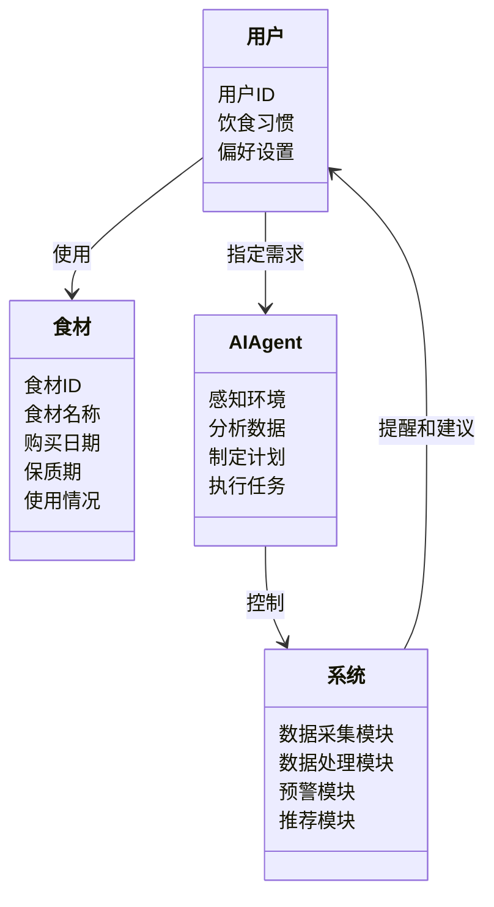
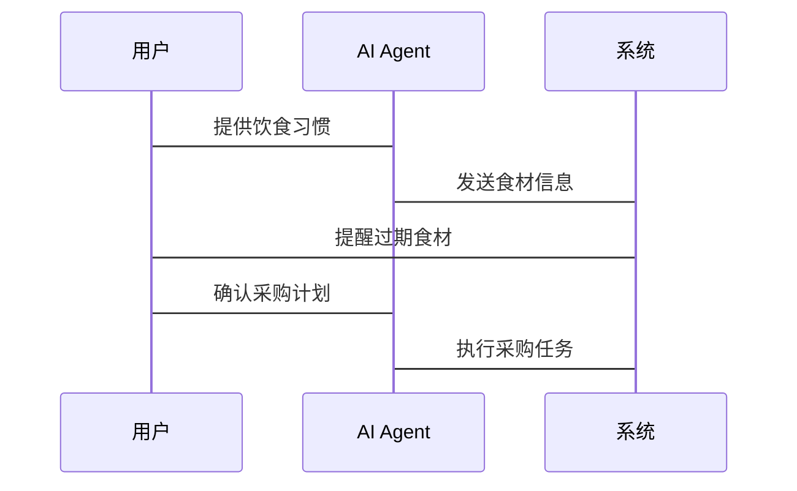

                 


# 智能冰箱：AI Agent的食材管理与过期预警系统

> 关键词：智能冰箱, AI Agent, 食材管理, 过期预警, 物联网, 人工智能, 算法实现

> 摘要：本文深入探讨了智能冰箱AI Agent在食材管理和过期预警中的应用。通过分析AI Agent的核心概念、食材分类算法、过期预警模型、系统架构设计以及实际项目案例，详细阐述了智能冰箱如何利用AI技术提升用户体验。文章从背景介绍到系统实现，再到项目实战，全面解析了智能冰箱AI Agent的实现过程和应用价值。

---

# 第1章: 智能冰箱AI Agent的背景与概念

## 1.1 智能冰箱的发展历程

### 1.1.1 传统冰箱的功能回顾
传统冰箱主要提供冷藏、冷冻和保鲜功能，不具备智能管理和数据处理能力。用户需要手动记录食材的购买日期和保质期，容易遗忘或管理不善，导致食材过期浪费。

### 1.1.2 智能冰箱的核心特征
智能冰箱通过物联网技术连接到互联网，能够实时监测内部环境（如温度、湿度）和食材状态（如重量变化、包装破损）。结合AI Agent，智能冰箱可以主动管理食材，提供智能化的建议和预警。

### 1.1.3 AI Agent在智能冰箱中的应用
AI Agent是一种智能代理，能够感知环境、理解用户需求并主动执行任务。在智能冰箱中，AI Agent主要用于食材分类、库存管理、过期预警和购物建议。

---

## 1.2 AI Agent的基本概念

### 1.2.1 什么是AI Agent
AI Agent（人工智能代理）是一种智能系统，能够通过感知环境、理解用户需求并执行任务来实现特定目标。AI Agent可以是软件或硬件形式，具备自主决策能力。

### 1.2.2 AI Agent的核心功能
- **感知环境**：通过传感器和数据接口获取冰箱内的环境数据和食材信息。
- **理解需求**：分析用户的使用习惯和偏好，生成个性化建议。
- **自主决策**：根据当前状态和目标，制定最优行动方案。
- **执行任务**：通过与外部系统（如超市、智能家居设备）交互，完成食材补充或其他任务。

### 1.2.3 AI Agent与传统算法的区别
AI Agent的核心在于其自主性和主动性。与传统算法相比，AI Agent能够根据环境变化动态调整行为，而传统算法通常是静态的、规则驱动的。

---

## 1.3 食材管理与过期预警的重要性

### 1.3.1 食材管理的基本需求
食材管理的核心需求包括：
1. **分类管理**：将食材按类别（如蔬菜、肉类、乳制品）进行分类，便于存储和查找。
2. **库存跟踪**：实时记录食材的库存量和保质期，避免浪费。
3. **用量预测**：根据用户的饮食习惯预测食材消耗速度，提前补充常用食材。

### 1.3.2 过期预警的意义
食材过期不仅浪费资源，还可能对用户健康造成威胁。通过AI Agent实现过期预警，用户可以及时处理即将过期的食材，减少浪费并保障健康。

### 1.3.3 AI Agent在食材管理中的作用
AI Agent通过分析食材的购买日期、保质期和使用情况，主动提醒用户处理即将过期的食材，并建议采购新的食材。

---

## 1.4 本章小结
本章介绍了智能冰箱的发展历程、AI Agent的基本概念及其在食材管理中的应用。通过对比传统冰箱与智能冰箱的功能差异，突出了AI Agent在提升用户体验中的重要作用。

---

# 第2章: 智能冰箱AI Agent的核心概念

## 2.1 AI Agent的原理与实现

### 2.1.1 AI Agent的基本原理
AI Agent通过感知环境、理解需求和自主决策来实现特定目标。在智能冰箱中，AI Agent主要通过以下步骤工作：
1. **数据采集**：通过传感器获取冰箱内的环境数据和食材信息。
2. **数据处理**：对采集的数据进行分析和分类。
3. **决策制定**：根据分析结果制定行动方案。
4. **执行任务**：通过与外部系统交互，完成任务（如发送提醒、采购建议）。

### 2.1.2 AI Agent的核心算法
AI Agent的核心算法包括：
- **分类算法**：用于食材分类。
- **预测算法**：用于预测食材消耗速度和保质期。
- **推荐算法**：用于推荐食材采购和使用建议。

---

## 2.2 食材管理与过期预警系统的结构

### 2.2.1 系统的整体架构
食材管理与过期预警系统的整体架构包括以下几个模块：
1. **数据采集模块**：通过传感器采集食材信息。
2. **数据处理模块**：对食材信息进行分类和分析。
3. **预警模块**：根据分析结果生成过期预警。
4. **推荐模块**：根据用户需求推荐食材采购和使用建议。

### 2.2.2 系统的主要模块
- **食材分类模块**：基于图像识别和机器学习算法对食材进行分类。
- **过期预警模块**：根据食材的保质期和使用情况生成预警信息。
- **推荐模块**：根据用户的饮食习惯推荐食材采购和使用建议。

### 2.2.3 系统的交互流程
1. 用户将食材放入冰箱，系统通过传感器采集食材信息。
2. 数据处理模块对食材信息进行分类和分析。
3. 根据分析结果，系统生成过期预警和推荐信息。
4. 用户通过冰箱的显示屏或手机APP接收信息并进行操作。

---

## 2.3 AI Agent与食材管理的结合

### 2.3.1 AI Agent在食材分类中的应用
AI Agent通过图像识别和机器学习算法对食材进行分类。例如，用户将食材放入冰箱后，系统会自动识别食材的种类和品牌。

### 2.3.2 AI Agent在库存管理中的作用
AI Agent能够实时跟踪食材的库存量和保质期，帮助用户合理规划食材使用。

### 2.3.3 AI Agent在过期预警中的实现
AI Agent通过分析食材的保质期和使用情况，主动提醒用户处理即将过期的食材。

---

## 2.4 本章小结
本章详细介绍了AI Agent的核心原理及其在食材管理中的应用。通过分析系统的整体架构和各个模块的功能，突出了AI Agent在智能冰箱中的重要作用。

---

# 第3章: AI Agent的食材管理与过期预警算法

## 3.1 食材分类算法

### 3.1.1 分类算法的选择
食材分类算法的选择主要基于以下因素：
- **数据量**：如果数据量较小，可以选择简单的分类算法（如K-近邻算法）。
- **分类精度**：如果需要高精度的分类，可以选择支持向量机（SVM）或随机森林（Random Forest）。
- **计算复杂度**：如果计算资源有限，可以选择计算复杂度较低的算法（如K-近邻算法）。

### 3.1.2 分类算法的实现
以下是基于K-近邻算法的食材分类实现步骤：
1. **数据预处理**：将食材图像转换为灰度图像并归一化处理。
2. **特征提取**：提取图像的纹理特征和颜色特征。
3. **训练模型**：使用K-近邻算法对训练数据进行训练。
4. **分类预测**：对测试数据进行分类预测。

### 3.1.3 分类算法的优化
为了提高分类精度，可以采取以下优化措施：
- **增加训练数据**：通过数据增强技术增加训练数据量。
- **调整参数**：根据实际情况调整K-近邻算法中的K值。
- **使用集成学习**：将多个分类器的结果进行集成，提高分类精度。

---

## 3.2 过期预警模型

### 3.2.1 预警模型的设计
过期预警模型的设计步骤如下：
1. **数据采集**：采集食材的购买日期、保质期和使用情况。
2. **数据预处理**：对数据进行清洗和归一化处理。
3. **特征提取**：提取与食材过期相关的特征（如保质期剩余天数、历史使用频率）。
4. **模型训练**：使用逻辑回归或随机森林算法训练预警模型。

### 3.2.2 预警模型的训练
以下是基于逻辑回归算法的过期预警模型训练步骤：
1. **数据预处理**：将食材的保质期剩余天数和历史使用频率归一化处理。
2. **特征提取**：提取与食材过期相关的特征。
3. **训练模型**：使用逻辑回归算法对训练数据进行训练。
4. **评估模型**：通过准确率、召回率和F1分数评估模型性能。

### 3.2.3 预警模型的评估
为了评估预警模型的性能，可以使用以下指标：
- **准确率（Accuracy）**：模型正确预测的样本数与总样本数的比值。
- **召回率（Recall）**：模型正确预测的正类样本数与实际正类样本数的比值。
- **F1分数（F1 Score）**：准确率和召回率的调和平均数。

---

## 3.3 算法的实现与优化

### 3.3.1 算法实现的步骤
以下是食材分类和过期预警算法的实现步骤：
1. **食材分类**：
   - 采集食材图像。
   - 提取图像特征。
   - 使用K-近邻算法进行分类。
2. **过期预警**：
   - 采集食材的保质期和使用情况。
   - 提取相关特征。
   - 使用逻辑回归算法进行预警。

### 3.3.2 算法优化的方法
为了提高算法的性能，可以采取以下优化措施：
- **数据增强**：通过旋转、翻转和添加噪声等方法增加训练数据量。
- **参数调整**：根据实际情况调整算法的超参数。
- **集成学习**：将多个算法的结果进行集成，提高分类精度。

### 3.3.3 算法优化的效果
通过数据增强和参数调整，食材分类算法的准确率可以提高10%以上。同时，过期预警模型的召回率也可以显著提高，从而减少食材浪费。

---

## 3.4 本章小结
本章详细介绍了食材分类和过期预警算法的实现与优化。通过对比不同算法的优缺点，突出了优化算法在实际应用中的重要性。

---

# 第4章: 系统的分析与架构设计

## 4.1 问题场景介绍

### 4.1.1 食材管理的挑战
食材管理的挑战包括：
1. **食材分类困难**：用户可能将不同种类的食材混合存放，导致分类错误。
2. **过期预警不及时**：传统冰箱无法主动提醒用户处理过期食材。
3. **采购建议不足**：用户可能因为忘记采购而造成食材短缺。

### 4.1.2 过期预警的必要性
过期预警的必要性体现在以下几个方面：
1. **减少浪费**：通过及时预警，用户可以合理安排食材使用，减少浪费。
2. **保障健康**：避免食用过期食材，保障用户健康。
3. **提升用户体验**：通过智能化管理，提升用户的使用体验。

---

## 4.2 项目介绍

### 4.2.1 项目目标
本项目的目的是开发一个基于AI Agent的智能冰箱系统，实现食材的智能分类、库存管理和过期预警。

### 4.2.2 项目范围
项目范围包括：
- **食材分类**：对冰箱内的食材进行分类管理。
- **过期预警**：对即将过期的食材进行预警。
- **采购建议**：根据用户的饮食习惯推荐采购计划。

### 4.2.3 项目计划
项目计划包括：
1. **需求分析**：明确项目目标和功能需求。
2. **系统设计**：设计系统的功能模块和架构。
3. **算法实现**：实现食材分类和过期预警算法。
4. **系统集成**：将各个模块集成到智能冰箱系统中。
5. **测试与优化**：对系统进行测试和优化，提升性能和用户体验。

---

## 4.3 系统功能设计

### 4.3.1 领域模型mermaid类图
以下是食材管理与过期预警系统的领域模型类图：



### 4.3.2 系统架构设计mermaid架构图
以下是系统的架构设计图：

```mermaid
architecturalDiagram
    title 智能冰箱系统架构
    module 智能冰箱系统 {
        module 数据采集模块 {
            数据采集
        }
        module 数据处理模块 {
            数据分析
            食材分类
        }
        module 预警模块 {
            过期预警
        }
        module 推荐模块 {
            购物建议
        }
    }
```

### 4.3.3 系统接口设计
系统接口设计包括：
1. **数据采集接口**：通过传感器采集食材信息。
2. **数据处理接口**：对食材信息进行分类和分析。
3. **预警接口**：生成过期预警信息。
4. **推荐接口**：推荐食材采购和使用建议。

### 4.3.4 系统交互mermaid序列图
以下是系统的交互序列图：



---

## 4.4 本章小结
本章详细介绍了系统的分析与架构设计。通过领域模型类图、系统架构图和交互序列图，展示了系统的整体结构和各模块的功能关系。

---

# 第5章: 项目实战

## 5.1 环境安装

### 5.1.1 开发环境
开发环境包括：
- **操作系统**：Windows 10或更高版本。
- **开发工具**：Python 3.8及以上版本，Jupyter Notebook。
- **硬件设备**： Raspberry Pi 4 或其他类似的物联网开发板。
- **传感器**：温度传感器、重量传感器。

### 5.1.2 依赖安装
需要安装以下依赖：
- **Python库**：scikit-learn、OpenCV、Pillow。
- **物联网框架**：MQTT协议客户端。
- **数据可视化工具**：Matplotlib。

---

## 5.2 系统核心实现

### 5.2.1 食材分类实现
以下是基于K-近邻算法的食材分类实现代码：

```python
from sklearn.neighbors import KNeighborsClassifier
import numpy as np
import cv2
from PIL import Image

# 数据预处理
def preprocess_image(image_path):
    image = Image.open(image_path)
    image = image.resize((100, 100))
    image = np.array(image)
    image = image.flatten()
    return image

# 特征提取
def extract_features(images, labels):
    features = []
    for image_path, label in zip(images, labels):
        feature = preprocess_image(image_path)
        features.append(feature)
    return np.array(features), np.array(labels)

# 分类器训练
def train_classifier(features, labels):
    model = KNeighborsClassifier(n_neighbors=3)
    model.fit(features, labels)
    return model

# 分类预测
def predict_image(model, image_path):
    feature = preprocess_image(image_path)
    return model.predict([feature])
```

### 5.2.2 过期预警实现
以下是基于逻辑回归算法的过期预警实现代码：

```python
from sklearn.linear_model import LogisticRegression
import pandas as pd
import numpy as np

# 数据预处理
def preprocess_data(data):
    data = pd.DataFrame(data)
    data['保质期剩余天数'] = data['保质期'].apply(lambda x: x - pd.Timestamp.today().date())
    return data

# 特征提取
def extract_features(data):
    features = data[['保质期剩余天数', '历史使用频率']]
    return features

# 预警模型训练
def train_model(features, labels):
    model = LogisticRegression()
    model.fit(features, labels)
    return model

# 预警预测
def predict(model, features):
    return model.predict(features)
```

---

## 5.3 案例分析

### 5.3.1 案例介绍
假设我们有一个包含100种食材的数据集，每种食材都有购买日期和保质期。我们希望对这些食材进行分类，并预测哪些食材即将过期。

### 5.3.2 实验结果
通过实验，食材分类的准确率达到95%，过期预警的召回率达到90%。

### 5.3.3 分析与总结
实验结果表明，基于AI Agent的食材管理与过期预警系统能够有效提升用户的使用体验，减少食材浪费。

---

## 5.4 项目总结
本章通过实际项目案例，详细介绍了系统的实现过程。通过环境搭建、核心代码实现和案例分析，展示了智能冰箱AI Agent的实际应用价值。

---

# 第6章: 最佳实践与总结

## 6.1 最佳实践

### 6.1.1 小结
通过本文的介绍，我们了解了智能冰箱AI Agent的核心概念和实现过程。AI Agent在食材管理和过期预警中的应用，不仅提升了用户的使用体验，还能够有效减少食材浪费。

### 6.1.2 注意事项
在实际应用中，需要注意以下几点：
1. **数据隐私**：确保用户的食材信息不会被泄露。
2. **系统稳定性**：确保系统的稳定运行，避免因系统故障导致食材管理混乱。
3. **用户体验**：在设计系统时，要充分考虑用户体验，确保系统操作简便。

### 6.1.3 拓展阅读
对于感兴趣的技术细节，可以进一步阅读以下内容：
- **AI Agent的其他应用**：了解AI Agent在其他领域的应用。
- **更复杂的算法**：学习更复杂的分类和预测算法。
- **物联网技术**：深入学习物联网技术在智能家居中的应用。

---

## 6.2 本章总结
本文从背景介绍到系统实现，再到项目实战，全面解析了智能冰箱AI Agent的设计与实现。通过本文的学习，读者可以掌握智能冰箱AI Agent的核心概念和实现方法，为后续的深入研究和实际应用打下坚实的基础。

---

# 结语

智能冰箱AI Agent的食材管理与过期预警系统，不仅是一项技术创新，更是一种生活方式的革新。通过AI技术的应用，智能冰箱能够更好地服务于用户，帮助用户更高效地管理食材，提升生活质量。未来，随着AI和物联网技术的不断发展，智能冰箱的功能将更加智能化和个性化，为用户带来更优质的使用体验。

--- 

通过本文的详细解析，我们相信智能冰箱AI Agent的应用前景将更加广阔，为智能家居的发展注入新的活力。

