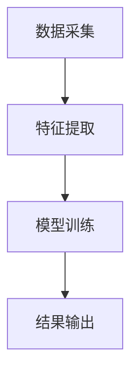
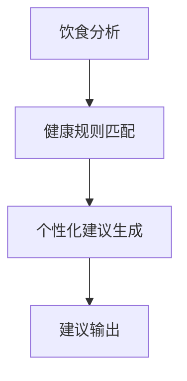
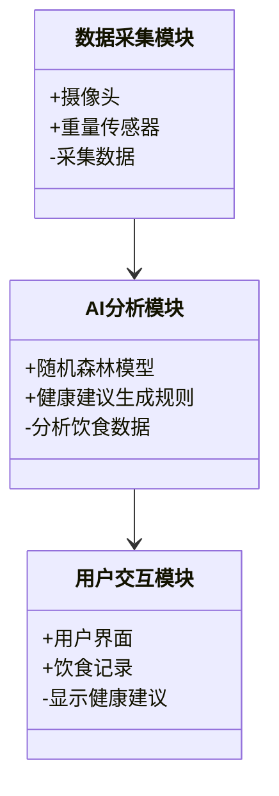

                 


# 智能冰箱：AI Agent的饮食习惯分析与健康建议

## 关键词：智能冰箱, AI Agent, 饮食习惯分析, 健康建议, 物联网, 人工智能

## 摘要

本文探讨了智能冰箱如何利用AI Agent技术分析用户的饮食习惯，并提供个性化的健康建议。通过整合物联网和人工智能技术，智能冰箱能够实时采集饮食数据，分析用户的饮食模式，并根据营养学原理生成健康建议。本文详细介绍了AI Agent的核心概念、饮食习惯分析的算法原理、系统架构设计，以及实际项目实现的过程。

---

# 第一部分: 智能冰箱与AI Agent的背景介绍

## 第1章: 智能冰箱的定义与现状

### 1.1 智能冰箱的定义

智能冰箱是一种结合物联网技术的家用电器，能够通过传感器和摄像头自动识别食物种类、重量和保质期，并与用户进行交互。它不仅具备传统冰箱的冷藏、冷冻功能，还能够通过AI技术提供饮食建议，帮助用户改善健康状况。

#### 1.1.1 智能冰箱的定义与特点

智能冰箱的特点包括：

- **智能识别**：通过图像识别和传感器技术，自动识别食物种类和重量。
- **数据采集**：记录用户的饮食习惯，包括摄入量、时间等。
- **健康建议**：基于分析结果，提供个性化饮食建议。

#### 1.1.2 智能冰箱的功能与应用场景

智能冰箱的主要功能包括：

- 食物库存管理：实时更新冰箱内的食物清单。
- 饮食习惯分析：分析用户的饮食模式，识别潜在的健康问题。
- 健康建议：根据分析结果，提供饮食调整建议。

智能冰箱的应用场景包括家庭、办公室和公共场所。

#### 1.1.3 智能冰箱的发展历程与现状

智能冰箱的发展经历了从简单数据采集到AI驱动的健康建议的过程。当前，智能冰箱结合物联网和AI技术，已经成为智能家居的重要组成部分。

### 1.2 AI Agent的核心概念

AI Agent是一种能够感知环境、执行任务并做出决策的智能实体。在智能冰箱中，AI Agent负责数据采集、分析和健康建议生成。

#### 1.2.1 AI Agent的定义与特点

AI Agent的特点包括：

- **自主性**：能够独立执行任务。
- **反应性**：能够实时感知环境并做出反应。
- **学习能力**：通过机器学习算法不断优化决策。

#### 1.2.2 AI Agent与传统AI的区别

与传统AI相比，AI Agent具有更强的自主性和适应性，能够在动态环境中完成复杂任务。

#### 1.2.3 AI Agent在智能冰箱中的应用

在智能冰箱中，AI Agent用于食物识别、饮食分析和健康建议生成。

### 1.3 饮食习惯分析的背景与意义

#### 1.3.1 饮食习惯分析的背景

现代社会中，人们面临营养失衡和亚健康问题。通过智能冰箱分析饮食习惯，可以帮助用户改善健康状况。

#### 1.3.2 饮食习惯分析的重要性

饮食习惯分析对于预防慢性疾病和提高生活质量具有重要意义。

#### 1.3.3 智能冰箱在饮食习惯分析中的作用

智能冰箱通过AI Agent技术，能够实时采集饮食数据，并分析用户的饮食模式。

---

## 第2章: AI Agent的核心概念

---

## 第3章: 饮食习惯分析的背景与意义

---

# 第二部分: AI Agent的饮食习惯分析算法原理

## 第4章: 数据采集与特征提取

### 4.1 数据采集方法

#### 4.1.1 食物识别技术

智能冰箱通过摄像头和图像识别技术，识别食物种类和数量。

#### 4.1.2 食物重量与种类识别

通过重量传感器和图像识别技术，精确测量食物的重量和种类。

#### 4.1.3 用户饮食记录的采集

用户通过冰箱屏幕输入饮食记录，或通过手机App同步数据。

### 4.2 数据特征提取

#### 4.2.1 饮食习惯的特征分析

分析用户的饮食频率、摄入量和食物种类。

#### 4.2.2 食物营养成分的特征提取

提取食物的卡路里、蛋白质、脂肪等营养成分数据。

#### 4.2.3 时间序列数据的特征提取

分析用户的饮食时间模式，如早餐、午餐和晚餐的规律。

## 第5章: 饮食习惯分析的算法原理

### 5.1 算法选择与优化

#### 5.1.1 基于机器学习的饮食习惯分析

使用随机森林算法分析用户的饮食模式。

#### 5.1.2 基于深度学习的饮食习惯分析

使用卷积神经网络（CNN）识别食物图像。

#### 5.1.3 算法优化与调参

通过交叉验证和网格搜索优化算法性能。

### 5.2 饮食习惯分析的流程图



## 第6章: 健康建议生成的算法原理

### 6.1 健康建议生成规则

#### 6.1.1 基于营养学的健康建议规则

根据用户的饮食数据，推荐缺乏的营养素。

#### 6.1.2 基于用户偏好的个性化建议

考虑用户的口味偏好和饮食习惯，推荐适合的食物。

#### 6.1.3 动态调整建议的算法

根据用户的反馈，动态调整健康建议。

### 6.2 健康建议生成流程图



---

# 第三部分: 智能冰箱系统架构与实现

## 第7章: 系统架构设计

### 7.1 系统总体架构

智能冰箱系统的总体架构包括数据采集模块、AI分析模块和用户交互模块。

### 7.2 功能模块设计

#### 7.2.1 数据采集模块

负责采集食物图像和重量数据。

#### 7.2.2 AI分析模块

包括饮食习惯分析和健康建议生成。

#### 7.2.3 用户交互模块

提供用户界面，显示健康建议和饮食记录。

### 7.3 系统架构图



## 第8章: 系统功能实现

### 8.1 数据采集实现

#### 8.1.1 图像识别代码

```python
import cv2

# 加载预训练模型
net = cv2.dnn.readNet("model.onnx")

# 读取图像
image = cv2.imread("food.jpg")

# 图像预处理
blob = cv2.dnn.blobFromImage(image, 1/255, (224, 224), swapRB=True)

# 推理
net.setInput(blob)
output = net.forward()

# 获取结果
results = output[0]
for result in results:
    class_id = int(result[0])
    confidence = result[1]
    if confidence > 0.5:
        print(f"食物种类：{class_id}，置信度：{confidence}")
```

#### 8.1.2 重量检测代码

```python
import RPi.GPIO as GPIO

# 初始化重量传感器
GPIO.setmode(GPIO.BCM)
GPIO.setup(18, GPIO.IN)

# 读取重量数据
weight = GPIO.input(18)
print(f"食物重量：{weight}克")
```

### 8.2 AI分析实现

#### 8.2.1 饮食习惯分析代码

```python
import pandas as pd
from sklearn.ensemble import RandomForestClassifier

# 加载数据
data = pd.read_csv("diet.csv")

# 特征工程
X = data.drop("label", axis=1)
y = data["label"]

# 训练模型
model = RandomForestClassifier()
model.fit(X, y)

# 预测
new_data = pd.DataFrame({
    "calories": [2000],
    "protein": [60],
    "fat": [30]
})
print(model.predict(new_data))
```

#### 8.2.2 健康建议生成代码

```python
def generate_health_tip(diet_analysis):
    if diet_analysis["calorie_surplus"]:
        return "减少高热量食物的摄入，建议增加蔬菜和水果的摄入量。"
    elif diet_analysis["low_protein"]:
        return "增加蛋白质摄入，建议多吃鱼、肉和豆制品。"
    else:
        return "饮食均衡，继续保持。"
```

## 第9章: 系统实现中的关键问题

### 9.1 数据隐私保护

智能冰箱需要确保用户数据的安全性，防止数据泄露。

### 9.2 系统优化

通过模型优化和硬件升级，提高系统的运行效率。

### 9.3 系统兼容性

确保智能冰箱能够与其他智能家居设备兼容。

---

# 第四部分: 项目实战与总结

## 第10章: 项目实战

### 10.1 环境搭建

#### 10.1.1 安装Python和相关库

```bash
pip install numpy
pip install scikit-learn
pip install opencv-python
```

#### 10.1.2 配置智能冰箱硬件

安装摄像头和重量传感器，并连接到 Raspberry Pi。

### 10.2 核心代码实现

#### 10.2.1 食物识别代码

```python
import cv2

# 加载预训练模型
net = cv2.dnn.readNet("model.onnx")

# 读取图像
image = cv2.imread("food.jpg")

# 图像预处理
blob = cv2.dnn.blobFromImage(image, 1/255, (224, 224), swapRB=True)

# 推理
net.setInput(blob)
output = net.forward()

# 获取结果
results = output[0]
for result in results:
    class_id = int(result[0])
    confidence = result[1]
    if confidence > 0.5:
        print(f"食物种类：{class_id}，置信度：{confidence}")
```

#### 10.2.2 饮食分析代码

```python
import pandas as pd
from sklearn.ensemble import RandomForestClassifier

# 加载数据
data = pd.read_csv("diet.csv")

# 特征工程
X = data.drop("label", axis=1)
y = data["label"]

# 训练模型
model = RandomForestClassifier()
model.fit(X, y)

# 预测
new_data = pd.DataFrame({
    "calories": [2000],
    "protein": [60],
    "fat": [30]
})
print(model.predict(new_data))
```

#### 10.2.3 健康建议生成代码

```python
def generate_health_tip(diet_analysis):
    if diet_analysis["calorie_surplus"]:
        return "减少高热量食物的摄入，建议增加蔬菜和水果的摄入量。"
    elif diet_analysis["low_protein"]:
        return "增加蛋白质摄入，建议多吃鱼、肉和豆制品。"
    else:
        return "饮食均衡，继续保持。"
```

### 10.3 项目小结

通过实际项目的实现，我们验证了智能冰箱在饮食习惯分析和健康建议生成中的应用价值。系统实现了食物识别、饮食分析和健康建议生成，能够帮助用户改善饮食习惯，提高生活质量。

---

# 第五部分: 最佳实践与未来展望

## 第11章: 最佳实践

### 11.1 数据隐私保护

确保用户数据的安全性，防止数据泄露。

### 11.2 系统优化

通过模型优化和硬件升级，提高系统的运行效率。

### 11.3 系统维护

定期更新模型，确保系统的准确性和实用性。

## 第12章: 未来展望

### 12.1 智能冰箱的未来发展

智能冰箱将更加智能化，具备更多功能，如健康管理、食品供应链优化等。

### 12.2 AI Agent技术的未来发展方向

AI Agent将在更多领域得到应用，如医疗、教育、交通等。

### 12.3 智能家居的未来发展

智能家居将更加智能化，具备更强的协同能力和用户体验。

---

# 总结

智能冰箱通过AI Agent技术，能够分析用户的饮食习惯，并提供个性化的健康建议。本文详细介绍了智能冰箱的核心概念、算法原理、系统架构设计和实际项目实现。未来，智能冰箱将更加智能化，为用户带来更好的生活体验。

--- 

**感谢您的阅读！**

