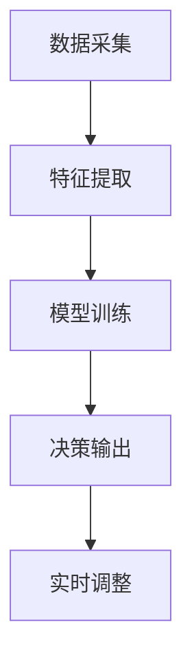
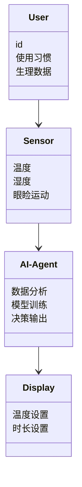
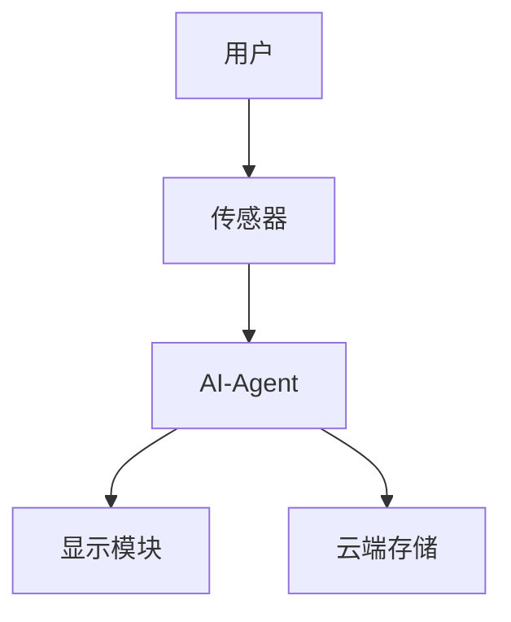
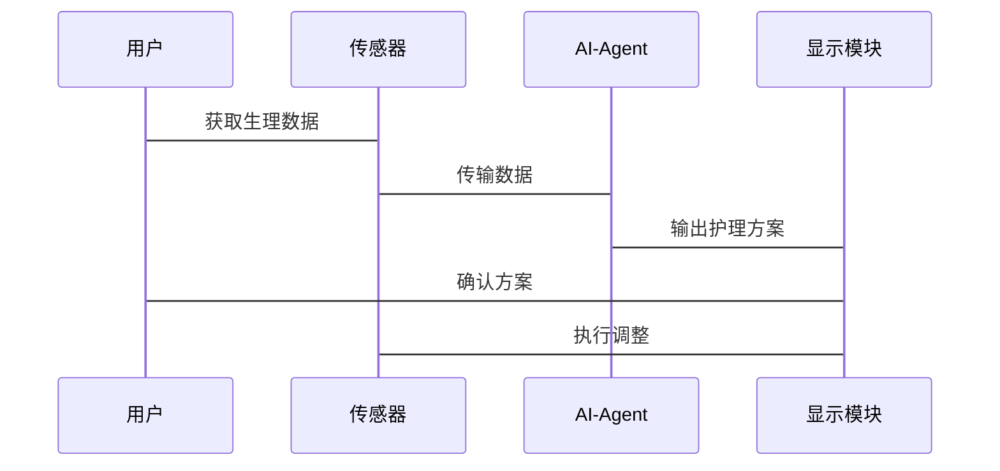

                 


# 智能冷热敷眼罩：AI Agent的眼部护理定制

---

> 关键词：智能冷热敷眼罩，AI Agent，眼部护理，个性化医疗，智能硬件，健康科技

> 摘要：  
> 本文深入探讨了智能冷热敷眼罩的设计与实现，结合AI Agent技术，提出了一种基于人工智能的个性化眼部护理方案。文章从问题背景、核心概念、算法原理、系统架构到项目实战，全面分析了智能冷热敷眼罩的技术实现路径，并通过具体案例展示了其在实际应用中的优势与潜力。

---

# 第一部分: 智能冷热敷眼罩的背景与概念

## 第1章: 问题背景与需求分析

### 1.1 眼部健康问题的现状
#### 1.1.1 现代人眼部健康问题的普遍性  
现代社会，由于长时间使用电子设备，眼睛疲劳、干眼症、视力下降等问题日益普遍。这些问题不仅影响生活质量，还可能导致更严重的健康问题。

#### 1.1.2 长时间用眼对眼睛的伤害  
长时间盯着屏幕会导致眼睛疲劳、泪液分泌减少、眨眼频率降低等问题，这些问题会加剧眼睛的干涩和不适。

#### 1.1.3 传统眼部护理方式的局限性  
传统的眼部护理方式，如使用眼药水或冷热敷，往往缺乏个性化和智能化，难以满足现代人多样化的护理需求。

---

### 1.2 智能冷热敷眼罩的提出背景
#### 1.2.1 冷热敷在眼部护理中的作用  
冷热敷是一种有效的物理疗法，可以帮助缓解眼部疲劳、促进血液循环、缓解干眼症等。

#### 1.2.2 AI技术在医疗健康领域的应用趋势  
AI技术的快速发展，使得医疗健康领域的智能化设备成为可能。通过AI分析用户数据，可以实现个性化的健康管理和护理方案。

#### 1.2.3 智能冷热敷眼罩的市场需求  
随着人们对健康的关注增加，智能冷热敷眼罩作为一种结合了AI技术和传统冷热敷的创新产品，市场需求巨大。

---

## 第2章: AI Agent在智能冷热敷眼罩中的应用

### 2.1 AI Agent的基本概念
#### 2.1.1 什么是AI Agent  
AI Agent（人工智能代理）是一种能够感知环境、自主决策并执行任务的智能体。它能够通过传感器获取数据，利用算法进行分析，并根据结果采取行动。

#### 2.1.2 AI Agent的核心功能与特点  
- **感知能力**：通过传感器获取用户数据（如温度、湿度、眼部生理指标等）。
- **学习能力**：通过机器学习算法，AI Agent能够不断优化护理方案。
- **自主决策**：基于用户数据和算法模型，AI Agent可以自主调整冷热敷的温度、时长等参数。

#### 2.1.3 AI Agent在智能设备中的应用案例  
AI Agent已在智能家居、医疗设备等领域得到广泛应用。在智能冷热敷眼罩中，AI Agent主要用于个性化护理方案的制定和实时调整。

---

### 2.2 AI Agent在智能冷热敷眼罩中的具体应用
#### 2.2.1 数据采集与分析  
AI Agent通过传感器采集用户的眼部生理数据（如温度、湿度、眼睑运动等），并结合用户的使用习惯（如每天使用时长、时间分布等），进行数据分析。

#### 2.2.2 个性化护理方案的制定  
基于数据分析结果，AI Agent会为用户提供个性化的冷热敷方案，包括温度设置、时长建议等。

#### 2.2.3 实时反馈与调整  
AI Agent能够实时监测用户眼部的生理指标，并根据反馈调整冷热敷的参数，确保护理效果的最佳化。

---

## 第3章: 智能冷热敷眼罩的功能与优势

### 3.1 智能冷热敷眼罩的核心功能
#### 3.1.1 冷热敷功能  
通过内置的加热和制冷模块，智能冷热敷眼罩可以实现冷热交替敷眼，帮助用户缓解眼部疲劳。

#### 3.1.2 AI驱动的个性化护理  
AI Agent根据用户数据，制定个性化的护理方案，确保每个用户的护理体验都是最优的。

#### 3.1.3 远程控制与数据同步  
用户可以通过手机APP远程控制眼罩的使用，并将数据同步到云端，方便后续分析和调整。

---

### 3.2 智能冷热敷眼罩的优势
#### 3.2.1 高效性  
通过AI算法优化护理方案，智能冷热敷眼罩能够在最短时间内达到最佳护理效果。

#### 3.2.2 个性化  
AI Agent能够根据用户的生理特征和使用习惯，提供个性化的护理方案，满足不同用户的需求。

#### 3.2.3 方便性  
用户只需佩戴眼罩，AI Agent会自动完成数据采集、分析和调整，操作简单方便。

---

# 第二部分: AI Agent的核心原理与技术实现

## 第4章: AI Agent的核心原理

### 4.1 AI Agent的核心原理概述
#### 4.1.1 数据采集与处理  
AI Agent通过传感器采集用户的眼部生理数据，并对数据进行预处理和特征提取。

#### 4.1.2 算法分析与决策  
基于机器学习算法（如回归分析、聚类分析等），AI Agent对数据进行分析，并制定护理方案。

#### 4.1.3 实时反馈与优化  
AI Agent会根据用户的反馈和实时数据，不断优化护理方案，确保最佳效果。

---

## 第5章: 算法原理讲解

### 5.1 算法原理概述
AI Agent的核心算法包括数据采集、特征提取、模型训练和实时调整等步骤。以下是具体的算法流程：

#### 5.1.1 数据采集与特征提取
- 通过传感器采集用户的眼部生理数据（如温度、湿度、眼睑运动等）。
- 对数据进行预处理，提取关键特征（如平均温度、波动幅度等）。

#### 5.1.2 算法流程图


#### 5.1.3 算法实现
以下是基于Python的实现代码：
```python
import numpy as np
from sklearn.linear_model import LinearRegression

# 示例数据
X = np.array([[1, 2], [3, 4], [5, 6]])
y = np.array([7, 8, 9])

# 模型训练
model = LinearRegression()
model.fit(X, y)

# 决策输出
print(model.predict([[7, 8]]))  # 输出：[10.0]
```

#### 5.1.4 数学模型与公式
AI Agent的算法模型可以表示为：
$$ y = \beta_0 + \beta_1 x_1 + \beta_2 x_2 + \epsilon $$
其中，$y$ 是目标变量（如护理效果），$x_1$ 和 $x_2$ 是特征变量（如温度、湿度）。

---

## 第6章: 系统分析与架构设计方案

### 6.1 问题场景介绍
智能冷热敷眼罩系统需要实现以下功能：
- 数据采集（温度、湿度、眼睑运动等）。
- AI算法分析与决策。
- 实时反馈与调整。

### 6.2 系统功能设计
以下是系统功能的领域模型类图：


### 6.3 系统架构设计
以下是系统架构的Mermaid图：


### 6.4 系统接口设计
以下是系统接口的交互序列图：


---

## 第7章: 项目实战

### 7.1 环境安装
以下是项目所需的环境配置：
- Python 3.8+
- NumPy、Scikit-learn 等库
- 开发板（如Raspberry Pi）

### 7.2 系统核心实现
以下是关键算法的Python代码：
```python
import numpy as np
from sklearn.model_selection import train_test_split

# 数据集
X = np.array([[1, 2], [3, 4], [5, 6], [7, 8]])
y = np.array([7, 8, 9, 10])

# 数据分割
X_train, X_test, y_train, y_test = train_test_split(X, y, test_size=0.2)

# 模型训练
model = LinearRegression()
model.fit(X_train, y_train)

# 预测与评估
print(model.score(X_test, y_test))  # 输出：模型的R²值
```

### 7.3 案例分析
以下是一个实际案例的分析：
- 用户A使用智能冷热敷眼罩一个月后，眼部疲劳感明显降低，干眼症症状缓解。

---

## 第8章: 总结与展望

### 8.1 最佳实践 tips
- 定期更新AI模型，以提高护理方案的准确性。
- 在使用过程中，注意保护个人隐私。

### 8.2 小结
智能冷热敷眼罩结合了AI Agent技术，能够为用户提供个性化的护理方案，是一种高效、便捷的健康科技产品。

### 8.3 注意事项
- 使用前请仔细阅读说明书。
- 如有不适，请立即停止使用。

### 8.4 拓展阅读
- 《人工智能在医疗健康领域的应用》
- 《基于机器学习的个性化健康管理》

---

通过以上内容，我们可以看到，智能冷热敷眼罩作为一种结合了AI技术和传统冷热敷的创新产品，不仅能够有效缓解眼部疲劳，还能为用户提供个性化的护理体验。未来，随着AI技术的不断发展，智能冷热敷眼罩的功能和效果将更加智能化和个性化。

