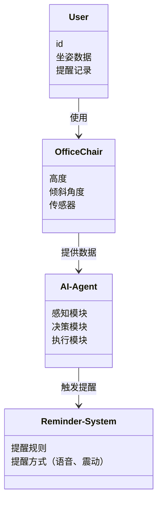
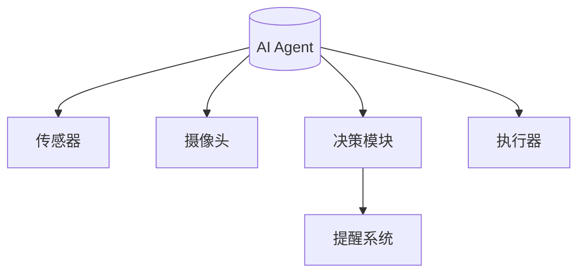
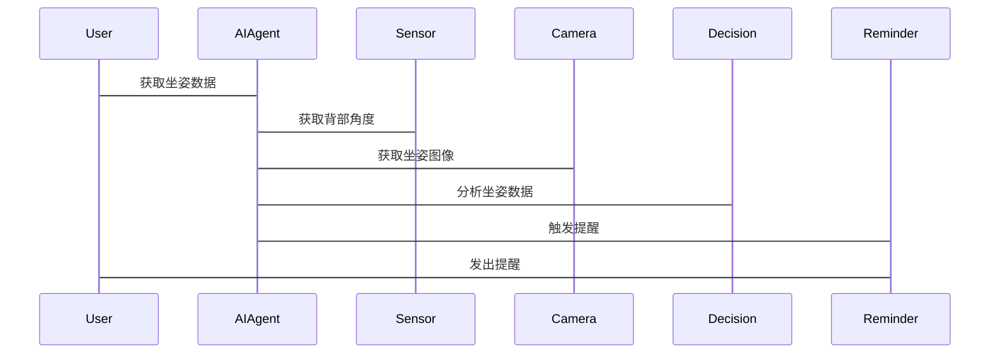

                 


# 智能办公桌：AI Agent的久坐提醒与姿势矫正

---

## 关键词：  
智能办公桌，AI Agent，久坐提醒，姿势矫正，健康办公，人工智能，人体工学

---

## 摘要：  
随着科技的发展，久坐问题和姿势矫正已成为现代办公环境中的重要议题。本文将探讨如何通过AI Agent技术实现智能办公桌的久坐提醒与姿势矫正功能。文章从背景介绍、核心概念、算法原理、系统架构到项目实战，全面分析智能办公桌的设计与实现。通过结合AI技术与人体工学，提出一种创新的解决方案，为用户提供更健康、更高效的办公体验。

---

## 第一部分：背景介绍

### 第1章：久坐问题与姿势矫正的背景

#### 1.1 久坐问题的现状与危害  
现代社会中，久坐已成为一种普遍现象，尤其是在办公室环境中。长时间的坐姿不当不仅会导致腰背疼痛，还可能引发颈椎病、椎间盘突出等健康问题。根据世界卫生组织的统计，久坐被认为是导致心血管疾病、糖尿病等多种慢性疾病的重要诱因之一。因此，如何减少久坐时间、改善坐姿，成为现代办公环境中亟待解决的问题。

#### 1.2 传统办公桌的局限性  
传统办公桌的功能相对单一，仅能满足基本的办公需求，无法对用户的坐姿进行实时监测和提醒。此外，传统办公桌缺乏智能化的交互方式，无法与用户的使用习惯和需求进行动态调整。这些问题使得传统办公桌难以满足现代人对健康办公的需求。

#### 1.3 AI Agent的引入与应用前景  
AI Agent（人工智能代理）是一种能够感知环境、自主决策并执行任务的智能系统。通过引入AI Agent技术，智能办公桌可以实时监测用户的坐姿，识别久坐行为，并通过语音、震动等方式提醒用户调整坐姿。AI Agent的应用不仅能够有效改善用户的健康状况，还能提升办公效率，为未来的智能办公环境奠定基础。

---

## 第二部分：智能办公桌的核心概念与AI Agent的联系

### 第2章：智能办公桌与AI Agent的核心概念

#### 2.1 智能办公桌的定义与特点  
智能办公桌是一种集成多种智能技术的办公设备，能够通过传感器、摄像头等硬件设备感知用户的坐姿和行为，并通过AI算法进行分析和判断。其特点包括：  
1. **智能化**：能够自主学习和适应用户的使用习惯。  
2. **实时监测**：通过传感器实时监测用户的坐姿和行为。  
3. **主动提醒**：在检测到异常坐姿或久坐行为时，主动发出提醒。  
4. **可调节性**：能够根据用户的需求进行高度、角度等参数的自动调节。  

#### 2.2 AI Agent的定义与特性  
AI Agent是一种能够感知环境、自主决策并执行任务的智能系统。其主要特性包括：  
1. **感知能力**：通过传感器、摄像头等设备感知环境和用户行为。  
2. **决策能力**：基于感知数据，通过算法进行分析和判断，生成相应的决策。  
3. **执行能力**：根据决策结果，通过硬件设备执行相应的操作，例如发出提醒、调整桌椅高度等。  

#### 2.3 智能办公桌与AI Agent的关系  
智能办公桌作为AI Agent的载体，为AI Agent提供了硬件支持和数据来源。AI Agent则通过分析智能办公桌提供的数据，实现对用户坐姿和行为的实时监测与提醒。两者结合，形成了一个完整的智能办公生态系统。

---

## 第三部分：AI Agent的算法原理与数学模型

### 第3章：AI Agent的算法原理

#### 3.1 AI Agent的感知与决策算法  
AI Agent的感知与决策算法是实现久坐提醒和姿势矫正的核心技术。以下是其实现流程：  
1. **感知阶段**：通过传感器和摄像头获取用户的坐姿数据，例如背部角度、头部位置、手腕高度等。  
2. **数据预处理**：对获取的数据进行去噪和归一化处理，确保数据的准确性和一致性。  
3. **特征提取**：从预处理后的数据中提取关键特征，例如坐姿的倾斜角度、坐姿的持续时间等。  
4. **决策阶段**：基于特征数据，通过机器学习算法（如随机森林、支持向量机）进行分类，判断用户的坐姿是否符合健康标准。  

#### 3.2 姿态检测的数学模型  
姿态检测的数学模型是AI Agent实现姿势矫正的关键。以下是常见的两种模型：  

**1. 基于几何模型的姿势检测**  
通过几何模型分析用户的坐姿，计算坐姿的倾斜角度和偏离程度。  
公式：  
$$ \text{倾斜角度} = \arctan\left(\frac{\text{背部高度差}}{\text{水平距离}}\right) $$  

**2. 基于深度学习的姿势检测**  
通过卷积神经网络（CNN）对用户的坐姿进行实时检测，输出坐姿的置信度和位置信息。  

#### 3.3 久坐提醒的预测模型  
久坐提醒的预测模型主要用于预测用户在短时间内是否会保持久坐状态。以下是其实现步骤：  
1. **数据收集**：收集用户的坐姿数据和坐姿时间。  
2. **数据建模**：建立时间序列模型（如ARIMA、LSTM），预测用户的坐姿时间是否超过阈值。  
3. **提醒策略**：当预测结果显示坐姿时间将超过阈值时，触发提醒机制。  

---

## 第四部分：系统分析与架构设计

### 第4章：系统功能设计

#### 4.1 问题场景介绍  
智能办公桌需要在以下场景中发挥作用：  
- 用户长时间保持不良坐姿，需要实时提醒。  
- 用户久坐，需要定期提醒起身活动。  

#### 4.2 领域模型设计  
以下是领域模型的类图：  



#### 4.3 系统架构设计  
以下是系统架构图：  



#### 4.4 系统接口设计  
以下是系统接口设计：  

- **传感器接口**：用于获取用户的坐姿数据，例如背部角度、手腕高度等。  
- **摄像头接口**：用于获取用户的坐姿图像，进行姿势检测。  
- **提醒接口**：用于向用户发出提醒，例如语音提醒、震动提醒等。  

#### 4.5 系统交互流程  
以下是系统交互流程图：  



---

## 第五部分：项目实战

### 第5章：AI Agent的实现与优化

#### 5.1 环境安装  
以下是实现AI Agent所需的环境配置：  
- **硬件环境**：安装摄像头、传感器等设备。  
- **软件环境**：安装Python、OpenCV、TensorFlow等工具。  

#### 5.2 核心代码实现  
以下是AI Agent的核心代码示例：  

```python
import numpy as np
from sklearn.ensemble import RandomForestClassifier

class AI_Agent:
    def __init__(self):
        self.model = RandomForestClassifier()

    def感知(self, 坐姿数据):
        # 数据预处理
        processed_data = self._预处理(坐姿数据)
        # 特征提取
        features = self._提取特征(processed_data)
        return features

    def 决策(self, 特征):
        # 预测坐姿是否异常
        预测结果 = self.model.predict(特征)
        return 预测结果

    def 执行(self, 预测结果):
        if 预测结果 == "异常":
            # 触发提醒
            self._发送提醒()
        else:
            # 调整桌椅高度
            self._调整高度()

    def _预处理(self, 坐姿数据):
        # 数据去噪和归一化处理
        去噪数据 = 坐姿数据.drop(columns=["噪声"])
        归一化数据 = (去噪数据 - 去噪数据.mean()) / 去噪数据.std()
        return 归一化数据

    def _提取特征(self, processed_data):
        # 提取关键特征
        特征 = processed_data[['背部角度', '手腕高度', '头部位置']]
        return 特征

    def _发送提醒(self):
        # 发出语音或震动提醒
        print("请调整坐姿！")

    def _调整高度(self):
        # 调整桌椅高度
        print("桌椅高度已调整为舒适位置。")

# 示例用法
agent = AI_Agent()
坐姿数据 = pd.DataFrame({'背部角度': [90, 85, 100], '手腕高度': [30, 25, 35], '头部位置': [60, 65, 70]})
特征 = agent.感知(坐姿数据)
预测结果 = agent.决策(特征)
agent.执行(预测结果)
```

#### 5.3 代码解读与分析  
上述代码实现了AI Agent的核心功能，包括数据预处理、特征提取、模型预测和执行操作。通过随机森林算法对坐姿数据进行分类，判断坐姿是否异常，并根据预测结果触发相应的提醒或调整桌椅高度。

#### 5.4 项目小结  
通过项目实战，我们可以看到AI Agent在智能办公桌中的应用潜力。然而，实际应用中还需要考虑硬件设备的精度、算法的实时性和用户体验等问题。

---

## 第六部分：最佳实践与总结

### 第6章：最佳实践与注意事项

#### 6.1 小结  
智能办公桌结合AI Agent技术，能够有效解决久坐问题和姿势矫正的痛点。通过实时监测用户的坐姿，AI Agent能够在第一时间发出提醒，帮助用户保持良好的坐姿，从而改善健康状况。

#### 6.2 注意事项  
1. **硬件精度**：传感器和摄像头的精度直接影响坐姿检测的准确性。  
2. **算法优化**：需要不断优化AI算法，提高坐姿检测的准确性和实时性。  
3. **用户体验**：提醒方式需要多样化，避免打扰用户的正常工作。  

#### 6.3 拓展阅读  
- 推荐阅读《人工智能在健康领域的应用》。  
- 推荐参考GitHub上的开源AI Agent项目。  

---

## 附录

### 附录A：术语表  
- AI Agent：人工智能代理  
- 姿势检测：通过技术手段检测用户的坐姿状态  
- 时间序列模型：用于预测用户久坐时间的算法  

### 附录B：参考文献  
1. 《人工智能技术与健康办公》  
2. 《基于深度学习的姿势检测算法研究》  

---

以上是《智能办公桌：AI Agent的久坐提醒与姿势矫正》的完整目录大纲和部分内容。

