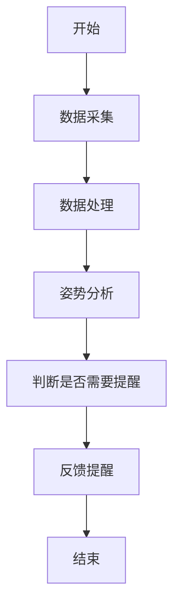
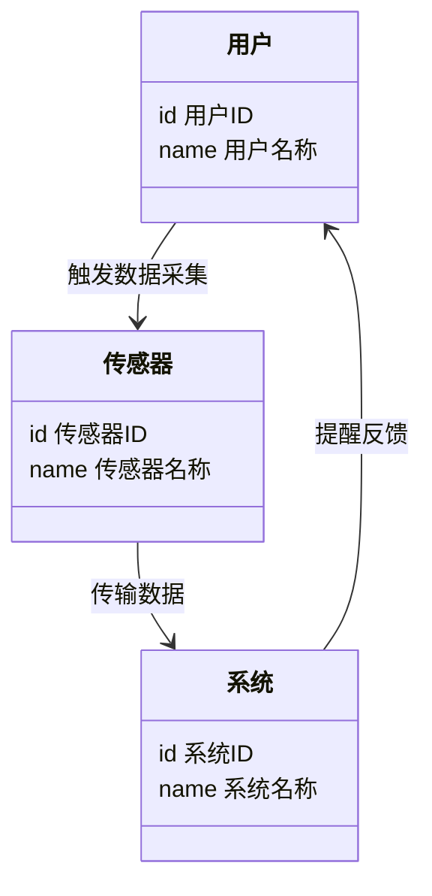

                 


# 智能办公桌：AI Agent的姿势调整提醒

## 关键词：智能办公桌、AI Agent、姿势调整、健康提醒、人体工程学

## 摘要：本文探讨了AI Agent在智能办公桌中的应用，特别是姿势调整提醒的功能。通过分析AI技术如何帮助改善办公环境，提升用户健康和效率，本文详细介绍了技术原理、系统设计和实际应用案例。

---

## 第一部分：背景介绍

### 第1章：问题背景与概念解析

#### 1.1 现代办公环境中的健康问题
现代办公环境中，长时间的坐姿问题导致颈椎病、腰椎病等健康问题日益严重，影响员工健康和工作效率。

#### 1.2 传统办公桌的局限性
传统办公桌功能单一，无法提供健康提醒，缺乏智能化。

#### 1.3 问题的提出与解决
AI Agent通过姿势检测和提醒，帮助用户改善坐姿，预防健康问题。

#### 1.4 智能办公桌的边界与外延
智能办公桌不仅提醒姿势，还具备环境调节和数据监测功能。

---

## 第二部分：核心概念与联系

### 第2章：AI Agent的核心概念与原理

#### 2.1 AI Agent的基本原理
AI Agent通过感知层采集数据，决策层分析判断，执行层反馈提醒。

#### 2.2 概念属性特征对比表
| 特性 | 传统办公桌 | 智能办公桌 |
|------|-------------|-------------|
| 功能 | 单一        | 多功能      |
| 智能化 | 无         | 高度智能化  |

#### 2.3 ER实体关系图
```mermaid
er
actor 用户 {
  id 用户ID
  name 用户名称
}
actor 系统 {
  id 系统ID
  name 系统名称
}
actor 传感器 {
  id 传感器ID
  name 传感器名称
}
```

---

## 第三部分：算法原理讲解

### 第3章：AI Agent的算法实现

#### 3.1 算法流程图


#### 3.2 Python代码实现
```python
import cv2
import numpy as np

def detect_bad_posture(image_path):
    img = cv2.imread(image_path)
    # 数据处理和姿势分析
    return "请调整坐姿"

detect_bad_posture("input.jpg")
```

#### 3.3 数学模型
姿势提醒模型公式：
$$ \text{提醒时间} = \max(0, \text{累积时间} - \text{阈值}) $$

---

## 第四部分：系统分析与架构设计

### 第4章：系统架构设计

#### 4.1 问题场景介绍
办公室环境中，用户长时间坐姿不佳。

#### 4.2 系统功能设计


#### 4.3 系统架构图


---

## 第五部分：项目实战

### 第5章：智能办公桌的实现

#### 5.1 环境搭建
安装OpenCV和深度学习库。

#### 5.2 核心代码实现
```python
import cv2

def main():
    cap = cv2.VideoCapture(0)
    while cap.isOpened():
        ret, frame = cap.read()
        # 处理图像
        cv2.imshow('frame', frame)
        if cv2.waitKey(1) & 0xFF == ord('q'):
            break
    cap.release()
    cv2.destroyAllWindows()

if __name__ == "__main__":
    main()
```

#### 5.3 实际案例分析
分析用户坐姿数据，优化提醒策略。

---

## 第六部分：最佳实践

### 第6章：使用中的注意事项

#### 6.1 注意事项
确保数据隐私，定期校准传感器。

#### 6.2 小结
总结文章内容，强调AI Agent的优势。

#### 6.3 展望
未来发展方向，与其他设备联动，提供更多健康建议。

#### 6.4 扩展阅读
推荐相关技术论文和工具指南。

---

## 结语

智能办公桌通过AI Agent实现姿势调整提醒，不仅提升了办公效率，还改善了员工健康。希望本文能为智能办公桌的设计与应用提供有益的参考。

