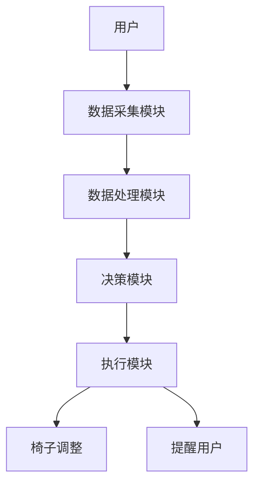

                 


# 智能办公椅：AI Agent的久坐提醒与姿势矫正

> 关键词：智能办公椅、AI Agent、久坐提醒、姿势矫正、物联网、人工智能

> 摘要：本文深入探讨了智能办公椅在AI Agent技术下的久坐提醒与姿势矫正功能。通过分析其核心算法、系统架构和实际应用，揭示了如何利用人工智能技术改善办公环境，提升用户健康和工作效率。

---

## 第一部分：背景与核心概念

### 第1章：久坐问题与智能办公椅的引入

#### 1.1 久坐问题的背景与现状
现代办公环境中，久坐已成为一个严重的健康问题。长时间保持不良姿势不仅会导致背部疼痛，还可能引发颈椎病、腰椎病等职业病。据统计，全球超过80%的办公族存在因久坐导致的健康问题。随着远程办公和灵活工作模式的普及，这一问题变得更加普遍。

#### 1.2 智能办公椅的定义与特点
智能办公椅是一种结合了物联网和人工智能技术的办公椅，能够实时监测用户的坐姿和坐姿时长，并通过AI Agent主动提供健康提醒和姿势矫正。其特点包括：
- **智能感知**：通过传感器实时监测用户坐姿和压力分布。
- **主动提醒**：当检测到用户久坐或坐姿不当时，通过震动或语音提醒用户调整姿势。
- **姿势矫正**：通过内置马达或气囊，智能调整椅背或扶手，帮助用户保持正确坐姿。

#### 1.3 AI Agent在智能办公椅中的应用
AI Agent（人工智能代理）是一种能够感知环境、自主决策并执行任务的智能系统。在智能办公椅中，AI Agent负责：
- **数据采集**：通过传感器获取用户的坐姿数据。
- **数据分析**：利用算法判断用户的坐姿是否健康。
- **决策与执行**：根据分析结果，触发提醒或调整椅子。

### 第2章：智能办公椅的核心技术与实现原理

#### 2.1 AI Agent的感知模块
AI Agent的感知模块负责采集用户的坐姿数据，主要包括：
- **压力传感器**：用于监测用户坐姿时的压力分布。
- **姿态传感器**：用于检测用户的坐姿角度和位置。

#### 2.2 AI Agent的决策模块
决策模块负责分析感知数据，并判断是否需要提醒或矫正。其主要功能包括：
- **坐姿判断**：通过机器学习算法判断用户的坐姿是否健康。
- **久坐提醒**：当用户坐姿超过一定时长，触发提醒。

#### 2.3 AI Agent的执行模块
执行模块负责根据决策模块的指令，调整椅子或提醒用户。其主要功能包括：
- **震动提醒**：通过椅子的震动功能提醒用户调整坐姿。
- **姿势矫正**：通过椅子的马达或气囊调整椅背或扶手，帮助用户保持正确坐姿。

---

## 第二部分：算法原理

### 第3章：AI Agent的算法实现

#### 3.1 坐姿检测算法
坐姿检测算法主要基于深度学习和计算机视觉技术。通过摄像头或姿态传感器获取用户坐姿数据，并利用预训练的模型判断用户的坐姿是否健康。

#### 3.2 久坐提醒算法
久坐提醒算法基于时间戳和坐姿数据，当用户连续坐姿不健康超过一定时长时，触发提醒。

#### 3.3 姿势矫正算法
姿势矫正算法通过优化坐姿模型，计算出最佳坐姿，并通过椅子的调整功能帮助用户达到最佳坐姿。

---

## 第三部分：系统架构与设计

### 第4章：系统架构设计

#### 4.1 系统功能模块划分
智能办公椅的系统架构主要包括以下模块：
- **数据采集模块**：负责采集用户的坐姿数据。
- **数据处理模块**：负责对采集的数据进行分析和处理。
- **决策模块**：负责判断是否需要提醒或矫正。
- **执行模块**：负责根据决策模块的指令调整椅子或提醒用户。

#### 4.2 系统架构图
以下是智能办公椅的系统架构图：



---

## 第四部分：项目实战

### 第5章：智能办公椅的实现与优化

#### 5.1 环境安装
为了实现智能办公椅的功能，需要以下硬件和软件环境：
- **硬件**：压力传感器、姿态传感器、马达、气囊等。
- **软件**：Python、TensorFlow、ROS（机器人操作系统）等。

#### 5.2 核心代码实现
以下是智能办公椅的Python核心代码示例：

```python
import tensorflow as tf
import numpy as np

# 加载预训练模型
model = tf.keras.models.load_model('pose_correction_model.h5')

# 压力传感器数据
pressure_data = np.array([...])

# 姿态传感器数据
posture_data = np.array([...])

# 预测坐姿
prediction = model.predict(pressure_data[np.newaxis, ...])

# 判断是否需要提醒
if prediction[0][0] > 0.5:
    print("久坐提醒：请调整坐姿！")
```

#### 5.3 案例分析
通过实际案例分析，优化算法的准确性和响应速度。例如，通过调整模型参数和优化传感器数据采集频率，提高坐姿检测的准确性。

---

## 第五部分：总结与展望

### 第6章：总结与展望

#### 6.1 总结
智能办公椅通过AI Agent技术实现了久坐提醒和姿势矫正功能，能够有效改善用户的坐姿，预防职业病的发生。本文详细介绍了其核心技术、算法实现和系统架构，并通过实际案例展示了其应用价值。

#### 6.2 展望
未来，智能办公椅将更加智能化和个性化，例如通过AI Agent学习用户的习惯，提供更加精准的健康建议和个性化的姿势矫正方案。

---

## 第六部分：注意事项与拓展阅读

### 第7章：注意事项

- **数据隐私**：智能办公椅需要采集用户的健康数据，需注意数据隐私保护。
- **系统维护**：定期更新算法模型，确保系统的准确性和稳定性。
- **用户体验**：优化提醒方式和椅子的舒适度，提升用户体验。

### 第8章：拓展阅读

- **相关技术**：深度学习、计算机视觉、物联网技术。
- **应用场景**：智能家居、健康监测、办公自动化。

---

通过本文的详细分析，我们不仅了解了智能办公椅的技术实现，还可以进一步探索其在其他领域的应用潜力。

