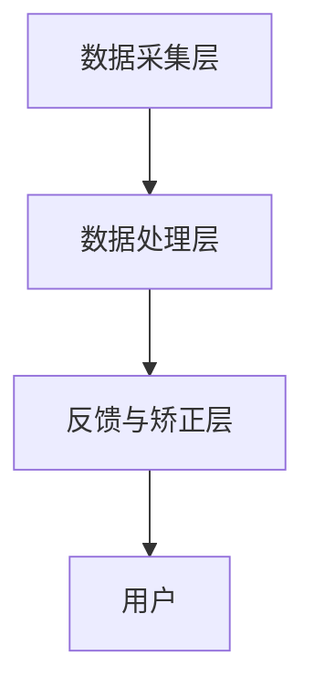

                 


# 智能办公椅：AI Agent的坐姿矫正系统

> 关键词：智能办公椅，AI Agent，坐姿矫正，人体工学，智能系统，健康办公

> 摘要：随着现代办公环境的不断变化，久坐导致的健康问题日益严重。本文介绍了一种基于AI Agent的智能办公椅坐姿矫正系统，通过深度学习和实时反馈机制，帮助用户保持正确的坐姿，预防和改善因不良坐姿引发的健康问题。文章详细阐述了系统的设计原理、算法实现、系统架构以及实际应用场景，为智能办公设备的开发提供了新的思路。

---

# 第一章：问题背景与描述

## 1.1 问题背景

现代办公环境中，久坐已成为一种普遍现象。根据世界卫生组织的数据，全球约有30%的成年人存在因久坐导致的健康问题。其中，最常见的问题包括腰椎病、颈椎病以及肌肉劳损等。这些问题的根源在于不良的坐姿习惯。

### 1.1.1 现代办公环境中的坐姿问题

在传统的办公环境中，员工的坐姿主要依赖个人的习惯和自我约束。然而，长时间的工作压力、缺乏运动以及办公设备的不科学设计，使得不良坐姿问题愈发严重。据统计，超过60%的办公室员工每天坐姿不正确，这不仅影响了工作效率，还对身体健康造成了严重威胁。

### 1.1.2 长期不良坐姿的危害

长期不良坐姿会导致以下问题：

- **骨骼问题**：脊柱变形、椎间盘突出。
- **肌肉问题**：肌肉疲劳、僵硬。
- **血液循环问题**：下肢水肿、静脉曲张。
- **呼吸问题**：胸椎变形影响肺部功能。

### 1.1.3 市场需求与技术可行性

近年来，市场上涌现出许多号称可以改善坐姿的办公椅，但大多数产品仅依赖机械结构实现简单的矫正功能，缺乏智能化和个性化。随着人工智能技术的发展，特别是深度学习和计算机视觉技术的进步，基于AI的坐姿矫正系统逐渐成为可能。

---

## 1.2 问题描述

### 1.2.1 坐姿矫正的定义与目标

坐姿矫正的目标是通过技术手段帮助用户保持正确的坐姿，减少因不良坐姿导致的健康问题。正确的坐姿要求包括：

- 头部：与身体保持自然垂直，视线与屏幕呈15度角。
- 肩部：放松且自然下垂，与肩胛骨保持对齐。
- 腰部：脊柱保持自然曲线，背部与靠背接触。
- 臀部：与椅子接触，双腿自然分开。

### 1.2.2 智能办公椅的功能需求

智能办公椅需要具备以下功能：

- **实时检测**：通过传感器或摄像头检测用户的坐姿。
- **智能反馈**：通过AI算法判断坐姿是否正确，并提供反馈。
- **主动矫正**：通过椅子的机械结构或外部设备（如震动提醒）进行矫正。
- **数据记录**：记录用户的坐姿数据，提供健康报告。

### 1.2.3 AI Agent在坐姿矫正中的作用

AI Agent（智能体）在坐姿矫正系统中的作用是：

- **数据采集**：通过摄像头或传感器采集用户的坐姿数据。
- **数据处理**：利用深度学习算法对坐姿数据进行分析和判断。
- **反馈与矫正**：根据分析结果，通过椅子或外部设备提供反馈和矫正。

---

## 1.3 问题解决与边界

### 1.3.1 AI Agent的解决方案

AI Agent通过以下步骤实现坐姿矫正：

1. 数据采集：利用摄像头或传感器获取用户的坐姿数据。
2. 数据分析：通过深度学习模型判断坐姿是否正确。
3. 矫正反馈：通过椅子的机械结构或外部设备提供反馈和矫正。

### 1.3.2 系统边界与功能范围

智能办公椅的坐姿矫正系统主要聚焦于坐姿检测和矫正功能，不涉及其他功能（如椅子的升降、倾斜等）。系统边界包括：

- 用户：系统的主要用户是长时间办公的员工。
- 环境：适用于办公室、家庭办公等场景。
- 功能：坐姿检测、反馈与矫正。

### 1.3.3 与现有技术的对比分析

现有技术主要依赖机械结构实现简单的坐姿矫正功能，而AI Agent的引入使得坐姿矫正系统具备以下优势：

- **智能化**：通过AI算法实现坐姿的实时检测和矫正。
- **个性化**：根据用户的坐姿习惯提供个性化的矫正建议。
- **高效性**：通过深度学习模型快速判断坐姿是否正确。

---

## 1.4 概念结构与核心要素

### 1.4.1 系统组成与功能模块

智能办公椅的坐姿矫正系统主要由以下模块组成：

- **数据采集模块**：通过摄像头或传感器采集用户的坐姿数据。
- **数据分析模块**：利用深度学习算法对坐姿数据进行分析。
- **反馈与矫正模块**：通过椅子的机械结构或外部设备提供反馈和矫正。

### 1.4.2 核心要素与属性

系统的核心要素包括：

- **坐姿数据**：用户坐姿的实时数据。
- **AI算法**：用于分析坐姿数据的深度学习模型。
- **反馈机制**：提供矫正反馈的方式。

### 1.4.3 系统架构的初步设想

初步的系统架构包括：

- **数据采集层**：负责采集坐姿数据。
- **数据处理层**：对坐姿数据进行分析和处理。
- **反馈与矫正层**：根据分析结果提供反馈和矫正。

---

# 第二章：AI Agent与坐姿矫正系统的核心原理

## 2.1 AI Agent的基本原理

### 2.1.1 AI Agent的定义与分类

AI Agent是一种能够感知环境、做出决策并采取行动的智能体。根据功能的不同，AI Agent可以分为以下几类：

- **反应式AI Agent**：根据当前环境信息做出反应。
- **认知式AI Agent**：具备推理和规划能力。

### 2.1.2 AI Agent的核心算法

AI Agent的核心算法包括：

- **深度学习**：用于图像识别和语音识别。
- **强化学习**：用于决策和优化。
- **自然语言处理**：用于人机交互。

### 2.1.3 AI Agent在坐姿矫正中的应用

在坐姿矫正系统中，AI Agent主要通过以下方式实现功能：

1. 数据采集：通过摄像头或传感器获取用户的坐姿数据。
2. 数据分析：利用深度学习模型判断坐姿是否正确。
3. 反馈与矫正：通过椅子的机械结构或外部设备提供反馈和矫正。

---

## 2.2 坐姿矫正系统的原理

### 2.2.1 坐姿检测的实现方法

坐姿检测的实现方法包括：

- **基于图像的检测**：通过摄像头采集用户的坐姿图像，利用深度学习模型进行检测。
- **基于传感器的检测**：通过压力传感器或惯性传感器采集坐姿数据。

### 2.2.2 坐姿矫正的算法设计

坐姿矫正算法的设计包括：

1. 数据预处理：对采集到的坐姿数据进行清洗和标准化。
2. 姿态估计：利用深度学习模型估计用户的坐姿。
3. 矫正反馈：根据姿态估计结果，通过椅子的机械结构或外部设备提供反馈和矫正。

### 2.2.3 系统反馈与用户交互

系统反馈与用户交互的方式包括：

- **视觉反馈**：通过显示器或LED灯提示坐姿是否正确。
- **触觉反馈**：通过震动或声音提示坐姿是否正确。
- **机械反馈**：通过椅子的机械结构调整坐姿。

---

## 2.3 核心概念对比与ER实体关系

### 2.3.1 核心概念对比表

| 对比维度 | AI Agent | 坐姿矫正系统 |
|----------|----------|--------------|
| 核心功能 | 智能决策 | 坐姿检测与矫正 |
| 输入方式 | 多模态输入（图像、传感器数据） | 坐姿数据 |
| 输出方式 | 行为指令（调整椅子高度、震动提醒） | 矫正反馈 |

### 2.3.2 ER实体关系图

```mermaid
erd
    用户
    坐姿数据
    AI Agent
    矫正反馈
    用户 <-- 关联 --> 坐姿数据
    AI Agent <-- 关联 --> 坐姿数据
    AI Agent <-- 关联 --> 矫正反馈
```

---

# 第三章：坐姿检测与矫正算法

## 3.1 算法原理

### 3.1.1 基于深度学习的坐姿检测

基于深度学习的坐姿检测主要采用以下步骤：

1. **数据采集**：通过摄像头采集用户的坐姿图像。
2. **数据预处理**：对图像进行标准化和增强处理。
3. **模型训练**：利用深度学习模型（如ResNet、YOLO）进行姿态估计。
4. **姿态检测**：通过模型输出用户的坐姿状态。

### 3.1.2 坐姿矫正算法的设计

坐姿矫正算法的设计包括：

1. **姿态估计**：通过深度学习模型估计用户的坐姿状态。
2. **矫正决策**：根据姿态估计结果，决定是否需要矫正。
3. **反馈与矫正**：通过椅子的机械结构或外部设备进行矫正。

### 3.1.3 算法优化与实现

算法优化的关键点包括：

- **模型优化**：通过模型压缩和量化技术优化模型性能。
- **数据优化**：通过数据增强和数据筛选提高模型的泛化能力。
- **计算优化**：通过并行计算和优化算法加速模型推理。

---

## 3.2 数学模型与公式

### 3.2.1 坐姿检测的数学模型

坐姿检测的数学模型主要基于深度学习模型。以下是一个典型的姿态估计模型的损失函数：

$$
\text{损失函数} = \text{分类损失} + \text{回归损失}
$$

其中，分类损失用于判断坐姿是否正确，回归损失用于精确定位姿态关键点。

### 3.2.2 坐姿矫正算法的数学模型

坐姿矫正算法的数学模型主要基于强化学习。以下是一个典型的强化学习模型的奖励函数：

$$
\text{奖励函数} = \text{坐姿正确性} \times \text{反馈强度}
$$

其中，坐姿正确性是通过姿态估计模型判断的，反馈强度是根据坐姿矫正的难易程度动态调整的。

---

# 第四章：系统架构与设计

## 4.1 系统架构设计

智能办公椅的坐姿矫正系统主要由以下模块组成：

- **数据采集层**：负责采集用户的坐姿数据。
- **数据处理层**：对坐姿数据进行分析和处理。
- **反馈与矫正层**：根据分析结果提供反馈和矫正。

### 4.1.1 系统功能设计

系统功能设计包括：

1. **数据采集**：通过摄像头或传感器采集用户的坐姿数据。
2. **数据分析**：利用深度学习模型分析坐姿数据。
3. **反馈与矫正**：通过椅子的机械结构或外部设备提供反馈和矫正。

### 4.1.2 系统架构图



---

## 4.2 系统接口与交互设计

### 4.2.1 系统接口设计

系统接口设计包括：

- **数据采集接口**：与摄像头或传感器连接，获取坐姿数据。
- **数据处理接口**：与深度学习模型连接，进行数据分析。
- **反馈与矫正接口**：与椅子的机械结构或外部设备连接，提供反馈和矫正。

### 4.2.2 系统交互流程

系统交互流程包括：

1. **用户坐姿采集**：用户坐姿数据被采集。
2. **数据分析**：坐姿数据被传输到数据处理层进行分析。
3. **矫正反馈**：根据分析结果，系统通过反馈与矫正层提供矫正反馈。

---

# 第五章：项目实战与案例分析

## 5.1 项目实战

### 5.1.1 环境安装

项目实战需要以下环境：

- **硬件环境**：摄像头、传感器、椅子机械结构。
- **软件环境**：深度学习框架（如TensorFlow、PyTorch）。

### 5.1.2 核心代码实现

以下是坐姿矫正系统的核心代码实现：

```python
import tensorflow as tf
from tensorflow.keras import layers

# 定义姿态估计模型
def pose_estimation_model():
    model = tf.keras.Sequential()
    model.add(layers.Conv2D(32, (3, 3), activation='relu', input_shape=(224, 224, 3)))
    model.add(layers.MaxPooling2D(pool_size=(2, 2)))
    model.add(layers.Conv2D(64, (3, 3), activation='relu'))
    model.add(layers.MaxPooling2D(pool_size=(2, 2)))
    model.add(layers.Flatten())
    model.add(layers.Dense(128, activation='relu'))
    model.add(layers.Dense(1, activation='sigmoid'))
    return model

# 训练模型
model = pose_estimation_model()
model.compile(optimizer='adam', loss='binary_crossentropy', metrics=['accuracy'])
model.fit(x_train, y_train, epochs=10, batch_size=32)
```

### 5.1.3 案例分析

以下是一个典型的坐姿矫正案例：

1. **数据采集**：用户坐姿数据被采集。
2. **数据分析**：坐姿数据被传输到数据处理层进行分析。
3. **矫正反馈**：根据分析结果，系统通过反馈与矫正层提供矫正反馈。

---

## 5.2 小结与展望

### 5.2.1 系统优势

智能办公椅的坐姿矫正系统具有以下优势：

- **智能化**：通过AI算法实现坐姿的实时检测和矫正。
- **个性化**：根据用户的坐姿习惯提供个性化的矫正建议。
- **高效性**：通过深度学习模型快速判断坐姿是否正确。

### 5.2.2 系统局限性

智能办公椅的坐姿矫正系统目前还存在以下局限性：

- **技术限制**：深度学习模型的计算资源需求较高。
- **用户体验**：反馈与矫正的舒适性和便捷性需要进一步优化。

### 5.2.3 未来展望

未来，随着人工智能技术的不断发展，智能办公椅的坐姿矫正系统将具备以下功能：

- **更智能化**：通过更先进的AI算法实现更精准的坐姿检测和矫正。
- **更个性化**：根据用户的健康数据提供个性化的坐姿矫正建议。
- **更便捷**：通过更先进的交互方式提供更便捷的用户体验。

---

# 第六章：最佳实践与注意事项

## 6.1 最佳实践

### 6.1.1 系统使用建议

- **定期校准**：确保系统的准确性。
- **用户培训**：通过培训提高用户的使用效果。

### 6.1.2 系统维护建议

- **定期更新**：确保系统的性能和功能。
- **故障排除**：及时解决系统故障。

## 6.2 注意事项

### 6.2.1 用户注意事项

- **初次使用**：建议在指导下使用。
- **注意事项**：避免长时间连续使用。

### 6.2.2 系统注意事项

- **环境要求**：确保系统的正常运行环境。
- **数据隐私**：确保用户数据的安全性。

---

# 第七章：总结与展望

## 7.1 小结

智能办公椅的坐姿矫正系统通过AI Agent实现了坐姿的实时检测和矫正，帮助用户保持正确的坐姿，预防和改善因不良坐姿引发的健康问题。本文详细阐述了系统的设计原理、算法实现、系统架构以及实际应用场景。

## 7.2 未来展望

随着人工智能技术的不断发展，智能办公椅的坐姿矫正系统将具备更智能化、更个性化、更便捷的功能。未来，我们将继续优化系统性能，提升用户体验，为智能办公设备的开发提供新的思路。

---

# 结语

智能办公椅的坐姿矫正系统是人工智能技术在办公健康领域的一个重要应用。通过本文的介绍，我们希望读者能够更好地理解AI在坐姿矫正中的作用，并为智能办公设备的开发提供新的思路。

---

