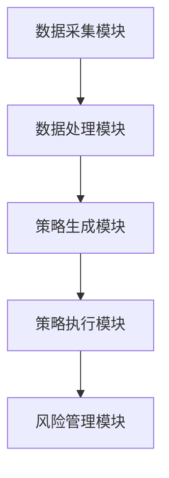

                 


# 智能加密货币交易策略

## 关键词：智能加密货币、交易策略、区块链、机器学习、技术分析、风险管理

## 摘要：  
智能加密货币交易策略是结合区块链技术、人工智能和大数据分析的高级交易方法，旨在通过自动化决策优化投资回报。本文将从背景与概述出发，详细分析加密货币市场的技术特点、机器学习算法的应用、系统架构设计，并通过实战案例展示如何构建智能交易策略，同时提供风险管理的最佳实践建议。

---

## 第一部分：智能加密货币交易策略的背景与概述

### 第1章：加密货币与智能交易策略概述

#### 1.1 加密货币的基本概念

##### 1.1.1 加密货币的定义与特点

加密货币是一种基于密码学的虚拟货币，具有去中心化、匿名性、不可篡改和全球流通的特点。与传统货币不同，加密货币的发行和交易通过区块链技术实现，确保了交易的安全性和透明性。

- **定义**：加密货币是一种数字资产，通过密码学算法确保其安全性和稀缺性。
- **特点**：
  - 去中心化：交易不依赖于中央机构，而是通过区块链节点达成共识。
  - 匿名性：交易记录仅显示地址，不涉及真实身份。
  - 不可篡改：区块链上的数据一旦写入，难以被修改。
  - 全球流通：加密货币可以在全球范围内自由交易和转账。

##### 1.1.2 加密货币的核心技术：区块链

区块链是加密货币的核心技术，通过分布式账本记录交易信息，确保数据的安全性和一致性。

- **区块链的基本结构**：由区块和链组成，每个区块包含交易记录和时间戳，通过哈希值连接成链。
- **共识机制**：如比特币的PoW（工作量证明）和以太坊的PoS（权益证明），确保网络的安全性和一致性。
- **智能合约**：允许在区块链上自动执行预设的条件，进一步扩展了加密货币的应用场景。

##### 1.1.3 加密货币的分类与应用场景

加密货币可以根据用途、发行机制和共识机制进行分类：

- **分类**：
  - 按用途：支付型（如比特币）、价值存储型（如黄金币）、平台币（如以太坊）。
  - 按发行机制：PoW、PoS、Dpos等。
  - 按技术特点：UTXO（如比特币）、账户模型（如以太坊）。

- **应用场景**：
  - 支付：跨境支付、小额支付。
  - 投资：作为一种投资资产，用于增值。
  - DeFi：去中心化金融，如借贷、交易。
  - NFT：非同质化代币，用于数字资产确权。

##### 1.1.4 加密货币的市场规模与增长趋势

加密货币市场近年来迅速增长，市场规模已超过数万亿美元。比特币和以太坊等主流币种占据较大市场份额，而新兴币种也在不断涌现，推动市场的多元化发展。

---

#### 1.2 智能交易策略的定义与特点

##### 1.2.1 智能交易策略的定义

智能交易策略是一种基于算法和人工智能的交易方法，通过分析市场数据和市场行为，自动执行交易决策。

- **定义**：智能交易策略是指利用计算机算法和人工智能技术，自动分析市场数据并做出交易决策的策略。
- **特点**：
  - 自动化：无需人工干预，系统自动执行交易。
  - 高频交易：能够在极短时间内完成大量交易，捕捉市场微小波动。
  - 智能学习：能够通过机器学习不断优化交易模型。

##### 1.2.2 智能交易策略的核心要素

智能交易策略的核心要素包括数据采集、模型构建、策略执行和风险管理。

- **数据采集**：获取市场数据，如价格、成交量、订单簿等。
- **模型构建**：使用机器学习、统计套利等方法构建交易模型。
- **策略执行**：根据模型预测结果自动执行交易。
- **风险管理**：控制交易风险，避免重大损失。

##### 1.2.3 智能交易策略与传统交易策略的区别

智能交易策略与传统交易策略的主要区别在于自动化、高频交易和智能学习能力。

- **自动化**：智能交易策略能够自动分析数据并执行交易，而传统策略需要人工决策。
- **高频交易**：智能交易策略能够在极短时间内完成大量交易，捕捉市场微小波动，而传统策略通常以较低频次进行交易。
- **智能学习**：智能交易策略能够通过机器学习不断优化交易模型，而传统策略通常基于固定的规则或经验。

---

#### 1.3 加密货币交易中的问题与挑战

##### 1.3.1 市场波动性与不确定性

加密货币市场波动剧烈，价格波动幅度远高于传统金融市场，这增加了交易策略的复杂性和风险。

- **市场波动性**：加密货币价格受多种因素影响，如政策变化、市场情绪、技术升级等，导致价格波动剧烈。
- **不确定性**：由于市场参与者的多样性，加密货币市场的价格走势具有较高的不确定性。

##### 1.3.2 交易成本与滑点问题

加密货币交易中，交易成本包括手续费、滑点等，这些问题会影响交易策略的收益。

- **交易成本**：不同交易所以手续费差异较大，高频率交易会增加手续费负担。
- **滑点**：由于市场深度不足，订单执行时的价格与预期价格可能存在差异，导致滑点损失。

##### 1.3.3 市场操纵与信息不对称

加密货币市场存在较多的市场操纵行为，如操纵价格、制造虚假交易量等，这使得交易策略的制定更加困难。

- **市场操纵**：一些市场参与者通过大量买入或卖出某一种加密货币，操纵市场价格，误导其他投资者。
- **信息不对称**：由于市场的不透明性，部分投资者能够获得内部信息或优先交易机会，导致信息不对称。

##### 1.3.4 交易策略的复杂性

加密货币市场的复杂性增加了交易策略的设计难度，需要综合考虑多种因素，如技术分析、基本面分析、市场情绪等。

---

#### 1.4 智能交易策略的应用前景

##### 1.4.1 加密货币市场的自动化交易需求

随着加密货币市场的快速发展，自动化交易的需求日益增长，尤其是在高频交易和算法交易方面。

- **自动化交易需求**：市场参与者希望通过自动化交易提高交易效率，降低交易成本，捕捉市场机会。
- **高频交易**：高频交易能够在极短时间内完成大量交易，捕捉市场的微小波动，提高收益。

##### 1.4.2 智能交易策略的优势与潜力

智能交易策略通过自动化决策和机器学习算法，能够在复杂多变的市场环境中优化交易收益，降低风险。

- **优势**：
  - 自动化决策：无需人工干预，能够快速响应市场变化。
  - 高频交易：能够在短时间内完成大量交易，捕捉市场机会。
  - 智能学习：能够通过机器学习不断优化交易模型，提高交易效率。
- **潜力**：随着人工智能技术的进步和加密货币市场的成熟，智能交易策略的应用前景广阔，能够为投资者带来更高的收益。

##### 1.4.3 智能交易策略的未来发展趋势

未来，智能交易策略将更加智能化、自动化，并与更多的新兴技术相结合，如人工智能、大数据分析等。

- **智能化**：交易策略将更加智能化，能够自主学习和优化。
- **自动化**：交易过程将更加自动化，从数据采集到交易执行完全自动化。
- **多策略结合**：未来的智能交易策略将结合多种交易策略，如技术分析、基本面分析、套利策略等，提高交易收益。

---

## 第二部分：加密货币市场的技术分析基础

### 第2章：技术分析的基本概念

#### 2.1 技术分析的核心假设

技术分析基于以下核心假设：

- **市场行为反映一切信息**：市场的价格走势反映了所有相关信息，包括基本面和技术面因素。
- **价格走势具有趋势性**：价格走势具有趋势性，能够通过技术指标进行预测。
- **历史模式重复出现**：市场的历史价格模式会重复出现，可以利用这些模式进行交易决策。

#### 2.2 常见的技术指标与分析方法

##### 2.2.1 均线（Moving Average）

- **定义**：均线是将一定时间段内的价格平均值计算出来，用于平滑价格波动，显示价格的长期趋势。
- **应用**：用于判断价格的支撑位和阻力位，以及趋势反转点。

##### 2.2.2 MACD（移动平均收敛散度）

- **定义**：MACD是两个移动平均线的差，用于判断市场的买力和卖力。
- **应用**：当MACD从负数变为正数，表示市场从空头转为多头，可能是买入信号；反之，当MACD从正数变为负数，可能是卖出信号。

##### 2.2.3 RSI（相对强弱指数）

- **定义**：RSI是衡量价格超买或超卖状态的指标，范围在0到100之间。
- **应用**：RSI高于80表示超买，可能需要卖出；低于20表示超卖，可能需要买入。

##### 2.2.4 K线图（Candlestick Chart）

- **定义**：K线图是将价格走势用蜡烛图表示，包括开盘价、收盘价、最高价和最低价。
- **应用**：通过分析K线图的形态，如锤子线、十字星等，判断市场趋势和反转点。

##### 2.2.5 交易量（Volume）

- **定义**：交易量是一定时间内某只股票或加密货币的交易数量或金额。
- **应用**：交易量是市场活跃度的指标，高交易量可能表示趋势延续，低交易量可能表示趋势反转。

---

#### 2.3 技术分析在智能交易策略中的应用

##### 2.3.1 技术指标的组合应用

通过组合使用多种技术指标，可以提高交易策略的准确性。例如，同时使用均线和RSI指标，可以更好地判断价格的支撑位和超买超卖状态。

##### 2.3.2 技术指标的阈值设置

每个技术指标都有其特定的阈值范围，例如RSI的超买超卖阈值通常设置为80和20。在智能交易策略中，需要根据历史数据和市场情况调整这些阈值。

##### 2.3.3 技术指标的动态调整

市场环境不断变化，技术指标的阈值和权重也需要动态调整，以适应市场的变化。例如，可以根据市场的波动性调整均线的计算周期，或者根据市场趋势调整MACD的参数。

---

## 第三部分：机器学习在智能加密货币交易策略中的应用

### 第3章：机器学习与智能交易策略

#### 3.1 机器学习的基本原理

##### 3.1.1 机器学习的定义与分类

- **定义**：机器学习是一种人工智能技术，通过数据训练模型，使其能够从数据中学习规律，并用于预测或分类。
- **分类**：
  - 监督学习：根据已知的输入和输出数据，训练模型进行预测。
  - 非监督学习：根据未标记的数据，发现数据中的模式和结构。
  - 强化学习：通过与环境交互，学习最优策略。

##### 3.1.2 机器学习的核心算法

- **监督学习算法**：线性回归、支持向量机（SVM）、随机森林、神经网络等。
- **非监督学习算法**：聚类、主成分分析（PCA）等。
- **强化学习算法**：Q-learning、Deep Q-Networks（DQN）等。

#### 3.2 加密货币价格预测的机器学习模型

##### 3.2.1 数据准备

- **数据来源**：可以从加密货币交易所获取历史价格数据，包括开盘价、收盘价、最高价、最低价和交易量等。
- **数据预处理**：包括数据清洗、特征提取、数据归一化等。

##### 3.2.2 特征工程

- **特征选择**：选择对价格预测有较大影响的特征，如均线、RSI、MACD等技术指标。
- **特征提取**：通过数据变换提取新的特征，如移动平均变化率（MOM）、相对强度指数（RSI）等。

##### 3.2.3 模型训练

- **选择算法**：根据数据特点选择合适的算法，如使用LSTM进行时间序列预测，或使用随机森林进行特征选择。
- **训练数据**：将数据分为训练集和测试集，使用训练集训练模型。
- **模型评估**：通过回测、准确率、召回率、F1值等指标评估模型性能。

##### 3.2.4 模型优化

- **参数调整**：通过网格搜索等方法优化模型参数，提高模型性能。
- **模型集成**：将多个模型的结果进行集成，如投票法、加权平均等，提高预测准确性。

#### 3.3 基于机器学习的交易策略设计

##### 3.3.1 交易信号生成

- **信号生成**：根据机器学习模型的预测结果生成交易信号，如买入信号和卖出信号。
- **信号过滤**：通过过滤掉弱信号或虚假信号，提高交易策略的有效性。

##### 3.3.2 交易策略执行

- **策略执行**：根据交易信号自动执行交易，如在预测价格上涨时买入，在预测价格下跌时卖出。
- **风险管理**：设置止损和止盈点，控制交易风险。

##### 3.3.3 交易策略优化

- **策略优化**：通过回测和实盘测试优化交易策略的参数，如买卖点的阈值、仓位大小等。
- **策略调整**：根据市场变化和模型表现调整策略，保持策略的有效性。

---

## 第四部分：智能加密货币交易策略的系统架构与实现

### 第4章：智能交易系统架构设计

#### 4.1 系统功能设计

##### 4.1.1 数据采集模块

- **功能**：实时采集加密货币市场的数据，包括价格、交易量、订单簿等。
- **数据源**：加密货币交易所API，如Coinbase、Binance、OKEx等。
- **数据存储**：将采集的数据存储到数据库中，如MySQL、MongoDB等。

##### 4.1.2 数据处理模块

- **功能**：对采集的数据进行预处理，如数据清洗、特征提取、数据归一化等。
- **工具**：使用Pandas、NumPy等数据处理库。
- **算法**：应用机器学习算法对数据进行处理，提取有用的特征。

##### 4.1.3 策略生成模块

- **功能**：根据处理后的数据生成交易策略，如基于技术分析的买卖信号、基于机器学习的预测结果。
- **工具**：使用Python的机器学习库，如Scikit-learn、XGBoost等。
- **算法**：应用监督学习、强化学习等算法生成交易信号。

##### 4.1.4 策略执行模块

- **功能**：根据生成的交易信号自动执行交易，如买入或卖出加密货币。
- **接口**：与加密货币交易所的API对接，实现自动化交易。
- **风险管理**：设置止损和止盈机制，控制交易风险。

#### 4.2 系统架构设计

##### 4.2.1 系统架构图



##### 4.2.2 系统交互流程

1. 数据采集模块通过API从交易所获取实时数据。
2. 数据处理模块对数据进行预处理，提取特征。
3. 策略生成模块基于特征生成交易信号。
4. 策略执行模块根据信号执行交易。
5. 风险管理模块实时监控交易风险，调整交易策略。

#### 4.3 系统接口设计

##### 4.3.1 数据接口

- **数据接口**：与交易所API对接，获取实时数据和历史数据。
- **接口协议**：使用RESTful API或WebSocket协议。

##### 4.3.2 交易接口

- **交易接口**：通过API发送交易指令，如买入或卖出订单。
- **接口安全**：使用API密钥进行身份验证，确保交易安全。

##### 4.3.3 风险管理接口

- **风险管理接口**：监控交易风险，如仓位变化、资金变动等。
- **接口功能**：设置止损和止盈点，调整交易策略。

---

## 第五部分：智能加密货币交易策略的实战与优化

### 第5章：项目实战

#### 5.1 环境搭建

##### 5.1.1 安装开发环境

- **安装Python**：选择合适的Python版本，安装Anaconda或Miniconda。
- **安装必要的库**：如Pandas、NumPy、Matplotlib、Scikit-learn、Binance API等。

##### 5.1.2 数据获取与处理

- **数据获取**：通过Binance API获取比特币的K线数据，时间范围为过去一年。
- **数据处理**：将数据存储为Pandas DataFrame，进行数据清洗和特征提取。

#### 5.2 策略实现

##### 5.2.1 技术分析策略

- **策略设计**：基于均线和RSI指标，设计一个简单的多空策略。
- **策略实现**：编写Python代码，计算均线和RSI指标，生成买卖信号。

##### 5.2.2 机器学习策略

- **模型训练**：使用历史数据训练机器学习模型，如LSTM进行价格预测。
- **策略实现**：根据模型预测结果生成交易信号，自动执行交易。

#### 5.3 回测与分析

##### 5.3.1 回测框架

- **回测框架**：使用Backtrader等回测框架进行策略回测。
- **回测指标**：计算回测结果的收益、最大回撤、夏普比率等指标。

##### 5.3.2 回测结果分析

- **收益分析**：比较不同策略的收益情况，选择表现最好的策略。
- **风险分析**：分析策略的风险指标，如波动率、最大回撤等。

#### 5.4 优化与改进

##### 5.4.1 策略优化

- **参数优化**：调整策略参数，如均线的周期、买卖信号的阈值等。
- **模型优化**：改进机器学习模型，提高预测准确率。

##### 5.4.2 系统优化

- **性能优化**：优化代码性能，减少交易延迟。
- **系统稳定性**：确保系统在极端市场条件下仍能稳定运行。

---

## 第六部分：智能加密货币交易策略的风险管理与优化

### 第6章：风险管理与优化

#### 6.1 风险管理策略

##### 6.1.1 仓位管理

- **仓位分配**：根据账户资金和市场情况，合理分配仓位。
- **止盈止损**：设置止盈和止损点，控制单笔交易的最大损失。

##### 6.1.2 风险分散

- **多样化投资**：通过投资多种加密货币或不同策略，分散投资风险。
- **风险对冲**：通过做多和做空相结合，对冲市场风险。

#### 6.2 交易策略优化

##### 6.2.1 策略组合

- **多策略结合**：将技术分析和机器学习策略相结合，提高交易收益。
- **策略轮动**：根据市场变化动态调整策略，适应市场环境。

##### 6.2.2 系统优化

- **算法优化**：改进交易算法，提高交易速度和准确性。
- **系统稳定性**：确保系统在极端市场条件下仍能稳定运行。

#### 6.3 实战案例分析

##### 6.3.1 案例分析

- **案例一**：基于均线和RSI的多空策略。
- **案例二**：基于机器学习的加密货币价格预测。

##### 6.3.2 优化方向

- **技术分析优化**：改进技术指标的计算方法，提高预测准确性。
- **机器学习优化**：引入更先进的算法，如强化学习，提高预测能力。

---

## 第七部分：总结与展望

### 第7章：总结与展望

#### 7.1 总结

智能加密货币交易策略通过结合区块链技术、机器学习和大数据分析，能够在复杂多变的市场环境中优化交易收益，降低风险。本文从背景与概述出发，详细分析了加密货币市场的技术特点、机器学习算法的应用、系统架构设计，并通过实战案例展示了如何构建智能交易策略。

#### 7.2 展望

未来，智能加密货币交易策略将更加智能化、自动化，并与更多的新兴技术相结合。随着人工智能技术的进步和加密货币市场的成熟，智能交易策略的应用前景广阔，能够为投资者带来更高的收益。同时，也需要关注技术风险和市场风险，确保交易系统的安全性和稳定性。

---

## 参考文献

1. 刘洋, 《区块链技术与加密货币》，人民邮电出版社，2020年。
2. Andrew Ng, 《机器学习实战》，人民邮电出版社，2018年。
3. 比特币白皮书, <https://bitcoin.org/bitcoin.pdf>
4. 以太坊白皮书, <https://ethereum.org/whitepaper/>
5. Binance API文档, <https://binance.com/api>

---

## 附录

### 附录A：常用技术指标公式

- 均线（Moving Average）：
  \[
  MA_{n} = \frac{1}{n} \sum_{i=1}^{n} p_i
  \]
  其中，\( p_i \) 是第 \( i \) 天的价格，\( n \) 是周期数。

- 相对强弱指数（RSI）：
  \[
  RSI = \frac{\text{上涨幅度}}{\text{下跌幅度}}
  \]
  其中，上涨幅度是过去 \( n \) 天的平均上涨幅度，下跌幅度是过去 \( n \) 天的平均下跌幅度。

### 附录B：Python代码示例

#### 1. 技术分析策略代码

```python
import pandas as pd
import numpy as np
import requests
from binance.client import Client
from binance.enums import *
from datetime import datetime, timedelta

# 初始化API客户端
client = Client(api_key='your_api_key', api_secret_key='your_api_secret')

# 获取K线数据
def get_klines(symbol, interval, start_time=None, end_time=None):
    klines = client.get_klines(symbol=symbol, interval=interval, 
                              start_time=start_time, end_time=end_time)
    return klines

# 计算均线
def calculate_ma(klines, window):
    closes = [float(kline.close) for kline in klines]
    ma = []
    for i in range(len(closes)):
        if i < window:
            ma.append(np.nan)
        else:
            ma.append(closes[i-window:i+1].mean())
    return ma

# 计算RSI
def calculate_rsi(klines, window=14):
    closes = [float(kline.close) for kline in klines]
    diffs = [closes[i] - closes[i-1] for i in range(1, len(closes))]
    up = [diff if diff > 0 else 0 for diff in diffs]
    down = [abs(diff) if diff < 0 else 0 for diff in diffs]
    sma_up = []
    sma_down = []
    for i in range(len(up)):
        if i < window:
            sma_up.append(np.nan)
            sma_down.append(np.nan)
        else:
            sma_up.append(up[i-window:i+1].mean())
            sma_down.append(down[i-window:i+1].mean())
    rsi = [100 * (sma_up[i] / (sma_up[i] + sma_down[i])) for i in range(len(sma_up))]
    return rsi

# 示例代码
symbol = 'BTCUSDT'
interval = '1h'
start_time = datetime.now() - timedelta(days=30)
end_time = datetime.now()

klines = get_klines(symbol, interval, start_time, end_time)
ma_10 = calculate_ma(klines, 10)
rsi_14 = calculate_rsi(klines, 14)

print("10日均线：", ma_10)
print("14日RSI：", rsi_14)
```

#### 2. 机器学习策略代码

```python
from sklearn.linear_model import LinearRegression
from sklearn.model_selection import train_test_split
from sklearn.metrics import mean_squared_error

# 数据准备
data = pd.DataFrame({
    'price': [1, 2, 3, 4, 5],
    'volume': [100, 200, 300, 400, 500]
})

# 特征与目标变量
X = data[['price', 'volume']]
y = data['price']

# 数据分割
X_train, X_test, y_train, y_test = train_test_split(X, y, test_size=0.2, random_state=42)

# 模型训练
model = LinearRegression()
model.fit(X_train, y_train)

# 模型预测
y_pred = model.predict(X_test)

# 模型评估
mse = mean_squared_error(y_test, y_pred)
print("均方误差：", mse)
print("回归系数：", model.coef_)
```

---

## 作者信息

作者：[您的名字]  
邮箱：[您的邮箱]  
GitHub：[您的GitHub链接]  
个人简介：[简要介绍您的背景和经验]

