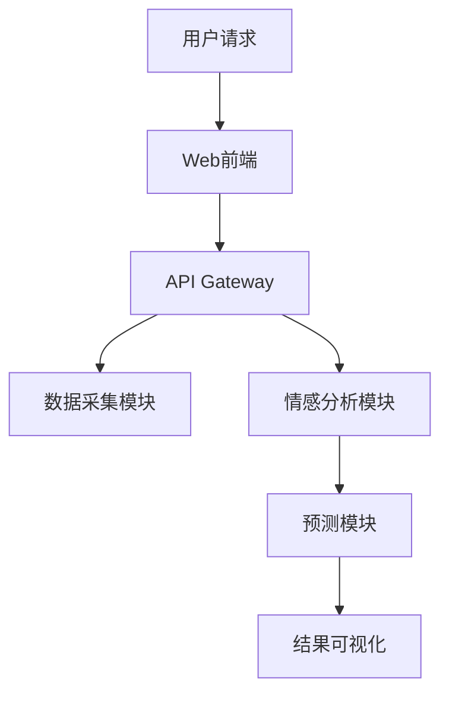

                 


# 智能加密货币市场情绪分析与预测

> 关键词：智能加密货币、市场情绪分析、预测模型、自然语言处理、机器学习

> 摘要：本文将探讨如何利用自然语言处理和机器学习技术，对加密货币市场的市场情绪进行智能分析与预测。通过构建情感分析模型，结合市场数据，帮助投资者更好地理解市场动态，做出更明智的投资决策。

---

# 第一部分: 情绪分析与预测的背景与基础

## 第1章: 加密货币市场的现状与挑战

### 1.1 加密货币市场的定义与特点
- 加密货币市场的基本概念
- 加密货币市场的波动性特点
- 市场参与者的多样性

### 1.2 市场情绪与价格波动的关系
- 情绪对市场的影响机制
- 投资者情绪的传染效应
- 市场情绪与价格波动的统计关系

### 1.3 情绪分析在加密货币市场中的重要性
- 帮助投资者理解市场动态
- 为量化交易提供情绪数据支持
- 提高市场预测的准确性

## 第2章: 情绪分析的核心概念与技术基础

### 2.1 情绪分析的基本概念
- 情感分析的定义
- 情感分析的分类（如正面、负面、中性）
- 情感强度预测的概念

### 2.2 自然语言处理（NLP）与机器学习的结合
- NLP在文本处理中的应用
- 机器学习在情感分类中的作用
- 深度学习模型（如LSTM、BERT）的优势

### 2.3 加密货币市场情绪分析的特殊性
- 非结构化数据的处理挑战
- 市场参与者情绪的复杂性
- 数据来源的多样性和实时性要求

---

# 第二部分: 情绪分析算法与实现

## 第3章: 情绪分析的算法原理

### 3.1 文本预处理流程
- 分词与停用词处理
- 词干提取与词向量表示
- 数据清洗与标准化

### 3.2 特征提取方法
- TF-IDF特征提取
- 词嵌入（如Word2Vec、GloVe）
- 深度学习模型的特征提取

### 3.3 情感分类算法
- 传统机器学习模型（如SVM、NB）
- 深度学习模型（如LSTM、BERT）
- 模型调优与参数优化

### 3.4 情感强度预测模型
- 回归模型的构建
- 情感强度的量化方法
- 模型的评估指标

## 第4章: 数学模型与公式详解

### 4.1 情感分析的向量空间模型
- 向量空间模型的定义
- TF-IDF公式：$TF_{td} = \frac{f_{t,d}}{\sum_{t' \in d} f_{t',d}}$
- IDF公式：$IDF(t) = \log\left(\frac{N}{n_t}\right)$

### 4.2 基于LSTM的情感分类模型
- LSTM结构简述
- 损失函数：交叉熵损失
- 优化算法：Adam优化器

### 4.3 情感强度预测的回归模型
- 线性回归模型：$y = \beta_0 + \beta_1x + \epsilon$
- 神经网络回归模型

## 第5章: 算法实现与优化

### 5.1 代码实现
```python
from sklearn.feature_extraction.text import TfidfVectorizer
from sklearn.svm import SVC
from sklearn.metrics import accuracy_score

vectorizer = TfidfVectorizer()
X = vectorizer.fit_transform(texts)
y = [0, 1, 2]  # 0: 中性, 1: 正面, 2: 负面

model = SVC()
model.fit(X, y)
y_pred = model.predict(X)
print("Accuracy:", accuracy_score(y, y_pred))
```

### 5.2 模型优化
- 调整超参数（如C、gamma）
- 使用交叉验证评估模型性能
- 模型集成（如投票分类器）

### 5.3 模型评估
- 准确率、召回率、F1分数
- 混淆矩阵分析
- ROC曲线与AUC值

---

# 第三部分: 系统设计与项目实战

## 第6章: 系统设计与架构

### 6.1 问题场景介绍
- 数据来源：社交媒体、新闻网站、论坛等
- 实时分析需求
- 可扩展性要求

### 6.2 系统功能设计
- 数据采集模块
- 情感分析模块
- 预测模块
- 可视化界面

### 6.3 系统架构设计


### 6.4 接口设计与交互流程
- API接口定义
- 用户交互流程图

## 第7章: 项目实战与案例分析

### 7.1 环境安装与配置
- 安装Python、Jupyter Notebook
- 安装相关库（如NLTK、scikit-learn、TensorFlow）

### 7.2 核心代码实现
```python
import numpy as np
import pandas as pd
from sklearn.model_selection import train_test_split
from sklearn.metrics import classification_report

# 数据加载
data = pd.read_csv('crypto_tweets.csv')
X = data['text']
y = data['sentiment']

# 数据分割
X_train, X_test, y_train, y_test = train_test_split(X, y, test_size=0.2)

# 特征提取与建模
from sklearn.pipeline import Pipeline
from sklearn.feature_extraction.text import TfidfVectorizer
from sklearn.svm import SVC

pipeline = Pipeline([
    ('tfidf', TfidfVectorizer()),
    ('model', SVC())
])

pipeline.fit(X_train, y_train)
y_pred = pipeline.predict(X_test)

print(classification_report(y_test, y_pred))
```

### 7.3 案例分析与结果解读
- 案例背景
- 数据预处理过程
- 模型训练与预测
- 结果分析与解释

## 第8章: 最佳实践与小结

### 8.1 最佳实践
- 数据质量的重要性
- 模型选择与调优
- 预测结果的解释与应用

### 8.2 注意事项
- 情绪分析的局限性
- 模型的泛化能力
- 数据隐私与伦理问题

### 8.3 未来研究方向
- 更复杂的情绪分类
- 多模态数据融合
- 实时分析与预测

### 8.4 拓展阅读
- 推荐书籍与论文
- 在线资源与工具

---

# 第四部分: 总结与展望

## 第9章: 总结

### 9.1 核心内容回顾
- 情绪分析的基本概念
- 算法实现与优化
- 系统设计与项目实战

### 9.2 技术总结
- NLP与机器学习的结合
- 深度学习模型的优势
- 情绪分析的挑战与解决方案

## 第10章: 展望

### 10.1 情绪分析的未来发展
- 更智能的模型
- 更广泛的应用场景
- 更高的预测精度

### 10.2 对投资者的建议
- 合理利用情绪分析工具
- 结合其他市场数据进行综合分析
- 风险控制与情绪管理

---

通过以上结构，我们可以系统地分析与预测加密货币市场的市场情绪，为投资者提供更科学的决策支持。

