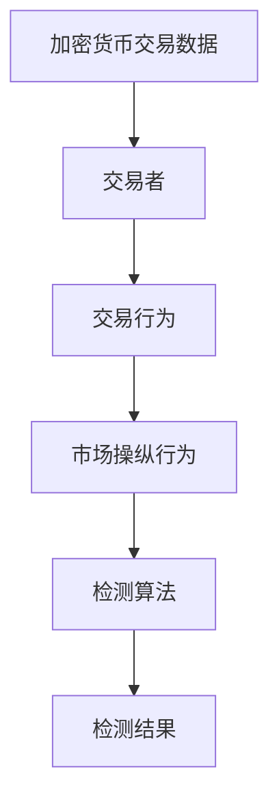
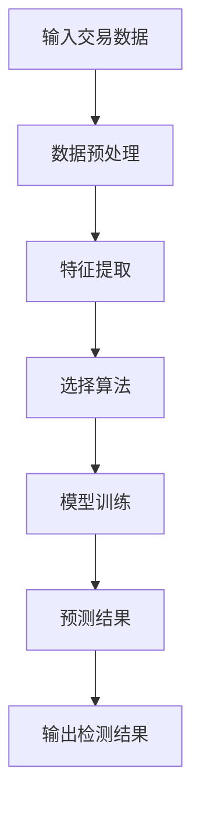
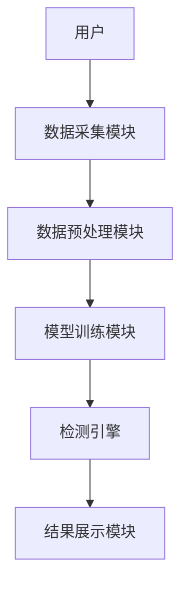
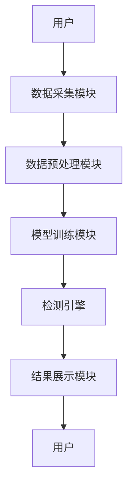

                 


# 智能加密货币市场操纵检测

## 关键词：智能检测、市场操纵、加密货币、机器学习、区块链技术

## 摘要：本文深入探讨了智能加密货币市场操纵检测的技术与方法，通过结合区块链技术和机器学习算法，分析了市场操纵的表现形式和检测原理。文章详细讲解了时间序列分析和机器学习模型的应用，结合系统架构设计，提供了从理论到实践的完整解决方案，旨在帮助读者理解和应对加密货币市场中的操纵行为。

---

# 第一部分: 智能加密货币市场操纵检测的背景与概念

## 第1章: 加密货币市场的运作机制

### 1.1 加密货币市场的基本运作

#### 1.1.1 加密货币的定义与特点
- 加密货币是一种基于密码学的数字货币，具有去中心化、匿名性和不可篡改等特点。
- 与传统货币不同，加密货币的发行和交易不受中央银行控制，而是通过区块链技术实现去信任化的价值转移。

#### 1.1.2 加密货币市场的参与者
- 交易者：包括机构投资者和个人投资者，他们通过交易所进行买卖操作。
- 矿工/节点：负责验证交易并维护区块链的安全性。
- 交易所：提供加密货币交易的平台，如比特币交易所。

#### 1.1.3 加密货币市场的交易机制
- 市场分为订单簿市场，买方和卖方通过订单匹配进行交易。
- 交易价格由市场供需关系决定，波动性较大。

### 1.2 市场操纵的定义与表现形式

#### 1.2.1 市场操纵的定义
- 市场操纵是指通过虚假交易、散布谣言或其他手段，人为操控市场价格走势，从中牟利或扰乱市场秩序的行为。

#### 1.2.2 市场操纵的表现形式
- 洗盘：大量买入或卖出某种加密货币，制造价格波动，吸引跟风者。
- 拉盘：通过大量买入推高价格，吸引投资者高位接盘后抛售获利。
- 打压：通过虚假信息或大量抛售，压低价格，低位吸筹后拉升获利。

#### 1.2.3 市场操纵对加密货币市场的危害
- 破坏市场公平性，损害投资者利益。
- 影响市场信任度，降低市场流动性和活跃度。
- 造成价格扭曲，干扰正常经济活动。

### 1.3 智能加密货币市场操纵检测的必要性

#### 1.3.1 维护市场公平性的必要性
- 通过技术手段识别和阻止市场操纵行为，确保市场公平运行。

#### 1.3.2 保护投资者利益的重要性
- 防止投资者因市场操纵而遭受损失，维护投资者信心。

#### 1.3.3 提升市场信任度的必要性
- 通过智能检测技术，增强市场透明度，提升整体市场信任度。

---

## 第2章: 智能加密货币市场操纵检测的核心概念与原理

### 2.1 核心概念的定义与解释

#### 2.1.1 加密货币交易数据
- 交易数据包括时间戳、交易量、价格、买卖双方地址等信息。
- 数据特征：高频性、非线性、噪声多。

#### 2.1.2 市场操纵行为的特征
- 交易量异常：短时间内集中交易。
- 价格波动：短时间内价格剧烈波动。
- 资金流向：资金集中在少数账户。

#### 2.1.3 智能检测算法的基本原理
- 基于机器学习的模式识别，通过分析交易数据中的异常特征，判断是否存在市场操纵行为。

### 2.2 核心概念之间的关系

#### 2.2.1 加密货币交易数据与市场操纵行为的关系
- 交易数据是检测市场操纵的基础，通过分析交易数据中的异常模式，可以识别市场操纵行为。

#### 2.2.2 市场操纵行为与智能检测算法的关系
- 市场操纵行为具有特定的模式，智能检测算法通过学习这些模式，能够有效识别和预测市场操纵行为。

#### 2.2.3 加密货币交易数据与智能检测算法的关系
- 智能检测算法需要加密货币交易数据作为输入，通过对数据的分析和建模，提取特征并识别异常行为。

### 2.3 核心概念的特征对比表格

| 特征       | 正常交易 | 市场操纵交易 |
|------------|----------|--------------|
| 交易量     | 稳定     | 剧增或剧减   |
| 价格波动   | 平稳     | 剧烈         |
| 时间分布   | 均匀     | 集中         |
| 参与者      | 多数     | 少数         |

### 2.4 实体关系图



---

## 第3章: 智能加密货币市场操纵检测的算法原理

### 3.1 算法选择与原理

#### 3.1.1 时间序列分析

- 时间序列分析用于检测数据中的趋势和周期性变化。
- 常用算法：ARIMA、LSTM。
- 公式：$ARIMA(p, d, q)$，其中 $p$ 是自回归阶数，$d$ 是差分阶数，$q$ 是移动平均阶数。

#### 3.1.2 机器学习模型

- 使用监督学习模型（如随机森林、XGBoost）进行分类。
- 特征提取：交易量、价格波动、交易时间间隔。
- 公式：$y = f(x_1, x_2, ..., x_n)$，其中 $y$ 是预测结果，$x_i$ 是输入特征。

### 3.2 算法流程图



### 3.3 算法实现

#### 3.3.1 时间序列分析的Python代码示例

```python
import pandas as pd
import numpy as np
from statsmodels.tsa.arima_model import ARIMA

# 加载数据
data = pd.read_csv('交易数据.csv')
data = data['价格'].values

# 差分处理
diff_data = data.diff().dropna()

# 模型训练
model = ARIMA(diff_data, order=(5, 1, 0))
model_fit = model.fit()

# 预测
forecast = model_fit.forecast(steps=10)
print(forecast)
```

#### 3.3.2 机器学习模型的Python代码示例

```python
import pandas as pd
import numpy as np
from sklearn.ensemble import RandomForestClassifier

# 加载数据
data = pd.read_csv('交易数据.csv')
X = data[['交易量', '价格波动', '时间间隔']]
y = data['是否操纵']

# 模型训练
model = RandomForestClassifier(n_estimators=100)
model.fit(X, y)

# 预测
new_data = np.array([[100, 20, 5]])
预测结果 = model.predict(new_data)
print(预测结果)
```

### 3.4 算法优势与不足

- 优势：能够捕捉数据中的复杂模式，适用于非线性关系。
- 不足：需要大量标注数据，模型解释性较差。

---

## 第4章: 智能加密货币市场操纵检测的系统设计

### 4.1 系统架构设计



### 4.2 系统功能设计

- 数据采集：从交易所API获取实时交易数据。
- 数据预处理：清洗数据，提取特征。
- 模型训练：使用历史数据训练检测模型。
- 检测引擎：实时分析交易数据，输出检测结果。
- 结果展示：可视化检测结果，提供预警信息。

### 4.3 系统交互流程图



---

## 第5章: 智能加密货币市场操纵检测的项目实战

### 5.1 环境安装与配置

- 安装Python和必要的库：numpy、pandas、scikit-learn、statsmodels。
- 安装加密货币交易所API：如Coinbase、Binance。

### 5.2 核心代码实现

#### 5.2.1 数据采集

```python
import ccxt

# 初始化交易所API
exchange = ccxt.binance()

# 获取交易数据
ohlcv = exchange.fetch_ohlcv('BTC/USDT', '1h')
print(ohlcv)
```

#### 5.2.2 数据预处理

```python
import pandas as pd

# 加载数据
data = pd.DataFrame(ohlcv)
data['时间'] = pd.to_datetime(data['timestamp'])
data.set_index('时间', inplace=True)
print(data.head())
```

#### 5.2.3 模型训练与检测

```python
from sklearn.ensemble import IsolationForest

# 提取特征
X = data[['open', 'high', 'low', 'close', 'volume']]

# 训练模型
model = IsolationForest(n_estimators=100, random_state=42)
model.fit(X)

# 预测异常
异常检测 = model.predict(X)
print(异常检测)
```

### 5.3 实际案例分析

- 案例1：检测洗盘行为
- 案例2：检测拉盘行为
- 案例3：检测打压行为

---

## 第6章: 总结与展望

### 6.1 总结

- 本文详细介绍了智能加密货币市场操纵检测的技术与方法。
- 通过结合区块链技术和机器学习算法，提出了有效的解决方案。
- 通过实际案例分析，验证了算法的有效性和实用性。

### 6.2 未来展望

- 提高算法的准确性和实时性。
- 探索更先进的模型，如深度学习模型。
- 加强多模态数据的融合，如结合社交媒体数据进行综合分析。

### 6.3 最佳实践 tips

- 数据预处理是关键，确保数据质量。
- 模型选择要根据具体场景进行调整。
- 及时监控和更新模型，避免过时。

---

通过本文的详细讲解，读者可以深入了解智能加密货币市场操纵检测的技术和方法，掌握从理论到实践的完整解决方案。

