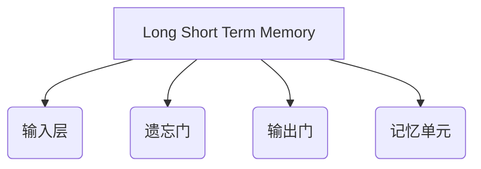
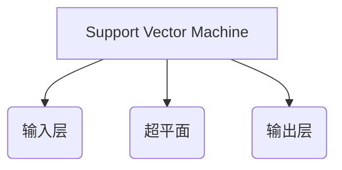

                 


# 智能加密货币市场操纵检测系统

> 关键词：加密货币，市场操纵，人工智能，检测系统，区块链

> 摘要：本文深入探讨了智能加密货币市场操纵检测系统的构建与实现，从加密货币市场的特点与挑战出发，结合人工智能技术，详细阐述了市场操纵行为的分类与特征、检测算法的原理与实现、系统架构的设计与优化，以及实际案例的分析与解读。本文旨在为加密货币市场的参与者、监管机构以及技术开发者提供理论与实践相结合的参考。

---

# 第一部分: 加密货币市场操纵检测系统背景与核心概念

## 第1章: 加密货币市场操纵检测的背景与问题描述

### 1.1 加密货币市场的特点与挑战

#### 1.1.1 加密货币市场的基本特点
- **去中心化**：加密货币交易不依赖传统金融机构，交易数据公开透明，但匿名性较强。
- **高波动性**：加密货币市场价格波动剧烈，容易受市场操纵影响。
- **数据公开性**：所有交易数据均可通过区块链等技术公开查询，但数据量大、复杂性高。

#### 1.1.2 市场操纵的定义与表现形式
- **市场操纵**：通过虚假交易、散布信息等手段影响市场价格走势，谋取不当利益。
- **常见类型**：
  - 拉高出货：通过大量买入推高价格后卖出获利。
  - 压迫卖出：通过虚假信息或大量抛售打压价格，趁低价买入。
  - 洗盘：通过大量交易制造市场活跃假象，吸引投资者跟风。

#### 1.1.3 加密货币市场操纵的危害
- 破坏市场公平性，损害投资者利益。
- 影响市场信任度，不利于加密货币的普及与应用。
- 增加监管难度，加剧市场波动。

### 1.2 市场操纵检测的必要性

#### 1.2.1 市场操纵对投资者的影响
- 投资者可能因虚假价格信号做出错误决策，导致损失。
- 市场操纵行为容易引发恐慌性抛售，加剧市场波动。

#### 1.2.2 市场操纵对市场公平性的影响
- 扰乱市场供需关系，扭曲价格形成机制。
- 削弱市场信任，降低市场流动性。

#### 1.2.3 检测市场操纵的法律与伦理意义
- 保护投资者权益，维护市场公平。
- 为监管机构提供技术支持，提高监管效率。

### 1.3 智能加密货币市场操纵检测系统的目标

#### 1.3.1 系统设计的核心目标
- 实时监测市场交易数据，识别异常交易行为。
- 提供可视化报告，辅助监管机构和投资者决策。
- 提供预警机制，及时发现并阻止市场操纵行为。

#### 1.3.2 系统预期解决的问题
- 如何高效识别市场操纵行为。
- 如何处理海量数据，提高检测精度。
- 如何实现系统实时性与准确性的平衡。

#### 1.3.3 系统的边界与外延
- 系统仅关注交易数据，不涉及其他市场行为。
- 系统不直接干预市场，仅提供检测与预警功能。
- 系统支持多种加密货币，可扩展性强。

## 第2章: 市场操纵检测的核心概念与关联

### 2.1 市场操纵行为的分类与特征

#### 2.1.1 市场操纵的主要类型
| 类型          | 描述                                                                 |
|---------------|----------------------------------------------------------------------|
| 拉高出货      | 大量买入推高价格后卖出，赚取价差利润。                               |
| 压迫卖出      | 通过虚假信息或大量抛售打压价格，吸引低价买入。                     |
| 洗盘          | 通过频繁交易制造市场活跃假象，吸引投资者跟风。                     |
| 信息操纵      | 利用虚假信息影响市场情绪，操纵价格走势。                           |

#### 2.1.2 各类操纵行为的特征对比
| 特性         | 拉高出货    | 压迫卖出    | 洗盘        | 信息操纵    |
|--------------|------------|------------|------------|------------|
| 交易量特征    | 突然增加    | 突然减少    | 高频交易    | 无明显变化  |
| 价格特征     | 短期上涨    | 短期下跌    | 价格波动    | 价格平稳    |
| 时间特征     | 集中爆发    | 集中抛售    | 高频震荡    | 长期影响    |

#### 2.1.3 操纵行为与正常交易行为的区分
- 正常交易：交易量与价格变化符合市场规律，交易行为分散。
- 操纵行为：交易量与价格变化异常，交易行为集中且突发。

### 2.2 智能检测系统的概念模型

#### 2.2.1 系统的核心要素与组成
- **数据源**：区块链交易数据、市场行情数据、社交媒体数据。
- **特征提取**：基于时间序列的交易行为特征提取。
- **检测算法**：基于机器学习的异常检测模型。
- **预警模块**：实时预警市场操纵行为。

#### 2.2.2 系统功能模块的划分
- 数据采集模块：采集交易数据、社交媒体数据。
- 特征提取模块：提取交易量、价格波动、时间序列特征。
- 检测模块：基于机器学习模型判断是否存在市场操纵。
- 预警模块：发出预警信号，并提供可视化报告。

#### 2.2.3 系统的输入、输出与交互流程
- 输入：区块链交易数据、市场行情数据、社交媒体数据。
- 输出：检测结果（是否存在市场操纵）、异常交易行为报告。
- 交互流程：数据输入 -> 特征提取 -> 模型检测 -> 输出结果。

### 2.3 关键概念的ER实体关系图

```mermaid
erDiagram
    actor User {
        +id : int
        +name : string
    }
    transaction Transaction {
        +id : int
        +time : datetime
        +price : float
        +volume : float
    }
    manipulation_behavior ManipulationBehavior {
        +id : int
        +type : string
        +description : string
    }
    User --> Transaction : 发起交易
    Transaction --> ManipulationBehavior : 表现为操纵行为
```

---

## 第3章: 市场操纵检测的算法原理

### 3.1 基于时间序列的异常检测算法

#### 3.1.1 LSTM网络的原理



#### 3.1.2 LSTM网络的数学模型

- 遗忘门：
  $$ f_t = \sigma(W_f x_t + U_f h_{t-1} + b_f) $$
- 输入门：
  $$ i_t = \sigma(W_i x_t + U_i h_{t-1} + b_i) $$
- 记忆单元：
  $$ c_t = f_t \cdot c_{t-1} + i_t \cdot tanh(W_c x_t + U_c h_{t-1} + b_c) $$
- 输出门：
  $$ o_t = \sigma(W_o x_t + U_o h_{t-1} + b_o) $$
- 最终输出：
  $$ h_t = o_t \cdot tanh(c_t) $$

#### 3.1.3 LSTM网络在市场操纵检测中的应用

```python
import keras
from keras.models import Sequential
from keras.layers import LSTM, Dense, Dropout

# 模型构建
model = Sequential()
model.add(LSTM(units=64, input_shape=(None, 4)))
model.add(Dropout(0.2))
model.add(Dense(units=1, activation='sigmoid'))
model.compile(loss='binary_crossentropy', optimizer='adam', metrics=['accuracy'])
```

### 3.2 基于图论的异常检测算法

#### 3.2.1 图论模型在市场操纵检测中的应用


#### 3.2.2 基于图论的异常检测算法实现

```python
import networkx as nx
from sklearn.manifold import TSNE

# 数据降维
tsne = TSNE(n_components=2, random_state=42)
X_tsne = tsne.fit_transform(X)

# 图结构构建
G = nx.Graph()
for i in range(len(X_tsne)):
    for j in range(i+1, len(X_tsne)):
        if i != j:
            G.add_edge(i, j)

# 异常检测
degrees = [G.degree(i) for i in range(len(X_tsne))]
outliers = [i for i, d in enumerate(degrees) if d < 2]
```

### 3.3 基于机器学习的分类算法

#### 3.3.1 支持向量机（SVM）算法



#### 3.3.2 SVM算法在市场操纵检测中的应用

```python
from sklearn import svm

# 模型构建
model = svm.SVC(kernel='rb

