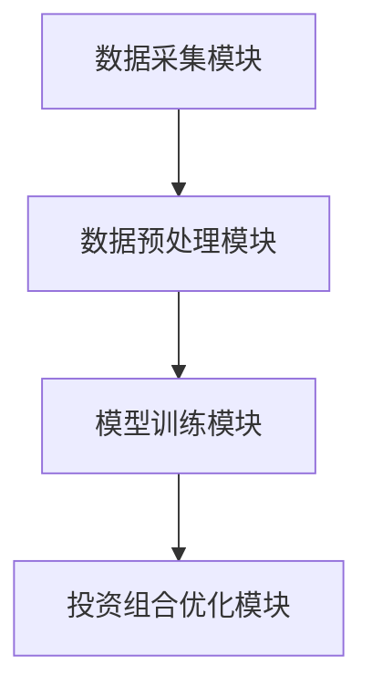

                 


# 智能加密货币投资组合管理

> 关键词：智能加密货币，投资组合管理，机器学习，风险管理，算法交易，区块链

> 摘要：智能加密货币投资组合管理是一种结合人工智能和区块链技术的投资策略，旨在通过数据驱动的算法优化加密货币投资组合的收益与风险。本文将详细探讨智能加密货币投资组合管理的核心概念、算法原理、系统架构、项目实战及最佳实践，帮助读者全面掌握这一领域的知识。

---

# 第一部分: 智能加密货币投资组合管理概述

## 第1章: 加密货币与投资组合管理概述

### 1.1 加密货币的基本概念

#### 1.1.1 加密货币的定义与特点
加密货币是一种基于区块链技术的数字资产，具有去中心化、匿名性、不可篡改等特点。与传统货币相比，加密货币的交易透明且高效。

#### 1.1.2 加密货币市场的基本结构
加密货币市场由交易所、钱包、矿池等组成，交易量大且波动性强。

#### 1.1.3 投资组合管理的核心概念
投资组合管理是指通过合理配置资产，以实现收益最大化和风险最小化的过程。

### 1.2 智能投资组合管理的背景与意义

#### 1.2.1 传统投资组合管理的局限性
传统投资组合管理依赖人工分析，效率低且容易受主观因素影响。

#### 1.2.2 加密货币市场的独特性与挑战
加密货币市场的高波动性和复杂性使得传统方法难以应对。

#### 1.2.3 智能投资组合管理的必要性
通过引入人工智能技术，可以实现自动化、实时化的投资决策，提高效率和准确性。

### 1.3 智能加密货币投资组合管理的定义与特点

#### 1.3.1 智能投资组合管理的定义
智能投资组合管理是利用人工智能技术，基于实时数据和历史数据分析，优化投资组合配置的过程。

#### 1.3.2 智能加密货币投资组合管理的特点
- 数据驱动：依赖大量市场数据进行分析。
- 自动化：算法自动优化投资组合。
- 风险管理：实时监控并调整风险水平。

#### 1.3.3 智能投资组合管理与传统投资管理的对比
| 特性          | 传统投资管理        | 智能投资管理        |
|---------------|---------------------|---------------------|
| 数据来源      | 有限，依赖人工收集  | 丰富，实时数据       |
| 决策速度      | 较慢，依赖人工判断  | 快速，自动化决策     |
| 精准度        | 受主观因素影响      | 更精准，基于数据驱动 |

### 1.4 本章小结
本章介绍了加密货币的基本概念、投资组合管理的核心概念以及智能加密货币投资组合管理的定义和特点，为后续内容奠定了基础。

---

# 第二部分: 智能加密货币投资组合管理的核心概念

## 第2章: 数据驱动的加密货币投资

### 2.1 数据来源与特征

#### 2.1.1 加密货币市场的数据来源
- 公共数据源：如CoinMarketCap、CoinGecko等。
- 交易所API：提供实时交易数据。
- 区块链数据：如交易哈希、区块高度等。

#### 2.1.2 数据特征分析
- 时间序列性：加密货币价格通常呈现时间序列特征。
- 高波动性：价格波动大，难以预测。
- 季节性：某些加密货币可能存在季节性波动。

#### 2.1.3 数据预处理与清洗
- 数据清洗：处理缺失值、异常值。
- 数据转换：标准化、归一化。
- 数据增强：通过技术指标（如MA、MACD）增强数据特征。

### 2.2 时间序列分析与预测

#### 2.2.1 时间序列分析的基本概念
时间序列分析是一种通过历史数据预测未来趋势的方法。

#### 2.2.2 常见的时间序列预测模型
- ARIMA模型：适用于线性时间序列数据。
- LSTM网络：适用于非线性时间序列数据。

#### 2.2.3 数据驱动的加密货币价格预测
通过ARIMA模型和LSTM网络对加密货币价格进行预测，并结合实际数据验证模型效果。

---

## 第3章: 机器学习在投资组合管理中的应用

### 3.1 机器学习的基本概念

#### 3.1.1 机器学习的定义与分类
机器学习是一种通过数据训练模型，使其能够自动学习和决策的技术。

#### 3.1.2 监督学习与无监督学习
- 监督学习：基于有标签的数据进行训练。
- 无监督学习：基于无标签的数据进行训练。

#### 3.1.3 加密货币投资中的机器学习应用
- 预测价格趋势。
- 识别市场情绪。
- 优化投资组合配置。

### 3.2 常见机器学习算法及其在投资组合管理中的应用

#### 3.2.1 线性回归与加密货币价格预测
线性回归是一种简单但有效的回归模型，适用于线性关系的预测。

#### 3.2.2 支持向量机（SVM）的应用
SVM适用于分类问题，可用于加密货币价格的涨跌预测。

#### 3.2.3 随机森林与加密货币市场分析
随机森林是一种基于决策树的集成算法，适用于非线性关系的分析。

---

## 第4章: 风险管理与投资组合优化

### 4.1 风险管理的基本概念

#### 4.1.1 风险的定义与分类
风险是投资中可能发生的损失或收益下降的可能性。

#### 4.1.2 风险评估的方法
- 历史波动率：衡量资产价格的波动程度。
- VaR（Value at Risk）：衡量潜在损失的最大值。

#### 4.1.3 加密货币市场的风险管理挑战
加密货币市场的高波动性和不确定性增加了风险管理的难度。

### 4.2 投资组合优化的数学模型

#### 4.2.1 均值-方差优化模型
均值-方差模型通过优化资产的期望收益和方差，找到最优投资组合。

$$ \text{Minimize } \sigma^2 \text{ subject to } \mu \geq \text{目标收益} $$

#### 4.2.2 马科维茨有效前沿理论
有效前沿是所有可能投资组合中收益风险比最优的集合。

#### 4.2.3 现实中的投资组合优化问题
现实中的投资组合优化需要考虑交易成本、市场冲击等复杂因素。

---

## 第5章: 系统架构与项目实战

### 5.1 系统架构设计

#### 5.1.1 问题场景介绍
- 数据采集：实时获取加密货币市场数据。
- 模型训练：训练机器学习模型进行价格预测。
- 投资组合优化：基于模型预测结果优化投资组合。

#### 5.1.2 系统功能设计
- 数据采集模块：负责获取实时数据。
- 数据预处理模块：清洗和转换数据。
- 模型训练模块：训练机器学习模型。
- 投资组合优化模块：优化投资组合配置。

#### 5.1.3 系统架构图


### 5.2 项目实战

#### 5.2.1 环境安装
- Python 3.8+
- NumPy、Pandas、Scikit-learn等库。

#### 5.2.2 核心代码实现
```python
import numpy as np
import pandas as pd
from sklearn.model_selection import train_test_split
from sklearn.linear_model import LinearRegression
from sklearn.metrics import mean_squared_error

# 加载数据
data = pd.read_csv('crypto_data.csv')
X = data[['open', 'high', 'low', 'volume']]
y = data['close']

# 划分训练集和测试集
X_train, X_test, y_train, y_test = train_test_split(X, y, test_size=0.2, random_state=42)

# 训练模型
model = LinearRegression()
model.fit(X_train, y_train)

# 预测
y_pred = model.predict(X_test)

# 评估
mse = mean_squared_error(y_test, y_pred)
print(f"均方误差：{mse}")
```

#### 5.2.3 代码功能解读
- 数据加载：从CSV文件加载加密货币数据。
- 数据划分：将数据划分为训练集和测试集。
- 模型训练：使用线性回归模型训练价格预测模型。
- 模型评估：计算均方误差，评估模型性能。

#### 5.2.4 实际案例分析
通过实际数据测试模型，分析预测结果与实际价格的差异，优化模型参数。

---

## 第6章: 最佳实践与小结

### 6.1 最佳实践

#### 6.1.1 小结
智能加密货币投资组合管理通过结合人工智能和区块链技术，优化投资组合的收益与风险。

#### 6.1.2 注意事项
- 数据质量：确保数据的准确性和完整性。
- 模型选择：根据实际需求选择合适的算法。
- 风险管理：实时监控并调整投资组合。

#### 6.1.3 拓展阅读
推荐学习区块链技术、时间序列分析、机器学习等领域的知识，进一步提升投资组合管理的能力。

---

# 附录: 全部代码实现与详细解读

```python
# 附录代码示例
import numpy as np
import pandas as pd
import matplotlib.pyplot as plt
from sklearn.linear_model import LinearRegression
from sklearn.metrics import mean_squared_error

# 加载数据
data = pd.read_csv('crypto_data.csv')

# 数据预处理
X = data[['open', 'high', 'low', 'volume']]
y = data['close']

# 划分训练集和测试集
X_train, X_test, y_train, y_test = train_test_split(X, y, test_size=0.2, random_state=42)

# 训练模型
model = LinearRegression()
model.fit(X_train, y_train)

# 预测
y_pred = model.predict(X_test)

# 评估
mse = mean_squared_error(y_test, y_pred)
print(f"均方误差：{mse}")

# 可视化
plt.scatter(y_test, y_pred)
plt.xlabel('实际价格')
plt.ylabel('预测价格')
plt.title('线性回归预测结果')
plt.show()
```

---

通过本文的详细讲解，读者可以全面了解智能加密货币投资组合管理的核心概念、算法原理和实际应用，为实际投资决策提供有力支持。

