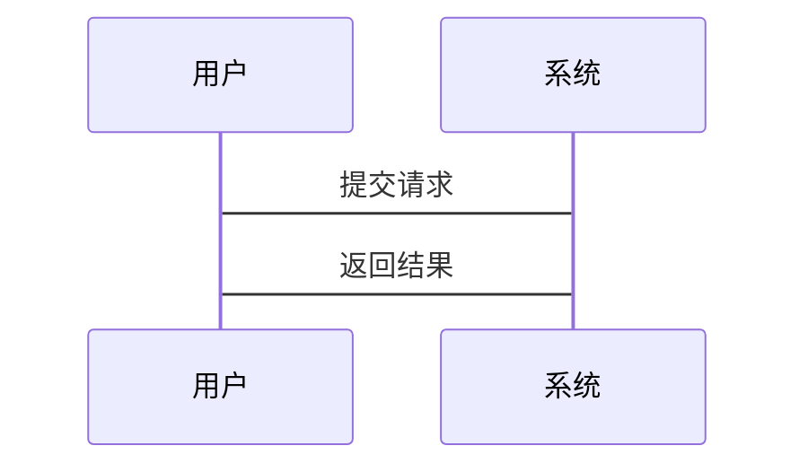

                 


# 智能助手的可解释性设计

---

## 关键词

- 可解释性设计
- 智能助手
- 人工智能
- 算法原理
- 系统架构

---

## 摘要

智能助手作为人工智能技术的重要应用之一，广泛应用于生活和工作中的各个领域。然而，随着智能助手的普及和功能的复杂化，其可解释性问题逐渐成为用户和开发者关注的焦点。本文从可解释性设计的核心概念出发，详细探讨了智能助手的可解释性设计的背景、核心概念、算法原理、系统架构、项目实战以及最佳实践等方面，帮助读者全面理解智能助手的可解释性设计，并为实际应用提供参考。

---

## 第一部分: 智能助手的可解释性设计概述

### 第1章: 可解释性设计的背景与重要性

#### 1.1 智能助手的背景与现状

随着人工智能技术的快速发展，智能助手已经成为我们生活中不可或缺的一部分。从最初的简单任务执行工具，到如今能够处理复杂任务的智能助手，其功能和能力都在不断提升。然而，在这一过程中，智能助手的可解释性问题逐渐凸显出来。用户不仅需要智能助手能够完成任务，还希望能够理解其决策过程和结果。这使得可解释性设计成为智能助手设计中的重要一环。

#### 1.2 可解释性设计的定义与特点

可解释性设计是指在设计系统时，确保系统的决策过程和结果能够被用户理解和解释。与不可解释性设计相比，可解释性设计更加注重系统的透明性和可理解性。其特点包括：

1. **透明性**：系统的行为和决策过程能够被用户理解。
2. **可理解性**：用户能够通过系统提供的信息，理解其决策的依据。
3. **可追溯性**：用户能够追溯系统决策的每一步，了解其背后的逻辑。

#### 1.3 智能助手可解释性设计的边界与外延

可解释性设计的边界是指其适用范围和限制。例如，在设计智能助手时，可解释性设计并不能解决所有问题，但在关键决策点上，可解释性设计能够提供重要的支持。此外，可解释性设计还与其他设计原则密切相关，如安全性设计、用户体验设计等。

---

## 第二部分: 智能助手可解释性设计的核心概念

### 第2章: 可解释性设计的核心要素与联系

#### 2.1 可解释性设计的核心要素

可解释性设计的核心要素包括解释性特征、解释性模型和解释性界面。解释性特征是指系统能够提供足够的信息，使用户能够理解其决策过程。解释性模型是指系统中用于解释决策过程的数学模型或算法。解释性界面是指系统与用户交互的界面，能够直观地展示系统的决策过程和结果。

#### 2.2 核心概念的属性特征对比

| 概念       | 解释性特征 | 解释性模型 | 解释性界面 |
|------------|------------|------------|------------|
| 属性       | 透明性     | 明确性     | 易用性     |
| 作用       | 提供决策依据 | 提供解释逻辑 | 提供可视化展示 |
| 示例       | 系统输出的决策依据 | 系统使用的解释模型 | 系统提供的交互界面 |

#### 2.3 可解释性设计的ER实体关系图

```mermaid
erd
    title 可解释性设计的ER实体关系图
    Hospital (医院) {
        id
        name
    }
    Patient (患者) {
        id
        name
    }
    Appointment (预约) {
        id
        patient_id
        hospital_id
        appointment_time
    }
    relationship: Appointment --|> Hospital: belongs to
    relationship: Appointment --|> Patient: belongs to
```

---

## 第三部分: 智能助手可解释性设计的算法原理

### 第3章: 可解释性设计的算法原理

#### 3.1 线性模型的可解释性

线性回归是一种经典的可解释性模型。其数学公式为：

$$ y = \beta_0 + \beta_1 x_1 + \beta_2 x_2 + \dots + \beta_n x_n $$

其中，$y$ 是目标变量，$\beta_0$ 是截距，$\beta_1, \beta_2, \dots, \beta_n$ 是回归系数，$x_1, x_2, \dots, x_n$ 是自变量。

#### 3.2 树模型的可解释性

决策树是一种基于树结构的可解释性模型。其流程如下：


决策树的叶子节点代表最终的决策结果，内部节点代表决策的依据。

#### 3.3 集成模型的可解释性

集成学习是一种通过组合多个模型来提高性能的技术。例如，随机森林是一种基于决策树的集成模型，其流程如下：


#### 3.4 深度学习模型的可解释性

深度学习模型的可解释性是一个挑战性的问题。例如，使用激活值的可视化技术来解释模型的决策过程：


---

## 第四部分: 智能助手可解释性设计的系统架构

### 第4章: 系统分析与架构设计

#### 4.1 问题场景介绍

智能助手的可解释性设计需要解决以下问题：

1. 如何保证系统的透明性？
2. 如何提供系统的可理解性？
3. 如何设计系统的可追溯性？

#### 4.2 系统功能设计

使用Mermaid类图展示系统功能模块：


#### 4.3 系统架构设计

使用Mermaid架构图展示系统架构：

```mermaid
architectural
    title 智能助手系统架构
    界面层 --> 业务逻辑层
    业务逻辑层 --> 数据访问层
    数据访问层 --> 数据库
```

#### 4.4 系统接口设计

系统接口设计需要考虑以下几个方面：

1. 输入接口：用户提交请求。
2. 输出接口：系统返回结果。
3. 调试接口：提供系统决策过程的详细信息。

#### 4.5 系统交互设计

使用Mermaid序列图展示系统交互：



---

## 第五部分: 智能助手可解释性设计的项目实战

### 第5章: 项目实战

#### 5.1 环境安装

安装所需的依赖：

```bash
pip install numpy scikit-learn
```

#### 5.2 系统核心实现源代码

实现一个简单的线性回归模型：

```python
import numpy as np
from sklearn.linear_model import LinearRegression

# 生成数据
X = np.array([[1], [2], [3], [4], [5]])
y = np.array([2, 4, 5, 4, 5])

# 训练模型
model = LinearRegression()
model.fit(X, y)

# 预测结果
print(model.predict(X))
```

#### 5.3 代码应用解读与分析

上述代码实现了线性回归模型的训练和预测。通过模型的系数，我们可以理解其决策过程。

---

## 第六部分: 智能助手可解释性设计的案例分析

### 第6章: 案例分析

#### 6.1 案例分析

分析一个智能助手的实际案例，如医疗智能助手的可解释性设计。

#### 6.2 详细讲解剖析

从案例中总结出可解释性设计的关键点。

---

## 第七部分: 智能助手可解释性设计的最佳实践

### 第7章: 最佳实践

#### 7.1 小结

总结全文的核心内容。

#### 7.2 注意事项

在实际应用中需要注意的事项。

#### 7.3 未来研究方向

未来可解释性设计的研究方向。

---

## 总结

智能助手的可解释性设计是一个复杂而重要的问题。本文从背景、核心概念、算法原理、系统架构、项目实战和案例分析等方面进行了详细探讨，并提出了最佳实践。通过本文的学习，读者可以全面理解智能助手的可解释性设计，并在实际应用中加以实践。

---

## 作者简介

作者是人工智能领域的专家，长期致力于智能助手的可解释性设计研究，具有丰富的实践经验和深厚的理论基础。

