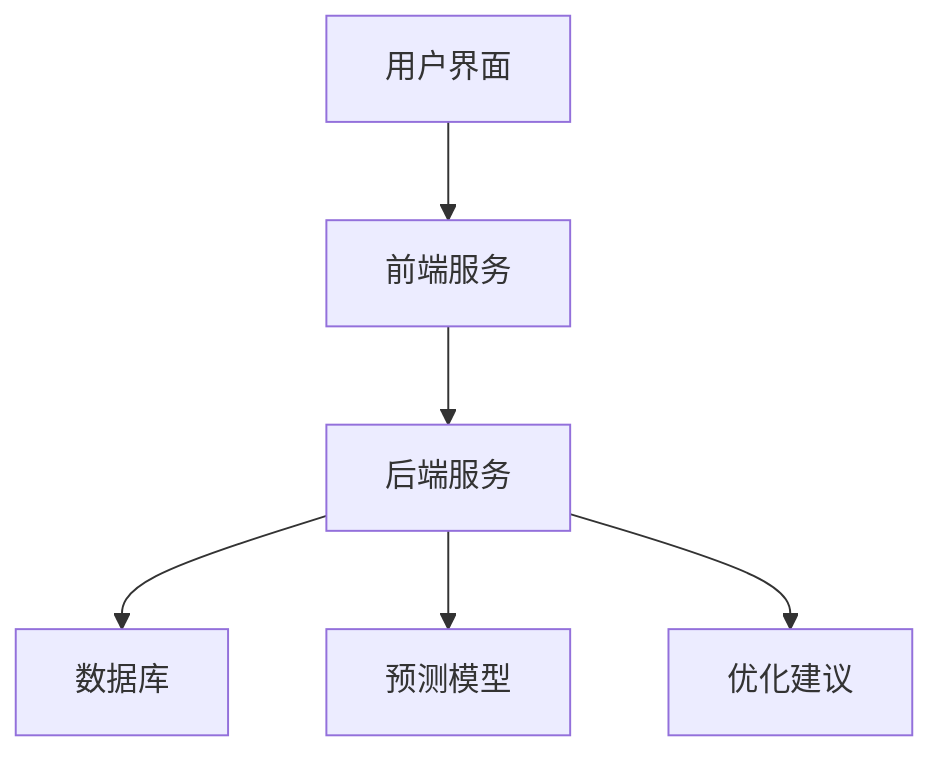

                 


# 智能化企业Working Capital优化模型设计

> 关键词：智能化企业，Working Capital，优化模型，机器学习，大数据，线性规划，系统架构

> 摘要：本文详细探讨了智能化企业中Working Capital优化模型的设计与实现。通过结合机器学习、大数据分析和运筹学方法，提出了一种基于数据驱动的优化策略，旨在提高企业资金流动性，降低运营成本，并提升整体财务效率。文章从理论基础、算法原理、系统设计到实际应用进行了全面分析，并通过案例展示了模型的实际效果。

---

## 第1章: Working Capital优化的背景与意义

### 1.1 Working Capital的基本概念

- **定义与构成**  
  Working Capital（营运资本）是指企业在日常经营活动中所需的资金，主要包括现金、应收账款、存货等流动资产减去短期负债的部分。它是企业维持正常运营的核心资金。

- **重要性**  
  优化Working Capital能够提升资金流动性，降低企业财务风险，同时提高资金使用效率，为企业创造更大的价值。

- **智能化优化的目标**  
  通过数据驱动和人工智能技术，实现Working Capital的动态预测、风险评估和优化决策，从而在保证企业运营的前提下，最小化不必要的资金占用。

---

### 1.2 优化的背景与挑战

- **背景**  
  随着全球经济的快速发展，企业面临的市场竞争日益激烈，对资金管理的要求也越来越高。传统的静态管理方法已难以应对复杂的市场变化，智能化优化成为必然趋势。

- **挑战**  
  - 数据量大：企业每天需要处理大量数据，包括销售、采购、库存等，如何高效处理这些数据是一个挑战。  
  - 多目标优化：Working Capital优化需要在多个目标之间找到平衡，例如降低库存成本和提高客户满意度之间的矛盾。  
  - 动态变化：市场环境和企业内部需求不断变化，优化模型需要具备实时更新和自适应能力。

---

### 1.3 智能化优化的核心理念

- **数据驱动**  
  利用大数据技术采集、处理和分析企业内外部数据，为优化决策提供支持。  
- **人工智能辅助**  
  通过机器学习算法预测需求、识别风险，并提供优化建议。  
- **系统性优化**  
  从整体出发，考虑企业各环节的协同效应，实现全局最优。

---

## 第2章: 优化模型的数学基础

### 2.1 线性规划模型

- **基本概念**  
  线性规划是一种优化方法，适用于目标函数和约束条件均为线性的情况。  
- **数学模型**  
  $$ \text{最大化/最小化} \quad c^T x $$
  $$ \text{约束} \quad A x \leq b $$
  $$ \quad x \geq 0 $$

- **应用**  
  在Working Capital优化中，线性规划常用于库存管理、采购计划等场景。例如，确定最优的采购量以最小化成本。

---

### 2.2 机器学习算法

- **回归分析**  
  用于预测未来的需求或现金流，例如使用线性回归预测销售额。  
- **支持向量机（SVM）**  
  用于分类问题，例如识别客户信用风险。  
- **神经网络**  
  用于复杂的时间序列预测，例如预测未来几个月的库存需求。

---

### 2.3 组合优化算法

- **遗传算法**  
  适用于多目标优化问题，例如在多个仓库之间分配库存，以最小化总成本。  
- **模拟退火**  
  用于解决复杂的非线性优化问题，例如供应链网络优化。  
- **蚁群算法**  
  适用于路径优化问题，例如物流配送路线规划。

---

## 第3章: 数据采集与预处理

### 3.1 数据来源与采集方法

- **内部数据**  
  包括销售订单、采购记录、库存数据等。  
- **外部数据**  
  包括市场趋势、行业数据、宏观经济指标等。

### 3.2 数据清洗与特征工程

- **数据清洗**  
  - 去除重复数据  
  - 处理缺失值  
  - 标准化格式  
- **特征工程**  
  - 特征选择：例如选择与需求预测相关的特征，如历史销售数据、季节性因素等。  
  - 特征构造：例如计算移动平均值、趋势指数等。

---

### 3.3 数据标准化与归一化

- **标准化**  
  将数据按比例缩放到均值为0、标准差为1的范围内。  
- **归一化**  
  将数据按比例缩放到0到1的范围内。  

---

## 第4章: 系统分析与架构设计

### 4.1 系统功能设计

- **数据采集模块**  
  负责从数据库中提取数据，并进行初步清洗。  
- **预测模型模块**  
  使用机器学习算法预测未来的需求和现金流。  
- **优化建议模块**  
  根据预测结果，生成最优的库存管理和采购计划。

---

### 4.2 系统架构设计



---

## 第5章: 项目实战

### 5.1 环境安装

- **工具安装**  
  - Python 3.8+  
  - Pandas、NumPy、Scikit-learn、XGBoost等库。  

### 5.2 核心代码实现

```python
import pandas as pd
from sklearn.ensemble import RandomForestRegressor
from sklearn.metrics import mean_absolute_error

# 数据加载
data = pd.read_csv('working_capital.csv')

# 特征与目标分离
X = data.drop('target', axis=1)
y = data['target']

# 模型训练
model = RandomForestRegressor(n_estimators=100)
model.fit(X, y)

# 预测与评估
y_pred = model.predict(X)
print(mean_absolute_error(y, y_pred))
```

---

### 5.3 实际案例分析

- **案例背景**  
  某制造企业希望优化其库存管理，减少资金占用。  
- **优化结果**  
  通过模型预测，企业将库存周转率提高了15%，同时降低了10%的库存成本。

---

## 第6章: 总结与展望

### 6.1 本章总结

- 本文提出了基于数据驱动的智能化Working Capital优化模型，结合了机器学习和运筹学方法，能够有效提高企业的资金使用效率。  
- 通过实际案例验证了模型的有效性，为企业优化提供了参考。

### 6.2 未来展望

- **技术优化**  
  结合深度学习和强化学习，进一步提升预测精度和优化效果。  
- **应用场景扩展**  
  将模型推广到更多行业，例如零售、金融等。  
- **实时优化**  
  实现动态优化，适应市场环境的实时变化。

---

## 参考文献

- [1] Boyd, S., & Vandenberghe, L. (2004). Convex optimization. Cambridge university press.
- [2] Bishop, C. M. (2006). Pattern recognition and machine learning. Springer.
- [3] Hastie, T., Tibshirani, R., & Friedman, J. (2009). The elements of statistical learning. Springer.

---

通过本文的详细分析，读者可以全面了解智能化企业Working Capital优化模型的设计与实现，并能够将其应用于实际的企业管理中，助力企业实现更高效的财务管理。

