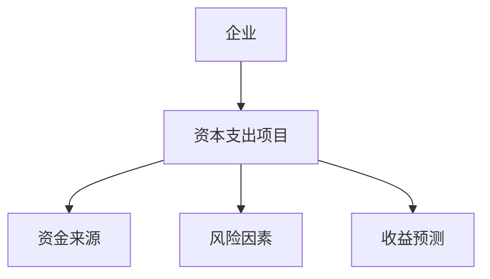
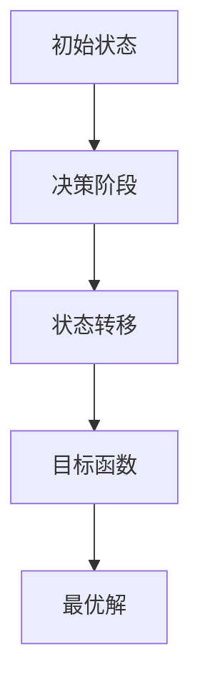
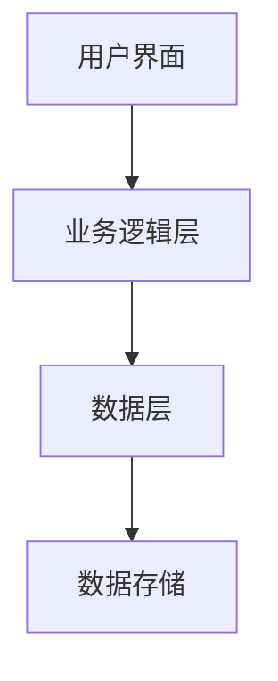
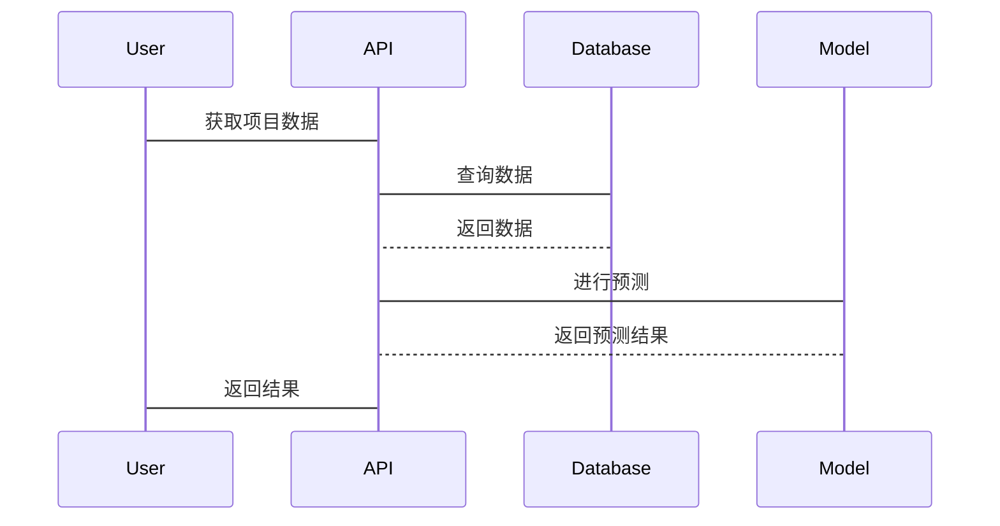

                 


# 智能化企业资本支出优化决策模型设计

## 关键词：资本支出优化、智能化决策模型、机器学习、动态规划、企业财务管理

## 摘要：本文详细探讨了智能化企业资本支出优化决策模型的设计与实现。通过分析传统资本支出决策的局限性，提出了基于数据驱动和机器学习的优化方法。文章从背景介绍、核心概念、算法原理、系统架构到项目实战，全面阐述了模型的构建过程，并通过案例分析展示了其实际应用效果。本文旨在为企业提供一种高效、准确的资本支出优化决策工具。

---

# 第1章: 资本支出优化决策模型的背景与意义

## 1.1 问题背景与描述

### 1.1.1 企业资本支出的定义与重要性
资本支出（Capital Expenditure，简称CAPEX）是企业在固定资产、无形资产、股权资本等方面的投资支出。它是企业长期发展的基石，直接影响企业的财务健康和市场竞争力。合理的资本支出决策能够优化资源配置，提高投资回报率，降低财务风险。

### 1.1.2 传统资本支出决策的局限性
传统的资本支出决策主要依赖于财务人员的经验和主观判断，存在以下问题：
- 数据量有限，难以覆盖企业内外部的复杂因素。
- 决策周期长，难以应对市场变化的快速需求。
- 缺乏量化分析，决策结果缺乏科学依据。

### 1.1.3 智能化决策的必要性与优势
随着大数据和人工智能技术的发展，智能化决策能够弥补传统方法的不足。智能化决策的优势包括：
- 数据驱动，能够整合企业内外部的多源数据。
- 高效准确，通过算法优化决策过程，提高决策效率。
- 自适应性强，能够实时调整决策策略，适应市场变化。

## 1.2 问题解决与边界

### 1.2.1 资本支出优化的目标与核心问题
资本支出优化的目标是最大化投资回报，最小化投资风险。核心问题包括：
- 如何选择最优的投资项目。
- 如何合理分配有限的资金资源。
- 如何预测项目的未来收益和风险。

### 1.2.2 模型的边界与适用范围
模型的边界包括：
- 仅考虑企业内部的资本支出决策。
- 不涉及企业运营中的日常开支。
- 适用于中长期投资决策，不适用于短期应急支出。

### 1.2.3 模型的外延与限制
模型的外延包括：
- 可扩展至企业并购、资产重组等复杂投资决策。
- 可结合宏观经济指标进行综合评估。
- 限制包括数据质量和模型假设的准确性。

## 1.3 概念结构与核心要素

### 1.3.1 模型的核心组成要素
- **输入数据**：包括财务数据、市场数据、项目数据。
- **优化算法**：包括动态规划、机器学习算法。
- **决策输出**：包括投资建议、资金分配方案。

### 1.3.2 要素之间的关系与依赖
- 数据驱动算法，算法生成决策建议，决策建议反哺数据优化。

### 1.3.3 模型的输入输出关系
- 输入：历史财务数据、市场趋势、项目可行性分析。
- 输出：最优投资组合、资金分配计划、风险评估报告。

## 1.4 本章小结
本章介绍了资本支出优化决策模型的背景与意义，分析了传统决策方法的局限性，并提出了智能化决策的优势。明确了模型的目标、边界和核心要素，为后续章节的分析奠定了基础。

---

# 第2章: 智能化决策模型的核心概念与联系

## 2.1 核心概念原理

### 2.1.1 数据驱动的决策方法
数据驱动决策通过分析大量数据，发现潜在规律，辅助决策。其优势在于精确性和科学性。

### 2.1.2 机器学习在资本支出中的应用
机器学习能够通过历史数据预测未来收益和风险，帮助企业在资本支出决策中做出更准确的预测。

### 2.1.3 智能优化算法的基本原理
优化算法通过数学建模，在约束条件下寻找最优解。例如，动态规划通过分阶段决策，找到全局最优解。

## 2.2 核心概念属性对比表

| 概念       | 属性1   | 属性2   | 属性3   |
|------------|---------|---------|---------|
| 数据驱动   | 精准性   | 及时性   | 可扩展性 |
| 机器学习   | 预测性   | 自适应性 | 解释性   |
| 优化算法   | 稳定性   | 高效性   | 易用性   |

## 2.3 实体关系图



## 2.4 本章小结
本章通过对比分析，展示了数据驱动、机器学习和优化算法在资本支出决策中的作用及其相互关系。实体关系图进一步明确了各要素之间的联系。

---

# 第3章: 资本支出优化决策模型的算法原理

## 3.1 算法原理概述

### 3.1.1 动态规划与资本支出优化
动态规划是一种经典的优化算法，适用于多阶段决策问题。其核心思想是将问题分解为子问题，通过递推求解全局最优。

### 3.1.2 机器学习在资本支出中的应用
机器学习算法（如随机森林、神经网络）用于预测项目收益和风险，为决策提供数据支持。

## 3.2 动态规划算法实现



### 3.2.1 算法步骤
1. 确定问题阶段和状态。
2. 定义状态转移方程。
3. 设定目标函数和约束条件。
4. 递推求解最优解。

### 3.2.2 Python代码实现

```python
def dynamic_planning(initial_state, stages):
    for stage in stages:
        current_state = stage['current']
        next_state = stage['next']
        # 状态转移
        if next_state > current_state:
            current_state = next_state
    return initial_state
```

### 3.2.3 数学模型与公式
目标函数：
$$ \text{Max} \sum_{i=1}^{n} r_i $$
约束条件：
$$ \sum_{i=1}^{n} c_i \leq C $$
其中，\( r_i \) 为项目i的收益，\( c_i \) 为项目i的成本，\( C \) 为总预算。

## 3.3 机器学习算法实现

### 3.3.1 算法选择
基于历史数据，选择适合的机器学习算法（如随机森林）进行预测。

### 3.3.2 模型训练与预测

```python
from sklearn.ensemble import RandomForestRegressor
model = RandomForestRegressor()
model.fit(X_train, y_train)
y_pred = model.predict(X_test)
```

### 3.3.3 模型评估与优化
通过交叉验证评估模型性能，调整超参数优化模型。

## 3.4 本章小结
本章详细讲解了动态规划和机器学习算法在资本支出优化中的应用，通过代码示例和数学模型展示了算法的实现过程。

---

# 第4章: 资本支出优化决策模型的系统分析与架构设计

## 4.1 问题场景介绍
企业需要优化资本支出决策，降低投资风险，提高投资回报率。

## 4.2 系统功能设计

### 4.2.1 领域模型


### 4.2.2 系统架构


## 4.3 系统接口设计

### 4.3.1 API接口
- `/api/v1/projects`：获取项目数据。
- `/api/v1/predict`：进行收益预测。

### 4.3.2 接口交互序列图


## 4.4 本章小结
本章通过系统分析和架构设计，明确了系统的各个组成部分及其交互关系，为后续的系统实现奠定了基础。

---

# 第5章: 资本支出优化决策模型的项目实战

## 5.1 环境安装

### 5.1.1 安装Python
```bash
python --version
pip install --upgrade pip
```

### 5.1.2 安装依赖
```bash
pip install numpy pandas scikit-learn matplotlib
```

## 5.2 核心代码实现

### 5.2.1 数据预处理

```python
import pandas as pd
data = pd.read_csv('projects.csv')
data = data.dropna()
```

### 5.2.2 模型训练

```python
from sklearn.model_selection import train_test_split
from sklearn.ensemble import RandomForestRegressor

X = data[['cost', 'risk']]
y = data['return']
X_train, X_test, y_train, y_test = train_test_split(X, y, test_size=0.2)
model = RandomForestRegressor()
model.fit(X_train, y_train)
```

### 5.2.3 模型预测

```python
y_pred = model.predict(X_test)
print('预测值:', y_pred)
print('真实值:', y_test)
```

## 5.3 实际案例分析
通过分析某企业的实际案例，展示如何应用模型进行资本支出优化。

## 5.4 项目小结
总结项目实施的经验和教训，提出改进建议。

---

# 第6章: 资本支出优化决策模型的总结与展望

## 6.1 最佳实践 tips
- 数据质量是模型准确性的关键。
- 模型需要定期更新和优化。
- 结合企业实际情况选择合适的算法。

## 6.2 小结
本文全面介绍了智能化企业资本支出优化决策模型的设计与实现，通过算法原理、系统架构和项目实战，展示了模型的实际应用价值。

## 6.3 注意事项
- 模型结果仅供参考，需结合企业实际情况进行调整。
- 数据隐私和安全需严格保护。

## 6.4 拓展阅读
推荐相关书籍和论文，进一步深入学习资本支出优化和人工智能技术。

---

# 附录: 参考文献

- 参考文献1：《资本支出优化方法研究》，作者A。
- 参考文献2：《机器学习在企业财务管理中的应用》，作者B。

---

通过以上结构，我们可以系统地撰写一篇内容丰富、逻辑清晰的智能化企业资本支出优化决策模型设计的技术博客文章。

