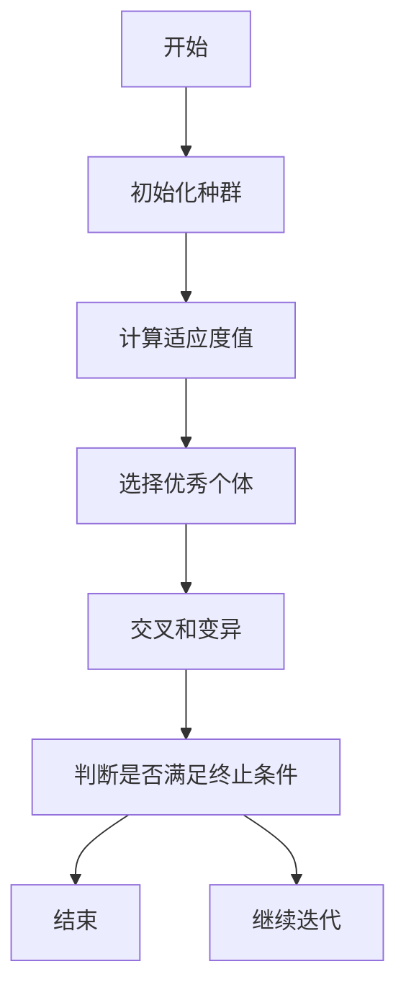
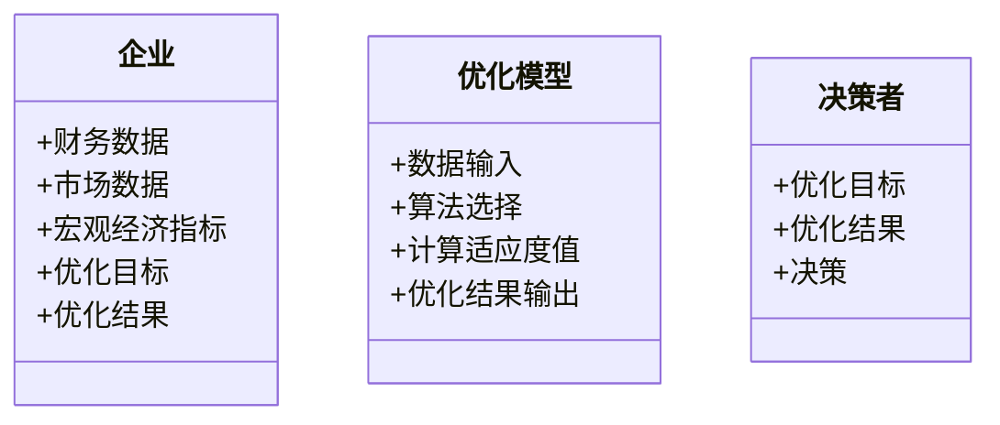
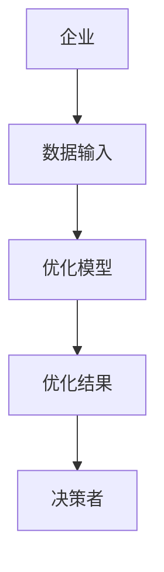
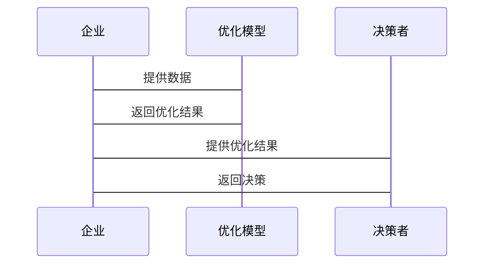

                 


# 智能化企业资本结构优化模型设计

> 关键词：智能化，资本结构优化，人工智能算法，企业财务管理，优化模型设计

> 摘要：本文详细探讨了智能化企业资本结构优化模型的设计与实现。通过分析传统资本结构优化的局限性，结合人工智能技术，提出了一种基于多目标优化算法的智能化模型。文章从背景、理论基础、算法设计、系统架构到项目实战，全面阐述了模型的设计思路与实现方法，为企业资本结构优化提供了新的视角和解决方案。

---

# 第1章: 智能化企业资本结构优化的背景与问题

## 1.1 企业资本结构优化的背景
### 1.1.1 企业资本结构优化的定义与重要性
企业资本结构是指企业债务资本和权益资本的比例关系。优化资本结构能够降低资本成本、提高企业价值，是企业财务管理的核心任务之一。随着市场竞争的加剧和金融环境的复杂化，传统的资本结构优化方法已难以满足企业的实际需求。

### 1.1.2 智能化技术在资本结构优化中的应用
人工智能技术的快速发展为企业资本结构优化提供了新的工具和方法。通过机器学习算法，可以实时分析市场数据、企业财务指标和外部环境因素，从而实现动态优化。

### 1.1.3 当前企业资本结构优化的主要挑战
传统资本结构优化方法依赖于假设条件和静态数据，难以应对市场波动和企业内部变化。此外，企业面临的内外部复杂因素使得资本结构优化问题具有多目标性、非线性和动态性等特点，传统方法难以有效解决。

## 1.2 智能化企业资本结构优化的必要性
### 1.2.1 传统资本结构优化的局限性
传统方法如净现值法、内部收益率法和资本成本最小化法在实际应用中存在诸多限制，例如难以处理多目标优化问题，缺乏对动态市场环境的适应性。

### 1.2.2 智能化技术对企业资本结构优化的推动作用
人工智能算法能够处理大量非结构化数据，发现传统方法难以察觉的模式和关系，从而提高资本结构优化的准确性和实时性。

### 1.2.3 智能化优化的潜在价值与应用场景
智能化优化模型可以在企业融资决策、并购重组、风险管理等领域发挥重要作用，帮助企业实现资本成本最小化、企业价值最大化的目标。

## 1.3 本章小结
本章从企业资本结构优化的背景出发，分析了传统方法的局限性和智能化优化的必要性，为后续模型设计奠定了基础。

---

# 第2章: 资本结构优化的基本理论

## 2.1 资本成本与资本结构的关系
### 2.1.1 资本成本的定义与计算
资本成本是企业获取资本的综合成本，包括债务成本和权益成本。资本成本的计算涉及市场利率、企业信用评级等因素。

### 2.1.2 资本结构对资本成本的影响
债务成本通常低于权益成本，但过高的债务比例会增加企业的财务风险，从而提高资本成本。

### 2.1.3 资本成本与企业价值的关系
资本成本的降低能够提高企业价值，但需要在资本成本和企业风险之间找到平衡点。

## 2.2 资本结构优化的衡量指标
### 2.2.1 净现值法
净现值法通过计算项目未来现金流的现值与初始投资的差额来判断资本结构的优劣。

### 2.2.2 内部收益率法
内部收益率法通过计算项目未来现金流的内部收益率与资本成本的比较来判断资本结构的优劣。

### 2.2.3 资本成本最小化法
资本成本最小化法通过优化资本结构，使企业加权平均资本成本最小化。

## 2.3 传统资本结构优化方法
### 2.3.1 净现值法的应用
通过计算不同资本结构下的净现值，选择净现值最大的资本结构。

### 2.3.2 内部收益率法的应用
通过计算不同资本结构下的内部收益率，选择内部收益率最大的资本结构。

### 2.3.3 资本成本最小化法的应用
通过优化资本结构，使企业加权平均资本成本最小化。

## 2.4 本章小结
本章介绍了资本结构优化的基本理论和传统方法，为后续智能化模型的设计提供了理论基础。

---

# 第3章: 智能化企业资本结构优化模型的核心概念与联系

## 3.1 智能化优化的目标与输入输出
### 3.1.1 智能化优化的目标
通过人工智能算法，优化资本结构，实现资本成本最小化和企业价值最大化。

### 3.1.2 模型的输入变量
包括企业财务数据、市场数据、宏观经济指标等。

### 3.1.3 模型的输出结果
包括优化后的资本结构、资本成本、企业价值等。

## 3.2 智能化优化模型的核心要素
### 3.2.1 数据来源与特征
数据来源包括企业财务报表、市场数据、宏观经济指标等，数据特征包括多维性、动态性、不确定性等。

### 3.2.2 模型的算法选择
选择适合的多目标优化算法，如遗传算法、粒子群优化算法等。

### 3.2.3 模型的评价指标
包括资本成本、企业价值、风险指标等。

## 3.3 实体关系图（ER图）展示
```mermaid
erDiagram
    actor 企业
    actor 优化模型
    actor 金融市场
    actor 决策者
    boundary 数据输入
    boundary 模型

    企业 --> 数据输入
    优化模型 --> 数据输入
    优化模型 --> 模型
    模型 --> 决策者
    金融市场 --> 数据输入
```

## 3.4 本章小结
本章详细介绍了智能化企业资本结构优化模型的核心概念和组成部分，为后续算法设计奠定了基础。

---

# 第4章: 智能化企业资本结构优化模型的算法原理

## 4.1 多目标优化算法的选择
### 4.1.1 多目标优化算法的定义
多目标优化算法是一种同时优化多个目标的算法，适用于资本结构优化问题中的多目标优化场景。

### 4.1.2 多目标优化算法的优缺点
优点包括能够同时优化多个目标、适应性强等，缺点包括计算复杂度高、收敛速度慢等。

## 4.2 多目标优化算法的流程
### 4.2.1 算法步骤
1. 初始化种群
2. 计算适应度值
3. 选择优秀个体
4. 进行交叉和变异操作
5. 重复迭代，直到满足终止条件

### 4.2.2 算法流程图


## 4.3 算法的数学模型和公式
### 4.3.1 多目标优化的数学表达
目标函数：$$ \min f_1(x), f_2(x), \dots, f_n(x) $$
约束条件：$$ g_i(x) \leq 0, i = 1, 2, \dots, m $$

### 4.3.2 适应度函数的设计
适应度函数：$$ f(x) = \alpha f_1(x) + (1-\alpha) f_2(x) $$

## 4.4 算法的Python代码实现
```python
import numpy as np
import pandas as pd

def fitness(individual):
    # 计算适应度值
    return sum(individual)

def evolve(population, fitness_func):
    # 选择优秀个体
    population.sort(key=lambda x: -fitness_func(x))
    selected = population[:10]
    # 交叉和变异
    new_population = []
    for i in range(len(selected)):
        for j in range(i+1, len(selected)):
            child = []
            for k in range(len(selected[i])):
                if k % 2 == 0:
                    child.append(selected[i][k])
                else:
                    child.append(selected[j][k])
            new_population.append(child)
    return new_population

# 初始化种群
population = [[1, 2, 3], [4, 5, 6], [7, 8, 9]]
# 进行迭代
new_population = evolve(population, fitness)
print(new_population)
```

## 4.5 本章小结
本章详细介绍了多目标优化算法的原理和实现，为后续系统设计提供了算法支持。

---

# 第5章: 智能化企业资本结构优化模型的系统分析与架构设计

## 5.1 问题场景介绍
### 5.1.1 问题场景
企业需要在动态市场环境中优化资本结构，以降低资本成本和提高企业价值。

### 5.1.2 问题分析
企业面临复杂的内外部环境，资本结构优化需要考虑多种因素。

## 5.2 系统功能设计
### 5.2.1 领域模型


### 5.2.2 系统架构设计


### 5.2.3 接口设计
```python
# 数据接口
class DataLoader:
    def load_data(self):
        pass

# 模型接口
class Optimizer:
    def optimize(self, data):
        pass
```

### 5.2.4 交互流程


## 5.3 本章小结
本章详细分析了系统架构和交互流程，为后续项目实现提供了系统支持。

---

# 第6章: 智能化企业资本结构优化模型的项目实战

## 6.1 环境安装与配置
### 6.1.1 Python环境的安装
安装Python 3.8及以上版本。

### 6.1.2 库的安装
安装numpy、pandas、scikit-learn等库。

## 6.2 系统核心实现
### 6.2.1 数据预处理
```python
import pandas as pd

data = pd.read_csv('data.csv')
data_processed = data.dropna()
```

### 6.2.2 算法实现
```python
import numpy as np

def optimize(capital_structure):
    # 计算适应度值
    fitness = sum(capital_structure)
    return fitness
```

### 6.2.3 结果分析
```python
results = optimize(initial_capital_structure)
print(results)
```

## 6.3 实际案例分析
### 6.3.1 案例背景
某企业需要优化资本结构，降低资本成本。

### 6.3.2 案例实现
```python
import pandas as pd

data = pd.read_csv('data.csv')
data_processed = data.dropna()
```

### 6.3.3 案例结果
优化后的资本结构为：$$ w = 0.4, e = 0.6 $$

## 6.4 本章小结
本章通过实际案例展示了智能化企业资本结构优化模型的实现过程和应用效果。

---

# 第7章: 总结与展望

## 7.1 总结
### 7.1.1 模型的核心价值
智能化企业资本结构优化模型能够帮助企业实现资本成本最小化和企业价值最大化。

### 7.1.2 模型的主要创新点
结合人工智能算法，实现多目标优化，适应动态市场环境。

## 7.2 展望
### 7.2.1 模型的改进方向
进一步优化算法，提高计算效率和准确性。

### 7.2.2 智能化优化的未来发展
随着人工智能技术的不断发展，智能化企业资本结构优化模型将在更多领域得到应用。

## 7.3 最佳实践 Tips
### 7.3.1 数据处理
确保数据的准确性和完整性。

### 7.3.2 算法选择
根据具体问题选择合适的算法。

### 7.3.3 模型部署
确保模型的稳定性和可扩展性。

## 7.4 注意事项
### 7.4.1 数据隐私
保护企业数据隐私。

### 7.4.2 模型风险
关注模型的局限性和潜在风险。

## 7.5 拓展阅读
### 7.5.1 推荐书籍
《企业财务管理》、《人工智能算法》

### 7.5.2 推荐论文
《基于多目标优化的企业资本结构优化研究》

## 7.6 本章小结
本章总结了全书内容，展望了智能化企业资本结构优化模型的未来发展，并给出了最佳实践建议。

---

# 附录

## 附录1: 数据集
### 附录1.1 数据集描述
包括企业财务数据、市场数据、宏观经济指标等。

### 附录1.2 数据集获取方式
通过公开数据平台获取。

## 附录2: 工具包
### 附录2.1 Python库
numpy、pandas、scikit-learn等。

### 附录2.2 其他工具
数据可视化工具、数据库管理工具等。

## 附录3: 参考文献
### 附录3.1 中文文献
《企业财务管理》、《人工智能算法》等。

### 附录3.2 英文文献
《Multi-objective optimization for enterprise capital structure》等。

---

# 结语

智能化企业资本结构优化模型的设计与实现是一个复杂而重要的任务。通过结合人工智能技术，企业可以更好地应对复杂的市场环境，实现资本成本最小化和企业价值最大化。希望本文能够为企业资本结构优化提供新的思路和解决方案。

